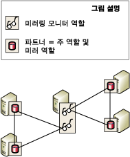

# Database Mirroring Witness
[!INCLUDE[appliesto-ss-xxxx-xxxx-xxx-md](../../includes/appliesto-ss-xxxx-xxxx-xxx-md.md)]
  자동 장애 조치(Failover)를 지원하려면 데이터베이스 미러링 세션을 보호 우선 모드로 구성해야 하며 *미러링 모니터 서버*라는 세 번째 서버 인스턴스가 있어야 합니다. 미러링 모니터 서버는 보호 우선 모드에 있는 미러 서버가 자동 장애 조치의 시작 여부를 인식할 수 있도록 하는 [!INCLUDE[ssNoVersion](../../includes/ssnoversion-md.md)] 의 선택적 인스턴스입니다. 미러링 모니터 서버는 두 파트너와는 달리 데이터베이스를 제공하지 않습니다. 미러링 모니터 서버는 자동 장애 조치(Failover)를 지원하는 역할만 수행합니다.  
  
> [!NOTE]  
>  성능 우선 모드에서는 미러링 모니터 서버로 인해 가용성이 저하될 수 있습니다. 미러링 모니터 서버가 데이터베이스 미러링 세션에 대해 구성된 경우 주 서버는 다른 서버 인스턴스인 미러 서버나 미러링 모니터 서버 중 하나에 연결되거나 둘 다에 연결되어야 합니다. 그렇지 않으면 데이터베이스를 사용할 수 없게 되며 서비스를 강제(데이터 손실 가능)할 수 없게 됩니다. 따라서 성능 우선 모드에서는 항상 미러링 모니터 서버를 OFF로 유지하는 것이 좋습니다. 성능 우선 모드에서 미러링 모니터 서버의 영향에 대한 자세한 내용은 [데이터베이스 미러링 운영 모드](../../database-engine/database-mirroring/database-mirroring-operating-modes.md)를 참조하세요.  
  
 다음 그림에서는 미러링 모니터 서버가 포함된 보호 우선 모드 세션을 보여 줍니다.  
  
   
  
 **항목 내용:**  
  
-   [여러 세션에서 미러링 모니터 서버 사용](#InMultipleSessions)  
  
-   [소프트웨어 및 하드웨어 권장 사항](#SwHwRecommendations)  
  
-   [자동 장애 조치에서의 미러링 모니터 서버 역할](#InAutoFo)  
  
-   [미러링 모니터 서버를 추가하거나 제거하려면](#AddRemoveWitness)  
  
##   여러 세션에서 미러링 모니터 서버 사용  
 특정 서버 인스턴스는 동시 데이터베이스 미러링 세션에서 서로 다른 데이터베이스에 대해 미러링 모니터 서버로 작동할 수 있습니다. 세션마다 서로 다른 파트너를 사용할 수 있습니다. 다음 그림에서는 서로 다른 파트너를 사용하는 두 개의 데이터베이스 미러링 세션에 속하는 미러링 모니터 서버인 서버 인스턴스를 보여 줍니다.  
  
   
  
 단일 서버 인스턴스는 일부 세션의 미러링 모니터 서버와 다른 세션의 파트너로 동시에 작동할 수도 있습니다. 그러나 실제로 서버 인스턴스는 대개 미러링 모니터 서버나 파트너 중 하나로 작동합니다. 이는 파트너의 경우 프로덕션 데이터베이스를 지원하기 위해 하드웨어 용량이 충분한 고성능 컴퓨터가 필요하지만 미러링 모니터 서버는 [!INCLUDE[ssCurrent](../../includes/sscurrent-md.md)]를 지원하는 모든 사용 가능한 Windows 시스템에서 실행될 수 있기 때문입니다.  
  
##   소프트웨어 및 하드웨어 권장 사항  
 미러링 모니터 서버는 파트너와 별도의 컴퓨터에 있는 것이 좋습니다. 데이터베이스 미러링 파트너는 [!INCLUDE[ssNoVersion](../../includes/ssnoversion-md.md)] Standard Edition 및 [!INCLUDE[ssNoVersion](../../includes/ssnoversion-md.md)] Enterprise Edition에서만 지원됩니다. 반대로 미러링 모니터 서버는 [!INCLUDE[ssNoVersion](../../includes/ssnoversion-md.md)] Workgroup 및 [!INCLUDE[ssNoVersion](../../includes/ssnoversion-md.md)] Express에서도 지원됩니다. 이전 버전의 [!INCLUDE[ssNoVersion](../../includes/ssnoversion-md.md)]에서 업그레이드하는 동안을 제외하고 미러링 세션의 서버 인스턴스는 모두 같은 버전의 [!INCLUDE[ssNoVersion](../../includes/ssnoversion-md.md)]를 실행 중이어야 합니다. 예를 들어 [!INCLUDE[ssKatmai](../../includes/sskatmai-md.md)] 미러링 구성에서 업그레이드하는 경우 [!INCLUDE[ssKatmai](../../includes/sskatmai-md.md)] 미러링 모니터 서버가 지원되지만 이 미러링 모니터 서버를 기존 또는 새로운 [!INCLUDE[ssKilimanjaro](../../includes/sskilimanjaro-md.md)] 이상 버전의 미러링 구성에 추가할 수는 없습니다.  
  
 미러링 모니터 서버는 이러한 [!INCLUDE[ssNoVersion](../../includes/ssnoversion-md.md)]버전을 지원하는 모든 신뢰할 수 있는 컴퓨터 시스템에서 실행될 수 있습니다. 그러나 미러링 모니터 서버로 사용되는 모든 서버 인스턴스에는 실행 중인 [!INCLUDE[ssNoVersion](../../includes/ssnoversion-md.md)] Standard 버전에 필요한 최소 구성을 적용하는 것이 좋습니다. 이러한 요구 사항에 대한 자세한 내용은 [SQL Server 2016 설치를 위한 하드웨어 및 소프트웨어 요구 사항](../../sql-server/install/hardware-and-software-requirements-for-installing-sql-server.md)을 참조하세요.  
  
##   자동 장애 조치에서의 미러링 모니터 서버 역할  
 데이터베이스 미러링 세션 동안 모든 서버 인스턴스가 해당 연결 상태를 모니터링합니다. 파트너가 서로 분리되면 미러링 모니터 서버를 통해 둘 중 하나만 데이터베이스를 제공하도록 할 수 있습니다. 동기화된 미러 서버와 주 서버와의 연결이 끊겼지만 미러링 모니터 서버와의 연결은 지속되는 경우 미러 서버는 미러링 모니터 서버에 연결하여 미러링 모니터 서버와 주 서버와의 연결이 끊겼는지 여부를 확인합니다.  
  
-   주 서버가 미러링 모니터 서버에 연결되어 있으면 자동 장애 조치가 발생하지 않습니다. 대신 주 서버는 파트너가 다시 연결되었을 때 미러 서버로 보낼 로그 레코드를 누적하는 동안 데이터베이스를 계속 제공합니다.  
  
-   미러링 모니터 서버와 주 서버와의 연결도 끊어진 경우 미러 서버는 주 데이터베이스를 사용할 수 없는 상태임을 인식하게 됩니다. 이 경우 미러 서버는 자동 장애 조치를 즉시 시작합니다.  
  
-   미러 서버와 미러링 모니터 서버 및 주 서버와의 연결이 끊어진 경우에는 주 서버의 상태에 관계없이 자동 장애 조치를 수행할 수 없습니다.  
  
 둘 이상의 서버 인스턴스가 연결되어 있어야 하는 요구 사항을 *쿼럼*이라고 합니다. 쿼럼을 사용하면 한 번에 하나의 파트너만 데이터베이스를 제공할 수 있습니다. 쿼럼 작동 방법과 쿼럼이 세션에 미치는 영향에 대한 자세한 내용은 [쿼럼: 미러링 모니터 서버가 데이터베이스 가용성에 미치는 영향&#40;데이터베이스 미러링&#41;](../../database-engine/database-mirroring/quorum-how-a-witness-affects-database-availability-database-mirroring.md)을 참조하세요.  
  
##   미러링 모니터 서버를 추가하거나 제거하려면  
 **미러링 모니터 서버를 추가하려면**  
  
-   [데이터베이스 미러링 모니터 서버 추가 또는 바꾸기&#40;SQL Server Management Studio&#41;](../../database-engine/database-mirroring/add-or-replace-a-database-mirroring-witness-sql-server-management-studio.md)  
  
-   [Windows 인증을 사용하여 데이터베이스 미러링 모니터 추가&#40;Transact-SQL&#41;](../../database-engine/database-mirroring/add-a-database-mirroring-witness-using-windows-authentication-transact-sql.md)  
  
 **미러링 모니터를 제거하려면**  
  
-   [데이터베이스 미러링 세션에서 미러링 모니터 서버 제거&#40;SQL Server&#41;](../../database-engine/database-mirroring/remove-the-witness-from-a-database-mirroring-session-sql-server.md)  
  
## 참고 항목  
 [데이터베이스 미러링 세션 중 역할 전환&#40;SQL Server&#41;](../../database-engine/database-mirroring/role-switching-during-a-database-mirroring-session-sql-server.md)   
 [데이터베이스 미러링 운영 모드](../../database-engine/database-mirroring/database-mirroring-operating-modes.md)   
 [쿼럼: 미러링 모니터 서버가 데이터베이스 가용성에 미치는 영향&#40;데이터베이스 미러링&#41;](../../database-engine/database-mirroring/quorum-how-a-witness-affects-database-availability-database-mirroring.md)   
 [데이터베이스 미러링 중에 발생 가능한 오류](../../database-engine/database-mirroring/possible-failures-during-database-mirroring.md)   
 [미러링 상태&#40;SQL Server&#41;](../../database-engine/database-mirroring/mirroring-states-sql-server.md)  
  
  
