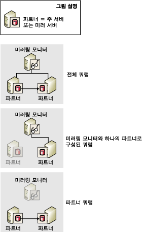
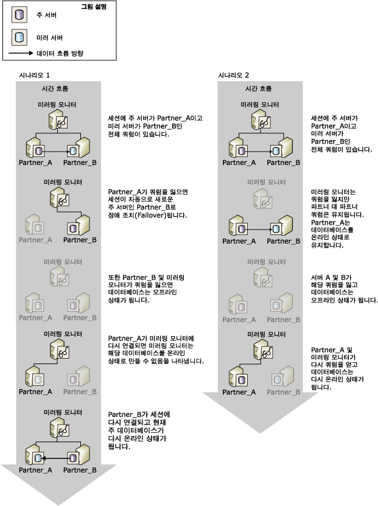

# 쿼럼: 미러링 모니터가 데이터베이스 가용성에 미치는 영향(데이터베이스 미러링)
 [!INCLUDE [SQL Server](../../includes/applies-to-version/sqlserver.md)]
  데이터베이스 미러링 세션에 대해 미러링 모니터 서버를 설정할 때마다 *쿼럼* 이 필요합니다. 쿼럼은 데이터베이스 미러링 세션에서 둘 이상의 서버 인스턴스가 서로 연결될 때 존재하는 관계입니다. 일반적으로 쿼럼은 3개의 상호 연결된 서버 인스턴스를 포함합니다. 미러링 모니터 서버가 설정된 경우 쿼럼이 있어야만 데이터베이스를 사용할 수 있습니다. 쿼럼은 자동 장애 조치(Failover)를 지원하는 보안 우선 모드를 위해 디자인되었으므로 한 번에 하나의 파트너만 데이터베이스를 소유할 수 있습니다.  
  
 특정 서버 인스턴스의 연결이 미러링 세션에서 끊어지면 해당 인스턴스는 쿼럼을 잃습니다. 연결된 서버 인스턴스가 없는 경우 세션이 쿼럼을 잃고 데이터베이스를 사용할 수 없게 됩니다. 다음 3가지 유형의 쿼럼이 지원됩니다.  
  
-   *전체 쿼럼* - 두 파트너와 미러링 모니터 서버로 구성됩니다.  
  
-   *미러링 모니터 서버에서 파트너로의 쿼럼* - 미러링 모니터 서버와 하나의 파트너로 구성됩니다.  
  
-   *파트너 간 쿼럼* - 두 파트너로 구성됩니다.  
  
 다음 그림에서는 이러한 유형의 쿼럼을 보여 줍니다.  
  
   
  
 현재 주 서버에 쿼럼이 있으면 데이터베이스 소유자가 수동 장애 조치를 수행하지 않는 한 주 서버가 주 서버의 역할을 소유하고 데이터베이스를 계속 제공합니다. 주 서버가 쿼럼을 잃으면 데이터베이스 제공을 중지합니다. 자동 장애 조치는 주 데이터베이스가 쿼럼을 잃어 더 이상 데이터베이스를 제공하지 않는 경우에만 발생할 수 있습니다.  
  
 연결이 끊어진 서버 인스턴스는 세션에서 가장 최근의 역할을 저장합니다. 일반적으로 연결이 끊어진 서버 인스턴스는 다시 시작할 때 세션에 다시 연결되고 쿼럼을 다시 얻습니다.  
  
> [!IMPORTANT]  
>  자동 장애 조치를 지원하는 보안 우선 모드를 사용하려는 경우에만 미러링 모니터 서버를 설정해야 합니다. 미러링 모니터 서버가 필요하지 않은 성능 우선 모드에서는 WITNESS 속성을 OFF로 설정하는 것이 좋습니다. 성능 우선 모드에서 미러링 모니터 서버의 영향에 대한 자세한 내용은 [데이터베이스 미러링 운영 모드](../../database-engine/database-mirroring/database-mirroring-operating-modes.md)를 참조하세요.  
  
## 보안 우선 모드 세션의 쿼럼  
 보안 우선 모드에서 쿼럼은 쿼럼이 있는 서버 인스턴스가 주 역할을 소유하는 파트너를 조정하는 컨텍스트를 제공하여 자동 장애 조치를 허용합니다. 쿼럼이 있을 경우 주 서버는 데이터베이스를 제공합니다. 동기화된 미러 서버와 미러링 모니터 서버가 쿼럼을 유지하고 주 서버가 쿼럼을 손실하는 경우 자동 장애 조치가 발생합니다.  
  
 보안 우선 모드의 쿼럼 시나리오는 다음과 같습니다.  
  
-   *전체 쿼럼* - 두 파트너와 하나의 미러링 모니터 서버로 구성됩니다.  
  
     일반적으로 3개의 서버 인스턴스는 모두 *전체 쿼럼*이라는 3방향 쿼럼에 참여합니다. 전체 쿼럼을 사용하면 주 서버와 미러 서버는 수동 장애 조치가 발생하지 않는 한 계속 해당 역할을 수행합니다.  
  
-   *미러링 모니터 서버에서 파트너로의 쿼럼* - 미러링 모니터 서버와 하나의 파트너로 구성됩니다.  
  
     파트너 중 하나가 손실되어 파트너 간의 네트워크 연결을 잃은 경우 다음 경우가 발생할 수 있습니다.  
  
    -   미러 서버가 손실되고 주 서버와 미러링 모니터 서버가 쿼럼을 유지합니다.  
  
         이 경우 주 서버는 데이터베이스를 DISCONNECTED로 설정하고 SUSPENDED 미러링 상태로 실행됩니다. 이때 데이터베이스는 현재 미러되지 않으므로 이를 *노출 실행*이라고 합니다. 미러 서버가 세션에 다시 참가할 때 서버는 쿼럼을 미러로 다시 얻고 데이터베이스의 복사본 동기화를 다시 수행합니다.  
  
    -   주 서버가 손실되고 미러링 모니터 서버와 미러 서버가 쿼럼을 유지합니다.  
  
         이 경우 자동 장애 조치가 수행됩니다. 자세한 내용은 [Database Mirroring Operating Modes](../../database-engine/database-mirroring/database-mirroring-operating-modes.md)을 참조하세요.  
  
    -   모든 서버 인스턴스가 쿼럼을 잃지만 이후에 미러와 미러링 모니터 서버가 다시 연결됩니다. 이 경우에 데이터베이스는 제공되지 않습니다.  
  
     매우 드문 경우로서 두 파트너가 미러링 모니터 서버에 계속 연결되어 있는 동안 장애 조치 파트너 사이의 네트워크 연결을 잃을 수 있습니다. 이 경우 미러링 모니터 서버에서 파트너로의 쿼럼 두 개가 개별적으로 존재하며 미러링 모니터 서버가 연락을 담당합니다. 미러링 모니터 서버에서 주 서버가 연결되어 있음을 미러 서버에 알리기 때문에 자동 장애 조치는 수행되지 않습니다. 대신 미러 서버는 미러 역할을 계속 수행하고 주 서버에 다시 연결되기를 기다립니다. Redo Queue가 이 지점에서 로그 레코드를 포함하는 경우 미러 서버는 미러 데이터베이스를 계속 롤포워드합니다. 다시 연결할 때 미러 서버는 미러 데이터베이스를 다시 동기화합니다.  
  
-   *파트너 간 쿼럼* - 두 파트너로 구성됩니다.  
  
     파트너가 쿼럼을 유지하는 한 데이터베이스는 SYNCHRONIZED 상태를 지속하고 수동 장애 조치가 가능합니다. 자동 장애 조치는 미러링 모니터 서버 없이는 불가능하지만 미러링 모니터 서버가 쿼럼을 다시 얻으면 세션은 일반 작업을 재개하고 자동 장애 조치가 다시 지원됩니다.  
  
-   세션이 쿼럼을 잃습니다.  
  
     모든 서버 인스턴스 간의 연결이 끊어지면 세션은 *쿼럼을 손실*하며 서버 인스턴스가 다시 연결되면 서로 간에 다시 쿼럼을 얻습니다.  
  
    -   주 서버가 다른 서버 인스턴스 중 하나와 다시 연결되면 데이터베이스를 사용할 수 있게 됩니다.  
  
    -   주 서버의 연결은 끊어진 상태지만 미러와 미러링 모니터 서버가 서로 다시 연결되면 데이터 손실이 발생할 수 있으므로 자동 장애 조치가 발생하지 않습니다. 따라서 주 서버가 세션에 다시 참가할 때까지 데이터베이스는 사용할 수 없습니다.  
  
    -   3개의 서버 인스턴스가 모두 다시 연결되었을 때 전체 쿼럼을 다시 얻으면 세션은 정상적인 작업을 재개합니다.  
  
> [!IMPORTANT]  
>  그러나 세션에 파트너 간 쿼럼이 있는 경우 한 파트너가 쿼럼을 손실하면 세션은 쿼럼을 손실합니다. 따라서 미러링 모니터 서버가 오랫동안 연결이 끊어진 상태로 유지될 것이 예상되면 세션에서 미러링 모니터 서버를 일시적으로 제거하는 것이 좋습니다. 미러링 모니터 서버가 제거되면 쿼럼의 요구 사항이 제거됩니다. 그런 다음 미러 서버의 연결이 끊어지면 주 서버가 계속해서 데이터베이스를 제공할 수 있습니다. 미러링 모니터 서버를 추가하거나 제거하는 방법은 [Database Mirroring Witness](../../database-engine/database-mirroring/database-mirroring-witness.md)를 참조하십시오.  
  
### 데이터베이스 가용성에 대한 쿼럼의 영향  
 다음 그림에서는 미러링 모니터 서버와 파트너가 협력하여 지정한 시간에 하나의 파트너만 주 역할을 수행하고 현재 주 서버만 해당 데이터베이스를 온라인 상태로 만들 수 있게 하는 방법을 보여 줍니다. 두 시나리오는 모두 전체 쿼럼 및 주 역할의 **Partner_A** 와 미러 역할의 **Partner_B** 로 시작합니다.  
  
   
  
 시나리오 1은 원래 주 서버(**Partner_A**)에 문제가 발생한 후 미러링 모니터 서버와 미러 서버가 주 서버 **Partner_A**를 더 이상 사용할 수 없음에 동의하고 쿼럼을 형성하는 방법을 보여 줍니다. 그런 다음 미러 서버 **Partner_B** 가 주 역할을 수행합니다. 자동 장애 조치(failover)가 수행되고 **Partner_B**는 해당 데이터베이스 복사본을 온라인 상태로 만듭니다. 그런 다음 **Partner_B** 가 다운되고 해당 데이터베이스는 오프라인 상태가 됩니다. 나중에 이전 주 서버였던 **Partner_A**는 쿼럼을 다시 얻은 미러링 모니터 서버에 다시 연결되지만 미러링 모니터 서버와 통신할 때 이제 **Partner_B** 가 주 역할을 소유하므로 **Partner_A** 에서 해당 데이터베이스 복사본을 온라인 상태로 만들 수 없습니다. **Partner_B** 는 세션에 다시 참가할 때 데이터베이스를 다시 온라인 상태로 만듭니다.  
  
 시나리오 2에서 미러링 모니터 서버는 쿼럼을 상실하지만 파트너인 **Partner_A** 와 **Partner_B**는 서로 쿼럼을 유지하고 데이터베이스가 온라인 상태로 남아 있습니다. 그런 다음 파트너도 해당 쿼럼을 상실하고 데이터베이스는 오프라인 상태가 됩니다. 나중에 주 서버 **Partner_A**는 쿼럼을 다시 얻은 미러링 모니터 서버에 다시 연결됩니다. 미러링 모니터 서버는 **Partner_A** 가 여전히 주 역할을 소유하며 **Partner_A** 가 해당 데이터베이스를 다시 온라인 상태로 만드는지 확인합니다.  
  
## 참고 항목  
 [데이터베이스 미러링 운영 모드](../../database-engine/database-mirroring/database-mirroring-operating-modes.md)   
 [데이터베이스 미러링 세션 중 역할 전환&#40;SQL Server&#41;](../../database-engine/database-mirroring/role-switching-during-a-database-mirroring-session-sql-server.md)   
 [데이터베이스 미러링 모니터 서버](../../database-engine/database-mirroring/database-mirroring-witness.md)   
 [데이터베이스 미러링 중에 발생 가능한 오류](../../database-engine/database-mirroring/possible-failures-during-database-mirroring.md)   
 [미러링 상태&#40;SQL Server&#41;](../../database-engine/database-mirroring/mirroring-states-sql-server.md)  
  
  
