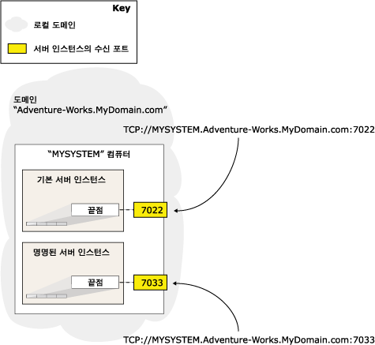

# 데이터베이스 미러링 끝점(SQL Server)
  [!INCLUDE[ssHADR](../../includes/sshadr-md.md)] 또는 데이터베이스 미러링에 참여하려면 서버 인스턴스에 자체의 전용 *데이터베이스 미러링 끝점*이 필요합니다. 데이터베이스 미러링 끝점은 다른 서버 인스턴스로부터 연결을 받는 데만 사용되는 특별한 용도의 끝점입니다. 지정된 서버 인스턴스에서 다른 모든 서버 인스턴스에 대한 모든 [!INCLUDE[ssHADR](../../includes/sshadr-md.md)] 또는 데이터베이스 미러링 연결은 단일 데이터베이스 미러링 끝점을 사용합니다.  
  
 데이터베이스 미러링 끝점은 TCP(전송 제어 프로토콜)를 사용하여 데이터베이스 미러링 세션에 참여하거나 가용성 복제본을 호스팅하는 서버 인스턴스 간에 메시지를 보내고 받습니다. 데이터베이스 미러링 끝점은 고유의 TCP 포트 번호에서 수신합니다.  
  
> [!NOTE]  
>  주 서버 또는 주 복제본에 대한 클라이언트 연결에는 데이터베이스 미러링 끝점이 사용되지 않습니다.  
  
> [!NOTE]  
>  이후 버전의 Microsoft SQL Server에서는 데이터베이스 미러링 기능이 제거됩니다. 새 개발 작업에서는 이 기능을 사용하지 않도록 하고, 현재 이 기능을 사용하는 응용 프로그램은 대신 [!INCLUDE[ssHADR](../../includes/sshadr-md.md)] 을 사용하도록 수정하십시오.  
  
  
##   서버 네트워크 주소  
 서버 인스턴스의 네트워크 주소( *서버 네트워크 주소* 또는 *끝점 URL*)에는 해당 끝점의 포트 번호는 물론 호스트 컴퓨터의 시스템 이름과 도메인 이름도 포함됩니다. 포트 번호는 특정 서버 인스턴스를 고유하게 식별합니다.  
  
 다음 그림에서는 같은 서버의 두 서버 인스턴스가 고유하게 식별되는 방법을 보여 줍니다. 두 서버 인스턴스의 서버 네트워크 주소에는 모두 `MYSYSTEM`이라는 같은 시스템 이름과 `Adventure-Works.MyDomain.com`이라는 도메인 이름이 포함되어 있습니다. 시스템에서 서버 인스턴스로 연결을 라우팅할 수 있도록 서버 네트워크 주소에 특정 서버 인스턴스의 미러링 끝점과 연결된 포트 번호가 포함되어 있습니다.  
  
   
  
 기본적으로 [!INCLUDE[ssNoVersion](../../includes/ssnoversion-md.md)] 인스턴스에는 데이터베이스 미러링 끝점이 없습니다. 데이터베이스 미러링 세션을 설정하는 과정에서 데이터베이스 미러링 끝점을 직접 만들어야 합니다. 시스템 관리자는 데이터베이스 미러링에 참여할 각 서버 인스턴스에 별도의 끝점을 만들어야 합니다. 지정된 컴퓨터에서 데이터베이스 미러링 끝점이 필요한 서버 인스턴스가 두 개 이상 있는 경우에는 각 끝점마다 다른 포트 번호를 지정하십시오.  
  
> [!IMPORTANT]  
>  [!INCLUDE[ssNoVersion](../../includes/ssnoversion-md.md)] 를 실행하는 컴퓨터에 방화벽이 있는 경우 끝점에 지정된 포트를 통한 들어오는 연결과 나가는 연결이 모두 가능하도록 방화벽을 구성해야 합니다.  
  
 데이터베이스 미러링 및 [!INCLUDE[ssHADR](../../includes/sshadr-md.md)]의 경우 끝점에 인증과 암호화가 구성됩니다. 자세한 내용은 [데이터베이스 미러링 및 Always On 가용성 그룹에 대한 전송 보안(SQL Server)](../../database-engine/database-mirroring/transport-security-database-mirroring-always-on-availability.md)을 참조하세요.  
  
> [!IMPORTANT]  
>  사용 중인 데이터베이스 미러링 끝점은 다시 구성하지 마십시오. 서버 인스턴스는 다른 서버 인스턴스의 끝점을 사용하여 다른 시스템의 상태를 파악합니다. 끝점을 다시 구성하면 인스턴스가 다시 시작되어 다른 서버 인스턴스에서 오류가 발생할 수 있습니다. 이는 특히 파트너에 끝점을 다시 구성하면 장애 조치(Failover) 오류가 발생할 수 있는 자동 장애 조치(failover) 모드에서 중요한 사항입니다.  
  
  
##   데이터베이스 미러링 끝점에 대한 인증 유형 결정  
 서버 인스턴스의 [!INCLUDE[ssNoVersion](../../includes/ssnoversion-md.md)] 서비스 계정에 따라 데이터베이스 미러링 끝점에 사용할 수 있는 인증 유형이 다음과 같이 결정됩니다.  
  
-   모든 서버 인스턴스가 도메인 서비스 계정으로 실행 중인 경우 데이터베이스 미러링 끝점에 Windows 인증을 사용할 수 있습니다. 모든 서버 인스턴스가 동일한 도메인 사용자 계정으로 실행되는 경우에는 두 **master** 데이터베이스 모두에 올바른 사용자 로그인이 자동으로 생성됩니다. 이 경우 가용성 데이터베이스에 대한 보안 구성이 단순해지므로 계정을 이와 같이 설정하는 것이 좋습니다.  
  
     가용성 그룹의 가용성 복제본을 호스팅하는 서버 인스턴스가 서로 다른 계정으로 실행되는 경우, 다른 서버 인스턴스의 **master** 에 각 계정에 대한 로그인을 만들어야 합니다. 그런 다음 해당 서버 인스턴스의 데이터베이스 미러링 끝점에 연결할 수 있도록 해당 로그인에 CONNECT 권한을 부여해야 합니다. 자세한 내용은 [데이터베이스 미러링 또는 Always On 가용성 그룹에 대한 로그인 계정 설정(SQL Server)](../../database-engine/database-mirroring/set-up-login-accounts-database-mirroring-always-on-availability.md)을 참조하세요.  
  
     서버 인스턴스에서 Windows 인증을 사용하는 경우 [!INCLUDE[tsql](../../includes/tsql-md.md)], PowerShell 또는 새 가용성 그룹 마법사를 사용하여 데이터베이스 미러링 끝점을 만들 수 있습니다.  
  
    > [!NOTE]  
    >  가용성 복제본을 호스팅할 서버 인스턴스에 데이터베이스 미러링 끝점이 없는 경우, 새 가용성 그룹 마법사가 Windows 인증을 사용하는 데이터베이스 미러링 끝점을 자동으로 만들 수 있습니다. 자세한 내용은 [가용성 그룹 마법사 사용(SQL Server Management Studio)](../../database-engine/availability-groups/windows/use-the-availability-group-wizard-sql-server-management-studio.md)을 참조하세요.  
  
-   로컬 시스템, 로컬 서비스 또는 네트워크 서비스와 같은 기본 제공 계정이나 비도메인 계정으로 실행되는 서버 인스턴스가 하나라도 있을 경우에는 끝점 인증에 인증서를 사용해야 합니다. 데이터베이스 미러링 끝점에 인증서를 사용하려면 시스템 관리자가 아웃바운드 및 인바운드 연결 모두에 인증서를 사용하도록 각 서버 인스턴스를 구성해야 합니다.  
  
     인증서를 통해 데이터베이스 미러링 보안을 구성하는 자동화된 방법은 없습니다. CREATE ENDPOINT [!INCLUDE[tsql](../../includes/tsql-md.md)] 문 또는 **New-SqlHadrEndpoint** PowerShell cmdlet을 사용해야 합니다. 자세한 내용은 [CREATE ENDPOINT(TRANSACT-SQL)](../../t-sql/statements/create-endpoint-transact-sql.md)를 참조하세요. 서버 인스턴스에서 인증서 인증을 사용하도록 설정하는 방법은 [데이터베이스 미러링 끝점에 대한 인증서 사용(TRANSACT-SQL)](../../database-engine/database-mirroring/use-certificates-for-a-database-mirroring-endpoint-transact-sql.md)을 참조하세요.  
  
  
##   관련 태스크  
 **데이터베이스 미러링 끝점을 구성하려면**  
  
-   [Windows 인증에 대한 데이터베이스 미러링 끝점 만들기(Transact-SQL)](../../database-engine/database-mirroring/create-a-database-mirroring-endpoint-for-windows-authentication-transact-sql.md)  
  
-   [데이터베이스 미러링 끝점에 대한 인증서 사용(TRANSACT-SQL)](../../database-engine/database-mirroring/use-certificates-for-a-database-mirroring-endpoint-transact-sql.md)  
  
    -   [데이터베이스 미러링 끝점의 아웃바운드 연결에 대한 인증서 사용 허용(Transact-SQL)](../../database-engine/database-mirroring/database-mirroring-use-certificates-for-outbound-connections.md)  
  
    -   [데이터베이스 미러링 끝점의 인바운드 연결에 대한 인증서 사용 허용(Transact-SQL)](../../database-engine/database-mirroring/database-mirroring-use-certificates-for-inbound-connections.md)  
  
-   [서버 네트워크 주소 지정(데이터베이스 미러링)](../../database-engine/database-mirroring/specify-a-server-network-address-database-mirroring.md)  
  
-   [가용성 복제본 추가 또는 수정 시 끝점 URL 지정(SQL Server)](../../database-engine/availability-groups/windows/specify-endpoint-url-adding-or-modifying-availability-replica.md)  
  
-   [가용성 그룹 마법사 사용(SQL Server Management Studio)](../../database-engine/availability-groups/windows/use-the-availability-group-wizard-sql-server-management-studio.md)  
  
 **데이터베이스 미러링 끝점에 대한 정보를 보려면**  
  
-   [sys.database_mirroring_endpoints(Transact-SQL)](../../relational-databases/system-catalog-views/sys-database-mirroring-endpoints-transact-sql.md)  
  
  
## 참고 항목  
 [데이터베이스 미러링 및 Always On 가용성 그룹에 대한 전송 보안(SQL Server)](../../database-engine/database-mirroring/transport-security-database-mirroring-always-on-availability.md)   
 [데이터베이스 미러링 구성 문제 해결(SQL Server)](../../database-engine/database-mirroring/troubleshoot-database-mirroring-configuration-sql-server.md)   
 [sys.dm_hadr_availability_replica_states(Transact-SQL)](../../relational-databases/system-dynamic-management-views/sys-dm-hadr-availability-replica-states-transact-sql.md)   
 [sys.dm_db_mirroring_connections(Transact-SQL)](../../relational-databases/system-dynamic-management-views/database-mirroring-sys-dm-db-mirroring-connections.md)  
  
  

