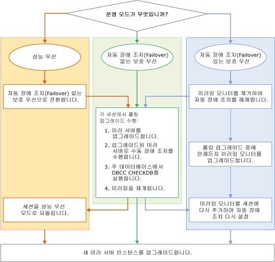

# 미러된 인스턴스 업그레이드
[!INCLUDE[appliesto-ss-xxxx-xxxx-xxx-md](../../includes/appliesto-ss-xxxx-xxxx-xxx-md.md)]
  [!INCLUDE[ssNoVersion](../../includes/ssnoversion-md.md)] 미러된 인스턴스를 새 [!INCLUDE[ssCurrent](../../includes/sscurrent-md.md)] 버전, 새 [!INCLUDE[ssNoVersion](../../includes/ssnoversion-md.md)]서비스 팩 또는 누적 업데이트나 새 Windows 서비스 팩 또는 누적 업데이트로 업그레이드하려는 경우 롤링 업그레이드를 수행하여 각 미러된 데이터베이스의 가동 중지 시간을 한 번의 수동 장애 조치(failover)에 걸리는 시간으로 줄일 수 있습니다. 원래 주 서버로 장애 복구(failback)할 때는 수동 장애 조치(failover) 2회에 걸리는 시간이 소요됩니다. 롤링 업그레이드는 가장 단순한 형식으로 수행할 때 현재 미러링 세션에서 미러 서버로 작동 중인 [!INCLUDE[ssCurrent](../../includes/sscurrent-md.md)] 인스턴스를 업그레이드한 다음 미러된 데이터베이스를 수동으로 장애 조치(failover)하고, 이전의 주 [!INCLUDE[ssCurrent](../../includes/sscurrent-md.md)] 인스턴스를 업그레이드한 다음 미러링을 다시 시작하는 여러 단계로 이루어진 프로세스입니다. 실제로 수행하는 정확한 프로세스는 업그레이드 중인 [!INCLUDE[ssCurrent](../../includes/sscurrent-md.md)] 인스턴스에서 실행되는 미러링 세션의 작동 모드, 수 및 레이아웃에 따라 달라집니다.  
  
> [!NOTE]  
>  마이그레이션 중에 로그 전달을 통해 데이터베이스 미러링을 사용하는 방법에 대한 자세한 내용을 확인하려면 이 [데이터베이스 미러링 및 로그 전달 백서](https://t.co/RmO6ruCT4J)를 다운로드하세요.  
  
## 사전 요구 사항  
 시작하기 전에 다음과 같은 중요한 정보를 검토하십시오.  
  
-   [지원되는 버전 및 에디션 업그레이드](../../database-engine/install-windows/supported-version-and-edition-upgrades.md): 사용 중인 Windows 운영 체제 버전 및 SQL Server 버전에서 SQL Server 2016으로 업그레이드할 수 있는지 확인합니다. 예를 들어, SQL Server 2005 인스턴스에서 [!INCLUDE[ssCurrent](../../includes/sscurrent-md.md)]로 직접 업그레이드할 수 없습니다.  
  
-   [데이터베이스 엔진 업그레이드 방법 선택](../../database-engine/install-windows/choose-a-database-engine-upgrade-method.md): 지원되는 버전 및 에디션 업그레이드에 대한 검토 결과와 환경에 설치된 기타 구성 요소를 바탕으로 적합한 업그레이드 방법 및 단계를 선택하여 올바른 순서로 구성 요소를 업그레이드합니다.  
  
-   [데이터베이스 엔진 업그레이드 계획 및 테스트](../../database-engine/install-windows/plan-and-test-the-database-engine-upgrade-plan.md): 릴리스 정보 및 알려진 업그레이드 문제, 업그레이드 전 검사 목록을 검토한 후 업그레이드 계획을 개발하고 테스트합니다.  
  
-   [SQL Server 2016 설치를 위한 하드웨어 및 소프트웨어 요구 사항](../../sql-server/install/hardware-and-software-requirements-for-installing-sql-server.md):  [!INCLUDE[ssCurrent](../../includes/sscurrent-md.md)] 설치를 위한 소프트웨어 요구 사항을 검토합니다. 추가 소프트웨어가 필요한 경우 가동 중지 시간을 최소화하기 위해 업그레이드 프로세스를 시작하기 전에 각 노드에 설치하십시오.  
  
## 권장되는 준비 사항(최선의 구현 방법)  
 롤링 업그레이드를 시작하기 전에 다음과 같이 하는 것이 좋습니다.  
  
1.  미러링 세션 중 하나 이상에서 수동 장애 조치(Failover)를 연습해 봅니다.  
  
    -   [데이터베이스 미러링 세션 수동 장애 조치(failover)&#40;SQL Server Management Studio&#41;](../../database-engine/database-mirroring/manually-fail-over-a-database-mirroring-session-sql-server-management-studio.md)  
  
    -   [데이터베이스 미러링 세션 수동 장애 조치(failover)&#40;Transact-SQL&#41;](../../database-engine/database-mirroring/manually-fail-over-a-database-mirroring-session-transact-sql.md).  
  
    > [!NOTE]  
    >  수동 장애 조치(failover)의 작동 방식에 대한 자세한 내용은 [데이터베이스 미러링 세션 중 역할 전환&#40;SQL Server&#41;](../../database-engine/database-mirroring/role-switching-during-a-database-mirroring-session-sql-server.md)을 참조하세요.  
  
2.  데이터를 보호합니다.  
  
    1.  모든 주 데이터베이스에 대해 전체 데이터베이스 백업을 수행합니다.  
  
         [전체 데이터베이스 백업 만들기&#40;SQL Server&#41;](../../relational-databases/backup-restore/create-a-full-database-backup-sql-server.md).  
  
    2.  모든 주 데이터베이스에서 [DBCC CHECKDB](../../t-sql/database-console-commands/dbcc-checkdb-transact-sql.md) 명령을 실행합니다.  
  
## 롤링 업그레이드 단계  
 세부적인 롤링 업그레이드 단계는 미러링 구성의 운영 모드에 따라 다릅니다. 그러나 기본 단계는 동일합니다.  
  
> [!NOTE]  
>  운영 모드에 대한 자세한 내용은 [데이터베이스 미러링 운영 모드](../../database-engine/database-mirroring/database-mirroring-operating-modes.md)를 참조하세요.  
  
 다음 그림은 각 운영 모드별로 롤링 업그레이드의 기본 단계를 보여 주는 순서도입니다. 단계별 절차는 이 그림 다음에 설명되어 있습니다.  
  
   
  
> [!IMPORTANT]  
>  동시 미러링 세션에서는 서버 인스턴스가 다른 역할(주 서버, 미러 서버 또는 미러링 모니터)을 수행할 수 있습니다. 이 경우 기본 롤링 업그레이드 프로세스를 적절히 조정해야 합니다. 자세한 내용은 [데이터베이스 미러링 세션 중 역할 전환&#40;SQL Server&#41;](../../database-engine/database-mirroring/role-switching-during-a-database-mirroring-session-sql-server.md)를 다운로드하세요.  
  
> [!NOTE]  
>  대부분의 경우에는 롤링 업그레이드가 완료된 후 원래 주 서버로 장애 복구(failback)합니다.  
  
### 세션을 성능 우선 모드에서 보호 우선 모드로 변경하려면  
  
1.  미러링 세션이 보호 우선 모드에서 실행되고 있을 경우 롤링 업그레이드를 수행하기 전에 자동 장애 조치가 없는 보호 우선 모드로 운영 모드를 변경하십시오.  
  
    > [!IMPORTANT]  
    >  미러 서버가 주 서버와 지리적으로 먼 거리에 있는 경우에는 롤링 업그레이드가 적합하지 않을 수 있습니다.  
  
    -   [!INCLUDE[ssManStudioFull](../../includes/ssmanstudiofull-md.md)]의 경우: **데이터베이스 속성** 대화 상자의 [미러링 페이지](../../relational-databases/databases/database-properties-mirroring-page.md)를 사용하여 **운영 모드** 옵션을 **자동 장애 조치(Failover) 없는 보호 우선(동기)** 으로 변경합니다. 이 페이지에 액세스하는 방법은 [데이터베이스 미러링 보안 구성 마법사 시작&#40;SQL Server Management Studio&#41;](../../database-engine/database-mirroring/start-the-configuring-database-mirroring-security-wizard.md)을 참조하세요.  
  
    -   [!INCLUDE[tsql](../../includes/tsql-md.md)]의 경우: 트랜잭션 보안을 FULL로 설정합니다. 자세한 내용은 [데이터베이스 미러링 세션에서 트랜잭션 보안 변경&#40;Transact-SQL&#41;](../../database-engine/database-mirroring/change-transaction-safety-in-a-database-mirroring-session-transact-sql.md)을 참조하세요.  
  
### 세션에서 미러링 모니터를 제거하려면  
  
1.  미러링 세션에 미러링 모니터가 있을 경우 롤링 업그레이드를 수행하기 전에 미러링 모니터를 제거하는 것이 좋습니다. 미러링 모니터를 제거하지 않으면 미러 서버 인스턴스를 업그레이드할 때 주 서버 인스턴스에 연결된 채로 남아있는 미러링 모니터에 의해 데이터베이스의 가용성이 결정됩니다. 미러링 모니터를 제거하고 나면 데이터베이스 가동 중단의 위험 없이 롤링 업그레이드 프로세스 도중 언제라도 업그레이드할 수 있습니다.  
  
    > [!NOTE]  
    >  자세한 내용은 [쿼럼: 미러링 모니터 서버가 데이터베이스 가용성에 미치는 영향&#40;데이터베이스 미러링&#41;](../../database-engine/database-mirroring/quorum-how-a-witness-affects-database-availability-database-mirroring.md)을 참조하세요.  
  
    -   [데이터베이스 미러링 세션에서 미러링 모니터 서버 제거&#40;SQL Server&#41;](../../database-engine/database-mirroring/remove-the-witness-from-a-database-mirroring-session-sql-server.md)  
  
### 롤링 업그레이드를 수행하려면  
  
1.  가동 중단을 최소화하려면 다음 방법을 사용하는 것이 좋습니다. 롤링 업그레이드를 시작할 때 자체 미러링 세션 내의 미러 서버인 모든 미러링 파트너를 업데이트합니다. 이때 여러 서버 인스턴스를 업데이트해야 할 수도 있습니다.  
  
    > [!NOTE]  
    >  미러링 모니터는 롤링 업그레이드 프로세스 도중 언제라도 업그레이드할 수 있습니다. 예를 들어 서버 인스턴스가 Session 1의 미러 서버이고 미러링 모니터가 Session 2에 있을 경우 지금 서버 인스턴스를 업그레이드할 수 있습니다.  
  
     처음 업그레이드할 서버 인스턴스는 다음과 같이 미러링 세션의 현재 구성에 따라 달라집니다.  
  
    -   서버 인스턴스가 자체 미러링 세션의 미러 서버인 경우 서버 인스턴스를 새 버전으로 업그레이드합니다.  
  
    -   현재 모든 서버 인스턴스가 미러링 세션의 주 서버일 경우 처음 업그레이드할 서버 인스턴스 하나를 선택합니다. 그런 다음 각각의 주 데이터베이스를 수동으로 장애 조치(Failover)하고 서버 인스턴스를 업그레이드합니다.  
  
     업그레이드가 끝나면 서버 인스턴스는 자동으로 자체 미러링 세션에 다시 참여합니다.  
  
2.  미러 서버 인스턴스가 업그레이드된 각 미러링 세션이 동기화될 때까지 대기합니다. 그런 다음 주 서버 인스턴스에 연결하여 세션을 수동으로 장애 조치(Failover)합니다. 장애 조치(Failover)를 수행하면 업그레이드된 서버 인스턴스는 해당 세션의 주 서버가 되고 이전 주 서버는 미러 서버가 됩니다.  
  
     이 단계의 목적은 업그레이드된 서버 인스턴스가 파트너로 참여하는 모든 미러링 세션에서 다른 서버 인스턴스를 미러 서버로 만드는 것입니다.  
  
     **업그레이드된 서버 인스턴스를 장애 조치(Failover)한 후의 제한 사항**  
  
     이전 서버 인스턴스에서 [!INCLUDE[ssCurrent](../../includes/sscurrent-md.md)] 서버 인스턴스로 장애 조치(Failover)한 후에는 데이터베이스 세션이 일시 중지되며 다른 파트너가 업그레이드되기 전에는 재개할 수 없습니다. 그러나 주 서버에는 계속 연결할 수 있으며 주 서버에 있는 데이터에 액세스하고 수정하는 것도 가능합니다.  
  
    > [!NOTE]  
    >  새 미러링 세션을 시작하려면 모든 서버 인스턴스가 같은 버전의 [!INCLUDE[ssNoVersion](../../includes/ssnoversion-md.md)]를 실행해야 합니다.  
  
3.  장애 조치(failover)를 수행한 후에는 주 데이터베이스에서 [DBCC CHECKDB](../../t-sql/database-console-commands/dbcc-checkdb-transact-sql.md) 명령을 실행하는 것이 좋습니다.  
  
4.  파트너로 참여하는 모든 미러링 세션에서 이제 미러 서버가 된 각 서버 인스턴스를 업그레이드합니다. 이때 여러 서버를 업데이트해야 할 수도 있습니다.  
  
    > [!IMPORTANT]  
    >  미러링 구성이 복잡할 경우 일부 서버 인스턴스가 하나 이상의 미러링 세션에서 원래의 주 서버로 남아 있을 수 있습니다. 이러한 서버 인스턴스에 대해 2-4단계를 반복하여 관련된 모든 인스턴스를 업그레이드하십시오.  
  
5.  미러링 세션을 재개합니다.  
  
    > [!NOTE]  
    >  자동 장애 조치(Failover)는 미러링 모니터가 업그레이드되고 미러링 세션에 다시 추가되기 전까지 작동하지 않습니다.  
  
6.  모든 미러링 세션에서 미러링 모니터로 남아 있는 나머지 서버 인스턴스를 업그레이드합니다. 업그레이드된 미러링 모니터가 미러링 세션에 다시 참여한 후에는 자동 장애 조치(Failover)가 다시 가능해집니다. 이때 여러 서버를 업데이트해야 할 수도 있습니다.  
  
### 세션을 성능 우선 모드로 되돌리려면  
  
1.  선택적으로, 다음 중 한 가지 방법을 사용하여 성능 우선 모드로 되돌릴 수 있습니다.  
  
    -   [!INCLUDE[ssManStudioFull](../../includes/ssmanstudiofull-md.md)]의 경우: **데이터베이스 속성** 대화 상자의 **미러링 페이지**를 사용하여 [운영 모드](../../relational-databases/databases/database-properties-mirroring-page.md) 옵션을 **성능 우선(동기)** 으로 변경합니다.  
  
    -   [!INCLUDE[tsql](../../includes/tsql-md.md)]의 경우: [ALTER DATABASE](../../t-sql/statements/alter-database-transact-sql-database-mirroring.md)를 사용하여 트랜잭션 보안을 OFF로 설정합니다.  
  
### 미러링 모니터를 미러링 세션에 다시 추가하려면  
  
1.  보호 우선 모드의 경우 선택적으로 미러링 모니터를 각 미러링 세션에 다시 연결합니다.  
  
     **미러링 모니터를 추가하려면**  
  
    -   [데이터베이스 미러링 모니터 서버 추가 또는 바꾸기&#40;SQL Server Management Studio&#41;](../../database-engine/database-mirroring/add-or-replace-a-database-mirroring-witness-sql-server-management-studio.md)  
  
    -   [Windows 인증을 사용하여 데이터베이스 미러링 모니터 추가&#40;Transact-SQL&#41;](../../database-engine/database-mirroring/add-a-database-mirroring-witness-using-windows-authentication-transact-sql.md)  
  
## 참고 항목  
 [설치 마법사를 사용하여 SQL Server 2016으로 업그레이드&#40;설치 프로그램&#41;](../../database-engine/install-windows/upgrade-sql-server-using-the-installation-wizard-setup.md)   
 [명령 프롬프트에서 SQL Server 2016 설치](../../database-engine/install-windows/install-sql-server-2016-from-the-command-prompt.md)   
 [ALTER DATABASE 데이터베이스 미러링&#40;Transact-SQL&#41;](../../t-sql/statements/alter-database-transact-sql-database-mirroring.md)   
 [BACKUP&#40;Transact-SQL&#41;](../../t-sql/statements/backup-transact-sql.md)   
 [미러된 데이터베이스 상태 보기&#40;SQL Server Management Studio&#41;](../../database-engine/database-mirroring/view-the-state-of-a-mirrored-database-sql-server-management-studio.md)   
 [데이터베이스 미러링&#40;SQL Server&#41;](../../database-engine/database-mirroring/database-mirroring-sql-server.md)   
 [데이터베이스 미러링 세션 중 역할 전환&#40;SQL Server&#41;](../../database-engine/database-mirroring/role-switching-during-a-database-mirroring-session-sql-server.md)   
 [데이터베이스 미러링 세션에 서비스 강제 수행&#40;Transact-SQL&#41;](../../database-engine/database-mirroring/force-service-in-a-database-mirroring-session-transact-sql.md)   
 [데이터베이스 미러링 모니터 시작&#40;SQL Server Management Studio&#41;](../../database-engine/database-mirroring/start-database-mirroring-monitor-sql-server-management-studio.md)   
 [데이터베이스 미러링 운영 모드](../../database-engine/database-mirroring/database-mirroring-operating-modes.md)  
  
  
