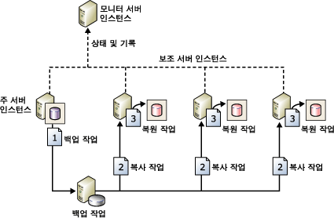

# 로그 전달 정보(SQL Server)

[!INCLUDE[appliesto-ss-xxxx-xxxx-xxx-md-winonly](../../includes/appliesto-ss-xxxx-xxxx-xxx-md-winonly.md)]

  [!INCLUDE[ssNoVersion](../../includes/ssnoversion-md.md)] 로그 전달을 사용하면 *주 서버* 인스턴스의 *주 데이터베이스* 에서 별도의 *보조 서버* 인스턴스에 있는 하나 이상의 *보조 데이터베이스* 로 트랜잭션 로그 백업을 자동으로 보낼 수 있습니다. 트랜잭션 로그 백업은 각 보조 데이터베이스에 개별적으로 적용됩니다. *모니터 서버*라는 선택적인 세 번째 서버 인스턴스는 백업 및 복원 작업의 기록과 상태를 기록하고 예약된 대로 작업이 실행되지 않으면 선택적으로 경고를 발생시킵니다.  
  
 **항목 내용:**  
  
-   [이점](#Benefits)  
  
-   [용어 및 정의](#TermsAndDefinitions)  
  
-   [로그 전달 개요](#ComponentsAndConcepts)  
  
-   [상호 운용성](#Interoperability)  
  
-   [관련 작업](#RelatedTasks)  
  
##   이점  
  
-   [!INCLUDE[ssNoVersion](../../includes/ssnoversion-md.md)]의 개별 인스턴스에서 각각 단일 주 데이터베이스와 하나 이상의 보조 데이터베이스에 대한 재해 복구 솔루션을 제공합니다.  
  
-   보조 데이터베이스에 대해 제한된 읽기 전용 액세스를 지원합니다(복원 작업 간의 간격 동안).  
  
-   주 서버가 주 데이터베이스의 로그를 백업하는 시점과 보조 서버가 로그 백업을 복원(적용)해야 할 시점 사이에 사용자 지정 지연을 설정할 수 있습니다. 예를 들어 주 데이터베이스에서 데이터가 실수로 변경된 경우 지연이 더 길면 도움이 될 수 있습니다. 실수로 변경된 내용을 빨리 발견하면 변경 내용이 반영되기 전에 보조 데이터베이스에서 아직 변경되지 않은 데이터를 지연 덕분에 검색할 수 있습니다.  
  
##   용어 및 정의  
 주 데이터베이스  
 프로덕션 서버인 [!INCLUDE[ssNoVersion](../../includes/ssnoversion-md.md)] 의 인스턴스입니다.  
  
 주 데이터베이스  
 다른 서버에 백업할 주 서버의 데이터베이스입니다. [!INCLUDE[ssManStudioFull](../../includes/ssmanstudiofull-md.md)] 를 통한 로그 전달 구성의 모든 관리는 주 데이터베이스에서 수행됩니다.  
  
 보조 데이터베이스  
 주 데이터베이스의 웜 대기 복사본을 보관할 [!INCLUDE[ssNoVersion](../../includes/ssnoversion-md.md)] 의 인스턴스입니다.  
  
 보조 데이터베이스  
 주 데이터베이스의 웜 대기 복사본입니다. 보조 데이터베이스는 제한된 읽기 전용 액세스에 사용 가능한 데이터베이스를 유지하는 RECOVERING 상태 또는 STANDBY 상태에 있을 수 있습니다.  
  
 모니터 서버  
 로그 전달의 자세한 내용을 모두 추적하는 [!INCLUDE[ssNoVersion](../../includes/ssnoversion-md.md)] 의 선택적 인스턴스입니다.  
  
-   주 데이터베이스의 트랜잭션 로그가 마지막으로 백업된 시간  
  
-   보조 서버가 백업 파일을 마지막으로 복사하고 복원한 시간  
  
-   백업 오류 경고 정보  
  
> [!IMPORTANT]  
>  모니터 서버를 구성한 후에는 로그 전달을 먼저 제거하지 않으면 모니터 서버를 변경할 수 없습니다.  
  
 백업 작업  
 백업 작업을 수행하고 로컬 서버와 모니터 서버에 작업을 기록하며 오래된 백업 파일과 기록 정보를 삭제하는 [!INCLUDE[ssNoVersion](../../includes/ssnoversion-md.md)] 에이전트 작업입니다. 로그 전달을 설정하면 주 서버 인스턴스에 "로그 전달 백업" 작업 범주가 생성됩니다.  
  
 복사 작업  
 주 서버에서 보조 서버의 구성 가능한 대상으로 백업 파일을 복사하고 보조 서버와 모니터 서버에 내역을 기록하는 [!INCLUDE[ssNoVersion](../../includes/ssnoversion-md.md)] 에이전트 작업입니다. 데이터베이스에서 로그 전달을 설정하면 로그 전달 구성의 각 보조 서버에 "로그 전달 복사" 작업 범주가 생성됩니다.  
  
 복원 작업  
 복사된 백업 파일을 보조 데이터베이스에 복원하는 [!INCLUDE[ssNoVersion](../../includes/ssnoversion-md.md)] 에이전트 작업입니다. 로컬 서버와 모니터 서버에 작업을 기록하고 오래된 파일과 기록 정보를 삭제합니다. 데이터베이스에서 로그 전달을 설정하면 보조 서버 인스턴스에 "로그 전달 복원" 작업 범주가 생성됩니다.  
  
 경고 작업  
 지정한 임계값 내에 백업 및 복원 작업이 완료되지 않을 때 주 데이터베이스 및 보조 데이터베이스에 대한 경고를 생성하는 [!INCLUDE[ssNoVersion](../../includes/ssnoversion-md.md)] 에이전트 작업입니다. 데이터베이스에서 로그 전달이 설정되면 모니터 서버 인스턴스에 "로그 전달 경고" 작업 범주가 생성됩니다.  
  
> [!TIP]  
>  각 경고에 대해 경고 번호를 지정해야 합니다. 또한 경고가 발생할 때 운영자에게 알릴 경고를 구성해야 합니다.  
  
##   로그 전달 개요  
 로그 전달은 다음 세 가지 작업으로 구성되어 있습니다.  
  
1.  주 서버 인스턴스에서 트랜잭션 로그를 백업합니다.  
  
2.  보조 서버 인스턴스에 트랜잭션 로그 파일을 복사합니다.  
  
3.  보조 서버 인스턴스에 로그 백업을 복원합니다.  
  
 다수의 보조 서버 인스턴스에 로그를 전달할 수 있습니다. 이 경우 두 번째 작업과 세 번째 작업은 각 보조 서버 인스턴스에 대해 중복됩니다.  
  
 로그 전달 구성은 자동으로 주 서버에서 보조 서버로 장애 조치(Failover)되지 않습니다. 주 데이터베이스를 사용할 수 없을 경우 수동으로 임의의 보조 데이터베이스를 온라인 상태로 전환할 수 있습니다.  
  
 보조 데이터베이스를 보고 용도로 사용할 수 있습니다.  
  
 또한 로그 전달 구성에 대해 경고를 구성할 수 있습니다.  
  
### 일반적인 로그 전달 구성  
 다음 그림에서는 주 서버 인스턴스, 보조 서버 인스턴스 3개 및 모니터 서버 인스턴스로 이루어진 로그 전달 구성을 보여 줍니다. 이 그림에서는 백업, 복사 및 복원 작업에서 수행된 단계를 다음과 같이 설명합니다.  
  
1.  주 서버 인스턴스는 백업 작업을 실행하여 주 데이터베이스의 트랜잭션 로그를 백업합니다. 그런 다음 로그 백업을 주 로그 백업 파일에 저장하고 해당 파일을 백업 폴더로 보냅니다.  이 그림에서 백업 폴더는 공유 디렉터리인 *백업 공유*에 있습니다.  
  
2.  3개의 보조 서버 인스턴스는 각각 자체 복사 작업을 실행하여 주 로그 백업 파일을 로컬 대상 폴더로 복사합니다.  
  
3.  각 보조 서버 인스턴스는 자체 복원 작업을 실행하여 로그 백업을 로컬 대상 폴더에서 로컬 보조 데이터베이스로 복원합니다.  
  
 주 서버 인스턴스와 보조 서버 인스턴스는 자체 기록 및 상태를 모니터 서버 인스턴스로 보냅니다.  
  
   
  
##   상호 운용성  
 로그 전달은 다음의 [!INCLUDE[ssNoVersion](../../includes/ssnoversion-md.md)]기능 또는 구성 요소와 함께 사용할 수 있습니다.  
  
-   [로그 전달에서 Always On 가용성 그룹으로 마이그레이션하기 위한 필수 조건&#40;SQL Server&#41;](../../database-engine/availability-groups/windows/prereqs-migrating-log-shipping-to-always-on-availability-groups.md)  
  
-   [데이터베이스 미러링 및 로그 전달&#40;SQL Server&#41;](../../database-engine/database-mirroring/database-mirroring-and-log-shipping-sql-server.md)  
  
-   [로그 전달 및 복제&#40;SQL Server&#41;](../../database-engine/log-shipping/log-shipping-and-replication-sql-server.md)  
  
> [!NOTE]  
>  [!INCLUDE[ssHADR](../../includes/sshadr-md.md)] 및 데이터베이스 미러링은 함께 사용할 수 없습니다. 이러한 기능 중 하나를 위해 구성된 데이터베이스는 다른 기능을 위해 구성할 수 없습니다.  
  
##   관련 작업  
  
-   [SQL Server 2016으로 로그 전달 업그레이드&#40;Transact-SQL&#41;](../../database-engine/log-shipping/upgrading-log-shipping-to-sql-server-2016-transact-sql.md)  
  
-   [로그 전달 구성&#40;SQL Server&#41;](../../database-engine/log-shipping/configure-log-shipping-sql-server.md)  
  
-   [로그 전달 구성에 보조 데이터베이스 추가&#40;SQL Server&#41;](../../database-engine/log-shipping/add-a-secondary-database-to-a-log-shipping-configuration-sql-server.md)  
  
-   [로그 전달 구성에서 보조 데이터베이스 제거&#40;SQL Server&#41;](../../database-engine/log-shipping/remove-a-secondary-database-from-a-log-shipping-configuration-sql-server.md)  
  
-   [로그 전달 제거&#40;SQL Server&#41;](../../database-engine/log-shipping/remove-log-shipping-sql-server.md)  
  
-   [로그 전달 보고서 보기&#40;SQL Server Management Studio&#41;](../../database-engine/log-shipping/view-the-log-shipping-report-sql-server-management-studio.md)  
  
-   [로그 전달 모니터링&#40;Transact-SQL&#41;](../../database-engine/log-shipping/monitor-log-shipping-transact-sql.md)  
  
-   [로그 전달 보조 데이터베이스로 장애 조치(failover)&#40;SQL Server&#41;](../../database-engine/log-shipping/fail-over-to-a-log-shipping-secondary-sql-server.md)  
  
-   [로그 전달 보조 데이터베이스로 장애 조치(failover)&#40;SQL Server&#41;](../../database-engine/log-shipping/fail-over-to-a-log-shipping-secondary-sql-server.md)  
  
-   [역할 전환 후 로그인 및 작업 관리&#40;SQL Server&#41;](../../sql-server/failover-clusters/management-of-logins-and-jobs-after-role-switching-sql-server.md)  
  
## 참고 항목  
 [Always On 가용성 그룹 개요&#40;SQL Server&#41;](../../database-engine/availability-groups/windows/overview-of-always-on-availability-groups-sql-server.md)  
  
  
