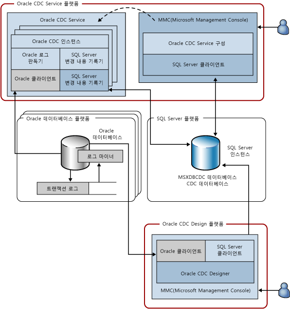

# Attunity Oracle CDC Service 시스템 아키텍처

[!INCLUDE[ssis-appliesto](../../includes/ssis-appliesto-ssvrpluslinux-asdb-asdw-xxx.md)]

  Oracle CDC Service는 하나 이상의 원본 Oracle 데이터베이스에서 선택한 테이블의 변경 내용을 [!INCLUDE[ssNoVersion](../../includes/ssnoversion-md.md)] 인스턴스에 있는 [!INCLUDE[ssNoVersion](../../includes/ssnoversion-md.md)] CDC 데이터베이스에 캡처합니다. 다음 다이어그램에서는 Oracle CDC Service를 구성하는 구성 요소를 보여 줍니다.  
  
   
  
 이 그림에서는 사용되는 4개의 플랫폼을 보여 줍니다. 이 다이어그램이 표준 사용 사례를 나타낸다고 하더라도 이러한 플랫폼은 많은 경우에 겹칠 수 있습니다. 예를 들어, Oracle 데이터베이스와 [!INCLUDE[ssNoVersion](../../includes/ssnoversion-md.md)] 데이터베이스는 각각 별도의 컴퓨터에서 실행되며 Oracle CDC S서비스 플랫폼 또는 CDC Service가 디자인되는 플랫폼과 공유되지 않습니다. 이 그림에 표시된 플랫폼은 다음과 같습니다.  
  
-   Oracle CDC Service: 이 플랫폼은 Oracle CDC Service를 설치하고 실행하는 지원되는 Windows 컴퓨터일 수 있습니다. 이 플랫폼은 Microsoft 장애 조치(failover) 클러스터의 클러스터 노드를 나타낼 수도 있습니다(고가용성 구성은 이 문서의 뒷부분에서 설명).  
  
-   Oracle Database: 이 플랫폼은 지원되는 버전의 Oracle 데이터베이스가 실행되는 컴퓨터일 수 있습니다. 여기에는 Windows, Linux 또는 설치된 버전의 Oracle 데이터베이스에서 지원되는 기타 운영 체제를 실행하는 컴퓨터가 포함됩니다. 단일 Oracle CDC Service가 여러 원본 Oracle 데이터베이스에서 변경 내용을 캡처할 수 있으므로 다이어그램에는 이 플랫폼이 복수로 표시됩니다.  
  
-   [!INCLUDE[ssNoVersion](../../includes/ssnoversion-md.md)]: 이 플랫폼은 대상 [!INCLUDE[ssNoVersion](../../includes/ssnoversion-md.md)] 데이터베이스([!INCLUDE[ssCurrent](../../includes/sscurrent-md.md)]의 지원되는 SKU)를 실행하는 컴퓨터일 수 있습니다. Oracle CDC Service는 변경 테이블과 서비스 구성을 저장하는 하나의 [!INCLUDE[ssNoVersion](../../includes/ssnoversion-md.md)] 대상을 지원합니다. [!INCLUDE[ssNoVersion](../../includes/ssnoversion-md.md)] 플랫폼은 [!INCLUDE[ssCurrent](../../includes/sscurrent-md.md)] 의 클러스터된 인스턴스 또는 [!INCLUDE[ssCurrent](../../includes/sscurrent-md.md)] Always On **기능을 사용하는** 의 미러된 인스턴스를 나타낼 수도 있습니다.  
  
-   Oracle CDC Designer: 이 플랫폼은 원본 Oracle 데이터베이스와 대상 [!INCLUDE[ssNoVersion](../../includes/ssnoversion-md.md)] 데이터베이스에 액세스할 수 있는 지원되는 Windows 컴퓨터일 수 있습니다.  
  
 다음 테이블에서는 위에서 설명한 4개의 플랫폼에서 실행되는 구성 요소에 대해 설명합니다.  
  
|구성 요소/설명|구성 요소 구성:|  
|----------------------------|----------------------------|  
|Oracle CDC Service: 변경 데이터 캡처 작업이 수행되는 Windows 서비스입니다.|Oracle CDC 인스턴스: 단일 원본 Oracle 데이터베이스의 변경 데이터 캡처 작업을 처리하는 Oracle CDC Service의 하위 프로세스입니다(원본 Oracle 데이터베이스당 하나의 Oracle CDC 인스턴스가 있음).|  
||Oracle 로그 판독기: Oracle 클라이언트를 사용하여 Oracle 트랜잭션 로그를 읽습니다.|  
||Oracle 클라이언트: Oracle과 통신하는 데 사용하는 Oracle 인스턴트 클라이언트입니다. 이 항목은 Oracle CDC Service를 설치하기 전에 Oracle에서 구하여 설치해야 하는 필수 구성 요소입니다.|  
||[!INCLUDE[ssNoVersion](../../includes/ssnoversion-md.md)] 변경 기록기: 캡처된 Oracle 테이블의 커밋된 변경 내용을 [!INCLUDE[ssNoVersion](../../includes/ssnoversion-md.md)] 변경 테이블에 기록합니다. 이 구성 요소는 대상 [!INCLUDE[ssNoVersion](../../includes/ssnoversion-md.md)] 데이터베이스 내의 캡처 상태도 유지 관리합니다.|  
||[!INCLUDE[ssNoVersion](../../includes/ssnoversion-md.md)]ODBC 클라이언트: [!INCLUDE[ssCurrent](../../includes/sscurrent-md.md)]의 Microsoft Native Client입니다. 이 항목은 Oracle CDC Service를 설치하기 전에 Microsoft에서 구하여 설치해야 하는 필수 구성 요소입니다.|  
|Oracle CDC Service 구성: Windows 서비스를 만들고 해당 구성을 설정하는 Microsoft Management Console 스냅인입니다.|[!INCLUDE[ssNoVersion](../../includes/ssnoversion-md.md)] 클라이언트: .NET 프레임워크 버전 4와 함께 제공되는 SQL ADO.NET 클라이언트입니다.|  
|Oracle Database: 테이블을 선택하기 위한 변경 사항을 캡처하는 원본 Oracle 데이터베이스입니다.|로그 마이너: Oracle 트랜잭션 로그를 읽는 Oracle 구성 요소입니다.|  
||트랜잭션 로그: Oracle에서 데이터베이스가 트랜잭션을 롤백하고 장애에서 복구하는 데 사용하는 온라인 및 보관된 Oracle 다시 실행 로그입니다(이 경우 Oracle 데이터베이스는 아카이브 로그 모드에서 작동해야 함).|  
|[!INCLUDE[ssNoVersion](../../includes/ssnoversion-md.md)] 인스턴스: CDC 데이터베이스가 호스팅되는 [!INCLUDE[ssNoVersion](../../includes/ssnoversion-md.md)] 인스턴스입니다. 이 인스턴스는 클러스터형 [!INCLUDE[ssNoVersion](../../includes/ssnoversion-md.md)] 인스턴스(장애 조치(failover) 클러스터) 또는 미러된 데이터베이스(Always On)일 수 있습니다.|MSXDBCDC 데이터베이스: 이 [!INCLUDE[ssNoVersion](../../includes/ssnoversion-md.md)] 인스턴스에서 작업하는 CDC Service에 대한 정보가 유지되는 데이터베이스입니다. CDC Service에서 처리되는 Oracle CDC 인스턴스에 대한 정보도 유지됩니다. 이 데이터베이스는 CDC Service 생성 프로세스의 일부로 만들어집니다.|  
||CDC 데이터베이스: 원본 Oracle 데이터베이스 중 하나에 대한 변경 내용을 저장하는 [!INCLUDE[ssNoVersion](../../includes/ssnoversion-md.md)] 데이터베이스입니다. CDC 데이터베이스는 [!INCLUDE[ssNoVersion](../../includes/ssnoversion-md.md)] CDC에 대해 설정되어 [!INCLUDE[ssNoVersion](../../includes/ssnoversion-md.md)] CDC 테이블과 기능을 갖추고 있으므로 Oracle에서 발생하는 변경 내용을 쉽게 사용할 수 있습니다.|  
|Oracle CDC Designer: Oracle CDC 인스턴스를 만드는 데 사용할 수 있는 Microsoft Management Console 스냅인입니다. 이 기능을 사용하여 캡처할 테이블과 열을 선택하고 Oracle 연결 정보를 제공하며 CDC 인스턴스의 수명 주기를 관리합니다.|[!INCLUDE[ssNoVersion](../../includes/ssnoversion-md.md)] 클라이언트: .NET Framework 버전 4와 함께 제공되는 SQL ADO.NET 클라이언트입니다.|  
||Oracle 클라이언트: Oracle과 통신하는 데 사용하는 Oracle 인스턴트 클라이언트입니다. 이 항목은 Oracle CDC Service를 설치하기 전에 Oracle에서 구하여 설치해야 하는 필수 구성 요소입니다.|  
  
 Oracle CDC Service 및 자식 Oracle CDC 인스턴스는 클라이언트인 원본 Oracle 데이터베이스 및 대상 [!INCLUDE[ssNoVersion](../../includes/ssnoversion-md.md)] 인스턴스와 통신할 수 있을 뿐이며 네트워크 및 기타 프로토콜에서는 활성으로 수신하지 않습니다. Oracle CDC Service는 CDC 데이터베이스에서 구성 변경을 모니터링하고 업데이트된 구성을 기반으로 작업을 업데이트합니다.  
  
  
