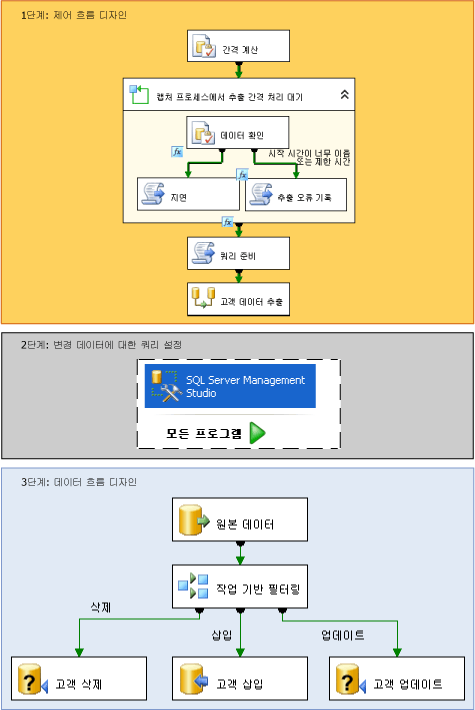

# 변경 데이터 캡처(SSIS)
  [!INCLUDE[ssNoVersion](../../includes/ssnoversion-md.md)]에서 변경 데이터 캡처는 원본 테이블에서 데이터 마트 및 데이터 웨어하우스로의 증분 로드를 효율적으로 수행하는 문제에 대한 효과적인 솔루션을 제공합니다.  
  
## 변경 데이터 캡처 정의  
 시간이 지나면서 원본 테이블은 변경됩니다. 이러한 테이블을 기반으로 하는 데이터 마트나 데이터 웨어하우스에도 이러한 변경 내용이 반영되어야 합니다. 그러나 전체 원본의 스냅숏을 주기적으로 복사하는 프로세스에는 시간과 리소스가 너무 많이 소모됩니다. 또한 타임스탬프 열, 트리거 또는 복잡한 쿼리를 비롯한 대체 방법을 사용하면 성능이 저하되고 복잡성이 증가되는 경우가 많습니다. 따라서 소비자가 데이터의 대상 표현에 쉽게 적용할 수 있도록 구조화된 안정적인 변경 데이터 스트림이 필요합니다. [!INCLUDE[ssNoVersion](../../includes/ssnoversion-md.md)] 의 변경 데이터 캡처가 이러한 솔루션을 제공합니다.  
  
 [!INCLUDE[ssDE](../../includes/ssde-md.md)] 의 변경 데이터 캡처 기능은 [!INCLUDE[ssNoVersion](../../includes/ssnoversion-md.md)] 테이블에 적용된 삽입, 업데이트 및 삭제 작업을 캡처하고 변경 내용에 대한 세부 정보를 쉽게 사용할 수 있는 관계형 형식으로 만듭니다. 변경 데이터 캡처에 사용되는 변경 테이블에는 행 단위로 발생한 변경 내용을 이해하는 데 필요한 메타데이터뿐만 아니라 추적된 원본 테이블의 열 구조를 미러링하는 열이 포함됩니다.  
  
> [!NOTE]  
>  변경 데이터 캡처는 일부 [!INCLUDE[msCoName](../../includes/msconame-md.md)][!INCLUDE[ssNoVersion](../../includes/ssnoversion-md.md)]버전에서 사용할 수 없습니다. [!INCLUDE[ssNoVersion](../../includes/ssnoversion-md.md)]버전에서 지원되는 기능 목록은 [SQL Server 2016 버전에서 지원하는 기능](~/sql-server/editions-and-supported-features-for-sql-server-2016.md)을 참조하세요.  
  
## Integration Services에서의 변경 데이터 캡처 작동 방식  
 [!INCLUDE[ssISnoversion](../../includes/ssisnoversion-md.md)] 패키지는 [!INCLUDE[ssNoVersion](../../includes/ssnoversion-md.md)] 데이터베이스에서 변경 데이터를 쉽게 수집하여 데이터 웨어하우스에 대한 증분 로드를 효율적으로 수행할 수 있습니다. 그러나 사용자가 [!INCLUDE[ssISnoversion](../../includes/ssisnoversion-md.md)] 를 사용하여 변경 데이터를 로드하려면 먼저 사용자가 변경 내용을 캡처하려는 데이터베이스 및 테이블에서 관리자가 변경 데이터 캡처를 설정해야 합니다. 데이터베이스에서 변경 데이터 캡처를 구성하는 방법은 [변경 데이터 캡처 설정 및 해제&#40;SQL Server&#41;](../../relational-databases/track-changes/enable-and-disable-change-data-capture-sql-server.md)를 참조하세요.  
  
 관리자가 데이터베이스에서 변경 데이터 캡처를 설정하면 사용자가 변경 데이터를 증분 로드하는 패키지를 만들 수 있습니다. 다음 다이어그램에서는 단일 테이블에서 증분 로드를 수행하는 패키지를 만드는 단계를 보여 줍니다.  
  
   
  
 위의 다이어그램에서 볼 수 있듯이 변경된 데이터를 증분 로드하는 패키지를 만드는 단계는 다음과 같습니다.  
  
 **1단계: 제어 흐름 디자인**  
 패키지의 제어 흐름에서 다음 태스크를 정의해야 합니다.  
  
-   검색하려는 원본 데이터에 대한 변경 간격의 시작 및 종료 **datetime** 값을 계산합니다.  
  
     이러한 값을 계산하려면 SQL 실행 태스크를 사용하거나 [!INCLUDE[ssISnoversion](../../includes/ssisnoversion-md.md)] 식에 **datetime** 함수를 사용합니다. 그런 다음 패키지에서 나중에 사용하기 위해 이러한 끝점을 패키지 변수에 저장합니다.  
  
     **자세한 내용:** [변경 데이터의 간격 지정](../../integration-services/change-data-capture/specify-an-interval-of-change-data.md)  
  
-   선택한 간격에 대한 변경 데이터가 준비되었는지 여부를 확인합니다. 비동기 캡처 프로세스에서 선택한 끝점에 아직 도달하지 않았을 수 있기 때문에 이 단계가 필요합니다.  
  
     데이터가 준비되었는지 여부를 확인하려면 필요한 경우 선택한 간격에 대한 변경 데이터가 준비될 때까지 실행을 지연하는 For 루프 컨테이너로 시작합니다. 해당 루프 컨테이너 내에서 SQL 실행 태스크를 사용하여 변경 데이터 캡처에 의해 유지되는 시간 매핑 테이블을 쿼리합니다. 그런 다음 필요한 경우 **Thread.Sleep** 메서드를 호출하는 스크립트 태스크 또는 **WAITFOR** 문이 있는 다른 SQL 실행 태스크를 사용하여 패키지 실행을 일시적으로 지연합니다. 다른 스크립트 태스크를 사용하여 오류 상태나 시간 초과를 기록할 수도 있습니다.  
  
     **자세한 내용:** [변경 데이터의 준비 여부 확인](../../integration-services/change-data-capture/determine-whether-the-change-data-is-ready.md)  
  
-   변경 데이터를 쿼리하는 데 사용할 쿼리 문자열을 준비합니다.  
  
     스크립트 태스크나 SQL 실행 태스크를 사용하여 변경 내용을 쿼리하는 데 사용할 SQL 문을 조합합니다.  
  
     **자세한 내용:** [변경 데이터에 대한 쿼리 준비](../../integration-services/change-data-capture/prepare-to-query-for-the-change-data.md)  
  
 **2단계: 변경 데이터에 대한 쿼리 설정**  
 데이터를 쿼리할 테이블 반환 함수를 만듭니다.  
  
 [!INCLUDE[ssManStudioFull](../../includes/ssmanstudiofull-md.md)] 를 사용하여 쿼리를 개발하고 저장합니다.  
  
 **자세한 내용:** [변경 데이터 검색 및 이해](../../integration-services/change-data-capture/retrieve-and-understand-the-change-data.md)  
  
 **3단계: 데이터 흐름 디자인**  
 패키지의 데이터 흐름에서 다음 태스크를 정의해야 합니다.  
  
-   변경 테이블에서 변경 데이터를 검색합니다.  
  
     데이터를 검색하려면 원본 구성 요소를 사용하여 선택한 간격 범위에 포함되는 변경 테이블의 변경 내용을 쿼리합니다. 원본에서는 앞에서 만든 Transact-SQL 테이블 반환 함수를 호출합니다.  
  
     **자세한 내용:** [변경 데이터 검색 및 이해](../../integration-services/change-data-capture/retrieve-and-understand-the-change-data.md)  
  
-   처리를 위해 변경 내용을 삽입, 업데이트 및 삭제로 분할합니다.  
  
     변경 내용을 분할하려면 조건부 분할 변환을 사용하여 적절한 처리를 위해 삽입, 업데이트 및 삭제를 다른 출력으로 전송합니다.  
  
     **자세한 내용:** [삽입, 업데이트 및 삭제 처리](../../integration-services/change-data-capture/process-inserts-updates-and-deletes.md)  
  
-   대상에 삽입, 삭제 및 업데이트를 적용합니다.  
  
     대상에 변경 내용을 적용하려면 대상 구성 요소를 사용하여 대상에 삽입을 적용합니다. 또한 OLE DB 명령 변환에 매개 변수가 있는 UPDATE 및 DELETE 문을 사용하여 대상에 업데이트 및 삭제를 적용합니다. 대상 구성 요소를 통해 임시 테이블에 해당 행을 저장하여 업데이트 및 삭제를 적용할 수도 있습니다. 그런 다음 SQL 실행 태스크를 사용하여 임시 테이블의 대상에 대해 대량 업데이트 및 대량 삭제 작업을 수행합니다.  
  
     **자세한 내용:** [대상에 변경 내용 적용](../../integration-services/change-data-capture/apply-the-changes-to-the-destination.md)  
  
### 여러 테이블의 데이터 변경  
 위 다이어그램에 설명된 프로세스 및 단계는 단일 테이블에서 증분 로드를 수행합니다. 여러 테이블에서 증분 로드를 수행하는 경우 전반적인 프로세스는 같습니다. 그러나 여러 테이블 처리에 맞게 패키지의 디자인을 변경해야 합니다. 여러 테이블에서 증분 로드를 수행하는 패키지를 만드는 방법은 [여러 테이블의 증분 로드 수행](../../integration-services/change-data-capture/perform-an-incremental-load-of-multiple-tables.md)을 참조하세요.  
  
## 패키지 변경 데이터 캡처 예제  
 [!INCLUDE[ssISnoversion](../../includes/ssisnoversion-md.md)] 에서는 패키지에서 변경 데이터 캡처를 사용하는 방법을 보여 주는 두 가지 예제를 제공합니다. 자세한 내용은 다음 항목을 참조하십시오.  
  
-   [지정된 간격 동안 변경 데이터 캡처 패키지 예제 추가 정보](http://go.microsoft.com/fwlink/?LinkId=133507)  
  
-   [마지막 요청 이후 변경 데이터 캡처 패키지 예제 추가 정보](http://go.microsoft.com/fwlink/?LinkId=133508)  
  
## 관련 작업  
  
-   [변경 데이터의 간격 지정](../../integration-services/change-data-capture/specify-an-interval-of-change-data.md)  
  
-   [변경 데이터의 준비 여부 확인](../../integration-services/change-data-capture/determine-whether-the-change-data-is-ready.md)  
  
-   [변경 데이터에 대한 쿼리 준비](../../integration-services/change-data-capture/prepare-to-query-for-the-change-data.md)  
  
-   [변경 데이터 검색을 위한 함수 만들기](../../integration-services/change-data-capture/create-the-function-to-retrieve-the-change-data.md)  
  
-   [변경 데이터 검색 및 이해](../../integration-services/change-data-capture/retrieve-and-understand-the-change-data.md)  
  
-   [삽입, 업데이트 및 삭제 처리](../../integration-services/change-data-capture/process-inserts-updates-and-deletes.md)  
  
-   [대상에 변경 내용 적용](../../integration-services/change-data-capture/apply-the-changes-to-the-destination.md)  
  
-   [여러 테이블의 증분 로드 수행](../../integration-services/change-data-capture/perform-an-incremental-load-of-multiple-tables.md)  
  
## 관련 내용  
 sqlblog.com의 블로그 항목 - [SSIS 디자인 패턴 – 증분 로드](http://go.microsoft.com/fwlink/?LinkId=217679)  
  
  
