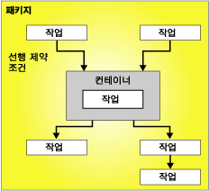

# 제어 흐름

[!INCLUDE[sqlserver-ssis](../../includes/applies-to-version/sqlserver-ssis.md)]

  패키지는 제어 흐름과 하나 이상의 데이터 흐름(선택적)으로 구성됩니다. [!INCLUDE[ssNoVersion](../../includes/ssnoversion-md.md)] [!INCLUDE[ssISnoversion](../../includes/ssisnoversion-md.md)]에서는 패키지의 구조를 제공하는 컨테이너, 기능을 제공하는 태스크 및 실행 파일, 컨테이너, 태스크를 정렬된 제어 흐름으로 연결하는 선행 제약 조건 등 3가지 유형의 제어 흐름 요소를 제공합니다.  
  
 자세한 내용은 [Precedence Constraints](../../integration-services/control-flow/precedence-constraints.md), [Integration Services Containers](../../integration-services/control-flow/integration-services-containers.md)및 [Integration Services Tasks](../../integration-services/control-flow/integration-services-tasks.md)을 참조하세요.  
  
 다음 다이어그램에서는 하나의 컨테이너와 6개의 태스크가 포함된 하나의 제어 흐름을 보여 줍니다. 태스크 중 5개는 패키지 수준에서 정의되며 남은 하나의 태스크는 컨테이너 수준에서 정의됩니다. 이 태스크는 컨테이너 내부에 있습니다.  
  
   
  
 [!INCLUDE[ssISnoversion](../../includes/ssisnoversion-md.md)] 아키텍처는 컨테이너 중첩을 지원하며 제어 흐름에는 중첩된 컨테이너의 여러 수준이 포함될 수 있습니다. 예를 들어 패키지에는 또 다른 Foreach 루프 컨테이너 등을 포함할 수 있는 Foreach 루프 컨테이너와 같은 컨테이너가 포함될 수 있습니다.  
  
 또한 이벤트 처리기에는 같은 종류의 제어 흐름 요소를 사용하여 작성되는 제어 흐름이 포함됩니다.  
  
## 제어 흐름 구현  
 **디자이너의** 제어 흐름 [!INCLUDE[ssIS](../../includes/ssis-md.md)] 탭을 사용하여 패키지의 제어 흐름을 만들 수 있습니다. **제어 흐름** 탭이 활성화된 경우 제어 흐름에 추가할 수 있는 태스크 및 컨테이너가 도구 상자에 나열됩니다.  
  
 다음 다이어그램에서는 제어 흐름 디자이너에서의 간단한 패키지에 대한 제어 흐름을 보여 줍니다. 다이어그램에 표시된 제어 흐름은 3개의 패키지 수준 태스크와 3개의 태스크가 포함된 한 개의 패키지 수준 컨테이너로 구성됩니다. 태스크와 컨테이너는 선행 제약 조건을 사용하여 연결됩니다.  
  
   
  
 제어 흐름을 만드는 데에는 다음 태스크가 포함됩니다.  
  
-   패키지에서 반복되는 워크플로를 구현하거나 제어 흐름을 하위 집합으로 구분하는 컨테이너를 추가합니다.  
  
-   데이터 흐름을 지원하고, 데이터를 준비하고, 워크플로 및 비즈니스 인텔리전스 기능을 수행하고, 스크립트를 구현하는 태스크를 추가합니다.  
  
     [!INCLUDE[ssISnoversion](../../includes/ssisnoversion-md.md)]에는 패키지의 비즈니스 요구 사항을 만족시켜주는 제어 흐름을 만들기 위해 사용할 수 있는 여러 태스크가 포함됩니다. 패키지에서 데이터를 사용해야 하는 경우 제어 흐름에는 적어도 하나 이상의 데이터 흐름 태스크가 포함되어야 합니다. 예를 들어 패키지에서 데이터를 추출하고, 데이터 값을 집계한 다음 결과를 데이터 원본에 기록해야 할 수도 있습니다.  자세한 내용은 [Integration Services 태스크](../../integration-services/control-flow/integration-services-tasks.md) 및 [제어 흐름에서 태스크 또는 컨테이너 추가 또는 삭제](../../integration-services/control-flow/add-or-delete-a-task-or-a-container-in-a-control-flow.md)를 참조하세요.  
  
-   선행 제약 조건을 사용하여 컨테이너와 태스크를 정렬된 제어 흐름으로 연결합니다.  
  
     **제어 흐름** 탭의 디자인 화면에 태스크나 컨테이너를 추가하면 [!INCLUDE[ssIS](../../includes/ssis-md.md)] 디자이너가 해당 항목에 연결선을 자동으로 추가합니다. 패키지에 두 개 이상의 항목, 태스크 또는 컨테이너가 포함된 경우 해당 연결선을 서로 연결하여 이를 하나의 제어 흐름으로 결합시킬 수 있습니다.  
  
     두 항목 간의 연결선을 선행 제약 조건이라고 합니다. 선행 제약 조건은 연결된 두 항목 간의 관계를 정의합니다. 선행 제약 조건은 런타임에 태스크 및 컨테이너가 실행되는 순서와 태스크 및 컨테이너가 실행되는 조건을 지정합니다. 예를 들어 선행 제약 조건을 사용하면 특정 태스크가 성공해야 제어 흐름의 다음 태스크가 실행되도록 지정할 수 있습니다. 자세한 내용은 [Precedence Constraints](../../integration-services/control-flow/precedence-constraints.md)을(를) 참조하세요.  
  
-   연결 관리자 추가  
  
     대부분의 태스크에는 데이터 원본에 대한 연결이 필요하며, 이를 위해서는 해당 태스크에 필요한 연결 관리자를 패키지에 추가해야 합니다. 사용되는 열거자 유형에 따라 Foreach 루프 컨테이너에도 연결 관리자가 필요할 수 있습니다. 연결 관리자는 제어 흐름을 항목별로 구성할 때나 제어 흐름 구성을 시작하기 전에 추가할 수 있습니다. 자세한 내용은 [Integration Services&#40;SSIS&#41; 연결](../../integration-services/connection-manager/integration-services-ssis-connections.md) 및 [연결 관리자 만들기](../connection-manager/integration-services-ssis-connections.md)를 참조하세요.  
  
 [!INCLUDE[ssIS](../../includes/ssis-md.md)] 디자이너에는 디자인 화면을 관리하고 제어 흐름을 이해하기 쉽게 만드는 데 사용할 수 있는 여러 디자인 타임 기능도 포함됩니다.  
  
## 관련 작업  
  
-   [제어 흐름에서 태스크 또는 컨테이너 추가 또는 삭제](../../integration-services/control-flow/add-or-delete-a-task-or-a-container-in-a-control-flow.md)  
  
-   [태스크 또는 컨테이너의 속성 설정](./add-or-delete-a-task-or-a-container-in-a-control-flow.md)  
  
-   [구성 요소 그룹화 또는 그룹 해제](../../integration-services/group-or-ungroup-components.md)  
  
