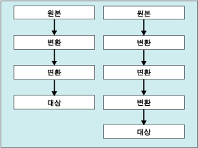

# 데이터 흐름 태스크
  데이터 흐름 태스크는 원본과 대상 사이에 데이터를 이동하는 데이터 흐름 엔진을 캡슐화하며, 이를 통해 사용자는 데이터 이동 시 데이터를 변환, 정리 및 수정할 수 있습니다. 데이터 흐름 태스크를 패키지에 추가하면 패키지에서 데이터를 추출, 변환 및 로드할 수 있습니다.  
  
 데이터 흐름은 적어도 하나 이상의 데이터 흐름 구성 요소로 구성되지만 일반적으로 데이터를 추출하는 원본, 데이터를 수정, 라우팅 또는 요약하는 변환 및 데이터를 로드하는 대상과 같은 일련의 연결된 데이터 흐름 구성 요소로 구성됩니다.  
  
 런타임 시 데이터 흐름 태스크는 데이터 흐름으로부터 실행 계획을 작성하고, 이 계획은 데이터 흐름 엔진에 의해 실행됩니다. 데이터 흐름이 없는 데이터 흐름 태스크를 만들 수 있지만 적어도 하나 이상의 데이터 흐름이 있는 경우에만 태스크가 실행됩니다.  
  
 텍스트 파일의 데이터를 [!INCLUDE[ssNoVersion](../../includes/ssnoversion-md.md)] 데이터베이스에 대량 삽입하려는 경우 데이터 흐름 태스크 및 데이터 흐름 대신 대량 삽입 태스크를 사용할 수 있습니다. 하지만 대량 삽입 태스크에서는 데이터를 변환할 수 없습니다. 자세한 내용은 [Bulk Insert Task](../../integration-services/control-flow/bulk-insert-task.md)을 참조하세요.  
  
## 여러 흐름  
 데이터 흐름 태스크에는 여러 데이터 흐름이 포함될 수 있습니다. 태스크에서 여러 데이터가 복사되고, 데이터 복사 순서가 중요하지 않은 경우에는 데이터 흐름 태스크에 여러 데이터 흐름을 포함시키는 것이 편리합니다. 예를 들어 플랫 파일의 데이터를 데이터 웨어하우스의 별모양 스키마에 있는 다른 차원 테이블로 복사하는 5개의 데이터 흐름을 만들 수 있습니다.  
  
 하지만 데이터 흐름 엔진은 하나의 데이터 흐름 태스크 내에 여러 데이터 흐름이 있는 경우 실행 순서를 결정합니다. 따라서 순서가 중요한 경우에는 패키지에서 각각 하나의 데이터 흐름이 포함된 여러 데이터 흐름 태스크를 사용해야 합니다. 그런 다음에는 선행 제약 조건을 적용하여 태스크의 실행 순서를 제어할 수 있습니다.  
  
 다음 다이어그램에서는 여러 데이터 흐름이 포함된 하나의 데이터 흐름 태스크를 보여 줍니다.  
  
   
  
## 로그 항목  
 [!INCLUDE[ssISnoversion](../../includes/ssisnoversion-md.md)] 에서는 모든 태스크에서 사용할 수 있는 로그 이벤트 집합을 제공합니다. [!INCLUDE[ssISnoversion](../../includes/ssisnoversion-md.md)] 에서는 여러 태스크에서 사용할 수 있는 사용자 지정 로그 항목도 제공합니다. 자세한 내용은 [Integration Services&#40;SSIS&#41; 로깅](../../integration-services/performance/integration-services-ssis-logging.md)을 참조하세요. 데이터 흐름 태스크에는 다음 사용자 지정 로그 항목이 포함됩니다.  
  
|로그 항목|Description|  
|---------------|-----------------|  
|**BufferSizeTuning**|데이터 흐름 태스크로 인해 버퍼 크기가 변경되었음을 나타냅니다. 로그 항목은 크기가 변경된 이유를 설명하고 임시 새 버퍼 크기를 나열합니다.|  
|**OnPipelinePostEndOfRowset**|구성 요소에 **ProcessInput** 메서드의 마지막 호출로 설정된 해당 행 집합 끝 신호를 제공했음을 나타냅니다. 입력을 처리하는 데이터 흐름의 각 구성 요소에 대한 항목이 기록됩니다. 이 항목은 구성 요소의 이름을 포함합니다.|  
|**OnPipelinePostPrimeOutput**|구성 요소가 **PrimeOutput** 메서드에 대한 마지막 호출을 완료했음을 나타냅니다. 데이터 흐름에 따라 여러 로그 항목이 기록될 수 있습니다. 구성 요소가 원본일 경우 이 로그 항목은 구성 요소가 행 처리를 완료했음을 의미합니다.|  
|**OnPipelinePreEndOfRowset**|구성 요소가 **ProcessInput** 메서드의 마지막 호출로 설정된 해당 행 집합 끝 신호를 수신하려고 함을 나타냅니다. 입력을 처리하는 데이터 흐름의 각 구성 요소에 대한 항목이 기록됩니다. 이 항목은 구성 요소의 이름을 포함합니다.|  
|**OnPipelinePrePrimeOutput**|구성 요소가 **PrimeOutput** 메서드에서 해당 호출을 수신하려고 함을 나타냅니다. 데이터 흐름에 따라 여러 로그 항목이 기록될 수 있습니다.|  
|**OnPipelineRowsSent**|**ProcessInput** 메서드 호출로 구성 요소 입력에 제공한 행 수를 보고합니다. 이 로그 항목은 구성 요소 이름을 포함합니다.|  
|**PipelineBufferLeak**|버퍼 관리자가 없어진 후에 버퍼를 활성 상태로 유지하는 모든 구성 요소에 대한 정보를 제공합니다. 버퍼가 여전히 활성 상태인 경우 버퍼 리소스가 해제되지 않으므로 메모리가 손실될 수 있습니다. 로그 항목은 구성 요소 이름과 버퍼 ID를 제공합니다.|  
|**PipelineComponentTime**|5개의 주요 처리 단계인 Validate, PreExecute, PostExecute, ProcessInput 및 ProcessOutput 각각에서 구성 요소에 소요된 시간(밀리초)을 보고합니다.|  
|**PipelineExecutionPlan**|데이터 흐름의 실행 계획을 보고합니다. 실행 계획은 버퍼를 구성 요소로 전송하는 방법에 대한 정보를 제공합니다. 이 정보는 PipelineExecutionTrees 로그 항목과 함께 데이터 흐름 태스크 내에서 발생하는 사항에 대해 설명합니다.|  
|**PipelineExecutionTrees**|데이터 흐름에서 레이아웃 실행 트리를 보고합니다. 데이터 흐름 엔진 스케줄러에서는 이 트리를 사용하여 데이터 흐름의 실행 계획을 작성합니다.|  
|**PipelineInitialization**|태스크에 대한 초기화 정보를 제공합니다. 이 정보에 BLOB 데이터의 임시 저장소에 사용할 디렉터리, 기본 버퍼 크기 및 버퍼의 행 수가 포함됩니다. 데이터 흐름 태스크의 구성에 따라 여러 로그 항목이 기록될 수 있습니다.|  
  
 이러한 로그 항목은 패키지를 실행할 때마다 데이터 흐름 태스크의 실행과 관련된 다양한 정보를 제공합니다. 패키지를 반복적으로 실행할 경우 해당 태스크에서 수행하는 처리, 성능에 영향을 줄 수 있는 문제 및 해당 태스크에서 처리하는 데이터 볼륨에 대한 중요한 기록 정보를 시간별로 제공하는 정보를 캡처할 수 있습니다.  
  
 이러한 로그 항목을 사용하여 데이터 흐름의 성능을 모니터링하고 향상시키는 방법은 다음 항목 중 하나를 참조하십시오.  
  
-   [성능 카운터](../../integration-services/performance/performance-counters.md)  
  
-   [데이터 흐름 성능 기능](../../integration-services/data-flow/data-flow-performance-features.md)  
  
### 데이터 흐름 태스크의 예제 메시지  
 다음 표에서는 매우 간단한 패키지의 로그 항목에 대한 예제 메시지를 보여 줍니다. 이 패키지에서는 OLE DB 원본을 사용하여 테이블에서 데이터를 추출하고, 정렬 변환을 사용하여 데이터를 정렬하며, OLE DB 대상을 사용하여 다른 테이블에 데이터를 씁니다.  
  
|로그 항목|메시지|  
|---------------|--------------|  
|**BufferSizeTuning**|`Rows in buffer type 0 would cause a buffer size greater than the configured maximum. There will be only 9637 rows in buffers of this type.`   `Rows in buffer type 2 would cause a buffer size greater than the configured maximum. There will be only 9497 rows in buffers of this type.`   `Rows in buffer type 3 would cause a buffer size greater than the configured maximum. There will be only 9497 rows in buffers of this type.`|  
|**OnPipelinePostEndOfRowset**|`A component will be given the end of rowset signal. : 1180 : Sort : 1181 : Sort Input`   `A component will be given the end of rowset signal. : 1291 : OLE DB Destination : 1304 : OLE DB Destination Input`|  
|**OnPipelinePostPrimeOutput**|`A component has returned from its PrimeOutput call. : 1180 : Sort`   `A component has returned from its PrimeOutput call. : 1 : OLE DB Source`|  
|**OnPipelinePreEndOfRowset**|`A component has finished processing all of its rows. : 1180 : Sort : 1181 : Sort Input`   `A component has finished processing all of its rows. : 1291 : OLE DB Destination : 1304 : OLE DB Destination Input`|  
|**OnPipelinePrePrimeOutput**|`PrimeOutput will be called on a component. : 1180 : Sort`   `PrimeOutput will be called on a component. : 1 : OLE DB Source`|  
|**OnPipelineRowsSent**|`Rows were provided to a data flow component as input. :  : 1185 : OLE DB Source Output : 1180 : Sort : 1181 : Sort Input : 76`   `Rows were provided to a data flow component as input. :  : 1308 : Sort Output : 1291 : OLE DB Destination : 1304 : OLE DB Destination Input : 76`|  
|**PipelineComponentTime**|`The component "Calculate LineItemTotalCost" (3522) spent 356 milliseconds in ProcessInput.`   `The component "Sum Quantity and LineItemTotalCost" (3619) spent 79 milliseconds in ProcessInput.`   `The component "Calculate Average Cost" (3662) spent 16 milliseconds in ProcessInput.`   `The component "Sort by ProductID" (3717) spent 125 milliseconds in ProcessInput.`   `The component "Load Data" (3773) spent 0 milliseconds in ProcessInput.`   `The component "Extract Data" (3869) spent 688 milliseconds in PrimeOutput filling buffers on output "OLE DB Source Output" (3879).`   `The component "Sum Quantity and LineItemTotalCost" (3619) spent 141 milliseconds in PrimeOutput filling buffers on output "Aggregate Output 1" (3621).`   `The component "Sort by ProductID" (3717) spent 16 milliseconds in PrimeOutput filling buffers on output "Sort Output" (3719).`|  
|**PipelineExecutionPlan**|`SourceThread0`   `Drives: 1`   `Influences: 1180 1291`   `Output Work List`   `CreatePrimeBuffer of type 1 for output ID 11.`   `SetBufferListener: "WorkThread0" for input ID 1181`   `CreatePrimeBuffer of type 3 for output ID 12.`   `CallPrimeOutput on component "OLE DB Source" (1)`   `End Output Work List`   `End SourceThread0`   `WorkThread0`   `Drives: 1180`   `Influences: 1180 1291`   `Input Work list, input ID 1181 (1 EORs Expected)`   `CallProcessInput on input ID 1181 on component "Sort" (1180) for view type 2`   `End Input Work list for input 1181`   `Output Work List`   `CreatePrimeBuffer of type 4 for output ID 1182.`   `SetBufferListener: "WorkThread1" for input ID 1304`   `CallPrimeOutput on component "Sort" (1180)`   `End Output Work List`   `End WorkThread0`   `WorkThread1`   `Drives: 1291`   `Influences: 1291`   `Input Work list, input ID 1304 (1 EORs Expected)`   `CallProcessInput on input ID 1304 on component "OLE DB Destination" (1291) for view type 5`   `End Input Work list for input 1304`   `Output Work List`   `End Output Work List`   `End WorkThread1`|  
|**PipelineExecutionTrees**|`begin execution tree 0`   `output "OLE DB Source Output" (11)`   `input "Sort Input" (1181)`   `end execution tree 0`   `begin execution tree 1`   `output "OLE DB Source Error Output" (12)`   `end execution tree 1`   `begin execution tree 2`   `output "Sort Output" (1182)`   `input "OLE DB Destination Input" (1304)`   `output "OLE DB Destination Error Output" (1305)`   `end execution tree 2`|  
|**PipelineInitialization**|`No temporary BLOB data storage locations were provided. The buffer manager will consider the directories in the TEMP and TMP environment variables.`   `The default buffer size is 10485760 bytes.`   `Buffers will have 10000 rows by default`   `The data flow will not remove unused components because its RunInOptimizedMode property is set to false.`|  
  
 로그 이벤트는 대부분 여러 개의 항목을 기록하며 다양한 로그 항목의 메시지에는 복잡한 데이터가 들어 있습니다. 복잡한 메시지 내용을 보다 쉽게 이해하고 전달할 수 있도록 메시지 텍스트를 구문 분석할 수 있습니다. 로그의 위치에 따라 Transact-SQL 문이나 스크립트 구성 요소를 사용하여 복잡한 텍스트를 열이나 보다 유용한 그 밖의 형식으로 구분할 수 있습니다.  
  
 예를 들어 다음 표에서는 "행이 데이터 흐름 구성 요소에 입력으로 제공되었습니다. :  : 1185 : OLE DB 원본 출력 : 1180 : Sort : 1181 : 정렬 입력 : 76"이라는 메시지가 여러 개의 열로 구문 분석된 결과를 보여 줍니다. 이 메시지는 OLE DB 원본의 행이 정렬 변환으로 보내질 때 **OnPipelineRowsSent** 이벤트에 의해 기록된 것입니다.  
  
|Column|Description|값|  
|------------|-----------------|-----------|  
|**PathID**|OLE DB 원본과 정렬 변환 사이의 경로에 대한 **ID** 속성 값입니다.|1185|  
|**PathName**|경로의 **Name** 속성 값입니다.|OLE DB 원본 출력|  
|**ComponentID**|정렬 변환의 **ID** 속성 값입니다.|1180|  
|**ComponentName**|정렬 변환의 **Name** 속성 값입니다.|Sort|  
|**InputID**|정렬 변환에 대한 입력의 **ID** 속성 값입니다.|1181|  
|**InputName**|정렬 변환에 대한 입력의 **Name** 속성 값입니다.|정렬 입력|  
|**RowsSent**|정렬 변환의 입력으로 보내지는 행 수입니다.|76|  
  
## 데이터 흐름 태스크 구성  
 **속성** 창을 사용하거나 프로그래밍 방식으로 속성을 설정할 수 있습니다.  
  
 **속성** 창에서 이러한 속성을 설정하는 방법을 보려면 다음 항목을 클릭하십시오.  
  
-   [태스크 또는 컨테이너의 속성 설정](http://msdn.microsoft.com/library/52d47ca4-fb8c-493d-8b2b-48bb269f859b)  
  
## 데이터 흐름 태스크의 프로그래밍 방식 구성  
 패키지에 데이터 흐름 태스크를 프로그래밍 방식으로 추가하고 데이터 흐름 속성을 설정하는 방법을 보려면 다음 항목을 클릭하십시오.  
  
-   [프로그래밍 방식으로 데이터 흐름 태스크 추가](../../integration-services/building-packages-programmatically/adding-the-data-flow-task-programmatically.md)  
  
## 관련 작업  
 [태스크 또는 컨테이너의 속성 설정](http://msdn.microsoft.com/library/52d47ca4-fb8c-493d-8b2b-48bb269f859b)  
  
## 관련 내용  
 technet.microsoft.com의 비디오, [분산 데이터 배포자](http://go.microsoft.com/fwlink/?LinkID=226278&clcid=0x409)  
  
  
