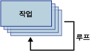

# For 루프 컨테이너

[!INCLUDE[ssis-appliesto](../../includes/ssis-appliesto-ssvrpluslinux-asdb-asdw-xxx.md)]

  For 루프 컨테이너는 패키지의 반복 제어 흐름을 정의합니다. 루프 구현은 프로그래밍 언어에서의 **For** 루프 구조와 유사합니다. For 루프 컨테이너는 각 루프를 반복할 때마다 식을 계산하고 식이 **False**가 될 때까지 워크플로를 반복합니다.  
  
 For 루프 컨테이너는 다음 요소를 사용하여 루프를 정의합니다.  
  
-   루프 카운터에 값을 할당하는 초기화 식(옵션)  
  
-   루프를 중지 또는 계속할지를 테스트하는 식이 포함된 계산 식  
  
-   루프 카운터를 증가 또는 감소시키는 반복 식(옵션)  
  
 다음 다이어그램에서는 메일 보내기 태스크를 사용한 For 루프 컨테이너를 보여 줍니다. 초기화 식이 `@Counter = 0`이고 계산 식이 `@Counter < 4`이고 반복 식이 `@Counter = @Counter + 1`이면 루프가 4번 반복되어 4개의 전자 메일 메시지를 보냅니다.  
  
   
  
 식은 [!INCLUDE[ssNoVersion](../../includes/ssnoversion-md.md)] [!INCLUDE[ssISnoversion](../../includes/ssisnoversion-md.md)]의 유효한 식이어야 합니다.  
  
 초기화 식과 대입 식을 만들려면 대입 연산자(=)를 사용할 수 있습니다. 이 연산자는 Integration Services 식 문법에서 다른 용도로 지원되지 않으며 For 루프 컨테이너의 초기화 및 대입 식 유형에만 사용할 수 있습니다. 대입 연산자를 사용하는 식의 구문은 `@Var = <expression>`이어야 합니다. 여기서 **Var**은 런타임 변수이고 \<expression>은 [!INCLUDE[ssIS](../../includes/ssis-md.md)] 식 구문의 규칙을 따르는 식입니다. 식은 변수, 리터럴 및 SSIS 식 문법에서 지원하는 모든 연산자와 함수를 포함할 수 있습니다. 변수의 데이터 형식으로 캐스팅할 수 있는 데이터 형식으로 식이 계산되어야 합니다.  
  
 For 루프 컨테이너는 하나의 계산 식만 포함할 수 있습니다. 따라서 For 루프 컨테이너는 모든 제어 흐름 요소를 동일한 횟수만큼 실행합니다. For 루프 컨테이너에 다른 For 루프 컨테이너가 포함될 수 있으므로 중첩 루프를 만들고 패키지에 복잡한 루프를 구현할 수 있습니다.  
  
 For 루프 컨테이너의 트랜잭션 속성을 설정하여 패키지 제어 흐름의 하위 집합에 대해 트랜잭션을 정의할 수 있습니다. 이러한 방식으로 보다 세부적으로 트랜잭션을 관리할 수 있습니다. 예를 들어 For 루프 컨테이너가 테이블의 데이터를 업데이트하는 제어 흐름을 여러 번 반복하는 경우 For 루프와 해당 제어 흐름에서 트랜잭션을 사용하여 모든 데이터가 성공적으로 업데이트되지 않으면 데이터가 업데이트되지 않도록 구성할 수 있습니다. 자세한 내용은 [Integration Services 트랜잭션](../../integration-services/integration-services-transactions.md)을 참조하세요.  
  
## For 루프 컨테이너를 사용하여 제어 흐름에 반복 추가
  [!INCLUDE[ssISnoversion](../../includes/ssisnoversion-md.md)]에는 패키지의 제어 흐름에서 조건에 따라 반복되는 루프를 간단하게 포함시킬 수 있는 제어 흐름 요소인 For 루프 컨테이너가 포함됩니다. 자세한 내용은 [For 루프 컨테이너](../../integration-services/control-flow/for-loop-container.md)가 될 때까지 워크플로를 반복합니다.  
  
 For 루프 컨테이너는 루프가 반복될 때마다 조건을 평가하고 조건이 False이면 중지합니다. For 루프 컨테이너에는 루프를 초기화하고, 반복되는 제어 흐름의 실행을 중지하는 평가 조건을 지정하고, 평가 조건을 비교할 값을 업데이트하는 식에 값을 대입하는 식이 포함됩니다. 평가 조건은 필수 항목이지만 초기화 및 대입 식은 선택 항목입니다.  
  
 For 루프 컨테이너는 기능을 제공하는 것이 아니고 반복할 수 있는 제어 흐름을 만드는 구조만 제공합니다. 컨테이너 기능을 제공하려면 적어도 하나 이상의 태스크를 For 루프 컨테이너에 포함시켜야 합니다. 자세한 내용은 [Integration Services Tasks](../../integration-services/control-flow/integration-services-tasks.md)을(를) 참조하세요.  
  
 For 루프 컨테이너에는 여러 태스크가 포함된 제어 흐름과 다른 컨테이너가 포함될 수 있습니다. For 루프 컨테이너에 태스크 및 컨테이너를 추가하는 방법은 패키지에 추가하는 방법과 비슷하며, 태스크 및 컨테이너를 패키지가 아닌 For 루프 컨테이너로 끌어 온다는 점만 다릅니다. For 루프 컨테이너에 두 개 이상의 태스크 또는 컨테이너가 포함된 경우 패키지에서와 같은 방식으로 선행 제약 조건을 사용하여 이를 연결할 수 있습니다. 자세한 내용은 [Precedence Constraints](../../integration-services/control-flow/precedence-constraints.md)을(를) 참조하세요.  
  
## 제어 흐름에서 For 루프 컨테이너 추가  
  
1.  패키지에 For 루프 컨테이너를 추가합니다. 자세한 내용은 [제어 흐름에서 태스크 또는 컨테이너 추가 또는 삭제](../../integration-services/control-flow/add-or-delete-a-task-or-a-container-in-a-control-flow.md)를 참조하세요.  
  
2.  For 루프 컨테이너에 태스크 및 컨테이너를 추가합니다. 자세한 내용은 [제어 흐름에서 태스크 또는 컨테이너 추가 또는 삭제](../../integration-services/control-flow/add-or-delete-a-task-or-a-container-in-a-control-flow.md)를 참조하세요.  
  
3.  선행 제약 조건을 사용하여 For 루프 컨테이너에 있는 태스크 및 컨테이너를 연결합니다. 자세한 내용은 [기본 선행 제약 조건을 사용하여 태스크 및 컨테이너 연결](https://msdn.microsoft.com/library/8f31f15f-98ff-4c35-b41f-8b8cfd148d75)을 참조하세요.  
  
4.  For 루프 컨테이너를 구성합니다. 자세한 내용은 [For 루프 컨테이너 구성](https://msdn.microsoft.com/library/b9cd7ea7-b198-4a35-8b16-6acf09611ca5)가 될 때까지 워크플로를 반복합니다.  

##  For 루프 컨테이너 구성
이 절차에서는 **For 루프 편집기** 대화 상자를 사용하여 For 루프 컨테이너를 구성하는 방법에 대해 설명합니다.  
  
1.  [!INCLUDE[ssBIDevStudioFull](../../includes/ssbidevstudiofull-md.md)]에서 For 루프 컨테이너를 두 번 클릭하여 **For 루프 편집기**를 엽니다.  
  
2.  선택적으로 For 루프 컨테이너의 이름과 설명을 수정합니다.  
  
3.  선택적으로 **InitExpression** 입력란에 초기화 식을 입력합니다.  
  
4.  **EvalExpression** 입력란에 계산 식을 입력합니다.  
  
    > [!NOTE]  
    >  식은 부울로 계산되어야 합니다. 식 결과가 **false**이면 루프 실행이 중지됩니다.  
  
5.  선택적으로 **AssignExpression** 입력란에 대입 식을 입력합니다.  
  
6.  선택적으로 **식** 페이지에서 **Expressions** 를 클릭하고 For 루프 컨테이너의 속성에 대한 속성 식을 만듭니다. 자세한 내용은 [속성 식 추가 또는 변경](../../integration-services/expressions/add-or-change-a-property-expression.md)을 참조하세요.  
  
7.  **확인** 을 클릭하여 **For 루프 편집기**를 닫습니다.  

## For 루프 편집기 대화 상자
**For 루프 편집기** 대화 상자의 **For 루프** 페이지를 사용하여 지정한 조건이 False로 평가될 때까지 워크플로를 반복하는 루프를 구성할 수 있습니다.  
  
 For 루프 컨테이너 및 패키지에서의 해당 컨테이너 사용 방법은 [For Loop Container](../../integration-services/control-flow/for-loop-container.md)를 참조하십시오.  
  
### 옵션  
 **InitExpression**  
 필요에 따라 루프에서 사용하는 값을 초기화하는 식을 제공합니다.  
  
 **EvalExpression**  
 루프를 중단할 것인지, 아니면 계속할 것인지를 평가하는 식을 제공합니다.  
  
 **AssignExpression**  
 필요에 따라 루프가 반복될 때마다 조건을 변경하는 식을 제공합니다.  
  
 **이름**  
 For 루프 컨테이너에 사용할 고유 이름을 제공합니다. 이 이름은 태스크 아이콘에서 레이블로 사용됩니다.  
  
> [!NOTE]  
>  개체 이름은 패키지 내에서 고유해야 합니다.  
  
 **설명**  
 For 루프 컨테이너에 대한 설명을 제공합니다.  
 
## For 루프 컨테이너와 함께 식 사용  
 평가 조건, 초기화 값 또는 대입 식을 지정하여 For 루프 컨테이너를 구성할 때는 문자 또는 식을 사용할 수 있습니다.  
  
 식에는 변수가 포함될 수 있습니다. 변수를 사용하면 런타임 시 값을 업데이트하여 패키지를 보다 유연하고 쉽게 관리할 수 있습니다. 식의 최대 길이는 4000자입니다.  
  
 식에서 변수를 지정할 때는 변수 이름 앞에 @ 기호를 사용해야 합니다. 예를 들어 변수 이름이 **Counter**이면 For 루프 컨테이너에서 사용되는 식에 @Counter를 입력합니다. 변수에 네임스페이스 속성을 포함시키려면 변수와 네임스페이스를 괄호로 묶어야 합니다. 예를 들어 변수가 **Counter** 이고 네임스페이스가 **MyNamespace** 이면 [@MyNamespace::Counter]를 입력합니다.  
  
 For 루프 컨테이너에서 사용되는 변수는 For 루프 컨테이너의 범위 또는 패키지 컨테이너 계층에서 높은 수준의 컨테이너 범위에 정의되어 있어야 합니다. 예를 들어 For 루프 컨테이너는 자체 범위에 정의된 변수와 패키지 범위에 정의된 변수를 사용할 수 있습니다. 자세한 내용은 [Integration Services&#40;SSIS&#41; 변수](../../integration-services/integration-services-ssis-variables.md) 및 [패키지에서 변수 사용](https://msdn.microsoft.com/library/7742e92d-46c5-4cc4-b9a3-45b688ddb787)을 참조하세요.  
  
 [!INCLUDE[ssIS](../../includes/ssis-md.md)] 식 문법에는 평가, 초기화 및 대입에 사용되는 복잡한 식을 구현할 수 있는 완벽한 연산자 및 함수가 제공됩니다. 자세한 내용은 [Integration Services&#40;SSIS&#41; 식](../../integration-services/expressions/integration-services-ssis-expressions.md)가 될 때까지 워크플로를 반복합니다.  
  
  
## 참고 항목  
 [제어 흐름](../../integration-services/control-flow/control-flow.md)   
 [Integration Services&#40;SSIS&#41; 식](../../integration-services/expressions/integration-services-ssis-expressions.md)  
  
  
