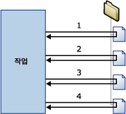

# Foreach 루프 컨테이너

[!INCLUDE[sqlserver-ssis](../../includes/applies-to-version/sqlserver-ssis.md)]

  Foreach 루프 컨테이너는 패키지의 반복 제어 흐름을 정의합니다. 루프 구현은 프로그래밍 언어에서의 **Foreach** 루프 구조와 유사합니다. 패키지에서 Foreach 열거자를 사용하면 루프를 사용할 수 있습니다.  Foreach 루프 컨테이너는 지정한 열거자의 각 멤버에 대해 제어 흐름을 반복합니다.  
  
 [!INCLUDE[ssNoVersion](../../includes/ssnoversion-md.md)] [!INCLUDE[ssISnoversion](../../includes/ssisnoversion-md.md)]에서는 다음 열거자 유형을 제공합니다.  
  
-   Foreach ADO 열거자는 테이블의 행을 열거합니다. 예를 들어 ADO 레코드 집합의 행을 가져올 수 있습니다.  
  
     레코드 집합 대상은 **Object** 데이터 형식의 패키지 변수에 저장된 레코드 집합의 메모리에 데이터를 저장합니다. 일반적으로 Foreach 루프 컨테이너를 Foreach ADO 열거자와 함께 사용하여 레코드 집합의 행을 한 번에 하나씩 처리합니다. Foreach ADO 열거자에 대해 지정된 변수는 개체 데이터 형식이어야 합니다. 레코드 집합 대상에 대한 자세한 내용은 [레코드 집합 대상 사용](../../integration-services/data-flow/use-a-recordset-destination.md)을 참조하세요.  
  
-   Foreach ADO.NET 스키마 행 집합 열거자는 데이터 원본에 대한 스키마 정보를 열거합니다. 예를 들어 [!INCLUDE[ssSampleDBnormal](../../includes/sssampledbnormal-md.md)] [!INCLUDE[ssNoVersion](../../includes/ssnoversion-md.md)] 데이터베이스의 테이블 목록을 열거하고 가져올 수 있습니다.  
  
-   Foreach File 열거자는 폴더의 파일을 열거합니다. 열거자는 하위 폴더를 포함할 수 있습니다. 예를 들어 Windows 폴더 및 하위 폴더에서 파일 이름 확장명이 *.log인 모든 파일을 읽을 수 있습니다. 파일이 검색되는 순서는 지정할 수 없습니다.  
  
-   Foreach From Variable 열거자는 지정한 변수에 포함된 열거 가능 개체를 열거합니다. 열거 가능 개체는 배열, ADO.NET **DataTable**, [!INCLUDE[ssISnoversion](../../includes/ssisnoversion-md.md)] 열거자 등이 될 수 있습니다. 예를 들어 서버 이름을 포함하는 배열 값을 열거할 수 있습니다.  
  
-   Foreach Item 열거자는 컬렉션 항목을 열거합니다. 예를 들어 프로세스 실행 태스크가 사용하는 실행 파일 이름 및 작업 디렉터리를 열거할 수 있습니다.  
  
-   Foreach Nodelist 열거자는 XPath(XML Path Language) 식의 결과 집합을 열거합니다. 예를 들어 식 `/authors/author[@period='classical']`은 classical period의 모든 author 목록을 열거하고 가져옵니다.  
  
-   Foreach SMO 열거자는 SMO( [!INCLUDE[ssNoVersion](../../includes/ssnoversion-md.md)] Management Object) 개체를 열거합니다. 예를 들어 [!INCLUDE[ssNoVersion](../../includes/ssnoversion-md.md)] 데이터베이스의 뷰 목록을 열거하고 가져올 수 있습니다.  
  
-   지정된 HDFS 위치에 있는 HDFS 파일을 열거하는 Foreach HDFS 파일 열거자입니다.  
  
-   Azure Storage의 blob 컨테이너에 blob를 열거하는 Foreach Azure Blob 열거자입니다.  

-   Azure Data Lake Store의 디렉터리에 파일을 열거하는 Foreach ADLS 파일 열거자입니다.

-   Azure Data Lake Store Gen2의 디렉터리에 파일을 열거하는 Foreach Data Lake Storage Gen2 파일 열거자입니다.
  
 다음 다이어그램에서는 파일 시스템 태스크가 있는 Foreach 루프 컨테이너를 보여 줍니다. Foreach 루프는 Foreach File 열거자를 사용하며 파일 시스템 태스크는 파일을 복사하도록 구성되어 있습니다. 열거자가 지정한 폴더에 4개 파일이 들어 있으면 루프가 4번 반복되어 4개 파일이 복사됩니다.  
  
   
  
 변수 및 속성 식의 조합을 사용하여 패키지 개체의 속성을 열거자 컬렉션 값으로 업데이트할 수 있습니다. 먼저 컬렉션 값을 사용자 정의 변수에 매핑한 다음 이 변수를 사용하는 속성 식을 속성에 구현합니다. 예를 들어 Foreach File 열거자의 컬렉션 값을 **MyFile** 이라는 변수에 매핑한 다음 메일 보내기 태스크의 Subject 속성에 대한 속성 식에서 이 변수를 사용합니다. 패키지를 실행하면 루프가 반복될 때마다 Subject 속성이 파일 이름으로 업데이트됩니다. 자세한 내용은 [패키지에서 속성 식 사용](../../integration-services/expressions/use-property-expressions-in-packages.md)을 참조하세요.  
  
 열거자 컬렉션 값에 매핑된 변수를 식과 스크립트에 사용할 수도 있습니다.  
  
 Foreach 루프 컨테이너는 여러 개의 태스크와 컨테이너를 포함할 수 있지만 하나의 열거자 유형만 사용할 수 있습니다. Foreach 루프 컨테이너에 여러 개의 태스크가 포함되어 있으면 열거자 컬렉션 값을 각 태스크의 여러 속성에 매핑할 수 있습니다.  
  
 Foreach 루프 컨테이너에 트랜잭션 특성을 설정하여 패키지 제어 흐름의 하위 집합에 대한 트랜잭션을 정의할 수 있습니다. 이렇게 하면 패키지 수준이 아닌 Foreach 루프 수준에서 트랜잭션을 관리할 수 있습니다. 예를 들어 Foreach 루프 컨테이너가 별모양 스키마의 차원 및 팩트 테이블을 업데이트하는 제어 흐름을 반복하는 경우 모든 팩트 테이블이 성공적으로 업데이트되지 않으면 어떤 테이블도 업데이트하지 않도록 트랜잭션을 구성할 수 있습니다. 자세한 내용은 [Integration Services 트랜잭션](../../integration-services/integration-services-transactions.md)을 참조하세요.  
  
## 열거자 유형  
 열거자는 구성 가능하며 열거자에 따라 다른 정보를 제공해야 합니다.  
  
 다음 표에서는 각 열거자 유형에 필요한 정보를 요약해서 보여 줍니다.  
  
|Enumerator|구성 요구 사항|  
|----------------|--------------------------------|  
|Foreach ADO|ADO 개체 원본 변수와 열거자 모드 지정 변수는 개체 데이터 형식이어야 합니다.|  
|Foreach ADO.NET 스키마 행 집합|데이터베이스에 대한 연결과 열거할 스키마 지정|  
|Foreach File|열거할 폴더 및 파일, 검색된 파일의 파일 이름 형식 및 하위 폴더 포함 여부 지정|  
|Foreach From Variable|열거할 개체가 포함된 변수 지정|  
|Foreach Item|열과 열 데이터 형식을 포함하여 Foreach Item 컬렉션의 항목 정의|  
|Foreach Nodelist|XML 문서의 원본 지정 및 XPath 작업 구성|  
|Foreach SMO|데이터베이스에 대한 연결과 열거할 SMO 개체 지정|  
|Foreach HDFS File 열거자|열거할 폴더 및 파일, 검색된 파일의 파일 이름 형식 및 하위 폴더 포함 여부 지정|  
|Foreach Azure Blob|컨테이너 blob을 열거할 수 있는 Azure blob 컨테이너를 지정합니다.|  
|Foreach ADLS 파일|열거할 파일을 포함하는 Azure Data Lake Store 디렉터리를 지정합니다.|
|Foreach Data Lake Storage Gen2 파일|열거할 파일을 포함하는 Azure Data Lake Storage Gen2 디렉터리를 다른 옵션과 함께 지정합니다.|

## Foreach 루프 컨테이너를 사용하여 제어 흐름에 열거 추가
 [!INCLUDE[ssISnoversion](../../includes/ssisnoversion-md.md)]에는 패키지의 제어 흐름에 파일 및 개체를 열거하는 루핑 구성을 간단하게 포함시킬 수 있는 제어 흐름 요소인 Foreach 루프 컨테이너가 포함됩니다. 자세한 내용은 [Foreach 루프 컨테이너](../../integration-services/control-flow/foreach-loop-container.md)을 참조하십시오.  
  
 Foreach 루프 컨테이너는 특정 기능을 제공하는 것이 아니라 반복 가능한 제어 흐름을 작성하고, 열거자 유형을 지정하고, 열거자를 구성할 수 있는 구조만 제공합니다. 컨테이너 기능을 제공하려면 적어도 하나 이상의 태스크를 Foreach 루프 컨테이너에 포함시켜야 합니다. 자세한 내용은 [Integration Services Tasks](../../integration-services/control-flow/integration-services-tasks.md)을(를) 참조하세요.  
  
 Foreach 루프 컨테이너에는 여러 태스크가 포함된 제어 흐름과 다른 컨테이너가 포함될 수 있습니다. Foreach 루프 컨테이너에 태스크 및 컨테이너를 추가하는 방법은 패키지에 추가하는 방법과 비슷하며, 태스크 및 컨테이너를 패키지가 아닌 Foreach 루프 컨테이너로 끌어 온다는 점만 다릅니다. Foreach 루프 컨테이너에 두 개 이상의 태스크 또는 컨테이너가 포함된 경우 패키지에서와 같은 방식으로 선행 제약 조건을 사용하여 이를 연결할 수 있습니다. 자세한 내용은 [Precedence Constraints](../../integration-services/control-flow/precedence-constraints.md)을(를) 참조하세요.  
  
### Foreach 루프 컨테이너 추가 및 구성
  
1.  패키지에 Foreach 루프 컨테이너를 추가합니다. 자세한 내용은 [제어 흐름에서 태스크 또는 컨테이너 추가 또는 삭제](../../integration-services/control-flow/add-or-delete-a-task-or-a-container-in-a-control-flow.md)를 참조하세요.  
  
2.  Foreach 루프 컨테이너에 태스크 및 컨테이너를 추가합니다. 자세한 내용은 [제어 흐름에서 태스크 또는 컨테이너 추가 또는 삭제](../../integration-services/control-flow/add-or-delete-a-task-or-a-container-in-a-control-flow.md)를 참조하세요.  
  
3.  선행 제약 조건을 사용하여 Foreach 루프 컨테이너에 있는 태스크 및 컨테이너를 연결합니다. 자세한 내용은 [기본 선행 제약 조건을 사용하여 태스크 및 컨테이너 연결](https://msdn.microsoft.com/library/8f31f15f-98ff-4c35-b41f-8b8cfd148d75)을 참조하세요.  
  
4.  Foreach 루프 컨테이너를 구성합니다. 자세한 내용은 [Foreach 루프 컨테이너 구성](https://msdn.microsoft.com/library/519c6f96-5e1f-47d2-b96a-d49946948c25)을 참조하십시오.  

## Foreach 루프 컨테이너 구성
이 절차에서는 열거자 및 컨테이너 수준의 속성 식을 비롯한 Foreach 루프 컨테이너를 구성하는 방법에 대해 설명합니다.  
  
1.  [!INCLUDE[ssBIDevStudioFull](../../includes/ssbidevstudiofull-md.md)]에서 원하는 패키지가 들어 있는 [!INCLUDE[ssISnoversion](../../includes/ssisnoversion-md.md)] 프로젝트를 엽니다.  
  
2.  **제어 흐름** 탭을 클릭하고 Foreach 루프를 두 번 클릭합니다.  
  
3.  **Foreach 루프 편집기** 대화 상자에서 **일반** 을 클릭하고 선택적으로 Foreach 루프의 이름과 설명을 수정합니다.  
  
4.  **컬렉션** 을 클릭하고 **Enumerator** 목록에서 열거자 유형을 선택합니다.  
  
5.  열거자를 지정하고 열거자 옵션을 다음과 같이 설정합니다.  
  
    -   Foreach File 열거자를 사용하려면 열거할 파일이 들어 있는 폴더를 제공하고, 파일 이름 및 유형에 대한 필터를 지정하고, 정규화된 파일 이름을 반환할지 여부를 지정합니다. 또한 하위 폴더의 파일에 대해서도 동일 작업을 반복할지 여부를 나타냅니다.  
  
    -   Foreach Item 열거자를 사용하려면 **열**을 클릭하고 **For Each Item 열** 대화 상자에서 **추가** 를 클릭하여 열을 추가합니다. **데이터 형식** 목록에서 각 열에 대한 데이터 형식을 선택하고 **확인**을 클릭합니다.  
  
         열에 값을 입력하거나 목록에서 값을 선택합니다.  
  
        > [!NOTE]  
        >  새 행을 추가하려면 입력한 셀 바깥의 아무 곳이나 클릭합니다.  
  
        > [!NOTE]  
        >  값이 열 데이터 형식과 호환되지 않으면 텍스트가 강조 표시됩니다.  
  
    -   Foreach ADO 열거자를 사용하려면 기존 변수를 선택하거나 **ADO 개체 원본 변수** 목록에서 **새 변수** 를 클릭하여 열거할 ADO 개체의 이름이 들어 있는 변수를 지정하고 열거 모드 옵션을 선택합니다.  
  
         새 변수를 만드는 경우에는 **변수 추가** 대화 상자에서 변수 속성을 설정합니다.  
  
    -   Foreach ADO.NET 스키마 행 집합 열거자를 사용하려면 기존 ADO.NET 연결을 선택하거나 **연결** 목록에서 **새 연결** 을 클릭한 후 스키마를 선택합니다.  
  
         필요에 따라 **제한 설정** 을 클릭하여 스키마 제한을 선택하고, 제한 값이 있는 변수를 선택하거나 제한 값을 입력한 다음 **확인**을 클릭합니다.  
  
    -   Foreach From Variable 열거자를 사용하려면 **변수** 목록에서 변수를 선택합니다.  
  
    -   Foreach NodeList 열거자를 사용하려면 DocumentSourceType을 클릭하고 목록에서 원본 유형을 선택한 다음 DocumentSource를 클릭합니다. DocumentSourceType에 대해 선택한 값에 따라 목록에서 변수 또는 파일 연결을 선택하거나, 새 변수 또는 파일 연결을 만들거나, **문서 원본 편집기**에서 XML 원본을 입력합니다.  
  
         그런 다음 EnumerationType을 클릭하고 목록에서 열거형 형식을 선택합니다. EnumerationType이 **Navigator, Node 또는 NodeText**이면 OuterXPathStringSourceType을 클릭하고 원본 유형을 선택한 다음 OuterXPathString을 클릭합니다. OuterXPathStringSourceType에 대해 설정된 값에 따라 목록에서 변수 또는 파일 연결을 선택하거나, 새 변수 또는 파일 연결을 만들거나, 외부 XPath(XML Path Language) 식에 대한 문자열을 입력합니다.  
  
         EnumerationType이 **ElementCollection**이면 위에서 설명한 대로 OuterXPathStringSourceType 및 OuterXPathString을 설정합니다. 그런 다음 InnerElementType을 클릭하고 내부 요소에 대한 열거형 형식을 선택한 다음 InnerXPathStringSourceType을 클릭합니다. InnerXPathStringSourceType에 대해 설정된 값에 따라 변수 또는 파일 연결을 선택하거나, 새 변수 또는 파일 연결을 만들거나, 내부 XPath 식에 대한 문자열을 입력합니다.  
  
    -   Foreach SMO 열거자를 사용하려면 기존 ADO.NET 연결을 선택하거나 **연결** 목록에서 **새 연결** 을 클릭한 후 사용할 문자열을 입력하거나 **찾아보기**를 클릭합니다. **찾아보기**를 클릭한 경우 **SMO 열거 선택** 대화 상자에서 열거할 개체 유형과 열거 유형을 선택하고 **확인**을 클릭합니다.  
  
6.  선택적으로 **컬렉션** 페이지의 **식** 텍스트 상자에서 찾아보기 단추 **(...)** 를 클릭하여 속성 값을 업데이트하는 식을 만듭니다. 자세한 내용은 [속성 식 추가 또는 변경](../../integration-services/expressions/add-or-change-a-property-expression.md)을 참조하세요.  
  
    > [!NOTE]  
    >  **속성** 목록에 나열되는 속성은 열거자에 따라 다릅니다.  
  
7.  선택적으로 **변수 매핑**을 클릭하여 컬렉션 값에 개체 속성을 매핑한 후 다음을 수행합니다.  
  
    1.  **변수** 목록에서 변수를 선택하거나 **\<New Variable>** 를 클릭하여 새 변수를 만듭니다.  
  
    2.  새 변수를 추가하는 경우에는 **변수 추가** 대화 상자에서 변수 속성을 설정하고 **확인**을 클릭합니다.  
  
    3.  For Each Item 열거자를 사용하는 경우 **인덱스** 목록에서 인덱스 값을 업데이트할 수 있습니다.  
  
        > [!NOTE]  
        >  인덱스 값은 항목에서 변수로 매핑될 열을 나타냅니다. For Each Item 열거자에서만 0이 아닌 인덱스 값을 사용할 수 있습니다.  
  
8.  선택적으로 **식** 페이지에서 **Expressions** 를 클릭하고 Foreach 루프 컨테이너의 속성에 대한 속성 식을 만듭니다. 자세한 내용은 [속성 식 추가 또는 변경](../../integration-services/expressions/add-or-change-a-property-expression.md)을 참조하세요.  
  
9. **확인**을 클릭합니다.  

## 일반 페이지 - Foreach 루프 편집기
**Foreach 루프 편집기** 대화 상자의 **일반** 페이지에서 지정한 열거자를 사용하여 컬렉션의 각 멤버에 대해 워크플로를 반복하는 Foreach 루프 컨테이너의 이름을 지정하고 설명할 수 있습니다.  
  
 Foreach 루프 컨테이너와 이를 구성하는 방법은 [Foreach 루프 컨테이너](../../integration-services/control-flow/foreach-loop-container.md) 및 [Foreach 루프 컨테이너 구성](https://msdn.microsoft.com/library/519c6f96-5e1f-47d2-b96a-d49946948c25)을 참조하세요.  
  
### 옵션  
 **이름**  
 Foreach 루프 컨테이너에 사용할 고유 이름을 제공합니다. 이 이름은 태스크 아이콘과 로그에서 레이블로 사용됩니다.  
  
> [!NOTE]  
>  개체 이름은 패키지 내에서 고유해야 합니다.  
  
 **설명**  
 Foreach 루프 컨테이너에 대한 설명을 입력합니다.  

## 컬렉션 페이지 - Foreach 루프 편집기
 **Foreach 루프 편집기** 대화 상자의 **컬렉션** 페이지를 사용하여 열거자 유형을 지정하고 열거자를 구성합니다.  
  
 Foreach 루프 컨테이너와 이를 구성하는 방법은 [Foreach 루프 컨테이너](../../integration-services/control-flow/foreach-loop-container.md) 및 [Foreach 루프 컨테이너 구성](https://msdn.microsoft.com/library/519c6f96-5e1f-47d2-b96a-d49946948c25)을 참조하세요.  
  
### 정적 옵션  
 **Enumerator**  
 목록에서 열거자 유형을 선택합니다. 이 속성의 옵션은 다음 표에 나열되어 있습니다.  
  
|값|Description|  
|-----------|-----------------|  
|**Foreach File 열거자**|파일을 열거합니다. 이 값을 선택하면 아래의 **Foreach File 열거자**섹션에 설명된 동적 옵션이 표시됩니다.|  
|**Foreach Item 열거자**|항목의 값을 열거합니다. 이 값을 선택하면 아래의 **Foreach Item 열거자**섹션에 설명된 동적 옵션이 표시됩니다.|  
|**Foreach ADO 열거자**|테이블 또는 테이블의 행을 열거합니다. 이 값을 선택하면 아래의 **Foreach ADO 열거자**섹션에 설명된 동적 옵션이 표시됩니다.|  
|**Foreach ADO.NET 스키마 행 집합 열거자**|스키마를 열거합니다. 이 값을 선택하면 아래의 **Foreach ADO.NET 열거자**섹션에 설명된 동적 옵션이 표시됩니다.|  
|**Foreach From Variable 열거자**|변수의 값을 열거합니다. 이 값을 선택하면 아래의 **Foreach From Variable 열거자**섹션에 설명된 동적 옵션이 표시됩니다.|  
|**Foreach Nodelist 열거자**|XML 문서의 노드를 열거합니다. 이 값을 선택하면 아래의 **Foreach Nodelist 열거자**섹션에 설명된 동적 옵션이 표시됩니다.|  
|**Foreach SMO 열거자**|SMO 개체를 열거합니다. 이 값을 선택하면 아래의 **Foreach SMO 열거자**섹션에 설명된 동적 옵션이 표시됩니다.|  
|**Foreach HDFS File 열거자**|지정된 HDFS 위치에 있는 HDFS 파일을 열거합니다. 이 값을 선택하면 **Foreach HDFS File 열거자**섹션에 동적 옵션이 표시됩니다.|  
|**Foreach Azure Blob 열거자**|지정된 Blob 위치에 있는 Blob 파일을 열거합니다. 이 값을 선택하면 **Foreach Azure Blob 열거자**섹션에 동적 옵션이 표시됩니다.|  
|**Foreach ADLS File 열거자**|지정된 Data Lake Store 디렉터리에서 파일을 열거합니다. 이 값을 선택하면 **Foreach ADLS File 열거자**섹션에 동적 옵션이 표시됩니다.|
|**Foreach Data Lake Storage Gen2 파일 열거자**|지정된 Data Lake Storage Gen2 디렉터리에서 파일을 열거합니다. 이 값을 선택하면 **Foreach Data Lake Storage Gen2 파일 열거자** 섹션에 동적 옵션이 표시됩니다.|
  
 **식**  
 기존 속성 식 목록을 보려면 **식** 을 클릭 또는 확장합니다. 줄임표 단추 **(...)** 를 클릭하여 열거자 속성에 대한 속성 식을 추가하거나 기존 속성 식을 편집 및 평가합니다.  
  
 **관련 항목:**  [Integration Services&#40;SSIS&#41; 식](../../integration-services/expressions/integration-services-ssis-expressions.md), [속성 식 편집기](../../integration-services/expressions/property-expressions-editor.md), [식 작성기](../../integration-services/expressions/expression-builder.md)  
  
### Enumerator 동적 옵션  
  
#### Enumerator = Foreach File 열거자  
 폴더의 파일을 열거하는 데 Foreach File 열거자를 사용할 수 있습니다. 예를 들어 Foreach 루프가 SQL 실행 태스크를 포함하는 경우 Foreach File 열거자를 사용하여 SQL 실행 태스크에서 실행하는 SQL 문을 포함하는 파일을 열거할 수 있습니다. 하위 폴더를 포함하도록 열거자를 구성할 수 있습니다.  
  
 루프의 외부 프로세스 또는 태스크에서는 루프가 실행되는 동안 파일을 추가, 삭제하거나 파일 이름을 바꾸기 때문에 Foreach File 열거자가 열거하는 폴더 및 하위 폴더의 내용이 루프가 실행되는 동안 변경될 수 있습니다. 이러한 변경 내용은 다양한 예기치 않은 상황을 발생시킬 수 있습니다.  
  
-   파일을 삭제한 경우 Foreach 루프의 특정 태스크의 작업은 후속 태스크에 사용되는 파일과 다른 파일 집합에 영향을 줄 수 있습니다.  
  
-   파일 이름이 바뀌어 외부 프로세스에서 이름이 바뀐 파일을 대체하기 위해 자동으로 파일을 추가한 경우 Foreach 루프에서 테스크의 작업은 같은 파일에 두 번 영향을 줄 수 있습니다.  
  
-   파일을 추가한 경우 Foreach 루프가 영향을 준 파일을 확인하기 어려울 수 있습니다.  
  
 **폴더**  
 열거할 루트 폴더의 경로를 입력합니다.  
  
 **찾아보기**  
 루트 폴더를 찾으려면 클릭합니다.  
  
 **파일**  
 열거할 파일을 지정합니다.  
  
> [!NOTE]  
>  와일드카드 문자(*)를 사용하여 컬렉션에 포함할 파일을 지정합니다. 예를 들어 이름에 “abc”가 포함된 파일을 포함하려면 \*abc\* 필터를 사용합니다.  
>   
>  파일 이름 확장명을 지정하면 열거자는 동일한 확장명에 추가 문자가 포함된 파일도 반환합니다. 이 동작은 이전 버전과의 호환성을 위해 8.3 파일 이름도 비교하는 운영 체제의 **dir** 명령줄 동작과 같습니다. 이 열거자 동작으로 인해 예기치 못한 결과가 발생할 수 있습니다. 예를 들어 Excel 2003 파일만 열거하기 위해 "*.xls"를 지정하면 열거자는 Excel 2007 파일도 반환합니다. 이는 Excel 2007 파일의 확장명이 ".xlsx"이기 때문입니다.  
>   
>  식을 사용하여 컬렉션에 포함할 파일을 지정할 수 있습니다. **컬렉션** 페이지에서 **식**을 확장하고 **FileSpec** 속성을 선택한 다음, 줄임표 단추(...)를 클릭하여 속성 식을 추가합니다.  
  
 **정규화된 이름**  
 파일 이름의 정규화된 경로를 검색하려면 선택합니다. 파일 옵션에서 와일드카드 문자를 지정한 경우 반환된 정규화된 경로가 필터와 일치합니다.  
  
 **이름만**  
 파일 이름만 검색하려면 선택합니다. 파일 옵션에서 와일드카드 문자를 지정하지 않은 경우 반환된 파일 이름이 필터와 일치합니다.  
  
 **이름 및 확장명**  
 파일 이름 및 해당 파일 이름 확장명을 검색하려면 선택합니다. 파일 옵션에서 와일드카드 문자를 지정한 경우 반환된 파일의 이름과 확장명이 필터와 일치합니다.  
  
 **하위 폴더 포함**  
 열거에 하위 폴더를 포함하려면 선택합니다.  
  
#### Enumerator = Foreach Item 열거자  
 컬렉션의 항목을 열거하는 데 Foreach Item 열거자를 사용할 수 있습니다. 열 및 열 값을 지정하여 컬렉션의 항목을 정의합니다. 행의 열은 항목을 정의합니다. 예를 들어 프로세스 실행 태스크에서 실행하는 실행 파일과 해당 태스크에서 사용하는 작업 디렉터리를 지정하는 항목에는 두 개의 열, 즉 실행 파일의 이름을 나열하는 열과 작업 디렉터리를 나열하는 열이 있습니다. 행 수는 루프가 반복되는 횟수를 결정합니다. 테이블에 10개의 행이 있는 경우 루프는 10번 반복됩니다.  
  
 프로세스 실행 태스크의 속성을 업데이트하려면 열의 인덱스를 사용하여 변수를 항목 열에 매핑합니다. 인덱스 값은 열거자 항목에 정의된 첫 번째 열에 0, 두 번째 열에 1과 같이 열에 순서대로 지정됩니다. 변수 값은 루프가 반복될 때마다 업데이트됩니다. 그런 다음 프로세스 실행 태스크의 **Executable** 및 **WorkingDirectory** 속성은 이러한 변수를 사용하는 속성 식으로 업데이트할 수 있습니다.  
  
 **For Each Item 컬렉션에 항목 정의**  
 테이블의 각 열에 대한 값을 입력합니다.  
  
> [!NOTE]  
>  행 열에 값을 입력하면 새 행이 해당 테이블에 자동으로 추가됩니다.  
  
> [!NOTE]  
>  입력한 값이 열 데이터 형식과 호환되지 않으면 텍스트가 빨간색으로 표시됩니다.  
  
 **열 데이터 형식**  
 활성 열의 데이터 형식을 나열합니다.  
  
 **제거**  
 목록에서 항목을 제거하려면 항목을 선택하고 **제거** 를 클릭합니다.  
  
 **열**  
 항목에 있는 열의 데이터 형식을 구성하려면 클릭합니다.  
  
 **관련 항목:** [For Each Item 열 대화 상자 UI 참조](https://msdn.microsoft.com/library/ea76aae0-8798-4677-8ab8-4a579de4957c)  
  
#### Enumerator = Foreach ADO 열거자  
 변수에 저장된 ADO 또는 ADO.NET 개체의 행이나 테이블을 열거하는 데 Foreach ADO 열거자를 사용할 수 있습니다. 예를 들어 Foreach 루프가 변수에 데이터 세트를 기록하는 스크립트 태스크를 포함하는 경우 Foreach ADO 열거자를 사용하여 데이터 세트의 행을 열거할 수 있습니다. 변수가 ADO.NET 데이터 세트를 포함하는 경우 여러 테이블의 행을 열거하거나 테이블을 열거하도록 열거자를 구성할 수 있습니다.  
  
 **ADO 개체 원본 변수**  
 목록에서 사용자 정의 변수를 선택하거나 \<**New variable...**>를 클릭하여 새 변수를 만듭니다.  
  
> [!NOTE]  
>  변수에 Object 데이터 형식이 있어야 합니다. 그렇지 않으면 오류가 발생합니다.  
  
 **관련 항목:** [Integration Services&#40;SSIS&#41; 변수](../../integration-services/integration-services-ssis-variables.md), [변수 추가](https://msdn.microsoft.com/library/d09b5d31-433f-4f7c-8c68-9df3a97785d5)  
  
 **첫 번째 테이블의 행**  
 첫 번째 테이블의 행만 열거하려면 선택합니다.  
  
 **모든 테이블의 행(ADO.NET 데이터 세트에만 해당)**  
 모든 테이블의 행을 열거하려면 선택합니다. 이 옵션은 열거할 모든 개체가 같은 ADO.NET 데이터 세트의 멤버인 경우에만 사용할 수 있습니다.  
  
 **모든 테이블(ADO.NET 데이터 세트에만 해당)**  
 테이블만 열거하려면 선택합니다.  
  
#### Enumerator = Foreach ADO.NET 스키마 행 집합 열거자  
 지정한 데이터 원본에 대한 스키마를 열거하는 데 Foreach ADO.NET 스키마 행 집합 열거자를 사용할 수 있습니다. 예를 들어 Foreach 루프가 SQL 실행 태스크를 포함하는 경우 Foreach ADO.NET 스키마 행 집합 열거자를 사용하여 **AdventureWorks** 데이터베이스의 열과 같은 스키마를 열거하고 SQL 실행 태스크를 사용하여 스키마 사용 권한을 가져올 수 있습니다.  
  
 **연결**  
 목록에서 ADO.NET 연결 관리자를 선택하거나 \<**New connection...**>을 클릭하여 새 ADO.NET 연결 관리자를 만듭니다.  
  
> [!IMPORTANT]  
>  ADO.NET 연결 관리자는 OLE DB용 .NET 공급자를 사용해야 합니다. SQL Server에 연결하는 경우 [!INCLUDE[ssNoVersion](../../includes/ssnoversion-md.md)] 연결 관리자 **대화 상자의** OleDb용 .NET 공급자 **섹션에 나열된** Native Client를 공급자로 사용하는 것이 좋습니다.  
  
 **관련 항목:** [ADO 연결 관리자](../../integration-services/connection-manager/ado-connection-manager.md), [ADO.NET 연결 관리자 구성](../../integration-services/connection-manager/configure-ado-net-connection-manager.md)  
  
 **스키마**  
 열거할 스키마를 선택합니다.  
  
 **제한 설정**  
 지정한 스키마에 적용할 제한을 설정합니다.  
  
 **관련 항목:** [스키마 제한 대화 상자](https://msdn.microsoft.com/library/92e5fd32-4944-4f7c-a448-b458df93d0d5)  
  
#### Enumerator = Foreach From Variable 열거자  
 지정한 변수의 열거 가능한 개체를 열거하는 데 Foreach From Variable 열거자를 사용할 수 있습니다. 예를 들어 Foreach 루프가 쿼리를 실행하여 변수에 결과를 저장하는 SQL 실행 태스크를 포함하는 경우 Foreach From Variable 열거자를 사용하여 쿼리 결과를 열거할 수 있습니다.  
  
 **변수**  
 목록에서 변수를 선택하거나 \<**New variable...**>를 클릭하여 새 변수를 만듭니다.  
  
 **관련 항목:** [Integration Services&#40;SSIS&#41; 변수](../../integration-services/integration-services-ssis-variables.md), [변수 추가](https://msdn.microsoft.com/library/d09b5d31-433f-4f7c-8c68-9df3a97785d5)  
  
#### Enumerator = Foreach NodeList 열거자  
 XML 파일에 XPath 식을 적용한 결과 생성된 XML 노드 집합을 열거하는 데 Foreach Nodelist 열거자를 사용할 수 있습니다. 예를 들어 Foreach 루프가 스크립트 태스크를 포함하는 경우 Foreach NodeList 열거자를 사용하여 XPath 식 조건에 부합하는 값을 XML 파일에서 스크립트 태스크로 전달할 수 있습니다.  
  
 XML 파일에 적용되는 XPath 식은 OuterXPathString 속성에 저장되는 외부 XPath 작업입니다. XPath 열거형을 **ElementCollection**으로 설정한 경우 Foreach NodeList 열거자는 InnerXPathString 속성에 저장되는 내부 XPath 식을 요소 모음에 적용할 수 있습니다.  
  
 XML 문서 및 데이터 작업 방법은 MSDN Library의 "[.NET Framework에 XML 적용(Employing XML in the .NET Framework)](https://go.microsoft.com/fwlink/?LinkId=56214)"을 참조하십시오.  
  
 **DocumentSourceType**  
 XML 문서의 원본 유형을 선택합니다. 이 속성의 옵션은 다음 표에 나열되어 있습니다.  
  
|값|Description|  
|-----------|-----------------|  
|**직접 입력**|원본을 XML 문서로 설정합니다.|  
|**파일 연결**|XML 문서가 포함된 파일을 선택합니다.|  
|**변수**|원본을 XML 문서가 포함된 변수로 설정합니다.|  
  
 **DocumentSource**  
 **DocumentSourceType**을 **직접 입력**으로 설정한 경우 XML 코드를 입력하거나 줄임표(...) 단추를 클릭하고 **문서 원본 편집기** 대화 상자를 사용하여 XML을 입력합니다.  
  
 **DocumentSourceType**을 **파일 연결**로 설정한 경우 파일 연결 관리자를 선택하거나 \<**New connection...**>을 클릭하여 새 연결 관리자를 만듭니다.  
  
 **관련 항목:** [파일 연결 관리자](../../integration-services/connection-manager/file-connection-manager.md), [파일 연결 관리자 편집기](../../integration-services/connection-manager/file-connection-manager-editor.md)  
  
 **DocumentSourceType**을 **변수**로 설정한 경우 기존 변수를 선택하거나 \<**New variable...**>를 클릭하여 새 변수를 만듭니다.  
  
 **관련 항목:** [Integration Services&#40;SSIS&#41; 변수](../../integration-services/integration-services-ssis-variables.md), [변수 추가](https://msdn.microsoft.com/library/d09b5d31-433f-4f7c-8c68-9df3a97785d5)  
  
 **EnumerationType**  
 목록에서 열거 유형을 선택합니다. 이 속성의 옵션은 다음 표에 나열되어 있습니다.  
  
|값|Description|  
|-----------|-----------------|  
|**Navigator**|XPathNavigator를 사용하여 열거합니다.|  
|**Node**|XPath 작업에서 반환한 노드를 열거합니다.|  
|**NodeText**|XPath 작업에서 반환한 텍스트 노드를 열거합니다.|  
|**ElementCollection**|XPath 작업에서 반환한 요소 노드를 열거합니다.|  
  
 **OuterXPathStringSourceType**  
 XPath 문자열의 원본 유형을 선택합니다. 이 속성의 옵션은 다음 표에 나열되어 있습니다. 
  
|값|Description|  
|-----------|-----------------|  
|**직접 입력**|원본을 XML 문서로 설정합니다.|  
|**파일 연결**|XML 문서가 포함된 파일을 선택합니다.|  
|**변수**|원본을 XML 문서가 포함된 변수로 설정합니다.|  
  
 **OuterXPathString**  
 **OuterXPathStringSourceType**을 **직접 입력**으로 설정한 경우 XPath 문자열을 입력합니다.  
  
 **OuterXPathStringSourceType**을 **파일 연결**로 설정한 경우 파일 연결 관리자를 선택하거나 \<**New connection...**>을 클릭하여 새 연결 관리자를 만듭니다.  
  
 **관련 항목:** [파일 연결 관리자](../../integration-services/connection-manager/file-connection-manager.md), [파일 연결 관리자 편집기](../../integration-services/connection-manager/file-connection-manager-editor.md)  
  
 **OuterXPathStringSourceType**을 **변수**로 설정한 경우 기존 변수를 선택하거나 \<**New variable...**>를 클릭하여 새 변수를 만듭니다.  
  
 **관련 항목:** [Integration Services&#40;SSIS&#41; 변수](../../integration-services/integration-services-ssis-variables.md), [변수 추가](https://msdn.microsoft.com/library/d09b5d31-433f-4f7c-8c68-9df3a97785d5)  
  
 **InnerElementType**  
 **EnumerationType** 을 **ElementCollection**으로 설정한 경우 목록에서 내부 요소의 유형을 선택합니다.  
  
 **InnerXPathStringSourceType**  
 내부 XPath 문자열의 원본 유형을 선택합니다. 이 속성의 옵션은 다음 표에 나열되어 있습니다.  
  
|값|Description|  
|-----------|-----------------|  
|**직접 입력**|원본을 XML 문서로 설정합니다.|  
|**파일 연결**|XML 문서가 포함된 파일을 선택합니다.|  
|**변수**|원본을 XML 문서가 포함된 변수로 설정합니다.|  
  
 **InnerXPathString**  
 **InnerXPathStringSourceType**을 **직접 입력**으로 설정한 경우 XPath 문자열을 입력합니다.  
  
 **InnerXPathStringSourceType**을 **파일 연결**로 설정한 경우 파일 연결 관리자를 선택하거나 \<**New connection...**>을 클릭하여 새 연결 관리자를 만듭니다.  
  
 **관련 항목:** [파일 연결 관리자](../../integration-services/connection-manager/file-connection-manager.md), [파일 연결 관리자 편집기](../../integration-services/connection-manager/file-connection-manager-editor.md)  
  
 **InnerXPathStringSourceType**을 **변수**로 설정한 경우 기존 변수를 선택하거나 \<**New variable...**>를 클릭하여 새 변수를 만듭니다.  
  
 **관련 항목:** [Integration Services&#40;SSIS&#41; 변수](../../integration-services/integration-services-ssis-variables.md), [변수 추가](https://msdn.microsoft.com/library/d09b5d31-433f-4f7c-8c68-9df3a97785d5)  
  
#### Enumerator = Foreach SMO 열거자  
 SMO(SQL Server Management Objects) 개체를 열거하는 데 Foreach SMO 열거자를 사용할 수 있습니다. 예를 들어 Foreach 루프가 SQL 실행 태스크를 포함하는 경우 Foreach SMO 열거자를 사용하여 **AdventureWorks** 데이터베이스의 테이블을 열거하고 각 테이블의 행 수를 계산하는 쿼리를 실행할 수 있습니다.  
  
 **연결**  
 기존 ADO.NET 연결 관리자를 선택하거나 \<**New connection...**>을 클릭하여 새 연결 관리자를 만듭니다.  
  
 관련 항목: [ADO.NET 연결 관리자](../../integration-services/connection-manager/ado-net-connection-manager.md), [ADO.NET 연결 관리자 구성](../../integration-services/connection-manager/configure-ado-net-connection-manager.md)  
  
 **열거**  
 열거할 SMO 개체를 지정합니다.  
  
 **찾아보기**  
 SMO 열거를 선택합니다.  
  
 **관련 항목:** [SMO 열거 선택 대화 상자](https://msdn.microsoft.com/library/64ada1fe-21a2-4675-98fc-d5c803aa32f0)  
  
####   열거자 = Foreach HDFS File 열거자  
 SSIS 패키지는 **Foreach HDFS 파일 열거자** 를 사용하여 지정된 HDFS 위치에 있는 HDFS 파일을 열거할 수 있습니다. 각 HDFS 파일의 이름을 변수에 저장하여 Foreach 루프 컨테이너 내의 태스크에서 사용할 수 있습니다.  
  
 **Hadoop 연결 관리자**  
 기존 Hadoop 연결 관리자를 지정하거나 HDFS 파일이 호스트되는 위치를 가리키는 새 연결 관리자를 만듭니다. 자세한 내용은 [Hadoop Connection Manager](../../integration-services/connection-manager/hadoop-connection-manager.md)를 참조하십시오.  
  
 **디렉터리 경로**  
 열거할 HDFS 파일을 포함하는 HDFS 디렉터리의 이름을 지정합니다.  
  
 **파일 이름 필터**  
 특정 이름 패턴의 파일을 선택하려면 이름 필터를 지정합니다. 예를 들어 MySheet*.xls\*는 MySheet001.xls 및 MySheetABC.xlsx와 같은 파일을 포함합니다.  
  
 **파일 이름 검색**  
 SSIS에서 검색되는 파일 이름 형식을 지정합니다.  
  
-   **정규화된 이름**은 디렉터리 경로와 파일 이름을 포함하는 전체 이름을 의미합니다.  
  
-   **이름만**은 경로 없이 파일 이름을 검색함을 의미합니다.  
  
 **하위 폴더 포함**  
 하위 폴더를 재귀적으로 반복할지 여부를 지정합니다.  
  
 편집기의 **변수 매핑** 페이지에서 열거된 HDFS 파일의 이름을 저장할 변수를 선택하거나 만듭니다.  
  
####   열거자 = Foreach Azure Blob 열거자  
 SSIS 패키지는  **Azure Blob 열거자** 를 사용하여 지정된 Blob 위치에 있는 Blob 파일을 열거할 수 있습니다. 열거된 Blob 파일의 이름을 변수에 저장하고 Foreach 루프 컨테이너 내의 작업에서 사용할 수 있습니다.  
  
 **Azure Blob 열거자** 는 [!INCLUDE[ssSQL15](../../includes/sssql15-md.md)]에 대해 제공되는 Azure용 SSIS(SQL Server Integration Services) 기능 팩의 구성 요소입니다. [여기](https://go.microsoft.com/fwlink/?LinkID=626967)서 기능 팩을 다운로드하세요.  
  
 **Azure Storage 연결 관리자**  
 기존 Azure Storage 연결 관리자를 선택하거나 Azure Storage 계정을 참조하는 연결 관리자 하나를 새로 만듭니다.  
  
 관련 항목: [Azure Storage 연결 관리자](../../integration-services/connection-manager/azure-storage-connection-manager.md).  
  
 **Blob 컨테이너 이름**  
 열거할 Blob 파일을 포함하는 Blob 컨테이너의 이름을 지정합니다.
  
 **Blob 디렉터리**  
 열거할 Blob 파일을 포함하는 Blob 디렉터리를 지정합니다. blob 디렉터리는 가상 계층 구조입니다.  
  
 **재귀적 검색**  
 하위 디렉터리 안에서 재귀적으로 검색할 것인지 여부를 지정합니다.

 **Blob 이름 필터**  
 특정 이름 패턴의 파일을 열거하려면 이름 필터를 지정합니다. 예를 들어 `MySheet*.xls\*`는 MySheet001.xls 및 MySheetABC.xlsx와 같은 파일을 포함합니다.  
  
 **Blob 시간 범위 시작/끝 필터**  
 시간 범위 필터를 지정합니다. **TimeRangeFrom** 에서 **TimeRangeTo** 사이에 수정된 파일이 열거됩니다. 

####   열거자 = Foreach ADLS File 열거자 
**ADLS File 열거자**를 통해 SSIS 패키지는 Azure Data Lake Store의 파일을 열거할 수 있습니다. 변수에 열거된 파일(슬래시 접두사로 시작 - `/`)의 전체 경로를 저장하고 Foreach 루프 컨테이너 내에서 작업의 파일 경로를 사용합니다.
  
**AzureDataLakeConnection**  
Azure Data Lake 연결 관리자를 지정하거나 ADLS 계정을 참조하는 새 연결 관리자를 만듭니다.   
  
**AzureDataLakeDirectory**  
열거할 파일을 포함하는 ADLS 디렉터리를 지정합니다.
  
**FileNamePattern**  
파일 이름 필터를 지정합니다. 지정된 패턴과 일치하는 이름의 파일만 열거됩니다. 와일드카드 `*` 및 `?`가 지원됩니다. 
  
**SearchRecursively**  
지정된 디렉터리 내에서 재귀적으로 검색할 것인지 지정합니다.  

####   열거자 = Foreach Data Lake Storage Gen2 파일 열거자 
**Foreach Data Lake Storage Gen2 파일 열거자**를 사용하면 SSIS 패키지가 Azure Data Lake Store Gen2에 파일을 열거할 수 있습니다.

**AzureStorageConnection**  
기존 Azure Storage Connection Manager를 지정하거나, Data Lake Storage Gen2 서비스를 참조하는 새 항목을 만듭니다.

**FolderPath**  
파일을 열거할 폴더의 경로를 지정합니다.

**SearchRecursively**  
지정된 폴더 내에서 재귀적으로 검색할 것인지 지정합니다.

***서비스 사용자 권한 구성에 대한 참고 사항***

Data Lake Storage Gen2 사용 권한은 [RBAC](https://docs.microsoft.com/azure/storage/common/storage-auth-aad-rbac-portal#assign-rbac-roles-using-the-azure-portal) 및 [ACL](https://docs.microsoft.com/azure/storage/blobs/data-lake-storage-how-to-set-permissions-storage-explorer)을 통해 결정됩니다.
ACL은 [여기](https://docs.microsoft.com/azure/storage/blobs/data-lake-storage-access-control#how-do-i-set-acls-correctly-for-a-service-principal)에 자세히 설명된 대로 앱 등록에 서비스 사용자의 OID(개체 ID)를 사용하여 구성된다는 것에 주의합니다.
RBAC 구성에 사용되는 애플리케이션(클라이언트) ID와는 다릅니다.
기본 제공 역할 또는 사용자 지정 역할을 통해 보안 주체에 RBAC 데이터 권한이 부여된 경우 요청의 권한 부여 시 먼저 이러한 사용 권한이 평가됩니다.
보안 주체의 RBAC 할당을 통해 요청한 작업의 권한이 부여된 경우 권한 부여가 즉시 확인되고 추가 ACL 검사가 수행되지 않습니다.
또는 보안 주체에 RBAC 할당이 없거나 요청한 작업이 할당된 사용 권한과 일치하지 않는 경우 ACL 검사를 통해 보안 주체가 요청된 작업을 수행할 수 있는 권한이 있는지 확인합니다.
열거자가 작동하려면 대상 폴더에 대한 **읽기** 권한과 함께 최소한 루트 파일 시스템부터 **실행** 권한을 부여합니다.
또는 RBAC를 사용하여 최소한 **Storage Blob 데이터 읽기 권한자** 역할을 부여합니다.
자세한 내용은 [이](https://docs.microsoft.com/azure/storage/blobs/data-lake-storage-access-control) 문서를 참조하세요.

## 변수 매핑 페이지 - Foreach 루프 편집기
 **Foreach 루프 편집기** 대화 상자의 **변수 매핑** 페이지를 사용하여 변수를 컬렉션 값에 매핑할 수 있습니다. 변수 값은 루프가 반복될 때마다 컬렉션 값으로 업데이트됩니다.  
  
 Integration Services 패키지의 Foreach 루프 컨테이너를 사용하는 방법은 [Foreach 루프 컨테이너](../../integration-services/control-flow/foreach-loop-container.md)를 참조하세요. 구성 방법에 대한 자세한 내용은 [Foreach 루프 컨테이너 구성](https://msdn.microsoft.com/library/519c6f96-5e1f-47d2-b96a-d49946948c25)을 참조하세요.  
  
 [!INCLUDE[msCoName](../../includes/msconame-md.md)] [!INCLUDE[ssNoVersion](../../includes/ssnoversion-md.md)] [!INCLUDE[ssISnoversion](../../includes/ssisnoversion-md.md)] 자습서인 간단한 ETL 패키지 만들기 자습서에는 Foreach 루프를 추가 및 구성하는 방법을 배울 수 있는 단원이 있습니다.  
  
### 옵션  
 **변수**  
 기존 변수를 선택하거나 **새 변수...** 를 클릭하여 새 변수를 만듭니다.  
  
> [!NOTE]  
>  변수를 매핑하면 새 행이 **변수** 목록에 자동으로 추가됩니다.  
  
 **관련 항목**: [Integration Services&#40;SSIS&#41; 변수](../../integration-services/integration-services-ssis-variables.md), [변수 추가](https://msdn.microsoft.com/library/d09b5d31-433f-4f7c-8c68-9df3a97785d5)  
  
 **Index**  
 Foreach Item 열거자를 사용하는 경우 컬렉션 값에서 변수에 매핑할 열의 인덱스를 지정합니다. 다른 유형의 열거자를 사용하는 경우 인덱스는 읽기 전용입니다.  
  
> [!NOTE]  
>  인덱스는 0부터 시작합니다.  
  
**Delete**  
 변수를 선택한 다음 **삭제**를 클릭합니다.  

## 스키마 제한 대화 상자(ADO.NET)
**스키마 제한** 대화 상자를 사용하여 Foreach ADO.NET 스키마 행 집합 열거자에 적용할 스키마 제한을 설정할 수 있습니다.  
  
### 옵션  
 **제한 사항**  
 스키마에 적용할 제약 조건을 선택합니다.  
  
 **변수**  
 변수를 사용하여 제한을 정의합니다. 목록에서 변수를 선택하거나 **새 변수...** 를 클릭하여 새 변수를 만듭니다.  
  
 **관련 항목:** [Integration Services&#40;SSIS&#41; 변수](../../integration-services/integration-services-ssis-variables.md), [변수 추가](https://msdn.microsoft.com/library/d09b5d31-433f-4f7c-8c68-9df3a97785d5)  
  
 **텍스트**  
 제한을 정의할 텍스트를 입력합니다.  
 
## For Each Item 열 대화 상자
**For Each Item 열** 대화 상자를 사용하여 Foreach Item 열거자에서 열거하는 항목에 열을 정의할 수 있습니다.  
  
### 옵션  
 **열**  
 열을 나열합니다.  
  
 **데이터 형식**  
 데이터 형식을 선택합니다.  
  
 **추가**  
 새 열을 추가합니다.  
  
 **제거**  
 열을 선택한 다음 **제거**를 클릭합니다.  
 
 ## SMO 열거 선택 대화 상자
**SMO 열거 선택** 대화 상자를 사용하여 지정한 [!INCLUDE[ssNoVersion](../../includes/ssnoversion-md.md)] 인스턴스에서 열거할 SMO( [!INCLUDE[ssNoVersion](../../includes/ssnoversion-md.md)] Management Objects) 개체를 지정할 수 있고 열거형을 선택할 수 있습니다.  
  
### 옵션  
 **열거**  
 서버를 확장한 다음 SMO 개체를 선택합니다.  
  
 **개체**  
 Objects 열거형을 사용합니다.  
  
 **미리 채우기**  
 Objects 열거형과 함께 **미리 채우기** 옵션을 사용합니다.  
  
 **이름**  
 Names 열거형을 사용합니다.  
  
 **URN**  
 URNs 열거형을 사용합니다.  
  
 **위치**  
 Locations 열거형을 사용합니다. 이 옵션은 파일에 대해서만 사용할 수 있습니다.  

## Foreach 루프 컨테이너와 함께 속성 식 사용  
 여러 개의 실행 파일을 동시에 실행하도록 패키지를 구성할 수 있습니다. 패키지가 속성 식을 구현하는 Foreach 루프 컨테이너를 포함하는 경우에는 이 구성 사용 시 주의해야 합니다.  
  
 Foreach 루프 열거자가 사용하는 연결 관리자의 ConnectionString 속성 값을 설정하기 위해 속성 식을 구현하면 유용합니다. ConnectionString의 속성 식은 열거자의 컬렉션 값에 매핑되는 변수에 의해 설정되며 루프가 반복될 때마다 업데이트됩니다.  
  
 루프 태스크의 병렬 실행 타이밍이 불확실해지는 부정적인 결과가 발생하지 않도록 하려면 한 번에 하나의 실행 파일만 실행하도록 패키지를 구성해야 합니다. 예를 들어 한 패키지가 여러 태스크를 동시에 실행할 수 있는 경우 SQL 실행 태스크의 인스턴스 두 개가 동시에 쓰기를 시도하면 폴더에 있는 파일을 열거하고 파일 이름을 검색한 다음 SQL 실행 태스크를 사용하여 파일 이름을 테이블에 삽입하는 Foreach 루프 컨테이너에 쓰기 충돌이 발생할 수 있습니다. 자세한 내용은 [패키지에서 속성 식 사용](../../integration-services/expressions/use-property-expressions-in-packages.md)을 참조하세요.  

## 참고 항목  
 [제어 흐름](../../integration-services/control-flow/control-flow.md)   
 [Integration Services 컨테이너](../../integration-services/control-flow/integration-services-containers.md)  
  
  
