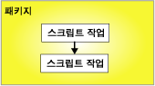
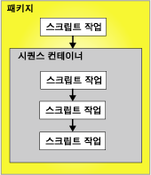

# 선행 제약 조건
  선행 제약 조건은 패키지에 있는 실행 개체, 컨테이너 및 태스크를 제어 흐름으로 연결하고 실행 개체의 실행 여부를 결정하는 조건을 지정합니다. 실행 개체는 For 루프, Foreach 루프 또는 시퀀스 컨테이너나 태스크 또는 이벤트 처리기일 수 있습니다. 또한 이벤트 처리기에서는 해당 실행 개체를 제어 흐름으로 연결하기 위해 선행 제약 조건이 사용됩니다.  
  
 선행 제약 조건은 선행 실행 개체 및 제약 조건이 지정된 실행 개체의 두 실행 개체를 연결합니다. 선행 실행 개체는 제약 조건이 지정된 실행 개체 전에 실행되며, 선행 실행 개체의 실행 결과로 제약 조건이 지정된 실행 개체의 실행 여부가 결정될 수 있습니다. 다음 다이어그램에서는 선행 제약 조건으로 연결된 두 개의 실행 개체를 보여 줍니다.  
  
   
  
 분기가 없는 선형 제어 흐름에서 선행 제약 조건은 태스크가 실행되는 시퀀스를 단독으로 제어합니다. 제어 흐름이 분기되는 경우 [!INCLUDE[ssISnoversion](../../includes/ssisnoversion-md.md)] 런타임 엔진은 해당 분기의 바로 다음에 오는 태스크 및 컨테이너에서의 실행 순서를 결정합니다. 런타임 엔진은 또한 제어 흐름에서 연결되지 않은 워크플로 사이의 실행 순서를 결정합니다.  
  
 [!INCLUDE[ssISnoversion](../../includes/ssisnoversion-md.md)] 의 중첩된 컨테이너 아키텍처에서는 단일 태스크만 캡슐화하는 태스크 호스트를 제외한 모든 컨테이너에 다른 컨테이너가 포함될 수 있으며, 각 컨테이너에는 고유 제어 흐름이 포함됩니다. For 루프, Foreach 루프 및 시퀀스 컨테이너에는 여러 태스크와 다른 컨테이너가 포함될 수 있으며, 그 아래에도 다시 여러 태스크와 컨테이너가 포함될 수 있습니다. 예를 들어 스크립트 태스크와 시퀀스 컨테이너가 포함된 패키지에 해당 스크립트 태스크 및 시퀀스 컨테이너로 연결되는 선행 제약 조건이 있는 경우를 가정해 보십시오. 시퀀스 컨테이너에는 3개의 스크립트 태스크가 들어 있으며, 해당 선행 제약 조건은 이 3개의 스크립트 태스크를 하나의 제어 흐름으로 연결합니다. 다음 다이어그램에서는 두 개의 중첩 수준이 포함된 패키지의 선행 제약 조건을 보여 줍니다.  
  
   
  
 패키지는 [!INCLUDE[ssIS](../../includes/ssis-md.md)] 컨테이너 계층에서 최상위에 있으므로 선행 제약 조건으로 여러 패키지를 연결할 수 없습니다. 하지만 패키지에 패키지 실행 태스크를 추가하고 다른 패키지를 제어 흐름에 간접적으로 연결할 수 있습니다.  
  
 선행 제약 조건은 다음과 같은 방식으로 구성할 수 있습니다.  
  
-   평가 작업을 지정합니다. 선행 제약 조건은 제약 조건 값이나 식 또는 둘을 모두 사용하여 제약 조건이 지정된 실행 개체가 실행되는지 여부를 결정합니다.  
  
-   선행 제약 조건에서 실행 결과가 사용되는 경우 성공, 실패 또는 완료로 실행 결과를 지정할 수 있습니다.  
  
-   선행 제약 조건에 계산 결과가 사용되는 경우 부울로 계산되는 식을 제공할 수 있습니다.  
  
-   선행 제약 조건이 단독으로 계산되는지 아니면 제약 조건이 지정된 실행 개체에 적용되는 다른 제약 조건과 함께 계산되는지 여부를 지정합니다.  
  
## 계산 작업  
 [!INCLUDE[ssISnoversion](../../includes/ssisnoversion-md.md)] 는 다음과 같은 계산 작업을 제공합니다.  
  
-   제약 조건이 지정된 실행 개체가 실행되는지 여부를 확인하기 위해 선행 실행 개체의 실행 결과만 사용하는 제약 조건. 선행 실행 개체의 실행 결과는 완료, 성공 또는 실패일 수 있습니다. 이 작업이 기본 작업입니다.  
  
-   제약 조건이 지정된 실행 개체가 실행되는지 여부를 확인하기 위해 계산되는 식. 식이 True로 계산되면 제약 조건이 지정된 실행 개체가 실행됩니다.  
  
-   선행 실행 개체의 실행 결과에 대한 요구 사항과 식을 계산한 반환 결과를 조합하는 제약 조건과 식  
  
-   선행 실행 개체의 실행 결과 또는 식을 계산한 반환 결과를 사용하는 제약 조건과 식  
  
 [!INCLUDE[ssIS](../../includes/ssis-md.md)] 디자이너에서는 색을 사용하여 선행 제약 조건의 유형을 확인합니다. Success 제약 조건은 녹색, Failure 제약 조건은 빨간색, Completion 제약 조건은 파란색입니다. [!INCLUDE[ssIS](../../includes/ssis-md.md)] 디자이너에 제약 조건 유형을 나타내는 텍스트 레이블을 표시하려면 [!INCLUDE[ssIS](../../includes/ssis-md.md)] 디자이너의 내게 필요한 옵션 기능을 구성해야 합니다.  
  
 식은 유효한 [!INCLUDE[ssIS](../../includes/ssis-md.md)] 식이어야 하며, 식에는 함수, 연산자, 시스템 변수 및 사용자 지정 변수가 포함될 수 있습니다. 자세한 내용은 [Integration Services&#40;SSIS&#41; 식](../../integration-services/expressions/integration-services-ssis-expressions.md) 및 [Integration Services&#40;SSIS&#41; 변수](../../integration-services/integration-services-ssis-variables.md)를 참조하세요.  
  
## 실행 결과  
 선행 제약 조건에는 다음과 같은 식 결과만 단독으로 사용되거나 식이 함께 사용될 수 있습니다.  
  
-   완료의 경우에는 출력 여부에 관계없이 선행 실행 개체가 완료되어야만 제약 조건이 지정된 실행 개체가 실행됩니다.  
  
-   성공의 경우에는 선행 실행 개체가 성공적으로 완료되어야만 제약 조건이 지정된 실행 개체가 실행됩니다.  
  
-   실패의 경우에는 선행 실행 개체가 실패해야만 제약 조건이 지정된 실행 개체가 실행됩니다.  
  
> [!NOTE]  
>  같은 **Precedence Constraint** 컬렉션의 멤버인 선행 제약 조건만 논리적 AND 조건으로 그룹화할 수 있습니다. 예를 들어 두 개의 Foreach 루프 컨테이너의 선행 제약 조건은 조합할 수 없습니다.  
  
## 선행 제약 조건 편집기를 사용하여 선행 제약 조건의 속성 설정  
  
1.  [!INCLUDE[ssBIDevStudioFull](../../includes/ssbidevstudiofull-md.md)]에서 원하는 패키지가 들어 있는 [!INCLUDE[ssISnoversion](../../includes/ssisnoversion-md.md)] 프로젝트를 엽니다.  
  
2.  솔루션 탐색기에서 패키지를 두 번 클릭하여 엽니다.  
  
3.  **제어 흐름** 탭을 클릭합니다.  
  
4.  선행 제약 조건을 두 번 클릭합니다.  
  
     **선행 제약 조건 편집기** 가 열립니다.  
  
5.  **평가 작업** 드롭다운 목록에서 평가 작업을 선택합니다.  
  
6.  **값** 드롭다운 목록에서 선행 제약 조건의 실행 결과를 선택합니다.  
  
7.  평가 작업에 식이 사용되는 경우 **식** 상자에 식을 입력하고 **테스트** 를 클릭하여 식을 계산합니다.  
  
    > [!NOTE]  
    >  변수 이름은 대소문자를 구분합니다.  
  
8.  제약 조건이 지정된 실행 개체에 여러 태스크 또는 컨테이너가 연결된 경우에는 **논리적 AND** 를 선택하여 모든 선행 실행 개체의 실행 결과가 **true**로 계산되어야 하도록 지정합니다. 하나의 식 결과만 **true** 로 계산되어야 하도록 지정하려면 **논리적 OR**을 선택합니다.  
  
9. **확인** 을 클릭하여 **선행 제약 조건 편집기**를 닫습니다.  
  
10. 업데이트된 패키지를 저장하려면 **파일** 메뉴에서 **선택한 항목 저장** 을 클릭합니다.  

## 선행 제약 조건 편집기
**선행 제약 조건 편집기** 대화 상자를 사용하여 선행 제약 조건을 구성할 수 있습니다.  
  
### Options  
 **평가 작업**  
 선행 제약 조건에서 사용하는 평가 작업을 지정합니다. 작업에는 **제약 조건**, **식**, **식 및 제약 조건**, **식 또는 제약 조건**이 있습니다.  
  
 **Value**  
 제약 조건 값을 **성공**, **실패**또는 **완료**로 지정합니다.  
  
> [!NOTE]  
>  선행 제약 조건 줄은 **성공**인 경우 녹색으로 표시되고 **실패**인 경우 강조 표시되고 **완료**인 경우 파란색으로 표시됩니다.  
  
 **식**  
 **식**, **식 및 제약 조건**또는 **식 또는 제약 조건**작업을 사용하는 경우 식을 입력하거나 식 작성기를 실행하여 식을 만듭니다. 식은 부울로 계산되어야 합니다.  
  
 **테스트**  
 식의 유효성을 검사합니다.  
  
 **논리적 AND**  
 동일한 실행 파일의 여러 선행 제약 조건을 함께 평가하도록 지정하려면 선택합니다. 모든 제약 조건이 **True**여야 합니다.  
  
> [!NOTE]  
>  이 유형의 선행 제약 조건은 녹색 실선으로 표시되거나 강조 표시되거나 파란색 실선으로 표시됩니다.  
  
 **논리적 OR**  
 동일한 실행 파일의 여러 선행 제약 조건을 함께 평가하도록 지정하려면 선택합니다. 적어도 하나의 제약 조건이 **True**여야 합니다.  
  
> [!NOTE]  
>  이 유형의 선행 제약 조건은 녹색 점선으로 표시되거나 강조 표시되거나 파란색 점선으로 표시됩니다.  
  
## 속성 창에서 선행 제약 조건의 속성 설정  
  
1.  [!INCLUDE[ssBIDevStudioFull](../../includes/ssbidevstudiofull-md.md)]에서 수정할 패키지가 들어 있는 [!INCLUDE[ssISnoversion](../../includes/ssisnoversion-md.md)] 프로젝트를 엽니다.  
  
2.  솔루션 탐색기에서 패키지를 두 번 클릭하여 엽니다.  
  
3.  **제어 흐름** 탭을 클릭합니다. **제어 흐름** 탭의 디자인 화면에서 선행 제약 조건을 마우스 오른쪽 단추로 클릭한 다음 **속성**을 클릭합니다. 속성 창에서 속성 값을 수정합니다.  
  
4.  **속성** 창에서 다음과 같은 선행 제약 조건의 읽기/쓰기 속성을 설정합니다.  
  
    |읽기/쓰기 속성|구성 동작|  
    |--------------------------|--------------------------|  
    |설명|설명을 제공합니다.|  
    |EvalOp|계산 작업을 선택합니다. **Expression**, **ExpressionAndConstant**또는 **ExpressionOrConstant** 작업을 선택할 경우 식을 지정할 수 있습니다.|  
    |식|계산 작업에 식이 포함된 경우 식을 제공합니다. 식은 부울로 계산되어야 합니다. 식 언어에 대한 자세한 내용은 [Integration Services&#40;SSIS&#41; 식](../../integration-services/expressions/integration-services-ssis-expressions.md)을 참조하세요.|  
    |LogicalAnd|여러 실행 개체가 선행되고 제약 조건이 지정된 실행 개체에 연결된 경우 **LogicalAnd** 를 설정하여 선행 제약 조건이 다른 선행 제약 조건과 함께 계산되는지 여부를 지정합니다.|  
    |속성|선행 제약 조건의 이름을 업데이트합니다.|  
    |ShowAnnotation|사용할 주석의 유형을 지정합니다. 주석을 사용하지 않으려면 **Never** 를 선택하고, 요청 시 주석을 사용하려면 **AsNeeded** 를 선택하고, Name 속성의 값을 사용하여 자동으로 주석을 달려면 **ConstraintName** 을 선택합니다. 또한 Description 속성의 값을 사용하여 자동으로 주석을 달려면 **ConstraintDescription** 을 선택하고, Value 및 Expression 속성의 값을 사용하여 자동으로 주석을 달려면 **ConstraintOptions** 를 선택합니다.|  
    |값|EvalOP 속성에 지정된 계산 작업에 제약 조건이 포함된 경우 제약 조건이 지정된 실행 개체의 실행 결과를 선택합니다.|  
  
5.  속성 창을 닫습니다.  
  
6.  업데이트된 패키지를 저장하려면 **파일** 메뉴에서 **선택한 항목 저장** 을 클릭합니다.  

## 바로 가기 메뉴를 사용하여 선행 제약 조건 값 설정  
  
1.  [!INCLUDE[ssBIDevStudioFull](../../includes/ssbidevstudiofull-md.md)]에서 원하는 패키지가 들어 있는 [!INCLUDE[ssISnoversion](../../includes/ssisnoversion-md.md)] 프로젝트를 엽니다.  
  
2.  솔루션 탐색기에서 패키지를 두 번 클릭하여 엽니다.  
  
3.  **제어 흐름** 탭을 클릭합니다.  
  
4.  **제어 흐름** 탭의 디자인 화면에서 선행 제약 조건을 마우스 오른쪽 단추로 클릭한 후 **성공**, **실패**또는 **완료**를 클릭합니다.  
  
5.  업데이트된 패키지를 저장하려면 **파일** 메뉴에서 **선택한 항목 저장** 을 클릭합니다.  

## 선행 제약 조건에 식 추가
 선행 제약 조건에서는 식을 사용하여 선행 실행 개체 및 제약 조건이 지정된 실행 개체 간의 제약 조건을 정의할 수 있습니다. 실행 개체는 태스크 또는 컨테이너일 수 있습니다. 식은 단독으로 사용되거나 선행 실행 개체의 실행 결과와 함께 사용될 수 있습니다. 실행 개체의 실행 결과는 성공 또는 실패입니다. 선행 제약 조건의 실행 결과를 구성할 경우 **Success**, **Failure**또는 **Completion**으로 실행 결과를 지정할 수 있습니다. **Success** 로 설정하려면 선행 실행 개체가 성공해야 하며, **Failure** 는 선행 실행 개체가 실패해야 하며, **Completion** 은 선행 태스크의 성공 또는 실패 여부에 관계없이 제약 조건이 지정된 실행 개체가 실행되어야 함을 나타냅니다. 자세한 내용은 [Precedence Constraints](../../integration-services/control-flow/precedence-constraints.md)을(를) 참조하세요.  
  
 식은 **True** 또는 **False** 로 계산되어야 하며 유효한 [!INCLUDE[ssISnoversion](../../includes/ssisnoversion-md.md)] 식이어야 합니다. 식에서는 문자, 시스템 및 사용자 지정 변수와 [!INCLUDE[ssIS](../../includes/ssis-md.md)] 식 문법에서 제공하는 함수와 연산자를 사용할 수 있습니다. 예를 들어 `@Count == SQRT(144) + 10` 식에서는 **Count** 변수, SQRT 함수 및 등호(==)와 더하기(+) 연산자를 사용합니다. 자세한 내용은 [Integration Services&#40;SSIS&#41; 식](../../integration-services/expressions/integration-services-ssis-expressions.md)가 될 때까지 워크플로를 반복합니다.  
  
 다음 그림에서 태스크 A와 태스크 B는 실행 결과와 식을 사용하는 선행 제약 조건으로 연결되어 있습니다. 제약 조건 값은 **Success** 로 설정되고 식은  `@X >== @Z`입니다. 제약 조건이 지정된 태스크 B는 태스크 A가 성공적으로 완료되고 변수 **X** 의 값이 변수 **Z**의 값보다 크거나 같은 경우에만 실행됩니다.  
  
   
  
 실행 개체는 또한 여러 식이 포함된 여러 선행 제약 조건을 사용하여 연결될 수 있습니다. 예를 들어 다음 그림에서 태스크 B와 C는 실행 결과와 식을 사용하는 선행 제약 조건에 의해 태스크 A에 연결됩니다. 두 제약 조건 값은 모두 **Success**로 설정됩니다. 하나의 선행 제약 조건에는 `@X >== @Z`식이 포함되고 다른 선행 제약 조건에는 `@X < @Z`식이 포함됩니다. 변수 **X** 와 변수 **Z**의 값에 따라 태스크 C 또는 태스크 B가 실행됩니다.  
  
   
  
 **디자이너에서** 선행 제약 조건 편집기 [!INCLUDE[ssIS](../../includes/ssis-md.md)] 를 사용하거나 [!INCLUDE[ssBIDevStudioFull](../../includes/ssbidevstudiofull-md.md)] 에서 제공하는 속성 창을 사용하여 식을 추가하거나 수정할 수 있습니다. 하지만 속성 창에는 식 구문에 대한 검사 기능이 제공되지 않습니다.  
  
 선행 제약 조건에 식이 포함되는 경우 **제어 흐름** 탭의 디자인 화면에서 선행 제약 조건 옆에 아이콘이 표시되고 아이콘의 도구 설명에 해당 식이 표시됩니다.  

### 선행 제약 조건에 식 추가  
  
1.  [!INCLUDE[ssBIDevStudioFull](../../includes/ssbidevstudiofull-md.md)]에서 원하는 패키지가 들어 있는 [!INCLUDE[ssISnoversion](../../includes/ssisnoversion-md.md)] 프로젝트를 엽니다.  
  
2.  솔루션 탐색기에서 패키지를 두 번 클릭하여 엽니다.  
  
3.  **제어 흐름** 탭을 클릭합니다.  
  
4.  **제어 흐름** 탭의 디자인 화면에서 선행 제약 조건을 두 번 클릭합니다. **선행 제약 조건 편집기** 가 열립니다.  
  
5.  **평가 작업**목록에서 **식**, **식 및 제약 조건** 또는 **식 또는 제약 조건** 을 선택합니다.  
  
6.  **실행** 텍스트 상자에 표현식을 입력하거나 Expression Builder를 실행하여 실행을 만듭니다.  
  
7.  식 구문의 유효성을 검사하려면 **테스트**를 클릭합니다.  
  
8.  업데이트된 패키지를 저장하려면 **파일** 메뉴에서 **선택한 항목 저장** 을 클릭합니다.  
 
### 실행 값과 식 조합  
 다음 표에서는 선행 제약 조건에서 실행 값 제약 조건과 식을 조합한 결과에 대해 설명합니다.  
  
|평가 작업|제약 조건 계산 결과|식 계산 결과|제약 조건이 지정된 실행 개체 실행|  
|--------------------------|-----------------------------|-----------------------------|---------------------------------|  
|제약 조건|True|해당 사항 없음|True|  
|제약 조건|False|해당 사항 없음|False|  
|식|해당 사항 없음|True|True|  
|식|해당 사항 없음|False|False|  
|제약 조건 및 식|True|True|True|  
|제약 조건 및 식|True|False|False|  
|제약 조건 및 식|False|True|False|  
|제약 조건 및 식|False|False|False|  
|제약 조건 또는 식|True|True|True|  
|제약 조건 또는 식|True|False|True|  
|제약 조건 또는 식|False|True|True|  
|제약 조건 또는 식|False|False|False|  

## 여러 선행 제약 조건을 사용하는 복잡한 제약 조건 시나리오 
선행 제약 조건은 두 개의 태스크, 두 개의 컨테이너 또는 각 태스크와 컨테이너를 하나씩 선택하여 두 개의 실행 개체를 참조합니다. 선행 제약 조건을 선행 실행 개체 및 제약 조건이 지정된 실행 개체라고 합니다. 제약 조건이 지정된 실행 개체에는 여러 선행 제약 조건이 포함될 수 있습니다. 자세한 내용은 [Precedence Constraints](../../integration-services/control-flow/precedence-constraints.md)을 참조하세요.  
  
 제약 조건을 그룹화하여 복잡한 제약 조건 시나리오를 조합하면 패키지에 복잡한 제어 흐름을 구현할 수 있습니다. 예를 들어 다음 그림에서 태스크 D는 **Success** 제약 조건에 의해 태스크 A에 연결되며 태스크 D는 다시 **Failure** 제약 조건에 의해 태스크 B에 연결되고, 태스크 D는 **Success** 제약 조건에 의해 태스크 C에 연결됩니다. 태스크 D와 태스크 A 사이의 선행 제약 조건, 태스크 D와 태스크 B 사이의 선행 제약 조건 및 태스크 D와 태스크 C 사이의 선행 제약 조건은 논리적 *AND* 관계에 있습니다. 따라서 태스크 D를 실행하려면 태스크 A와 태스크 C는 성공적으로 실행되어야 하고 태스크 B는 실패해야 합니다.  
  
   
  
### LogicalAnd 속성  
 태스크 또는 컨테이너에 여러 제약 조건이 있는 경우 **LogicalAnd** 속성은 선행 제약 조건이 그 자체로만 평가되는지 또는 다른 제약 조건과 함께 평가되는지 여부를 지정합니다.  
  
 **LogicalAnd** 속성은 [!INCLUDE[ssIS](../../includes/ssis-md.md)] 디자이너 또는 [!INCLUDE[ssBIDevStudioFull](../../includes/ssbidevstudiofull-md.md)]에서 제공하는 속성 창에서 **선행 제약 조건 편집기**를 사용하여 설정할 수 있습니다.  

## 선행 제약 조건에 대한 기본값 설정  
[!INCLUDE[ssIS](../../includes/ssis-md.md)] 디자이너를 처음 사용할 때 선행 제약 조건의 기본값은 **Success**입니다. 다음 단계에 따라 [!INCLUDE[ssIS](../../includes/ssis-md.md)] 디자이너를 구성하고 선행 제약 조건에 대해 다른 기본값을 사용하십시오.
  
1.  [!INCLUDE[ssBIDevStudioFull](../../includes/ssbidevstudiofull-md.md)]를 엽니다.  
  
2.  **도구** 메뉴에서 **옵션**을 클릭합니다.  
  
3.  **옵션** 대화 상자에서 **비즈니스 인텔리전스 디자이너** 를 확장한 후 **Integration Services 디자이너**를 확장합니다.  
  
4.  **제어 흐름 자동 연결** 을 클릭하고 **기본적으로 선택한 셰이프에 새 셰이프 연결**을 선택합니다.  
  
5.  드롭다운 목록에서 **새 셰이프에 Failure 제약 조건 사용** 또는 **새 셰이프에 Completion 제약 조건 사용**을 선택합니다.  
  
6.  **확인**을 클릭합니다.  
  
## 기본 선행 제약 조건 만들기  
  
1.  [!INCLUDE[ssBIDevStudioFull](../../includes/ssbidevstudiofull-md.md)]에서 원하는 패키지가 들어 있는 [!INCLUDE[ssISnoversion](../../includes/ssisnoversion-md.md)] 프로젝트를 엽니다.  
  
2.  솔루션 탐색기에서 패키지를 두 번 클릭하여 엽니다.  
  
3.  **제어 흐름** 탭을 클릭합니다.  
  
4.  **제어 흐름** 탭의 디자인 화면에서 태스크 또는 컨테이너를 클릭하고 선행 제약 조건을 적용하려는 실행 개체에 해당 연결선을 끌어 옵니다.  
  
5.  업데이트된 패키지를 저장하려면 **파일** 메뉴에서 **선택한 항목 저장** 을 클릭합니다.  
