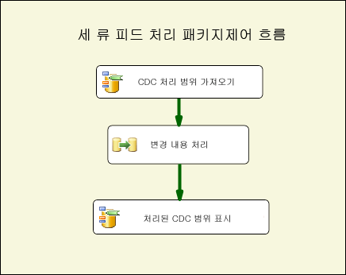
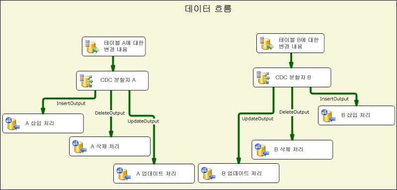
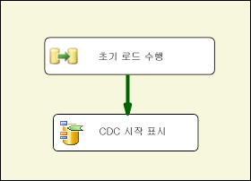
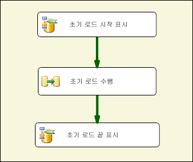
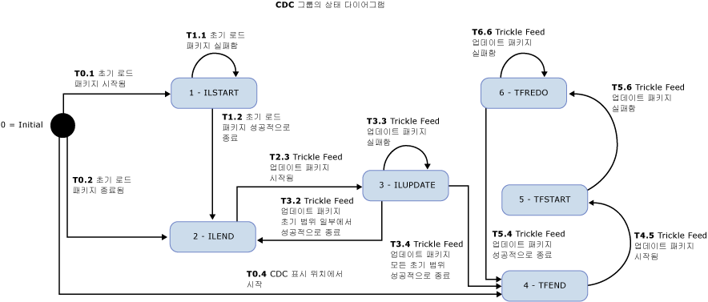

# CDC 흐름 구성 요소
  SSIS 개발자는 Attunity for Microsoft [!INCLUDE[ssISCurrent](../../includes/ssiscurrent-md.md)] 의 변경 데이터 캡처 구성 요소를 통해 CDC를 사용하고 CDC 패키지의 복잡성을 줄일 수 있습니다.  
  
 SSIS CDC 구성 요소는 원본 테이블이 동일한 [!INCLUDE[ssCurrent](../../includes/sscurrent-md.md)] 데이터베이스 또는 Oracle 데이터베이스([!INCLUDE[ssCurrent](../../includes/sscurrent-md.md)]용 Oracle CDC 서비스를 사용하는 경우)인 [!INCLUDE[ssCurrent](../../includes/sscurrent-md.md)] CDC 기능에서 사용할 수 있도록 디자인되었습니다. 분할된 테이블이 지원됩니다.  
  
 이 구성 요소에는 SSIS 패키지에서 변경 데이터를 읽고 처리하는 환경을 간소화하는 제어 흐름 및 데이터 흐름 구성 요소가 포함되어 있습니다. Microsoft [!INCLUDE[ssCurrent](../../includes/sscurrent-md.md)]의 구성 요소 라이브러리에 이러한 구성 요소를 추가할 수는 있지만 이 구성 요소는 별도로 설치됩니다.  
  
 다음은 Attunity의 변경 데이터 캡처 구성 요소입니다.  
  
 **CDC 제어 흐름 구성 요소**:  
  
 [CDC 제어 태스크](../../integration-services/control-flow/cdc-control-task.md)  
  
 **CDC 데이터 흐름 구성 요소**:  
  
 [CDC 원본](../../integration-services/data-flow/cdc-source.md)  
  
 [CDC 분할자](../../integration-services/data-flow/cdc-splitter.md)  
  
## 설치  
 이 섹션에서는 [!INCLUDE[ssISCurrent](../../includes/ssiscurrent-md.md)]용 CDC 구성 요소의 설치 절차에 대해 설명합니다.  
  
 SSIS용 CDC 구성 요소는 Microsoft SQL Server® 2016용 Microsoft® Change Data Capture Designer and Service for Oracle by Attunity에 패키징됩니다. 이 다운로드는 SQL Server 2016 기능 팩의 일부입니다. [SQL Server 2016 기능 팩 웹 페이지](http://go.microsoft.com/fwlink/?LinkId=746297)에서 기능 팩의 구성 요소를 다운로드합니다.  
  
### 버전 지원  
 다음 Microsoft [!INCLUDE[ssNoVersion](../../includes/ssnoversion-md.md)] 제품은 SSIS용 CDC 구성 요소에서 지원됩니다.  
  
-   Microsoft [!INCLUDE[ssCurrent](../../includes/sscurrent-md.md)]  
  
-   Visual Studio 2015용 Microsoft [!INCLUDE[ssBIDevStudio](../../includes/ssbidevstudio-md.md)]  
  
 이러한 버전은 다음 운영 체제 및 플랫폼에서 지원됩니다.  
  
-   Windows Vista 서비스 팩 2  
  
-   Windows 7  
  
-   Windows 10  
  
-   Windows Server 2008 서비스 팩 2  
  
-   Windows Server 2008 R2  
  
-   Windows Server 2012  
  
### 설치 프로그램 실행  
 설치 마법사를 실행하기 전에 [!INCLUDE[ssCurrent](../../includes/sscurrent-md.md)][!INCLUDE[ssBIDevStudio](../../includes/ssbidevstudio-md.md)] 가 닫혀 있는지 확인합니다. 그런 다음 설치 마법사의 지시를 따릅니다.  
  
### SSIS 다시 시작  
 CDC 구성 요소를 설치한 후 SQL [!INCLUDE[ssBIDevStudio](../../includes/ssbidevstudio-md.md)]에서 패키지를 개발할 때 구성 요소가 제대로 작동하도록 하려면 SSIS 서비스를 다시 시작해야 합니다.  
  
 구성 요소를 설치하면 메시지가 표시됩니다. 메시지가 표시되면 **예** 를 클릭합니다.  
  
### Microsoft CDC 구성 요소 제거  
 제거 마법사를 사용하여 CDC 원본, CDC 분할자 또는 CDC 제어 태스크를 제거할 수 있습니다. 구성 요소를 제거하기 전에 다음을 확인해야 합니다.  
  
 패키지를 개발하는 데 [!INCLUDE[ssCurrent](../../includes/sscurrent-md.md)][!INCLUDE[ssBIDevStudio](../../includes/ssbidevstudio-md.md)] 를 사용하고 있는 경우 제거 마법사를 실행하기 전에 [!INCLUDE[ssBIDevStudio](../../includes/ssbidevstudio-md.md)] 가 닫혀 있는지 확인합니다.  
  
## 이점  
 [!INCLUDE[ssCurrent](../../includes/sscurrent-md.md)][!INCLUDE[ssISnoversion](../../includes/ssisnoversion-md.md)] 구성 요소용 CDC 구성 요소를 사용하면 SSIS 개발자가 변경 데이터를 처리하는 SSIS 패키지를 쉽게 빌드할 수 있습니다. 이러한 구성 요소를 사용하면 SSIS 개발자가 CDC를 처리하는 기능이 향상되고 CDC 패키지의 복잡성이 줄어듭니다.  
  
 SSIS CDC 구성 요소는 복제, 데이터 웨어하우스 로드, OLAP에 대한 느린 변경 차원 업데이트, 변경 내용 감사 또는 가능한 추가적인 용도를 위해 추가로 처리할 수 있는 쉬운 방법으로 변경 데이터를 제공하는 데 사용됩니다. 사용되는 추가 처리 유형은 SSIS 개발자에 의해 결정됩니다.  
  
 SSIS CDC 구성 요소는 동일한 [!INCLUDE[ssCurrent](../../includes/sscurrent-md.md)] 데이터베이스에 있는 변경 테이블에 [!INCLUDE[ssCurrent](../../includes/sscurrent-md.md)] CDC 기능을 사용하도록 디자인되었습니다.  
  
## 변경 데이터 캡처 구성 요소 시작  
 일반적인 CDC 패키지는 테이블 그룹에 대한 변경을 처리합니다. 이 유형의 CDC 패키지의 기본적인 제어 흐름은 아래 그림과 같습니다. 이 패키지를 trickle-feed 처리 패키지라고 합니다.  
  
   
  
 이 [!INCLUDE[ssCurrent](../../includes/sscurrent-md.md)][!INCLUDE[ssISnoversion](../../includes/ssisnoversion-md.md)] 제어 흐름에는 CDC 제어 태스크 및 데이터 흐름 태스크라는 두 가지 태스크가 포함되어 있습니다. **CDC 처리 범위 가져오기**라는 첫 번째 태스크는 **변경 내용 처리**라는 데이터 흐름 태스크에서 처리되는 변경 내용에 대한 LSN 범위를 설정합니다. 이 범위는 마지막 패키지 실행 중에 처리되고 영구 저장소에 저장된 작업에 따라 설정됩니다.  
  
 CDC 제어 태스크를 사용하는 방법은 [CDC Control Task](../../integration-services/control-flow/cdc-control-task.md) 및 [CDC Control Task Editor](../../integration-services/control-flow/cdc-control-task-editor.md)를 참조하십시오.  
  
 다음 그림에서는 변경 내용의 처리 방식을 개념적으로 보여 주는 **변경 내용 처리** 데이터 흐름을 보여 줍니다.  
  
   
  
 이 그림에 표시된 단계는 다음과 같습니다.  
  
-   **테이블 X에 대한 변경 내용** 은 부모 제어 흐름에서 결정된 CDC 처리 범위 내에 작성된 테이블 X에 대한 변경 내용을 읽는 CDC 원본입니다.  
  
-   **CDC 분할자 X** 는 변경 내용을 삽입, 삭제 및 업데이트로 분할하는 데 사용됩니다. 이 시나리오에서는 CDC 원본이 순 변경 내용을 생성하여 서로 다른 변경 유형이 병렬로 처리될 수 있도록 구성되어 있다고 가정합니다.  
  
-   그러면 특정 변경 내용이 다운스트림으로 추가로 처리됩니다. 이 그림에서는 변경 내용이 여러 ODBC 대상을 사용하여 테이블에 삽입되지만 실제 사례에서는 다르게 처리될 수 있습니다.  
  
 CDC 원본에 대한 자세한 내용은 다음을 참조하십시오.  
  
 [CDC 원본](../../integration-services/data-flow/cdc-source.md)  
  
 [CDC 원본 편집기&#40;연결 관리자 페이지&#41;](../../integration-services/data-flow/cdc-source-editor-connection-manager-page.md)  
  
 [CDC 원본 편집기&#40;열 페이지&#41;](../../integration-services/data-flow/cdc-source-editor-columns-page.md)  
  
 [CDC 원본 편집기&#40;오류 출력 페이지&#41;](../../integration-services/data-flow/cdc-source-editor-error-output-page.md)  
  
 CDC 분할자에 대한 자세한 내용은 다음을 참조하십시오.  
  
 [CDC 분할자](../../integration-services/data-flow/cdc-splitter.md)  
  
 CDC 패키지를 빌드할 때 주의해야 할 기본적인 문제 중 하나는 변경 내용 처리 시 데이터의 초기 로드 또는 초기 처리와 상호 작용하는 방법입니다.  
  
 CDC 구성 요소는 다음과 같은 세 가지 다른 초기 로드 및 변경 내용 처리 시나리오를 지원합니다.  
  
-   데이터베이스 스냅숏으로 수행되는 초기 로드. 이 경우에는 변경 내용 처리가 스냅숏 이벤트의 LSN을 사용하여 시작됩니다.  
  
-   정지 데이터베이스에서 초기 로드. 이 경우에는 초기 로드 시 변경이 수행되지 않으므로 초기 로드 시 임의의 시점에 현재 LSN이 샘플링되고 해당 LSN을 사용하여 변경 내용 처리가 시작됩니다.  
  
-   활성 데이터베이스에서 초기 로드. 이 경우에는 초기 로드가 진행 중일 때 데이터베이스에 대한 변경이 수행되고 변경 내용 처리를 정확하게 시작할 수 있는 단일 LSN이 없습니다. 이 경우에는 초기 로드 패키지 개발자가 초기 로드 전후에 원본 데이터베이스의 현재 LSN을 샘플링할 수 있습니다. 그런 다음 변경 내용을 처리할 때 처리된 변경 내용 중 일부가 이미 초기 로드 시 표시되었으므로 초기 로드 시까지 변경 내용을 병렬로 처리할 때 주의해야 합니다. 예를 들어 삽입된 행을 초기 로드 프로세스에서 읽었으므로 삽입 변경 시 중복 키 오류로 인해 실패할 수 있습니다.  
  
 다음 그림에서는 처음 두 개의 시나리오를 처리할 수 있는 SSIS 패키지를 보여 줍니다.  
  
   
  
 다음 그림에서는 세 번째 시나리오를 처리할 수 있는 SSIS 패키지를 보여 줍니다.  
  
   
  
 초기 로드 패키지에 이어 변경 내용을 사용할 수 있는 경우 해당 변경 내용의 처리 일정에 따라 trickle-feed 업데이트 패키지가 반복적으로 실행됩니다.  
  
 CDC 처리 상태를 초기 로드 패키지에서 trickle feed 패키지로 전달하거나 각 패키지 내의 서로 다른 태스크 간에 전달하는 작업은 특수 SSIS 패키지 문자열 변수를 통해 이루어집니다. 이 변수 값을 CDC 상태라고 하며 이 값은 초기 로드 및 trickle-feed 패키지에서 처리되는 테이블 그룹에 대한 현재 CDC 처리 상태를 반영합니다.  
  
 CDC 상태 변수 값은 영구 저장소에서 유지 관리해야 하고 시작 CDC 처리 전에 읽어야 하며 처리 완료 후에 현재 상태로 저장해야 합니다. CDC 상태를 로드 및 저장하는 태스크는 SSIS 개발자가 처리할 수 있지만 CDC 제어 구성 요소가 CDC 상태 값을 데이터베이스 테이블에서 유지 관리하여 이 태스크를 자동화할 수 있습니다.  
  
## 보안 고려 사항  
 이 섹션에서는 SSIS에서 CDC 구성 요소 사용과 관련된 몇 가지 보안 고려 사항을 보여 줍니다.  
  
### 변경 데이터에 대한 액세스 권한 부여  
 trickle-feed 업데이트 패키지는 [!INCLUDE[ssCurrent](../../includes/sscurrent-md.md)] CDC 함수에 액세스할 수 있어야 합니다. 기본적으로 해당 액세스 권한은 **db_owner** 고정 데이터베이스 역할의 멤버에게 부여됩니다. **db_owner**는 강력한 역할이기 때문에 [!INCLUDE[ssCurrent](../../includes/sscurrent-md.md)] 내에서 캡처 인스턴스를 정의할 때 각 캡처 인스턴스에 보안 제어 역할을 연결하여 SSIS CDC 패키지가 훨씬 더 많은 제한된 사용자를 통해 변경 내용을 처리할 수 있도록 하는 것이 좋습니다.  
  
### CDC 데이터베이스의 현재 LSN에 대한 액세스  
 변경 내용 처리를 위해 시작 LSN을 표시하기 위한 CDC 제어 태스크 작업은 CDC 데이터베이스의 현재 LSN을 찾을 수 있어야 합니다. 이 작업은 master 데이터베이스에서 **sp_replincrementlsn** 프로시저를 사용하여 수행됩니다. 이 프로시저에 대한 실행 권한을 [!INCLUDE[ssCurrent](../../includes/sscurrent-md.md)] CDC 데이터베이스에 연결하는 데 사용되는 로그인에 제공해야 합니다.  
  
### CDC 상태 테이블에 대한 액세스  
 CDC 상태 테이블은 [!INCLUDE[ssCurrent](../../includes/sscurrent-md.md)] CDC 데이터베이스에 연결하는 데 사용되는 로그인에서 업데이트할 수 있어야 하는 CDC 상태를 자동으로 유지하는 데 사용됩니다. 이 테이블은 SSIS 개발자가 작성하므로 [!INCLUDE[ssCurrent](../../includes/sscurrent-md.md)] 시스템 관리자를 [!INCLUDE[ssCurrent](../../includes/sscurrent-md.md)] 데이터베이스를 만들고 관리 및 유지 관리 태스크를 수행할 수 있는 권한이 있는 사용자로 설정합니다. 또한 CDC 사용 데이터베이스를 사용하는 [!INCLUDE[ssCurrent](../../includes/sscurrent-md.md)] 시스템 관리자는 [!INCLUDE[ssCurrent](../../includes/sscurrent-md.md)] CDC 기술 및 구현에 대해 잘 알고 있어야 합니다.  
  
## CDC 처리를 위해 테이블 그룹화  
 데이터베이스 프로젝트의 범위는 몇 개의 테이블에서 수천 개의 테이블에 이르기까지 크기가 다양합니다. 초기 로드 및 CDC 패키지를 디자인할 때 쉽게 관리하고 효율성을 높일 수 있도록 테이블을 훨씬 더 작은 그룹으로 그룹화하는 것이 좋습니다. 이 섹션에서는 테이블을 작은 그룹으로 정렬하는 데 영향을 주는 다양한 고려 사항을 보여 줍니다. 각 그룹의 테이블은 초기에 로드된 다음 그룹으로 업데이트됩니다.  
  
 CDC 구성 요소에 의해 지원되는 CDC 패턴은 이 그룹화가 이미 결정되어 있는 것으로 가정합니다. 각 그룹은 다른 그룹에서 별도로 관리하는 별도의 CDC 컨텍스트를 정의합니다. 각 그룹에 대한 초기 로드 및 trickle-feed 업데이트 패키지가 생성됩니다. trickle-feed 업데이트는 변경 내용 처리 제약 조건의 비율(예: CPU 및 IO 소모량, 다른 시스템에 미치는 영향) 및 원하는 대기 시간에 따라 주기적으로 실행되도록 예약됩니다.  
  
 테이블은 다음 고려 사항에 따라 그룹화됩니다.  
  
1.  대상 데이터베이스에 따라 그룹화됩니다. 다른 대상 데이터베이스에 기록되거나 다른 처리를 거치는 모든 테이블은 다른 CDC 그룹에 할당해야 합니다.  
  
2.  참조 무결성 제약 조건과 관련된 테이블은 같은 그룹에 할당하여 대상에서 참조 무결성 문제가 발생하지 않도록 해야 합니다.  
  
3.  긴 대기 시간이 허용될 수 있는 테이블을 그룹화할 수 있으므로 해당 테이블의 처리 빈도를 낮추고 전체 시스템 부하를 줄일 수 있습니다.  
  
4.  변경 속도가 빠른 테이블은 작은 그룹에 있어야 하고 변경 속도가 느린 테이블은 큰 그룹으로 그룹화할 수 있습니다.  
  
 각 CDC 그룹에 대해 다음 두 개의 패키지가 생성됩니다.  
  
-   원본 테이블에서 전체 범위의 데이터를 읽고 해당 데이터를 대상 테이블에 적용하는 초기 로드 패키지  
  
-   원본 테이블에 대한 변경 내용을 읽고 해당 변경 내용을 대상 테이블에 적용하는 trickle-feed 업데이트 패키지. 이 패키지는 예약된 일정에 따라 정기적으로 실행해야 합니다.  
  
## CDC 상태  
 각 CDC 그룹에는 특정 형식의 문자열로 표현된 상태가 연결되어 있습니다. 자세한 내용은 [CDC Control Task](../../integration-services/control-flow/cdc-control-task.md)을 참조하세요. 다음 표에서는 가능한 CDC 상태 값을 보여 줍니다.  
  
|State|Description|  
|-----------|-----------------|  
|0-(INITIAL)|현재 CDC 그룹에서 패키지가 실행되기 전에 존재하는 상태입니다. CDC 상태가 비어 있을 때의 상태이기도 합니다.   CDC 제어 태스크 작업에 대한 자세한 내용은 [CDC Control Task](../../integration-services/control-flow/cdc-control-task.md)를 참조하십시오.|  
|1-ILSTART(초기 로드 시작)|초기 로드 패키지가 시작될 때 존재하는 상태입니다. 이 상태는 CDC 제어 태스크에 대한 **MarkInitialLoadStart** 작업 호출 이후에 발생합니다.   CDC 제어 태스크 작업에 대한 자세한 내용은 [CDC Control Task](../../integration-services/control-flow/cdc-control-task.md)를 참조하십시오.|  
|2- ILEND(초기 로드 종료)|초기 로드 패키지가 성공적으로 종료되는 경우 존재하는 상태입니다. 이 상태는 CDC 제어 태스크에 대한 MarkInitialLoadEnd 작업 호출 이후에 발생합니다.   CDC 제어 태스크 작업에 대한 자세한 내용은 [CDC Control Task](../../integration-services/control-flow/cdc-control-task.md)를 참조하십시오.|  
|3-ILUPDATE(초기 로드 업데이트)|초기 처리 범위를 처리 중인 동안 초기 로드 이후에 업데이트 패키지의 첫 번째 실행 후 존재하는 상태입니다. 이 상태는 CDC 제어 태스크에 대한 **GetProcessingRange** 작업 호출 이후에 발생합니다.   **_$reprocessing** 열을 사용하는 경우 이 상태는 패키지가 이미 대상에 있는 행을 다시 처리하고 있을 수 있음을 나타내는 1로 설정됩니다.   CDC 제어 태스크 작업에 대한 자세한 내용은 [CDC Control Task](../../integration-services/control-flow/cdc-control-task.md)를 참조하십시오.|  
|4-TFEND(Trickle-Feed 업데이트 종료)|일반 CDC 실행에 대해 예상되는 상태입니다. 이 상태는 이전 실행이 성공적으로 완료되었으며 새 처리 범위를 사용한 새 실행을 시작할 수 있음을 나타냅니다.|  
|5-TFSTART(Trickle-Feed 업데이트 시작)|이 상태는 CDC 제어 태스크에 대한 **GetProcessingRange** 작업 호출 이후에 업데이트 패키지의 후속 실행 시 존재하는 상태입니다.   이 상태는 일반 CDC 실행이 시작되었지만 종료되지 않았거나 아직 확실하게 종료되지 않았음을 나타냅니다(**MarkProcessedRange**).   CDC 제어 태스크 작업에 대한 자세한 내용은 [CDC Control Task](../../integration-services/control-flow/cdc-control-task.md)를 참조하십시오.|  
|6-TFREDO(Trickle-Feed 업데이트 다시 처리)|이 상태는 TFSTART 실행 후 **GetProcessingRange** 에서 발생하는 상태입니다. 이 상태는 이전 실행이 성공적으로 완료되지 않았음을 나타냅니다.   __$reprocessing 열을 사용하는 경우 이 상태는 패키지가 이미 대상에 있는 행을 다시 처리하고 있을 수 있음을 나타내는 1로 설정됩니다.|  
|7-오류|CDC 그룹이 ERROR 상태에 있습니다.|  
  
 다음은 CDC 구성 요소에 대한 상태 다이어그램입니다. 예상치 못한 상태에 도달하면 ERROR 상태에 도달합니다. 예상되는 상태는 아래의 다이어그램에 나와 있지만 ERROR 상태는 다이어그램에 표시되지 않습니다.  
  
 예를 들어 초기 로드 패키지의 끝 부분에서 상태가 TFSTART인 경우 상태를 ILEND로 설정하려고 하면 CDC 그룹은 오류 상태에 있으며 Trickle-Feed 업데이트 패키지는 실행되지 않고 초기 로드 패키지가 실행됩니다.  
  
   
  
 초기 로드 패키지가 성공적으로 실행되면 미리 결정된 일정에 따라 Trickle-Feed 업데이트 패키지가 반복적으로 실행되어 원본 테이블에 대한 변경 내용이 처리됩니다. Trickle-Feed 업데이트 패키지의 각 실행은 CDC 실행입니다.  
  
## 섹션 내용  
  
-   [CDC 원본](../../integration-services/data-flow/cdc-source.md)  
  
-   [CDC 분할자](../../integration-services/data-flow/cdc-splitter.md)  
  
## 관련 작업  
  
-   [변경 유형에 따라 CDC 스트림 전송](../../integration-services/data-flow/direct-the-cdc-stream-according-to-the-type-of-change.md)  
  
-   [상태 변수 정의](../../integration-services/data-flow/define-a-state-variable.md)  
  
## 관련 내용  
  
-   mattmasson.com의 블로그 항목 - [SQL Server 2012용 SSIS의 CDC](http://www.mattmasson.com/2011/12/cdc-in-ssis-for-sql-server-2012-2/)  
  
-   blogs.msdn.com의 CDC Service 설정 관련 블로그 항목, [SQL Server 2012의 Oracle용 CDC](http://go.microsoft.com/fwlink/?LinkId=247827)  
  
-   social.technet.microsoft.com의 기술 문서, [Attunity Oracle용 Microsoft SQL Server 2012 변경 데이터 캡처 설치](http://go.microsoft.com/fwlink/?LinkId=252958)  
  
-   social.technet.microsoft.com의 기술 문서, [Attunity Oracle용 Microsoft 변경 데이터 캡처의 구성 문제 해결](http://go.microsoft.com/fwlink/?LinkId=252960)  
  
-   social.technet.microsoft.com의 기술 문서, [Attunity Oracle용 Microsoft 변경 데이터 캡처의 CDC 인스턴스 오류 문제 해결](http://go.microsoft.com/fwlink/?LinkId=252961)  
  
-   technet.microsoft.com의 비디오, [CDC for Oracle Databases using SQL Server Integration Services 2012 (SQL Server Video)](http://technet.microsoft.com/sqlserver/jj218898)(SQL Server Integration Services 2012를 사용하는 Oracle 데이터베이스에 대한 CDC(SQL Server 비디오))  
  
## 관련 항목:  
 [CDC 제어 태스크](../../integration-services/control-flow/cdc-control-task.md)  
  
  