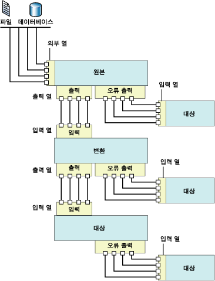

# 데이터 흐름
  [!INCLUDE[ssNoVersion](../../includes/ssnoversion-md.md)] [!INCLUDE[ssISnoversion](../../includes/ssisnoversion-md.md)]에는 원본, 변환, 대상 등 3가지 다른 유형의 데이터 흐름 구성 요소가 있습니다. 원본은 관계형 데이터베이스의 테이블과 뷰, 파일 및 [!INCLUDE[ssASnoversion](../../includes/ssasnoversion-md.md)] 데이터베이스와 같은 데이터 저장소로부터 데이터를 추출합니다. 변환은 데이터를 수정, 요약 및 삭제합니다. 대상은 데이터를 데이터 저장소로 로드하거나 메모리 내 데이터 집합을 만듭니다.  
  
> [!NOTE]  
>  사용자 지정 공급자를 사용할 경우 ProviderDescriptors.xml 파일을 메타데이터 열 값으로 업데이트해야 합니다.  
  
 또한 [!INCLUDE[ssISnoversion](../../includes/ssisnoversion-md.md)] 에는 구성 요소의 출력을 다른 구성 요소의 입력으로 연결하는 경로가 제공됩니다. 경로는 구성 요소의 시퀀스를 정의하고 데이터 흐름에 주석을 추가하거나 열의 원본을 볼 수 있도록 합니다.  
  
 원본 및 대상의 출력을 변환 및 대상의 입력으로 연결하여 데이터 흐름 구성 요소를 연결합니다. 데이터 흐름을 구성할 때 두 번째 및 이후의 구성 요소는 일반적으로 데이터 흐름에 추가할 때 연결됩니다. 구성 요소를 연결한 다음에는 해당 구성 요소를 구성할 때 입력 열을 사용할 수 있습니다. 입력 열을 사용할 수 없으면 구성 요소가 데이터 흐름에 연결된 다음에 해당 구성 요소의 구성을 완료해야 합니다. 자세한 내용은 [Integration Services 경로](../../integration-services/data-flow/integration-services-paths.md) 및 [경로에 구성 요소 연결](http://msdn.microsoft.com/library/05633e4c-1370-4b05-802b-f36b07dd71c8)을 참조하세요.  
  
 다음 다이어그램에서는 원본, 입력과 출력이 각각 하나씩 포함된 변환 및 대상이 들어 있는 데이터 흐름을 보여 줍니다. 다이어그램에는 입력, 출력 및 외부 열 외에도 입력, 출력 및 오류 출력이 포함됩니다.  
  
   
  
## 데이터 흐름 구현  
 패키지의 제어 흐름에 데이터 흐름 태스크를 추가하는 단계는 패키지에서 데이터 흐름을 구현하기 위한 첫 번째 단계입니다. 패키지에는 자체 데이터 흐름이 각각 포함된 여러 데이터 흐름 태스크가 포함될 수 있습니다. 예를 들어 패키지에서 데이터 흐름이 지정된 순서로 실행되어야 하거나 데이터 흐름 사이에 다른 태스크가 수행되어야 하는 경우에는 각 데이터 흐름에 대해 별개의 데이터 흐름 태스크를 사용해야 합니다.  
  
 제어 흐름에 데이터 흐름 태스크가 포함된 다음에는 패키지에 사용되는 데이터 흐름 작성을 시작할 수 있습니다. 자세한 내용은 [데이터 흐름 태스크](../../integration-services/control-flow/data-flow-task.md)를 참조하세요.  
  
 데이터 흐름을 만드는 작업에는 다음 단계가 포함됩니다.  
  
-   파일 및 데이터베이스에서 데이터를 추출할 하나 이상의 원본을 추가하고 원본에 연결할 연결 관리자를 추가합니다.  
  
-   패키지의 비즈니스 요구 사항을 충족하는 변환을 추가합니다. 데이터 흐름에는 변환을 포함시킬 필요가 없습니다.  
  
     일부 변환에는 연결 관리자가 필요합니다. 예를 들어 조회 변환에서는 연결 관리자를 사용하여 조회 데이터가 들어 있는 데이터베이스에 연결합니다.  
  
-   원본 및 변환의 출력을 변환 및 대상의 입력으로 연결하여 데이터 흐름 구성 요소를 연결합니다.  
  
-   파일 및 데이터베이스와 같은 데이터 저장소로 데이터를 로드할 하나 이상의 대상을 추가하고 데이터 원본에 연결할 연결 관리자를 추가합니다.  
  
-   구성 요소에서 문제를 처리하기 위한 오류 출력을 구성합니다.  
  
     런타임 시 데이터 흐름 구성 요소에서 데이터를 변환하거나, 조회를 수행하거나, 식을 계산할 때 행 수준의 오류가 발생할 수 있습니다. 이에 대한 예로는 문자열 값이 포함된 데이터 열을 정수로 변환할 수 없는 경우나 식에서 0으로 나누기가 발생하는 경우를 들 수 있습니다. 두 작업 모두 오류를 발생시키며, 오류가 포함된 행은 오류 흐름을 사용하여 개별적으로 처리할 수 있습니다. 패키지 데이터 흐름에서 오류 흐름을 사용하는 방법에 대한 자세한 내용은 [데이터의 오류 처리](../../integration-services/data-flow/error-handling-in-data.md)를 참조하세요.  
  
-   데이터 흐름을 쉽게 이해할 수 있도록 주석을 포함합니다. 자세한 내용은 [패키지에서 주석 사용](../../integration-services/use-annotations-in-packages.md)을 참조하세요.  
  
> [!NOTE]  
>  새 패키지를 만들 때 연결 관리자, 원본 및 대상을 올바르게 구성하는 데 도움이 되는 마법사를 사용할 수도 있습니다. 자세한 내용은 [Create Packages in SQL Server Data Tools](../../integration-services/create-packages-in-sql-server-data-tools.md)을 참조하세요.  
  
 **데이터 흐름** 탭이 활성화된 경우 데이터 흐름에 추가할 수 있는 원본, 변환 및 대상이 도구 상자에 포함됩니다.  
  
## 식  
 원본, 대상 및 변환의 여러 데이터 흐름 구성 요소에서는 해당 속성에 속성 식을 사용할 수 있습니다. 속성 식은 패키지가 로드되면 속성 값을 바꾸는 식입니다. 패키지는 런타임에 업데이트된 속성 값을 사용합니다. 식은 [!INCLUDE[ssISnoversion](../../includes/ssisnoversion-md.md)] 식 구문을 사용하여 작성되며 [!INCLUDE[ssISnoversion](../../includes/ssisnoversion-md.md)] 함수, 연산자, 식별자 및 변수를 포함할 수 있습니다. 자세한 내용은 [Integration Services&#40;SSIS&#41; 식](../../integration-services/expressions/integration-services-ssis-expressions.md), [Integration Services&#40;SSIS&#41; 식](../../integration-services/expressions/integration-services-ssis-expressions.md) 및 [패키지에서 속성 식 사용](../../integration-services/expressions/use-property-expressions-in-packages.md)을 참조하세요.  
  
 [!INCLUDE[ssBIDevStudioFull](../../includes/ssbidevstudiofull-md.md)]에서 패키지를 구성하면 속성 식을 지원하는 데이터 흐름 구성 요소의 속성은 해당 속성이 속한 데이터 흐름 태스크에 표시됩니다. 데이터 흐름 구성 요소의 속성 식을 추가, 변경 및 제거하려면 데이터 흐름 태스크를 클릭하고 속성 창이나 태스크 편집기를 사용하여 속성 식을 추가, 변경 또는 삭제합니다. 데이터 흐름 태스크 자체의 속성 식은 속성 창에서 관리합니다.  
  
 데이터 흐름에 식을 사용하는 구성 요소가 들어 있으면 이 식도 속성 창에 표시됩니다. 식을 보려면 구성 요소가 속한 데이터 흐름 태스크를 선택합니다. 속성은 항목별이나 사전순으로 볼 수 있습니다. 속성 창에서 항목별 보기를 사용하면 특정 속성에 사용되지 않은 식은 **기타** 범주에 표시됩니다. 사전순 보기를 사용하면 식은 데이터 흐름 구성 요소의 이름 순서로 표시됩니다.  
  
## 원본  
 [!INCLUDE[ssISnoversion](../../includes/ssisnoversion-md.md)]에서 원본은 다른 외부 데이터 원본의 데이터를 데이터 흐름 내의 다른 구성 요소에서 사용할 수 있도록 만드는 데이터 흐름 구성 요소입니다. 플랫 파일, XML 파일, Microsoft Excel 통합 문서 및 원시 데이터가 포함된 파일로부터 데이터를 추출할 수 있습니다. 또한 데이터베이스에서 테이블 및 뷰에 액세스하고 쿼리를 실행하여 데이터를 추출할 수 있습니다.  
  
 데이터 흐름에는 단일 원본이나 여러 원본이 포함될 수 있습니다.  
  
 데이터 흐름의 원본에는 일반적으로 하나의 일반 출력이 포함됩니다. 일반 출력에는 원본이 데이터 흐름에 추가하는 열인 출력 열이 포함됩니다.  
  
 일반 출력은 외부 열을 참조합니다. 외부 열은 원본에 있는 열입니다. 예를 들어 **AdventureWorks** 데이터베이스의 **Product** 테이블에 있는 **MadeFlag** 열은 일반 출력에 추가할 수 있는 외부 열입니다. 외부 열의 메타데이터에는 원본 열의 이름, 데이터 형식 및 길이와 같은 정보가 포함됩니다.  
  
 원본에 대한 오류 출력에는 일반 출력과 동일한 열과 오류 정보를 제공하는 두 개의 추가 열이 포함됩니다. [!INCLUDE[ssISnoversion](../../includes/ssisnoversion-md.md)] 개체 모델은 일반 출력과 원본에 포함될 수 있는 오류 출력의 개수를 제한하지 않습니다. 스크립트 구성 요소를 제외하고 [!INCLUDE[ssISnoversion](../../includes/ssisnoversion-md.md)] 에 포함되는 대부분의 원본에는 하나의 일반 출력이 포함되며, 대부분의 원본에는 하나의 오류 출력이 포함됩니다. 사용자 지정 원본은 여러 일반 출력과 오류 출력을 구현하도록 코딩될 수 있습니다.  
  
 모든 출력 열은 데이터 흐름에서 다음 데이터 흐름 구성 요소에 대한 입력 열로 사용될 수 있습니다.  
  
 사용자 지정 원본을 작성할 수도 있습니다. 자세한 내용은 [사용자 지정 데이터 흐름 구성 요소 개발](../../integration-services/extending-packages-custom-objects/data-flow/developing-a-custom-data-flow-component.md) 및 [특정 유형의 데이터 흐름 구성 요소 개발](../../integration-services/extending-packages-custom-objects-data-flow-types/developing-specific-types-of-data-flow-components.md)을 참조하세요.  
  
 다음 원본에는 속성 식을 통해 업데이트할 수 있는 속성이 있습니다.  
  
-   [ADO.NET 원본](../../integration-services/data-flow/ado-net-source.md)  
  
-   [XML 원본](../../integration-services/data-flow/xml-source.md)  
  
### 다운로드할 수 있는 원본  
 다음 표는 [!INCLUDE[msCoName](../../includes/msconame-md.md)] 웹 사이트에서 다운로드할 수 있는 기타 원본을 보여 줍니다.  
  
|원본|설명|  
|------------|-----------------|  
|Oracle 원본|Oracle 원본은 [!INCLUDE[msCoName](../../includes/msconame-md.md)] Connector for Oracle by Attunity의 원본 구성 요소입니다. [!INCLUDE[msCoName](../../includes/msconame-md.md)] Connector for Oracle by Attunity에는 연결 관리자 및 대상도 포함되어 있습니다. 자세한 내용은 [Microsoft Connectors for Oracle by Attunity 및 Microsoft Connectors for Teradata by Attunity(Microsoft Connectors for Oracle and Teradata by Attunity)](http://go.microsoft.com/fwlink/?LinkId=789384)다운로드 페이지를 참조하십시오.|  
|SAP BI 원본|SAP BI 원본은 [!INCLUDE[msCoName](../../includes/msconame-md.md)] Connector for SAP BI의 원본 구성 요소입니다. [!INCLUDE[msCoName](../../includes/msconame-md.md)] Connector for SAP BI에는 연결 관리자 및 대상도 포함되어 있습니다. 자세한 내용은 [Microsoft SQL Server 기능 팩](http://go.microsoft.com/fwlink/?LinkID=746297)다운로드 페이지를 참조하세요.|  
|Teradata 원본|Teradata 원본은 [!INCLUDE[msCoName](../../includes/msconame-md.md)] Connector for Teradata by Attunity의 원본 구성 요소입니다. [!INCLUDE[msCoName](../../includes/msconame-md.md)] Connector for Teradata by Attunity에는 연결 관리자 및 대상도 포함되어 있습니다. 자세한 내용은 [Microsoft Connectors for Oracle by Attunity 및 Microsoft Connectors for Teradata by Attunity(Microsoft Connectors for Oracle and Teradata by Attunity)](http://go.microsoft.com/fwlink/?LinkId=789384)다운로드 페이지를 참조하십시오.|  
  
 [!INCLUDE[msCoName](../../includes/msconame-md.md)] Connector for Oracle by Attunity의 뛰어난 성능을 활용하는 방법을 보려면 [Microsoft Connector for Oracle by Attunity의 성능(SQL Server 비디오)](http://go.microsoft.com/fwlink/?LinkID=210369)을 참조하세요.  
  
## 변환  
 변환의 기능은 매우 다양합니다. 변환은 데이터 업데이트, 요약, 삭제, 병합 및 배포와 같은 태스크를 수행할 수 있습니다. 열 값을 수정하고, 테이블 값을 조회하고, 데이터를 정리하고, 열 값을 집계할 수 있습니다.  
  
 변환의 입력 및 출력은 들어오고 나가는 데이터의 열을 정의합니다. 데이터에서 수행되는 작업에 따라 변환에는 하나의 입력과 여러 출력이 포함되거나 여러 입력과 하나의 출력이 포함될 수 있습니다. 또한 변환에는 발생한 오류에 대한 정보와 함께 실패한 데이터를 제공하는 오류 출력이 포함될 수 있습니다. 예를 들어 정수 데이터 형식으로 변환될 수 없는 문자열 데이터가 포함될 수 있습니다. [!INCLUDE[ssISnoversion](../../includes/ssisnoversion-md.md)] 개체 모델은 입력, 일반 출력 및 변환에 포함될 수 있는 오류 출력의 개수를 제한하지 않습니다. 여러 입력, 일반 출력 및 오류 출력의 임의 조합을 구현하는 사용자 지정 변환을 만들 수 있습니다.  
  
 변환의 입력은 하나 이상의 입력 열로 정의됩니다. 일부 [!INCLUDE[ssISnoversion](../../includes/ssisnoversion-md.md)] 변환은 또한 외부 열을 입력으로 참조할 수 있습니다. 예를 들어 OLE DB 명령 변환에 대한 입력에는 외부 열이 포함됩니다. 출력 열은 변환이 데이터 흐름에 추가하는 열입니다. 일반 출력과 오류 출력에는 모두 출력 열이 포함됩니다. 그런 다음 이러한 출력 열은 데이터 흐름에서 다른 변환이나 대상과 같은 다음 구성 요소에 대한 입력 열로 사용됩니다.  
  
 다음 변환에는 속성 식을 통해 업데이트할 수 있는 속성이 있습니다.  
  
-   [조건부 분할 변환](../../integration-services/data-flow/transformations/conditional-split-transformation.md)  
  
-   [파생 열 변환](../../integration-services/data-flow/transformations/derived-column-transformation.md)  
  
-   [유사 항목 그룹화 변환](../../integration-services/data-flow/transformations/fuzzy-grouping-transformation.md)  
  
-   [유사 항목 조회 변환](../../integration-services/data-flow/transformations/fuzzy-lookup-transformation.md)  
  
-   [OLE DB 명령 변환](../../integration-services/data-flow/transformations/ole-db-command-transformation.md)  
  
-   [비율 샘플링 변환](../../integration-services/data-flow/transformations/percentage-sampling-transformation.md)  
  
-   [피벗 변환](../../integration-services/data-flow/transformations/pivot-transformation.md)  
  
-   [행 샘플링 변환](../../integration-services/data-flow/transformations/row-sampling-transformation.md)  
  
-   [정렬 변환](../../integration-services/data-flow/transformations/sort-transformation.md)  
  
-   [피벗 해제 변환](../../integration-services/data-flow/transformations/unpivot-transformation.md)  
  
 자세한 내용은 [Integration Services Transformations](../../integration-services/data-flow/transformations/integration-services-transformations.md)을 참조하세요.  
  
## 대상  
 대상은 데이터 흐름의 데이터를 특정 데이터 저장소로 기록하거나 메모리 내 데이터 집합을 만드는 데이터 흐름 구성 요소입니다. 데이터를 플랫 파일, 프로세스 분석 개체로 로드하고 다른 프로세스에 데이터를 제공할 수 있습니다. 또한 데이터베이스에서 테이블 및 뷰에 액세스하고 쿼리를 실행하여 데이터를 로드할 수 있습니다.  
  
 데이터 흐름에는 데이터를 여러 데이터 저장소로 로드하는 여러 대상이 포함될 수 있습니다.  
  
 [!INCLUDE[ssISnoversion](../../includes/ssisnoversion-md.md)] 대상에는 적어도 하나 이상의 입력이 포함되어야 합니다. 입력에는 다른 데이터 흐름 구성 요소로부터 가져온 입력 열이 포함됩니다. 입력 열은 대상의 열로 매핑됩니다.  
  
 여러 대상에는 또한 하나의 오류 출력이 들어 있습니다. 대상의 오류 출력에는 일반적으로 데이터를 대상 데이터 저장소에 기록하는 동안 발생하는 오류에 대한 정보가 들어 있는 출력 열이 포함됩니다. 오류는 여러 이유로 인해 발생합니다. 예를 들어 대상 열을 Null로 설정할 수 없지만 열에 Null 값이 포함되어 있을 수 있습니다.  
  
 [!INCLUDE[ssISnoversion](../../includes/ssisnoversion-md.md)] 개체 모델은 일반 입력과 대상에 포함될 수 있는 오류 출력의 개수를 제한하지 않으며, 사용자는 여러 입력과 오류 출력을 구현하는 사용자 지정 대상을 만들 수 있습니다.  
  
 사용자 지정 대상을 직접 작성할 수도 있습니다. 자세한 내용은 [사용자 지정 데이터 흐름 구성 요소 개발](../../integration-services/extending-packages-custom-objects/data-flow/developing-a-custom-data-flow-component.md) 및 [특정 유형의 데이터 흐름 구성 요소 개발](../../integration-services/extending-packages-custom-objects-data-flow-types/developing-specific-types-of-data-flow-components.md)을 참조하세요.  
  
 다음 대상에는 속성 식을 통해 업데이트할 수 있는 속성이 있습니다.  
  
-   [플랫 파일 대상](../../integration-services/data-flow/flat-file-destination.md)  
  
-   [SQL Server Compact Edition 대상](../../integration-services/data-flow/sql-server-compact-edition-destination.md)  
  
### 다운로드할 수 있는 대상  
 다음 표는 [!INCLUDE[msCoName](../../includes/msconame-md.md)] 웹 사이트에서 다운로드할 수 있는 기타 대상을 보여 줍니다.  
  
|원본|설명|  
|------------|-----------------|  
|Oracle 대상|Oracle 대상은 [!INCLUDE[msCoName](../../includes/msconame-md.md)] Connector for Oracle by Attunity의 대상 구성 요소입니다. [!INCLUDE[msCoName](../../includes/msconame-md.md)] Connector for Oracle by Attunity에는 연결 관리자 및 원본도 포함되어 있습니다. 자세한 내용은 [Microsoft Connectors for Oracle by Attunity 및 Microsoft Connectors for Teradata by Attunity(Microsoft Connectors for Oracle and Teradata by Attunity)](http://go.microsoft.com/fwlink/?LinkId=789384)다운로드 페이지를 참조하십시오.|  
|SAP BI 대상|SAP BI 대상은 [!INCLUDE[msCoName](../../includes/msconame-md.md)] Connector for SAP BI의 대상 구성 요소입니다. [!INCLUDE[msCoName](../../includes/msconame-md.md)] Connector for SAP BI에는 연결 관리자 및 원본도 포함되어 있습니다. 자세한 내용은 [Microsoft SQL Server 기능 팩](http://go.microsoft.com/fwlink/?LinkID=746297)다운로드 페이지를 참조하세요.|  
|Teradata 대상|Teradata 대상은 [!INCLUDE[msCoName](../../includes/msconame-md.md)] Connector for Teradata by Attunity의 대상 구성 요소입니다. [!INCLUDE[msCoName](../../includes/msconame-md.md)] Connector for Teradata by Attunity에는 연결 관리자 및 원본도 포함되어 있습니다. 자세한 내용은 [Microsoft Connectors for Oracle by Attunity 및 Microsoft Connectors for Teradata by Attunity(Microsoft Connectors for Oracle and Teradata by Attunity)](http://go.microsoft.com/fwlink/?LinkId=789384)다운로드 페이지를 참조하십시오.|  
  
 [!INCLUDE[msCoName](../../includes/msconame-md.md)] Connector for Oracle by Attunity의 뛰어난 성능을 활용하는 방법을 보려면 [Microsoft Connector for Oracle by Attunity의 성능(SQL Server 비디오)](http://go.microsoft.com/fwlink/?LinkID=210369)을 참조하세요.  
  
## 연결 관리자  
 여러 데이터 흐름 구성 요소는 데이터 원본에 연결되며, 구성 요소를 제대로 구성하려면 구성 요소에 필요한 연결 관리자를 패키지에 추가해야 합니다. 연결 관리자는 데이터 흐름을 구성할 때나 데이터 흐름 구성을 시작하기 전에 추가할 수 있습니다. 자세한 내용은 [Integration Services&#40;SSIS&#41; 연결](../../integration-services/connection-manager/integration-services-ssis-connections.md) 및 [연결 관리자 만들기](http://msdn.microsoft.com/library/6ca317b8-0061-4d9d-b830-ee8c21268345)를 참조하세요.  
  
## 외부 메타데이터  
 [!INCLUDE[ssIS](../../includes/ssis-md.md)] 디자이너를 사용하여 패키지에 데이터 흐름을 만드는 경우 원본 및 대상의 메타데이터는 원본 및 대상의 외부 열로 복사되어 스키마에 대한 스냅숏으로 사용됩니다. [!INCLUDE[ssISnoversion](../../includes/ssisnoversion-md.md)] 에서 패키지에 대한 유효성을 검사할 때 [!INCLUDE[ssIS](../../includes/ssis-md.md)] 디자이너는 이 스냅숏을 원본 또는 대상의 스키마와 비교하고 변경된 내용에 따라 오류 및 경고를 게시합니다.  
  
 [!INCLUDE[ssISnoversion](../../includes/ssisnoversion-md.md)] 프로젝트는 오프라인 모드를 제공합니다. 오프라인에서 작업할 때는 패키지에 사용되는 원본 또는 대상에 대한 연결이 구성되지 않으며 외부 열에 대한 메타데이터가 업데이트되지 않습니다.  
  
## 입/출력  
 원본에는 출력이 포함되고, 대상에는 입력이 포함되고, 변환에는 입력과 출력이 모두 포함됩니다. 또한 여러 데이터 흐름 구성 요소는 하나의 오류 출력을 사용하도록 구성될 수 있습니다.  
  
### 입력  
 대상 및 변환에는 입력이 포함됩니다. 입력에는 데이터 흐름 구성 요소가 외부 열을 사용하도록 구성된 경우 이러한 외부 열을 참조할 수 있는 하나 이상의 입력 열이 포함됩니다. 입력은 데이터 흐름을 모니터링하고 제어하도록 구성될 수 있습니다. 예를 들어 구성 요소가 오류에 대한 응답으로 실패하거나, 오류를 무시하거나, 오류 행을 오류 출력으로 리디렉션하도록 지정할 수 있습니다. 또한 입력에 대한 설명을 할당하거나 입력 이름을 업데이트할 수 있습니다. [!INCLUDE[ssIS](../../includes/ssis-md.md)] 디자이너에서 입력은 **고급 편집기** 대화 상자를 사용하여 구성됩니다. **고급 편집기** 에 대한 자세한 내용은 [Integration Services User Interface](../../integration-services/integration-services-user-interface.md)를 참조하십시오.  
  
### 출력  
 원본 및 변환에는 항상 출력이 포함됩니다. 출력에는 데이터 흐름 구성 요소가 외부 열을 사용하도록 구성된 경우 이러한 외부 열을 참조할 수 있는 하나 이상의 출력 열이 포함됩니다. 출력은 데이터의 다운스트림 처리에 유용한 정보를 제공하도록 구성될 수 있습니다. 예를 들어 출력이 정렬되는지 여부를 나타낼 수 있습니다. 또한 출력에 대한 설명을 제공하거나 출력 이름을 업데이트할 수 있습니다. [!INCLUDE[ssIS](../../includes/ssis-md.md)] 디자이너에서 출력은 **고급 편집기** 대화 상자를 사용하여 구성됩니다.  
  
### 오류 출력  
 원본, 대상 및 변환에는 오류 출력이 포함될 수 있습니다. **오류 출력 구성** 대화 상자를 사용하여 각 입력 또는 열에서 오류에 대한 데이터 흐름 구성 요소의 대응 방식을 지정할 수 있습니다. 런타임 시 오류 또는 데이터 잘림이 발생하고 데이터 흐름 구성 요소가 열을 리디렉션하도록 구성된 경우 오류가 포함된 데이터 행이 오류 출력으로 보내집니다. 오류 출력은 추가 변환을 적용하거나 데이터를 다른 대상으로 지정하는 변환에 연결될 수 있습니다. 기본적으로 오류 출력에는 출력 열과 두 개의 오류 열인 **ErrorCode** 와 **ErrorColumn**이 포함됩니다. 출력 열에는 실패한 행의 데이터가 포함되고, **ErrorCode** 는 오류 코드를 제공하며, **ErrorColumn** 은 실패한 열을 식별합니다.  
  
 자세한 내용은 [데이터 오류 처리](../../integration-services/data-flow/error-handling-in-data.md)를 참조하세요.  
  
### 열  
 입력, 출력 및 오류 출력에는 해당 열이 포함됩니다. 각 열은 구성이 가능하며, 입력, 출력 또는 외부 등의 열 유형에 따라[!INCLUDE[ssISnoversion](../../includes/ssisnoversion-md.md)] 는 열에 대해 서로 다른 속성을 제공합니다. [!INCLUDE[ssISnoversion](../../includes/ssisnoversion-md.md)]에는 프로그래밍 방식으로 설정하거나 구성 요소 관련 대화 상자를 통해 설정하거나 **고급 편집기** 대화 상자를 통해 설정하는 세 가지 열 속성 설정 방법이 제공됩니다.  
  
## 경로  
 경로는 데이터 흐름 구성 요소를 연결합니다. [!INCLUDE[ssIS](../../includes/ssis-md.md)] 디자이너에서는 경로 속성을 보고 수정하고, 경로 시작 지점의 출력 메타데이터를 보고, 데이터 뷰어를 경로에 연결할 수 있습니다.  
  
 자세한 내용은 [Integration Services Paths](../../integration-services/data-flow/integration-services-paths.md) 및 [Debugging Data Flow](../../integration-services/troubleshooting/debugging-data-flow.md)를 참조하세요.  
  
## 데이터 흐름 구성 요소의 구성  
 데이터 흐름 구성 요소는 구성 요소 수준, 입력/출력/오류 출력 수준 및 열 수준에서 구성될 수 있습니다.  
  
-   구성 요소 수준에서는 모든 구성 요소에 공통적인 속성과 구성 요소의 사용자 지정 속성이 설정됩니다.  
  
-   입력, 출력 및 오류 출력 수준에서는 입력, 출력 및 오류 출력의 공통 속성이 설정됩니다. 구성 요소에 여러 출력이 지원되는 경우에는 출력을 추가할 수 있습니다.  
  
-   열 수준에서는 모든 열에 공통적인 속성과 구성 요소에서 열에 대해 제공되는 모든 사용자 지정 속성이 설정됩니다. 구성 요소에 출력 열 추가가 지원되는 경우에는 열을 출력에 추가할 수 있습니다.  
  
 [!INCLUDE[ssIS](../../includes/ssis-md.md)] 디자이너를 사용하거나 프로그래밍 방식으로 속성을 설정할 수 있습니다. [!INCLUDE[ssIS](../../includes/ssis-md.md)] 디자이너에서 각 요소 유형에 대해 제공된 사용자 지정 대화 상자를 사용하거나 속성 창 또는 **고급 편집기** 대화 상자를 사용하여 요소 속성을 설정할 수 있습니다.  
  
 [!INCLUDE[ssIS](../../includes/ssis-md.md)] 속성을 설정하는 방법에 대한 자세한 내용은 [데이터 흐름 구성 요소의 속성 설정](../../integration-services/data-flow/set-the-properties-of-a-data-flow-component.md)을 참조하세요.  
  
## 관련 작업  
 [데이터 흐름에서 구성 요소 추가 또는 삭제](../../integration-services/data-flow/add-or-delete-a-component-in-a-data-flow.md)  
  
 [데이터 흐름의 구성 요소 연결](../../integration-services/data-flow/connect-components-in-a-data-flow.md)  
  
## 관련 내용  
 technet.microsoft.com의 비디오, [Microsoft Connector for Oracle by Attunity의 성능(SQL Server 비디오)](http://go.microsoft.com/fwlink/?LinkID=210369)  
