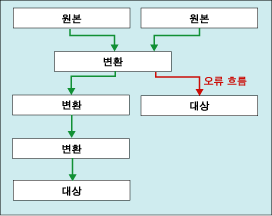

# <a name="error-handling-in-data"></a>데이터 오류 처리
  데이터 흐름 구성 요소가 열 데이터에 변환을 적용하거나, 원본에서 데이터를 추출하거나, 데이터를 대상으로 로드할 때 오류가 발생할 수 있습니다. 오류는 주로 예기치 않은 데이터 값으로 인해 발생합니다. 예를 들어 열에 숫자 대신 문자열이 포함되었기 때문에 데이터 변환이 실패하거나, 열의 데이터 형식은 숫자인데 데이터가 날짜여서 데이터베이스 열에 대한 삽입 작업이 실패하거나, 열 값이 0이어서 식 계산이 실패하고 잘못된 수치 연산이 발생할 수 있습니다.  
  
 오류는 일반적으로 다음과 같은 범주에 속합니다.  
  
-   변환으로 인해 유효 숫자나 비유효 숫자가 손실되거나 문자열이 잘리는 경우 발생하는 데이터 변환 오류. 데이터 변환 오류는 요청한 변환이 지원되지 않는 경우에도 발생합니다.  
  
-   런타임 시 계산되는 식이 잘못된 연산을 수행하거나 데이터 값이 누락 또는 잘못되어 구문이 잘못된 경우에 발생하는 식 계산 오류  
  
-   조회 작업이 조회 테이블에서 일치하는 항목을 찾지 못하는 경우에 발생하는 조회 오류  
  
 Integration Services 오류, 경고 및 기타 메시지 목록은 [Integration Services Error and Message Reference](../../integration-services/integration-services-error-and-message-reference.md)를 참조하십시오.  
  
## <a name="use-error-outputs-to-capture-row-level-errors"></a>오류 출력을 사용하여 행 수준 오류 캡처  
 여러 데이터 흐름 구성 요소에서 지원되는 오류 출력을 통해 들어오고 나가는 데이터의 행 수준 오류를 구성 요소에서 처리하는 방법을 제어할 수 있습니다. 입력 또는 출력의 개별 열에 대해 옵션을 설정하여 잘림이나 오류가 발생할 경우 구성 요소에서 작동하는 방법을 지정합니다. 예를 들어 고객 이름 데이터가 잘린 경우 구성 요소가 실패하지만 덜 중요한 데이터가 포함된 다른 열의 오류는 무시하도록 지정할 수 있습니다.  
  
 오류 출력은 다른 변환의 입력에 연결되거나 오류가 없는 출력과는 다른 대상으로 로드될 수 있습니다. 예를 들어 오류 출력은 빈 열에 대해 문자열을 제공하는 파생 열 변환에 연결될 수 있습니다.  
  
 다음 다이어그램에서는 오류 출력이 포함된 간단한 데이터 흐름을 보여 줍니다.  
  
   
  
 자세한 내용은 [데이터 흐름](../../integration-services/data-flow/data-flow.md) 및 [Integration Services 경로](../../integration-services/data-flow/integration-services-paths.md)를 참조하세요.  

## <a name="configure-error-output-dialog-box"></a>구성 오류 출력 대화 상자
**오류 출력 구성** 대화 상자를 사용하여 오류 출력을 지원하는 데이터 흐름 변환에 대한 오류 처리 옵션을 구성할 수 있습니다.  
  
 오류 출력 작업 방법에 대한 자세한 내용은 [데이터 오류 처리](../../integration-services/data-flow/error-handling-in-data.md)를 참조하세요.  
  
### <a name="options"></a>옵션  
 **입력 또는 출력**  
 출력의 이름을 확인합니다.  
  
 **열**  
 변환 편집기 대화 상자에서 선택한 출력 열을 봅니다.  
  
 **오류**  
 해당 사항이 있을 경우 오류 발생 시 수행할 동작을 지정합니다. 오류 무시, 행 리디렉션 또는 구성 요소 실패를 지정할 수 있습니다.  
  
 **관련 항목:** [데이터 오류 처리](../../integration-services/data-flow/error-handling-in-data.md)  
  
 **잘림**  
 해당 사항이 있을 경우 잘림 발생 시 수행할 동작을 지정합니다. 오류 무시, 행 리디렉션 또는 구성 요소 실패를 지정할 수 있습니다.  
  
 **관련 항목:** [데이터 오류 처리](../../integration-services/data-flow/error-handling-in-data.md)  
  
 **Description**  
 작업에 대한 설명을 표시합니다.  
  
 **이 값을 선택한 셀에 설정**  
 오류나 잘림 발생 시 선택한 모든 셀에 수행할 동작을 지정합니다. 오류 무시, 행 리디렉션 또는 구성 요소 실패를 지정할 수 있습니다.  
  
 **적용**  
 선택한 셀에 오류 처리 옵션을 적용합니다.  
  
## <a name="errors-are-either-failures-or-truncations"></a>오류: 실패 또는 잘림  
 오류는 오류 또는 잘림의 두 범주로 분류됩니다.  
  
 **오류**. 오류는 명확한 실패를 나타내며 NULL 결과를 생성합니다. 이러한 오류에는 데이터 변환 오류 또는 식 계산 오류가 포함될 수 있습니다. 예를 들어 영문자가 포함된 문자열을 숫자로 변환하려고 시도하면 오류가 발생합니다. 캐스트가 잘못되거나 호환되지 않는 데이터 형식을 사용하는 경우 데이터 변환, 식 평가, 변수와 속성 및 데이터 열에 식 결과를 할당하는 작업이 실패할 수 있습니다. 자세한 내용은 [캐스트&#40;SSIS 식&#41;](../../integration-services/expressions/cast-ssis-expression.md), [식에서의 Integration Services 데이터 형식](../../integration-services/expressions/integration-services-data-types-in-expressions.md) 및 [Integration Services 데이터 형식](../../integration-services/data-flow/integration-services-data-types.md)을 참조하세요.  
  
 **잘림**. 잘림은 오류보다 덜 심각합니다. 잘림은 사용 가능하거나 심지어 필요한 결과를 생성하기도 합니다. 잘림은 필요에 따라 오류 또는 허용 가능한 조건으로 취급될 수 있습니다. 예를 들어 한 자만 수용할 수 있는 열에 15자의 문자열을 삽입하는 경우 해당 문자열을 잘라내도록 할 수 있습니다.  
  
## <a name="select-an-error-handling-option"></a>오류 처리 옵션 선택  
 원본, 변환 및 대상에서 오류 및 잘림이 처리되는 방법을 구성할 수 있습니다. 다음 표에서는 옵션에 대해 설명합니다.  
  
|옵션|Description|  
|------------|-----------------|  
|구성 요소 실패|오류 또는 잘림이 발생하면 데이터 흐름 태스크가 실패합니다. 실패는 오류 또는 잘림에 대한 기본 옵션입니다.|  
|오류 무시|오류 또는 잘림이 무시되고 데이터 행이 변환 또는 원본의 출력으로 전달됩니다.|  
|행 리디렉션|오류 또는 잘림이 발생한 데이터 행이 원본, 변환 또는 대상의 오류 출력으로 전달됩니다.|  
  
## <a name="get-more-info-about-the-error"></a>오류에 대한 추가 정보 확인  
 데이터 열 외에도 오류 출력에는 **ErrorCode** 및 **ErrorColumn** 열이 포함됩니다. **ErrorCode** 열은 오류를 식별하며 **ErrorColumn** 에는 오류 열의 계보 식별자가 포함됩니다.  
  
 **ErrorColumn** 열의 값이 0으로 설정되는 경우도 있습니다. 이는 오류 조건이 단일 열 대신 전체 행에 영향을 주는 경우 발생합니다. 조회 변환에서 조회가 실패하는 경우를 예로 들 수 있습니다.  
  
 이 두 숫자 값은 해당 오류 설명과 열 이름이 없으므로 사용이 제한될 수 있습니다. 아래에는 오류 설명과 열 이름을 확인할 수 있는 몇 가지 방법이 나와 있습니다.  
  
-   오류 출력에 데이터 뷰어를 연결하면 오류 설명과 열 이름을 모두 확인할 수 있습니다. 이렇게 하려면 SSIS 디자이너에서 오류 출력 앞의 빨간색 화살표를 마우스 오른쪽 단추로 클릭하고 **데이터 뷰어 사용**을 선택합니다.  
  
-   로깅을 사용하도록 설정하고 **DiagnosticEx** 이벤트를 선택하여 열 이름을 찾을 수 있습니다. 이 이벤트는 로그에 데이터 흐름 열 맵을 작성합니다. 그런 다음 이 열 맵의 식별자를 통해 열 이름을 조회할 수 있습니다. **DiagnosticEx** 이벤트는 로그의 크기를 줄이기 위해 해당 XML 출력에서 공백을 유지하지 않습니다. 가독성을 높이기 위해 XML 서식 지정 및 구문 강조를 지원하는 XML 편집기(예: Visual Studio)로 로그를 복사합니다. 로깅에 대한 자세한 내용은 [Integration Services&#40;SSIS&#41; 로깅](../../integration-services/performance/integration-services-ssis-logging.md)을 참조하세요.  
  
     데이터 흐름 열 맵의 예는 다음과 같습니다.  
  
    ```xml  
  
    \<DTS:PipelineColumnMap xmlns:DTS="www.microsoft.com/SqlServer/Dts">  
        \<DTS:Pipeline DTS:Path="\Package\Data Flow Task">  
            \<DTS:Column DTS:ID="11" DTS:IdentificationString="ADO NET Source.Outputs[ADO NET Source Output].Columns[Customer]"/>  
            \<DTS:Column DTS:ID="12" DTS:IdentificationString="ADO NET Source.Outputs[ADO NET Source Output].Columns[Product]"/>  
            \<DTS:Column DTS:ID="13" DTS:IdentificationString="ADO NET Source.Outputs[ADO NET Source Output].Columns[Price]"/>  
            \<DTS:Column DTS:ID="14" DTS:IdentificationString="ADO NET Source.Outputs[ADO NET Source Output].Columns[Timestamp]"/>  
            \<DTS:Column DTS:ID="20" DTS:IdentificationString="ADO NET Source.Outputs[ADO NET Source Error Output].Columns[Customer]"/>  
            \<DTS:Column DTS:ID="21" DTS:IdentificationString="ADO NET Source.Outputs[ADO NET Source Error Output].Columns[Product]"/>  
            \<DTS:Column DTS:ID="22" DTS:IdentificationString="ADO NET Source.Outputs[ADO NET Source Error Output].Columns[Price]"/>  
            \<DTS:Column DTS:ID="23" DTS:IdentificationString="ADO NET Source.Outputs[ADO NET Source Error Output].Columns[Timestamp]"/>  
            \<DTS:Column DTS:ID="24" DTS:IdentificationString="ADO NET Source.Outputs[ADO NET Source Error Output].Columns[ErrorCode]"/>  
            \<DTS:Column DTS:ID="25" DTS:IdentificationString="ADO NET Source.Outputs[ADO NET Source Error Output].Columns[ErrorColumn]"/>  
            \<DTS:Column DTS:ID="31" DTS:IdentificationString="Flat File Destination.Inputs[Flat File Destination Input].Columns[Customer]"/>  
            \<DTS:Column DTS:ID="32" DTS:IdentificationString="Flat File Destination.Inputs[Flat File Destination Input].Columns[Product]"/>  
            \<DTS:Column DTS:ID="33" DTS:IdentificationString="Flat File Destination.Inputs[Flat File Destination Input].Columns[Price]"/>  
            \<DTS:Column DTS:ID="34" DTS:IdentificationString="Flat File Destination.Inputs[Flat File Destination Input].Columns[Timestamp]"/>  
        \</DTS:Pipeline>  
    \</DTS:PipelineColumnMap>  
  
    ```  
  
-   Script 구성 요소를 사용하여 오류 출력의 추가 열에 오류 설명 및 열 이름을 포함할 수도 있습니다. 예제는 [스크립트 구성 요소를 사용하여 오류 출력 향상](../../integration-services/extending-packages-scripting-data-flow-script-component-examples/enhancing-an-error-output-with-the-script-component.md)을 참조하세요.  
  
    -   호출 하는 단일 스크립트 줄을 사용 하 여 오류 설명을 추가 열에 포함 된 <xref:Microsoft.SqlServer.Dts.Pipeline.Wrapper.IDTSComponentMetaData100.GetErrorDescription%2A> 의 메서드는 <xref:Microsoft.SqlServer.Dts.Pipeline.Wrapper.IDTSComponentMetaData100> 인터페이스.  
  
    -   호출 하는 단일 스크립트 줄을 사용 하 여 추가 열에 열 이름을 포함 된 <xref:Microsoft.SqlServer.Dts.Pipeline.Wrapper.IDTSComponentMetaData100.GetIdentificationStringByID%2A> 의 메서드는 <xref:Microsoft.SqlServer.Dts.Pipeline.Wrapper.IDTSComponentMetaData100> 인터페이스입니다.  
  
     오류를 캡처할 데이터 흐름 구성 요소에서 임의의 다운스트림 위치에 있는 데이터 흐름의 오류 세그먼트에 Script 구성 요소를 추가할 수 있습니다. 일반적으로는 오류 행이 대상에 기록되기 직전에 Script 구성 요소를 배치합니다. 이렇게 하면 스크립트가 설명에서 기록된 오류 행만 조회합니다. 데이터 흐름의 오류 세그먼트가 일부 오류를 수정하고 해당 행을 오류 대상에 기록하지 않을 수도 있습니다.  

## <a name="see-also"></a>관련 항목:  
 [데이터 흐름](../../integration-services/data-flow/data-flow.md)   
 [변환 사용 하 여 데이터를 변환 합니다.](../../integration-services/data-flow/transformations/transform-data-with-transformations.md)   
 [경로에 구성 요소 연결](http://msdn.microsoft.com/library/05633e4c-1370-4b05-802b-f36b07dd71c8)   
 [데이터 흐름 태스크](../../integration-services/control-flow/data-flow-task.md)   
 [데이터 흐름](../../integration-services/data-flow/data-flow.md)  
  
  
