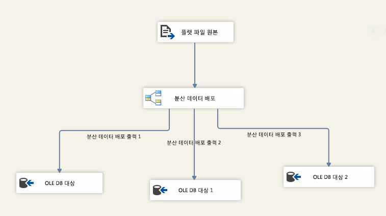

# 분산 데이터 배포자 변환

[!INCLUDE[ssis-appliesto](../../../includes/ssis-appliesto-ssvrpluslinux-asdb-asdw-xxx.md)]

  BDD(분산 데이터 배포자) 변환은 최신 CPU의 동시 처리 기능을 이용하며, 들어오는 행의 버퍼를 여러 스레드의 출력에 균일하게 분산합니다. BDD 구성 요소는 각 출력 경로에 별도의 스레드를 사용하여 다중 코어 또는 다중 프로세서 컴퓨터에서 SSIS 패키지의 성능을 향상시킵니다.  
  
 다음 다이어그램에서는 BDD 변환을 사용하는 간단한 예를 보여 줍니다. 이 예에서 BDD 변환은 플랫 파일 원본의 입력 데이터에서 파이프라인 버퍼를 한 번에 하나씩 선택하여 라운드 로빈 방식으로 세 출력 경로 중 하나로 보냅니다. 데이터 흐름 태스크의 속성을 보여주는 SQL Server Data Tools의 <xref:Microsoft.SqlServer.Dts.Pipeline.Wrapper.MainPipeClass.DefaultBufferSize%2A>창에서 <xref:Microsoft.SqlServer.Dts.Pipeline.Wrapper.MainPipeClass.DefaultBufferMaxRows%2A>(파이프라인 버퍼의 기본 크기) 및 **DefaultBufferMaxRows** (파이프라인 버퍼의 기본 최대 행 수)의 값을 확인할 수 있습니다.  
  
   
  
 분산 데이터 배포자 변환은 다음 조건을 충족하는 시나리오에서 패키지의 성능을 향상시키는 데 도움이 됩니다.  
  
1.  BDD 변환으로 많은 양의 데이터가 들어오는 경우. 데이터 크기가 작고 한 버퍼만 데이터를 저장할 수 있는 경우 BDD 변환을 사용할 이유가 없습니다. 데이터 크기가 크고 여러 개의 버퍼가 데이터를 저장하는 데 필요한 경우 BDD는 여러 스레드를 사용하여 병렬로 데이터 버퍼를 효율적으로 처리할 수 있습니다.  
  
2.  데이터를 읽는 속도가 데이터 흐름의 나머지 부분에서 데이터를 처리할 수 있는 속도보다 빠른 경우. 이 시나리오에서는 데이터에 수행되는 변환이 데이터가 들어오는 속도에 비해 느리게 실행됩니다. 대상에 병목 상태가 발생한 경우 대상이 병렬 처리될 수 있어야 합니다.  
  
3.  데이터의 순서를 정렬할 필요가 없는 경우. 예를 들어 데이터를 정렬된 상태로 유지해야 하는 경우 BDD 변환을 사용하여 데이터를 분할하면 안 됩니다.  
  
 SSIS 패키지의 병목 현상이 원본에서 데이터를 읽을 수 있는 속도 때문에 발생하는 경우 BDD 구성 요소는 성능을 향상시키는 데 도움이 되지 않습니다. SSIS 패키지의 병목 현상이 대상에서 병렬 처리를 지원하지 않기 때문에 발생하는 경우 BDD는 도움이 되지 않지만, 모든 변환을 병렬로 수행하고 UNION ALL 변환을 사용하여 BDD 변환의 여러 출력 경로에서 들어오는 출력 데이터를 결합한 후 대상에 데이터를 보낼 수 있습니다.  
  
> [!IMPORTANT]  
>  변환 사용에 대한 데모를 보려면 TechNet 라이브러리에서 [분산 데이터 배포자 비디오](https://go.microsoft.com/fwlink/?LinkID=226278) 를 참조하세요.  
  
  
