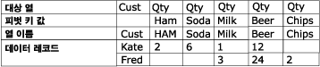
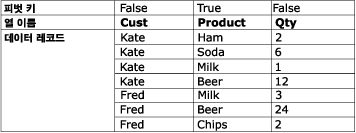

# 피벗 해제 변환

[!INCLUDE[ssis-appliesto](../../../includes/ssis-appliesto-ssvrpluslinux-asdb-asdw-xxx.md)]

  피벗 해제 변환은 단일 레코드의 여러 열 값을 단일 열에 동일 값이 포함된 여러 레코드로 확장하여 정규화되지 않은 데이터 세트를 정규화된 버전으로 만듭니다. 예를 들어 고객 이름이 나열된 데이터 세트에 각 고객마다 하나의 행이 있고 행의 열에 제품 및 구매 수량이 표시되어 있습니다. 피벗 해제 변환으로 데이터 집합을 정규화하면 데이터 집합에 고객이 구매한 각 제품이 서로 다른 행에 포함됩니다.  
  
 다음 다이어그램에서는 Product 열로 데이터를 피벗 해제하기 전의 데이터 집합을 보여 줍니다.  
  
   
  
 다음 다이어그램에서는 Product 열로 데이터를 피벗 해제한 후의 데이터 집합을 보여 줍니다.  
  
   
  
 일부 경우에는 피벗 해제된 결과에 예기치 않은 값이 있는 행이 포함될 수 있습니다. 예를 들어 다이어그램에 표시된 피벗 해제할 예제 데이터에서 Fred의 모든 Qty 열에 null 값이 있으면 출력에는 Fred에 대한 행이 다섯 개가 아니라 한 개만 포함될 수 있습니다. Qty 열에는 해당 열 데이터 형식에 따라 null이나 0이 포함됩니다.  
  
## 피벗 해제 변환 구성  
 피벗 해제 변환에는 **PivotKeyValue** 사용자 지정 속성이 포함됩니다. 이 속성은 패키지가 로드되면 속성 식을 사용하여 업데이트할 수 있습니다. 자세한 내용은 [Integration Services&#40;SSIS&#41; 식](../../../integration-services/expressions/integration-services-ssis-expressions.md), [패키지에서 속성 식 사용](../../../integration-services/expressions/use-property-expressions-in-packages.md) 및 [변환 사용자 지정 속성](../../../integration-services/data-flow/transformations/transformation-custom-properties.md)을 참조하세요.  
  
 이 변환은 하나의 입력과 하나의 출력을 가지며 오류 출력은 없습니다.  
  
 [!INCLUDE[ssIS](../../../includes/ssis-md.md)] 디자이너를 사용하거나 프로그래밍 방식으로 속성을 설정할 수 있습니다.  
  
 **고급 편집기** 대화 상자를 사용하거나 프로그래밍 방식으로 설정할 수 있는 속성에 대한 자세한 내용을 보려면 다음 항목 중 하나를 클릭하세요.  
  
-   [Common Properties](https://msdn.microsoft.com/library/51973502-5cc6-4125-9fce-e60fa1b7b796)  
  
-   [변환 사용자 지정 속성](../../../integration-services/data-flow/transformations/transformation-custom-properties.md)  
  
 속성을 설정하는 방법에 대한 자세한 내용은 [데이터 흐름 구성 요소의 속성 설정](../../../integration-services/data-flow/set-the-properties-of-a-data-flow-component.md)을 참조하세요.  
  
## 피벗 해제 변환 편집기
  **피벗 해제 변환 편집기** 대화 상자를 사용하여 행에 피벗할 열을 선택하고 데이터 열 및 새 피벗 값 출력 열을 지정할 수 있습니다.  
  
> [!NOTE]  
>  이 항목에서는 [피벗 해제 변환](../../../integration-services/data-flow/transformations/unpivot-transformation.md) 에 설명된 피벗 해제 시나리오를 사용하여 옵션 사용법을 보여 줍니다.  
  
### 옵션  
 **사용 가능한 입력 열**  
 확인란을 사용하여 행에 피벗할 열을 지정합니다.  
  
 **이름**  
 사용 가능한 입력 열의 이름을 표시합니다.  
  
 **통과**  
 열을 피벗 해제된 출력에 포함할지 여부를 나타냅니다.  
  
 **입력 열**  
 각 행에 대해 사용 가능한 입력 열 목록에서 선택합니다. 선택 내용에 따라 **사용 가능한 입력 열** 테이블의 확인란이 달라집니다.  
  
 [Unpivot Transformation](../../../integration-services/data-flow/transformations/unpivot-transformation.md)에 설명된 피벗 해제 시나리오에서 입력 열은 **햄**, **탄산음료**, **우유**, **맥주**및 **칩** 열입니다.  
  
 **대상 열**  
 데이터 열에 사용할 이름을 제공합니다.  
  
 [피벗 해제 변환](../../../integration-services/data-flow/transformations/unpivot-transformation.md)에 설명된 피벗 해제 시나리오에서 대상 열은 수량(**Qty**) 열입니다.  
  
 **피벗 키 값**  
 피벗 값에 사용할 이름을 제공합니다. 기본값은 입력 열의 이름이지만 설명이 포함된 고유 이름을 임의로 선택할 수 있습니다.  
  
 이 속성의 값은 속성 식을 사용하여 지정할 수 있습니다.  
  
 [Unpivot Transformation](../../../integration-services/data-flow/transformations/unpivot-transformation.md)에 설명된 피벗 해제 시나리오에서 피벗 값은 **피벗 키 값 열 이름** 옵션으로 지정한 새 제품 열에 **햄**, **탄산음료**, **우유**, **맥주**및 **칩**과 같은 텍스트 값으로 나타납니다.  
  
 **피벗 키 값 열 이름**  
 피벗 값 열에 사용할 이름을 제공합니다. 기본값은 "피벗 키 값"이지만 알기 쉬운 임의의 고유 이름을 선택할 수 있습니다.  
  
 [Unpivot Transformation](../../../integration-services/data-flow/transformations/unpivot-transformation.md)에 설명된 피벗 해제 시나리오에서 피벗 키 값 열 이름은 **제품** 이며 **제품** , **탄산음료**, **우유**, **맥주**, **칩**열이 피벗 해제되는 새 **제품** 열을 지정합니다.  
  
## 참고 항목  
 [Integration Services 오류 및 메시지 참조](../../../integration-services/integration-services-error-and-message-reference.md)   
 [피벗 변환](../../../integration-services/data-flow/transformations/pivot-transformation.md)  
  
  
