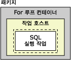
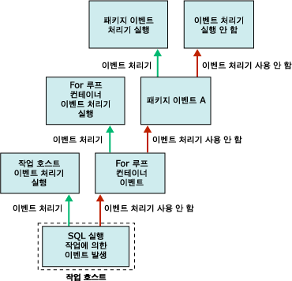

# Integration Services(SSIS) 이벤트 처리기

[!INCLUDE[ssis-appliesto](../includes/ssis-appliesto-ssvrpluslinux-asdb-asdw-xxx.md)]

  런타임 시 실행 개체(패키지 및 Foreach 루프, For 루프, 시퀀스 및 태스크 호스트 컨테이너)는 이벤트를 발생시킵니다. 예를 들어 오류가 발생하면 OnError 이벤트가 발생합니다. 이러한 이벤트에 대한 사용자 지정 이벤트 처리기를 만들면 패키지 기능을 확장하고 런타임 시 패키지를 더 쉽게 관리할 수 있습니다. 이벤트 처리기는 다음과 같은 태스크를 수행할 수 있습니다.  
  
-   패키지 또는 태스크 실행이 완료될 때 임시 데이터 스토리지를 삭제합니다.  
  
-   패키지 실행 전에 리소스 사용 가능 여부를 확인하기 위해 시스템 정보를 검색합니다.  
  
-   참조 테이블에서 조회가 실패하는 경우 테이블의 데이터를 새로 고칩니다.  
  
-   오류 또는 경고가 발생하거나 태스크가 실패하는 경우 전자 메일 메시지를 보냅니다.  
  
 이벤트에 이벤트 처리기가 없으면 패키지의 컨테이너 계층에서 다음 순서의 컨테이너로 이벤트가 전달됩니다. 이 컨테이너에 이벤트 처리기가 있으면 이벤트에 대한 응답으로 이 이벤트 처리기가 실행됩니다. 그렇지 않으면 이벤트가 다시 컨테이너 계층에서 다음 순서의 컨테이너로 전달됩니다.  
  
 다음 다이어그램은 하나의 SQL 실행 태스크가 포함된 For 루프 컨테이너가 들어 있는 간단한 패키지를 보여 줍니다.  
  
   
  
 이 패키지에는 **OnError** 이벤트에 대한 이벤트 처리기만 들어 있습니다. SQL 실행 태스크가 실행될 때 오류가 발생하면 패키지에 대한 **OnError** 이벤트 처리기가 실행됩니다. 다음 다이어그램은 **OnError** 이벤트 처리기가 패키지를 실행하도록 만드는 호출 시퀀스를 보여 줍니다.  
  
   
  
 이벤트 처리기는 이벤트 처리기 컬렉션의 멤버이며 모든 컨테이너에는 이 컬렉션이 포함됩니다. [!INCLUDE[ssIS](../includes/ssis-md.md)] 디자이너를 사용하여 패키지를 만드는 경우에는 **디자이너의** 패키지 탐색기 **탭에 있는** 이벤트 처리기 [!INCLUDE[ssIS](../includes/ssis-md.md)] 폴더에서 이벤트 처리기 컬렉션의 멤버를 확인할 수 있습니다.  
  
 다음과 같은 방법으로 이벤트 처리기 컨테이너를 구성할 수 있습니다.  
  
-   이벤트 처리기에 대한 이름 및 설명을 지정합니다.  
  
-   이벤트 처리기 실행 여부, 이벤트 처리기 실패 시 패키지가 실패하는지 여부 및 이벤트 처리기 실패 시 발생할 수 있는 오류 개수를 나타냅니다.  
  
-   이벤트 처리기가 런타임에 반환하는 실제 실행 결과 대신 반환할 실행 결과를 지정합니다.  
  
-   이벤트 처리기의 트랜잭션 옵션을 지정합니다.  
  
-   이벤트 처리기에서 사용되는 로깅 모드를 지정합니다.  
  
## 이벤트 처리기 내용  
 이벤트 처리기를 만드는 방법은 패키지를 빌드하는 방법과 비슷합니다. 이벤트 처리기에는 제어 흐름으로 순서가 지정된 태스크 및 컨테이너가 포함되며, 데이터 흐름이 포함될 수도 있습니다. [!INCLUDE[ssIS](../includes/ssis-md.md)] 디자이너에는 사용자 지정 이벤트 처리기를 만들기 위한 **이벤트 처리기** 탭이 포함됩니다.  
  
 이벤트 처리기를 프로그래밍 방식으로 만들 수도 있습니다. 자세한 내용은 [프로그래밍 방식으로 이벤트 처리](../integration-services/building-packages-programmatically/handling-events-programmatically.md)를 참조하세요.  
  
## 런타임 이벤트  
 다음 표에서는 [!INCLUDE[ssISnoversion](../includes/ssisnoversion-md.md)] 에서 제공되는 이벤트 처리기를 나열하고 이벤트 처리기를 실행하는 런타임 이벤트에 대해 설명합니다.  
  
|이벤트 처리기|이벤트|  
|-------------------|-----------|  
|**OnError**|**OnError** 이벤트에 대한 이벤트 처리기입니다. 이 이벤트는 오류가 발생할 때 실행 개체에 의해 발생합니다.|  
|**OnExecStatusChanged**|**OnExecStatusChanged** 이벤트에 대한 이벤트 처리기입니다. 이 이벤트는 실행 상태가 변경될 때 실행 개체에 의해 발생합니다.|  
|**OnInformation**|**OnInformation** 이벤트에 대한 이벤트 처리기입니다. 이 이벤트는 정보 보고를 위한 실행 개체의 유효성 검사 및 실행 중에 발생합니다. 이 이벤트에는 오류 또는 경고를 제외한 정보만 포함됩니다.|  
|**OnPostExecute**|**OnPostExecute** 이벤트에 대한 이벤트 처리기입니다. 이 이벤트는 실행을 마친 바로 다음 실행 개체에 의해 발생합니다.|  
|**OnPostValidate**|**OnPostValidate** 이벤트에 대한 이벤트 처리기입니다. 이 이벤트는 유효성 검사가 완료될 때 실행 개체에 의해 발생합니다.|  
|**OnPreExecute**|**OnPreExecute** 이벤트에 대한 이벤트 처리기입니다. 이 이벤트는 실행되기 바로 전에 실행 개체에 의해 발생합니다.|  
|**OnPreValidate**|**OnPreValidate** 이벤트에 대한 이벤트 처리기입니다. 이 이벤트는 유효성 검사가 시작될 때 실행 개체에 의해 발생합니다.|  
|**OnProgress**|**OnProgress** 이벤트에 대한 이벤트 처리기입니다. 이 이벤트는 실행 개체의 진행 상태를 측정할 수 있는 경우 실행 개체에 의해 발생합니다.|  
|**OnQueryCancel**|**OnQueryCancel** 이벤트에 대한 이벤트 처리기입니다. 이 이벤트는 실행 중지 시기를 결정하기 위해 실행 개체에 의해 발생합니다.|  
|**OnTaskFailed**|**OnTaskFailed** 이벤트에 대한 이벤트 처리기입니다. 이 이벤트는 작업이 실패할 때 해당 태스크에 의해 발생합니다.|  
|**OnVariableValueChanged**|**OnVariableValueChanged** 이벤트에 대한 이벤트 처리기입니다. 이 이벤트는 변수 값이 변경될 때 실행 개체에 의해 발생합니다. 이 이벤트는 변수가 정의되는 실행 개체에 의해 발생합니다. 변수에 대한 **RaiseChangeEvent** 속성을 **False**로 설정한 경우에는 이 이벤트가 발생하지 않습니다. 자세한 내용은 [Integration Services&#40;SSIS&#41; 변수](../integration-services/integration-services-ssis-variables.md)을 참조하세요.|  
|**OnWarning**|**OnWarning** 이벤트에 대한 이벤트 처리기입니다. 이 이벤트는 경고가 발생할 때 실행 개체에 의해 발생합니다.|  

## 패키지에 이벤트 처리기 추가
컨테이너와 태스크는 런타임에 이벤트를 발생시킵니다. 이벤트가 발생할 때 워크플로를 실행하여 이벤트에 응답하는 사용자 지정 이벤트 처리기를 만들 수 있습니다. 예를 들어 태스크가 실패하면 전자 메일 메시지를 보내는 이벤트 처리기를 만들 수 있습니다.  
  
 이벤트 처리기는 패키지와 비슷합니다. 패키지와 같이 이벤트 처리기에서는 변수에 대한 범위를 제공할 수 있으며 제어 흐름과 선택적 데이터 흐름이 포함됩니다. 패키지, Foreach 루프 컨테이너, For 루프 컨테이너, 시퀀스 컨테이너 및 모든 태스크에 대해 이벤트 처리기를 만들 수 있습니다.  
  
 **디자이너에서** 이벤트 처리기 [!INCLUDE[ssIS](../includes/ssis-md.md)] 탭의 디자인 화면을 사용하여 이벤트 처리기를 만들 수 있습니다.  
  
 **이벤트 처리기** 탭이 활성화되면 **디자이너의 도구 상자에 있는** 제어 흐름 항목 **및** 유지 관리 계획 태스크 [!INCLUDE[ssIS](../includes/ssis-md.md)] 노드에 이벤트 처리기의 제어 흐름을 작성하기 위한 태스크와 컨테이너가 포함됩니다. **데이터 흐름 원본**, **변환**및 **데이터 흐름 대상** 노드에는 이벤트 처리기의 데이터 흐름을 작성하기 위한 데이터 원본, 변환 및 대상이 포함됩니다. 자세한 내용은 [Control Flow](../integration-services/control-flow/control-flow.md) 및 [Data Flow](../integration-services/data-flow/data-flow.md)를 참조하세요.  
  
 **이벤트 처리기** 탭에는 또한 이벤트 처리기에서 서버 및 데이터 원본에 연결하는 데 사용하는 연결 관리자를 만들고 수정할 수 있는 **연결 관리자** 영역이 포함됩니다. 자세한 내용은 [연결 관리자 만들기](https://msdn.microsoft.com/library/6ca317b8-0061-4d9d-b830-ee8c21268345)를 참조하세요.  
  
### 이벤트 처리기 탭에서 이벤트 처리기 추가  
  
1.  [!INCLUDE[ssBIDevStudioFull](../includes/ssbidevstudiofull-md.md)]에서 원하는 패키지가 들어 있는 [!INCLUDE[ssISnoversion](../includes/ssisnoversion-md.md)] 프로젝트를 엽니다.  
  
2.  솔루션 탐색기에서 패키지를 두 번 클릭하여 엽니다.  
  
3.  **이벤트 처리기** 탭을 클릭합니다.  
  
       
  
     이벤트 처리기에서 제어 흐름과 데이터 흐름을 만드는 방법은 패키지에서 제어 흐름과 데이터 흐름을 만드는 방법과 비슷합니다. 자세한 내용은 [Control Flow](../integration-services/control-flow/control-flow.md) 및 [Data Flow](../integration-services/data-flow/data-flow.md)를 참조하세요.  
  
4.  **실행 파일** 목록에서 이벤트 처리기를 만들 실행 파일을 선택합니다.  
  
5.  **이벤트 처리기** 목록에서 만들 이벤트 처리기를 선택합니다.  
  
6.  **이벤트 처리기** 탭의 디자인 화면에서 링크를 클릭합니다.  
  
7.  이벤트 처리기에 제어 흐름 항목을 추가하고 제어 흐름 항목 간에 제약 조건을 끌어서 선행 제약 조건을 사용하는 항목을 연결합니다. 자세한 내용은 [Control Flow](../integration-services/control-flow/control-flow.md)을 참조하세요.  
  
8.  필요에 따라 **데이터 흐름** 탭의 디자인 화면에 데이터 흐름 태스크를 추가하고 이벤트 처리기의 데이터 흐름을 만들 수도 있습니다. 자세한 내용은 [Data Flow](../integration-services/data-flow/data-flow.md)을 참조하세요.  
  
9. **파일** 메뉴에서 **선택한 항목 저장** 을 클릭하여 패키지를 저장합니다.  

## 이벤트 처리기의 속성 설정  
 [!INCLUDE[ssBIDevStudioFull](../includes/ssbidevstudiofull-md.md)] 의 **속성** 창을 사용하거나 프로그래밍 방식으로 속성을 설정할 수 있습니다.  
  
 [!INCLUDE[ssBIDevStudioFull](../includes/ssbidevstudiofull-md.md)]에서 이러한 속성을 설정하는 방법에 대한 자세한 내용은 [태스크 또는 컨테이너의 속성 설정](https://msdn.microsoft.com/library/52d47ca4-fb8c-493d-8b2b-48bb269f859b)을 참조하세요.  
  
 이러한 속성을 프로그래밍 방식으로 설정하는 방법에 대한 자세한 내용은 <xref:Microsoft.SqlServer.Dts.Runtime.DtsEventHandler>를 참조하세요.  
  
## 관련 작업  
 패키지에 이벤트 처리기를 추가하는 방법에 대한 자세한 내용은 [패키지에 이벤트 처리기 추가](https://msdn.microsoft.com/library/5e56885d-8658-480a-bed9-3f2f8003fd78)를 참조하세요.  
  
  
