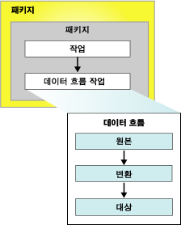

# Integration Services(SSIS) 패키지
  패키지는 연결, 제어 흐름 요소, 데이터 흐름 요소, 이벤트 처리기, 변수, 매개 변수 및 구성으로 이루어진 컬렉션으로 [!INCLUDE[ssNoVersion](../includes/ssnoversion-md.md)] [!INCLUDE[ssISnoversion](../includes/ssisnoversion-md.md)] 에서 제공하는 그래픽 디자인 도구를 사용하여 조합하거나 프로그래밍 방식으로 작성합니다.  그런 다음 완성된 패키지를 [!INCLUDE[ssNoVersion](../includes/ssnoversion-md.md)], [!INCLUDE[ssIS](../includes/ssis-md.md)] 패키지 저장소 또는 파일 시스템에 저장하거나, ssISnoversion 프로젝트를 [!INCLUDE[ssIS](../includes/ssis-md.md)] 서버에 배포할 수 있습니다. 패키지는 검색, 실행 및 저장되는 작업 단위입니다.  
  
 처음으로 패키지를 만들면 아무 것도 포함되어 있지 않은 빈 개체입니다. 패키지에 기능을 추가하려면 하나의 제어 흐름과 선택적으로 하나 이상의 데이터 흐름을 패키지에 추가합니다.  
  
 다음 다이어그램에서는 데이터 흐름 태스크 사용한 제어 흐름이 포함된 간단한 패키지를 보여 주며 이 제어 흐름에 다시 데이터 흐름이 포함됩니다.  
  
   
  
 기본 패키지를 만든 후 로깅 및 변수 등의 고급 기능을 추가하여 패키지 기능을 확장할 수 있습니다. 자세한 내용은 패키지 기능을 확장하는 개체에 대한 섹션을 참조하십시오.  
  
 그런 다음 보안을 구현하거나 검사점에서 패키지를 다시 시작할 수 있게 하거나 패키지 워크플로에 트랜잭션을 통합하는 패키지 수준 속성을 설정하여 완성된 패키지를 구성할 수 있습니다. 자세한 내용은 확장 기능을 지원하는 속성에 대한 섹션을 참조하십시오.  
  
## 패키지의 내용  
 **태스크 및 컨테이너(제어 흐름)** 제어 흐름은 패키지 실행 시 실행되는 하나 이상의 태스크와 컨테이너로 구성됩니다. 패키지 제어 흐름에서 다음 태스크나 컨테이너를 실행하기 위한 조건을 정의하거나 순서를 제어하기 위해 선행 제약 조건을 사용하여 패키지의 태스크와 컨테이너를 연결합니다. 태스크 및 컨테이너의 하위 집합을 그룹화하여 패키지 제어 흐름에서 하나의 단위로 반복해서 실행할 수도 있습니다. 자세한 내용은 [Control Flow](../integration-services/control-flow/control-flow.md)을 참조하세요.  
  
 **데이터 원본 및 대상(데이터 흐름)** 데이터 흐름은 데이터를 추출 및 로드하는 원본과 대상, 데이터를 수정 및 확장하는 변환, 원본, 변환 및 대상을 연결하는 경로로 구성됩니다. 패키지에 데이터 흐름을 추가하려면 패키지 제어 흐름에 데이터 흐름 태스크가 포함되어 있어야 합니다. 데이터 흐름 태스크는 데이터 흐름을 만들고 순서를 지정하고 실행하는 [!INCLUDE[ssIS](../includes/ssis-md.md)] 패키지의 실행 파일입니다. 패키지의 각 데이터 흐름 태스크에 대해 데이터 흐름 엔진의 별도 인스턴스가 열립니다. 자세한 내용은 [Data Flow Task](../integration-services/control-flow/data-flow-task.md) 및 [Data Flow](../integration-services/data-flow/data-flow.md)를 참조하세요.  
  
 **연결 관리자(연결)** 패키지는 일반적으로 하나 이상의 연결 관리자를 포함합니다. 연결 관리자는 패키지의 태스크, 변환 및 이벤트 처리기에 사용되는 데이터에 액세스하기 위한 연결 문자열을 정의하는 패키지와 데이터 원본 간의 연결입니다. [!INCLUDE[ssISnoversion](../includes/ssisnoversion-md.md)] 에는 텍스트 및 XML 파일과 같은 데이터 원본, 관계형 데이터베이스, [!INCLUDE[ssASnoversion](../includes/ssasnoversion-md.md)] 데이터베이스 및 프로젝트에 대한 연결 형식이 포함되어 있습니다. 자세한 내용은 [Integration Services&#40;SSIS&#41; 연결](../integration-services/connection-manager/integration-services-ssis-connections.md)을 참조하세요.  
  
## 패키지 기능을 확장하는 개체  
 패키지는 이벤트 처리기, 구성, 로깅 및 변수와 같이 고급 기능을 제공하거나 기존 기능을 확장하는 추가 개체를 포함할 수 있습니다.  
  
### 이벤트 처리기  
 이벤트 처리기는 패키지, 태스크 또는 컨테이너에서 발생한 이벤트에 응답하여 실행되는 워크플로입니다. 예를 들어 이벤트 처리기를 사용하여 실행 전 이벤트나 오류가 발생할 때 디스크 공간을 검사하고 사용 가능한 공간이나 오류 정보를 관리자에게 보고하는 전자 메일 메시지를 보낼 수 있습니다. 이벤트 처리기는 패키지처럼 하나의 제어 흐름과 선택적 데이터 흐름으로 구성됩니다. 패키지의 개별 태스크나 컨테이너에 이벤트 처리기를 추가할 수 있습니다. 자세한 내용은 [Integration Services&#40;SSIS&#41; 이벤트 처리기](../integration-services/integration-services-ssis-event-handlers.md)를 참조하세요.  
  
### 구성  
 구성은 패키지와 해당 태스크의 속성, 컨테이너, 변수, 연결 및 패키지 실행 시의 이벤트 처리기를 정의하는 속성-값 쌍의 집합입니다. 구성을 사용하면 패키지를 수정하지 않아도 속성을 업데이트할 수 있습니다. 패키지를 실행하면 구성 정보가 로드되어 속성 값을 업데이트합니다. 예를 들어 구성은 연결의 연결 문자열을 업데이트할 수 있습니다.  
  
 다른 컴퓨터에 패키지를 설치하면 구성이 저장되어 패키지와 함께 배포됩니다. 패키지를 설치할 때 구성의 값을 업데이트하여 다른 환경에서 패키지를 지원할 수 있습니다. 자세한 내용은 [패키지 구성 만들기](../integration-services/packages/create-package-configurations.md)를 참조하세요.  
  
### 로깅 및 로그 공급자  
 로그는 패키지 실행 시 수집되는 패키지에 대한 정보 컬렉션입니다. 예를 들어 로그는 패키지 실행의 시작 시간과 종료 시간을 제공할 수 있습니다. 로그 공급자는 패키지와 해당 컨테이너 및 태스크가 런타임 정보를 기록하는 데 사용할 수 있는 대상 유형과 형식을 정의합니다. 로그는 패키지와 연결되지만 패키지의 태스크와 컨테이너는 임의의 패키지 로그에 정보를 기록할 수 있습니다. [!INCLUDE[ssISnoversion](../includes/ssisnoversion-md.md)] 에는 로깅을 위한 다양한 기본 제공 로그 공급자가 포함되어 있습니다. 예를 들어 [!INCLUDE[ssISnoversion](../includes/ssisnoversion-md.md)] 에는 [!INCLUDE[ssNoVersion](../includes/ssnoversion-md.md)] 에 대한 로그 공급자와 텍스트 파일이 있습니다. 사용자 지정 로그 공급자를 만들어 로깅에 사용할 수도 있습니다. 자세한 내용은 [Integration Services&#40;SSIS&#41; 로깅](../integration-services/performance/integration-services-ssis-logging.md)을 참조하세요.  
  
### 변수  
 [!INCLUDE[ssISnoversion](../includes/ssisnoversion-md.md)] 는 시스템 변수와 사용자 정의 변수를 지원합니다. 시스템 변수는 런타임 시 패키지 개체에 대한 유용한 정보를 제공하며 사용자 정의 변수는 패키지의 사용자 지정 시나리오를 지원합니다. 식, 스크립트 및 구성에 두 유형의 변수를 모두 사용할 수 있습니다.  
  
 패키지 수준 변수에는 패키지에 사용 가능한 미리 정의된 시스템 변수와 패키지 범위 내의 사용자 정의 변수가 포함됩니다. 자세한 내용은 [Integration Services(SSIS) 변수](../integration-services/integration-services-ssis-variables.md)를 참조하세요.  
 
### 매개 변수  
 [!INCLUDE[ssISnoversion](../includes/ssisnoversion-md.md)] 매개 변수를 사용하여 패키지 실행 시 패키지 내의 속성에 값을 할당할 수 있습니다. 프로젝트 수준에서 *프로젝트 매개 변수* 를 만들고 패키지 수준에서 *패키지 매개 변수* 를 만들 수 있습니다. 프로젝트 매개 변수는 프로젝트가 수신하는 외부 입력을 프로젝트 내 하나 이상의 패키지에 제공하기 위해 사용됩니다. 패키지 매개 변수를 사용하면 패키지를 편집하여 다시 배포할 필요 없이 패키지 실행을 수정할 수 있습니다. 자세한 내용은 [Integration Services&amp;(SSIS) 매개 변수](../integration-services/integration-services-ssis-package-and-project-parameters.md)를 참조하세요.  
 
## 확장 기능을 지원하는 패키지 속성  
 패키지 개체를 구성하여 검사점에서 패키지 다시 시작, 디지털 인증서로 패키지 서명, 패키지 보호 수준 설정, 트랜잭션을 사용하여 데이터 무결성 보장 등의 기능을 지원할 수 있습니다.  
  
### 패키지 다시 시작  
 패키지에는 해당 태스크가 하나 이상 실패할 때 패키지를 다시 시작하기 위해 사용할 수 있는 검사점 속성이 있습니다. 예를 들어 패키지에 두 개의 다른 테이블을 업데이트하는 두 개의 데이터 흐름 태스크가 있고 두 번째 태스크가 실패할 경우 첫 번째 데이터 흐름 태스크를 반복하지 않고 패키지를 다시 실행할 수 있습니다. 장기 실행 패키지의 경우 패키지 다시 시작 기능을 사용하면 시간을 절약할 수 있습니다. 다시 시작은 전체 패키지를 다시 실행할 필요 없이 실패한 태스크부터 패키지를 시작할 수 있다는 것을 의미합니다. 자세한 내용은 [Restart Packages by Using Checkpoints](../integration-services/packages/restart-packages-by-using-checkpoints.md)을 참조하세요.  
  
### 패키지 보안  
 디지털 서명으로 패키지를 서명하고 암호 또는 사용자 키를 사용하여 암호화할 수 있습니다. 디지털 서명은 패키지 원본을 인증합니다. 단, 패키지가 로드될 때 디지털 서명을 확인하도록 [!INCLUDE[ssISnoversion](../includes/ssisnoversion-md.md)] 를 구성해야 합니다. 자세한 내용은 [디지털 서명을 사용하여 패키지 원본 확인](../integration-services/security/identify-the-source-of-packages-with-digital-signatures.md) 및 [패키지의 중요한 데이터에 대한 액세스 제어](../integration-services/security/access-control-for-sensitive-data-in-packages.md)를 참조하세요.  
  
### 트랜잭션 지원  
 패키지에 트랜잭션 특성을 설정하면 패키지의 태스크, 컨테이너 및 연결이 트랜잭션에 조인할 수 있습니다. 트랜잭션 특성으로 인해 패키지와 해당 요소는 하나의 단위로 성공하거나 실패합니다. 패키지는 다른 패키지를 실행하고 트랜잭션에 다른 패키지를 등록할 수도 있으므로 여러 개의 패키지를 하나의 작업 단위로 실행할 수 있습니다. 자세한 내용은 [Integration Services 트랜잭션](../integration-services/integration-services-transactions.md)을 참조하세요.  
  
## 패키지에 사용할 수 있는 사용자 지정 로그 항목  
 다음 표에서는 패키지에 대한 사용자 지정 로그 항목을 나열합니다. 자세한 내용은 [Integration Services&#40;SSIS&#41; 로깅](../integration-services/performance/integration-services-ssis-logging.md)을 참조하세요.  
  
|로그 항목|설명|  
|---------------|-----------------|  
|**PackageStart**|패키지 실행이 시작되었음을 나타냅니다.   참고: 이 로그 항목은 로그에 자동으로 기록되며 제외할 수 없습니다.|  
|**PackageEnd**|패키지가 완료되었음을 나타냅니다.   참고: 이 로그 항목은 로그에 자동으로 기록되며 제외할 수 없습니다.|  
|**진단**|동시에 실행될 수 있는 실행 파일 수처럼 패키지 실행에 영향을 주는 시스템 구성에 대한 정보를 제공합니다.|  
  
## 패키지의 속성 설정  
 [!INCLUDE[ssBIDevStudioFull](../includes/ssbidevstudiofull-md.md)] 의 **속성** 창을 사용하거나 프로그래밍 방식으로 속성을 설정할 수 있습니다.  
  
 [!INCLUDE[ssBIDevStudioFull](../includes/ssbidevstudiofull-md.md)]를 사용하여 이러한 속성을 설정하는 방법은 [패키지 속성 설정](../integration-services/set-package-properties.md)을 참조하세요.  
  
 이러한 속성을 프로그래밍 방식으로 설정하는 방법은 <xref:Microsoft.SqlServer.Dts.Runtime.Package>을 참조하세요.  

## 기존 패키지를 템플릿으로 다시 사용  
 패키지는 기본 기능을 공유하는 패키지를 작성하는 템플릿으로 자주 사용됩니다. 기본 패키지를 작성한 다음 복사하거나 해당 패키지가 템플릿이 되도록 지정할 수 있습니다. 예를 들어 파일을 다운로드하고 복사한 다음 데이터를 추출하는 패키지에 한 폴더에 있는 파일을 열거하는 Foreach 루프의 FTP 및 파일 시스템 태스크가 포함될 수 있습니다. 또한 데이터에 액세스할 플랫 파일 연결 관리자 및 데이터를 추출할 플랫 파일 원본이 포함될 수 있습니다. 데이터의 대상은 다양하며 기본 패키지에서 복사된 후 각각의 새 패키지에 추가됩니다. 또한 패키지를 만든 다음 [!INCLUDE[ssISnoversion](../includes/ssisnoversion-md.md)] 프로젝트에 추가할 새 패키지의 템플릿으로 사용할 수 있습니다. 자세한 내용은 [Create Packages in SQL Server Data Tools](../integration-services/create-packages-in-sql-server-data-tools.md)을 참조하세요.  
  
 프로그래밍 방식으로 또는 SSIS 디자이너를 사용하여 패키지를 처음 만드는 경우 GUID가 해당 **ID** 속성에 추가되고 이름이 **Name** 속성에 추가됩니다. 기존 패키지를 복사하거나 템플릿 패키지를 사용하여 새 패키지를 만드는 경우 이름 및 GUID도 복사됩니다. 이는 로깅을 사용하는 경우 로깅된 정보가 속하는 패키지를 식별할 수 있도록 패키지의 GUID 및 이름이 로그에 기록되기 때문에 문제가 발생할 수 있습니다. 따라서 새 패키지와 새 패키지를 복사된 패키지 및 로그 데이터에 있는 패키지와 구분할 수 있도록 새 패키지의 이름 및 GUID를 업데이트해야 합니다.  
  
 패키지 GUID를 변경하려면 **의 속성 창에 있는** ID [!INCLUDE[ssBIDevStudioFull](../includes/ssbidevstudiofull-md.md)]속성에 GUID를 다시 생성합니다. 패키지 이름을 변경하려면 속성 창에서 **Name** 속성 값을 업데이트해야 합니다. 또한 **dtutil** 명령 프롬프트를 사용하거나 GUID 및 이름을 프로그래밍 방식으로 업데이트할 수 있습니다. 자세한 내용은 [패키지 속성 설정](../integration-services/set-package-properties.md) 및 [dtutil 유틸리티](../integration-services/dtutil-utility.md)를 참조하세요.  
  
## 관련 작업  
 [!INCLUDE[ssISnoversion](../includes/ssisnoversion-md.md)] 에는 [!INCLUDE[ssIS](../includes/ssis-md.md)] 개체 모델 외에도 두 개의 패키지 작성용 그래픽 도구인 [!INCLUDE[ssNoVersion](../includes/ssnoversion-md.md)] 디자이너와 [!INCLUDE[ssIS](../includes/ssis-md.md)] 가져오기 및 내보내기 마법사가 포함되어 있습니다. 자세한 내용은 다음 항목을 참조하십시오.  
  
-   [SQL Server 가져오기 및 내보내기 마법사를 사용하여 데이터 가져오기 및 내보내기](../integration-services/import-export-data/import-and-export-data-with-the-sql-server-import-and-export-wizard.md)  
  
-   [SQL Server Data Tools에서 패키지 만들기](../integration-services/create-packages-in-sql-server-data-tools.md)  
  
-   개발자 가이드의 [프로그래밍 방식으로 패키지 작성](../integration-services/building-packages-programmatically/building-packages-programmatically.md)을 참조하세요. 
  
  
