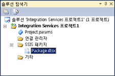

# Integration Services(SSIS) 프로젝트 및 솔루션
  [!INCLUDE[ssNoVersion](../includes/ssnoversion-md.md)] 에서는 [!INCLUDE[ssBIDevStudioFull](../includes/ssbidevstudiofull-md.md)] 패키지 개발을 위해 [!INCLUDE[ssISnoversion](../includes/ssisnoversion-md.md)] 를 제공합니다.  
  
[!INCLUDE[ssISnoversion](../includes/ssisnoversion-md.md)] 패키지는 프로젝트에 있습니다. [!INCLUDE[ssISnoversion](../includes/ssisnoversion-md.md)] 프로젝트를 만들고 사용하려면 [!INCLUDE[ssBIDevStudioFull](../includes/ssbidevstudiofull-md.md)] 환경을 설치해야 합니다. 자세한 내용은 [Integration Services 설치](../integration-services/install-windows/install-integration-services.md)를 참조하세요.  
  
 [!INCLUDE[ssISnoversion](../includes/ssisnoversion-md.md)] 에서 새 [!INCLUDE[ssBIDevStudioFull](../includes/ssbidevstudiofull-md.md)]프로젝트를 만들 때는 **새 프로젝트** 대화 상자에 **Integration Services 프로젝트** 템플릿이 있습니다. 이 프로젝트 템플릿은 하나의 패키지가 포함되어 있는 새 프로젝트를 만듭니다.  
  
## 프로젝트 및 솔루션  
 프로젝트는 솔루션에 저장됩니다. 솔루션을 먼저 만든 다음 솔루션에 [!INCLUDE[ssISnoversion](../includes/ssisnoversion-md.md)] 프로젝트를 추가할 수 있습니다. 솔루션이 없으면 프로젝트를 만들 때 [!INCLUDE[ssBIDevStudioFull](../includes/ssbidevstudiofull-md.md)] 에서 솔루션이 자동으로 생성됩니다. 솔루션에는 여러 형식의 프로젝트가 포함될 수 있습니다.  
  
> [!TIP]  
>  기본적으로 [!INCLUDE[ssBIDevStudio](../includes/ssbidevstudio-md.md)]에서 새 프로젝트를 만들 때는 **솔루션 탐색기** 창에 솔루션이 표시되지 않습니다. 이 기본 동작을 변경하려면 **도구** 메뉴에서 **옵션**을 클릭합니다. **옵션** 대화 상자에서 **프로젝트 및 솔루션**을 확장한 다음 **일반**을 선택합니다. **일반** 페이지에서 **솔루션 항상 표시**를 선택합니다.  

## 솔루션은 프로젝트를 포함합니다.  
 솔루션은 종단 간 비즈니스 솔루션을 개발할 때 사용되는 프로젝트를 그룹화 및 관리하는 컨테이너입니다. 솔루션을 사용하면 여러 프로젝트를 하나의 단위로 취급하고 비즈니스 솔루션에 관련된 하나 이상의 관련 프로젝트를 하나로 묶을 수 있습니다.  
  
 솔루션에는 여러 형식의 프로젝트가 포함될 수 있습니다. [!INCLUDE[ssIS](../includes/ssis-md.md)] 디자이너를 사용하여 [!INCLUDE[ssISnoversion](../includes/ssisnoversion-md.md)] 패키지를 만들려면 [!INCLUDE[ssISnoversion](../includes/ssisnoversion-md.md)] 에서 제공하는 솔루션의 [!INCLUDE[ssBIDevStudioFull](../includes/ssbidevstudiofull-md.md)]프로젝트를 사용합니다.  
  
 새 솔루션을 만들 때 [!INCLUDE[ssBIDevStudioFull](../includes/ssbidevstudiofull-md.md)] 는 솔루션 탐색기에 솔루션 폴더를 추가하고 확장명이 .sln 및 .suo인 파일을 만듭니다.  
  
-   *.sln 파일에는 솔루션 구성에 대한 정보가 포함되고 솔루션의 프로젝트가 나열됩니다.  
  
-   *.suo 파일에는 솔루션을 사용하기 위한 기본 설정에 대한 정보가 포함됩니다.  
  
 새 프로젝트를 만들면 [!INCLUDE[ssBIDevStudioFull](../includes/ssbidevstudiofull-md.md)] 에서 솔루션이 자동으로 생성되지만 빈 솔루션을 만든 다음 프로젝트를 나중에 추가할 수도 있습니다.  
   
## Integration Services 프로젝트는 패키지를 포함합니다.  
 프로젝트는 [!INCLUDE[ssISnoversion](../includes/ssisnoversion-md.md)] 패키지를 개발하는 컨테이너입니다.  
  
 [!INCLUDE[ssBIDevStudioFull](../includes/ssbidevstudiofull-md.md)]에서 [!INCLUDE[ssISnoversion](../includes/ssisnoversion-md.md)] 프로젝트는 패키지와 관련된 파일을 저장하고 그룹화합니다. 예를 들어 특정 ETL(추출, 변환 및 로드) 솔루션을 만드는 데 필요한 파일이 프로젝트에 포함됩니다.  
  
 [!INCLUDE[ssISnoversion](../includes/ssisnoversion-md.md)] 프로젝트를 만들려면 먼저 이러한 종류의 프로젝트에 포함되는 기본 내용에 대해 잘 알고 있어야 합니다. 프로젝트에 포함되는 내용을 이해한 후에는 [!INCLUDE[ssISnoversion](../includes/ssisnoversion-md.md)] 프로젝트를 만들고 사용할 수 있습니다.  
  
## Integration Services 프로젝트의 폴더  
 다음 다이어그램은 [!INCLUDE[ssISnoversion](../includes/ssisnoversion-md.md)] 의 [!INCLUDE[ssBIDevStudioFull](../includes/ssbidevstudiofull-md.md)]프로젝트에 있는 폴더를 보여 줍니다.  
  
   
  
 다음 표에서는 [!INCLUDE[ssISnoversion](../includes/ssisnoversion-md.md)] 프로젝트에 표시되는 폴더에 대해 설명합니다.  
  
|Folder|설명|  
|------------|-----------------|  
|[!INCLUDE[ssIS](../includes/ssis-md.md)] 패키지|패키지가 포함됩니다. 자세한 내용은 [Integration Services&#40;SSIS&#41; 패키지](../integration-services/integration-services-ssis-packages.md)를 참조하세요.|  
|기타|패키지 파일 이외의 파일을 포함합니다.|  
  
## Integration Services 프로젝트의 파일  
 신규 또는 기존 [!INCLUDE[ssISnoversion](../includes/ssisnoversion-md.md)] 프로젝트를 솔루션에 추가하면 [!INCLUDE[ssBIDevStudioFull](../includes/ssbidevstudiofull-md.md)] 에서 확장명이 .dtproj, .dtproj.user 및 .database인 프로젝트 파일이 생성됩니다.  
  
-   *.dtproj 파일에는 패키지와 같은 프로젝트 구성 및 항목에 대한 정보가 포함됩니다.  
  
-   *.dtproj.user 파일에는 프로젝트를 사용하기 위한 기본 설정에 대한 정보가 포함됩니다.  
  
-   *.database 파일에는 [!INCLUDE[ssBIDevStudioFull](../includes/ssbidevstudiofull-md.md)] 에서 [!INCLUDE[ssISnoversion](../includes/ssisnoversion-md.md)] 프로젝트를 여는 데 필요한 정보가 포함됩니다.  
  
## Integration Services 프로젝트의 버전 대상 지정  
 [!INCLUDE[ssBIDevStudioFull](../includes/ssbidevstudiofull-md.md)]에서 SQL Server 2016, SQL Server 2014 또는 SQL Server 2012를 대상으로하는 패키지를 만들고, 유지 관리하고 실행할 수 있습니다.  
  
 솔루션 탐색기에서 Integration Services 프로젝트를 마우스 오른쪽 단추로 클릭하고 **속성**을 선택하여 프로젝트에 대한 속성 페이지를 엽니다. **구성 속성** 의 **일반**탭에서 **TargetServerVersion** 속성을 선택하고 SQL Server 2016, SQL Server 2014 또는 SQL Server 2012를 선택합니다.  
  
   
 
## 새 Integration Services 프로젝트 만들기  
  
1.  [!INCLUDE[ssBIDevStudioFull](../includes/ssbidevstudiofull-md.md)]를 엽니다.  
  
2.  **파일** 메뉴에서 **새로 만들기**를 가리킨 다음 **프로젝트**를 클릭합니다.  
  
3.  **새 프로젝트** 대화 상자의 **템플릿** 창에서 **Integration Services 프로젝트** 템플릿을 선택합니다.  
  
     **Integration Services 프로젝트** 템플릿은 비어 있는 단일 패키지가 포함되어 있는 [!INCLUDE[ssISnoversion](../includes/ssisnoversion-md.md)] 프로젝트를 만듭니다.  
  
4.  (선택 사항) 프로젝트 이름과 위치를 편집합니다.  
  
     솔루션 이름은 프로젝트 이름과 일치하도록 자동으로 업데이트됩니다.  
  
5.  솔루션 파일에 대한 별개의 폴더를 만들려면 **솔루션용 디렉터리 만들기**를 선택합니다. 이 옵션이 기본 옵션입니다.  
  
6.  컴퓨터에 원본 제어 소프트웨어가 설치된 경우 **원본 제어에 추가**  를 선택하여 프로젝트와 원본 제어를 연결합니다.  
  
7.  원본 제어 소프트웨어가 [!INCLUDE[msCoName](../includes/msconame-md.md)] Visual SourceSafe인 경우 **Visual SourceSafe 로그인** 대화 상자가 열립니다. **Visual SourceSafe 로그인**에서 사용자 이름, 암호 및 [!INCLUDE[msCoName](../includes/msconame-md.md)] Visual SourceSafe 데이터베이스의 이름을 제공합니다. 데이터베이스를 찾으려면 **찾아보기** 를 클릭합니다.  
  
    > **참고:** 선택한 원본 제어 플러그 인을 확인 및 변경하고 원본 제어 환경을 구성하려면 **도구** 메뉴에서 **옵션**을 클릭한 후 **원본 제어** 노드를 확장합니다.  
  
8.  **확인** 을 클릭하여 **솔루션 탐색기** 에 솔루션을 추가하고 솔루션에 프로젝트를 추가합니다.  
  
## 프로젝트 및 해당 패키지의 대상 버전 선택  
  
1.  솔루션 탐색기에서 Integration Services 프로젝트를 마우스 오른쪽 단추로 클릭하고 **속성** 을 선택하여 프로젝트에 대한 속성 페이지를 엽니다.  
  
2.  **구성 속성** 의 **일반**탭에서 **TargetServerVersion** 속성을 선택하고 SQL Server 2016, SQL Server 2014 또는 SQL Server 2012를 선택합니다.  
  
       
  
 SQL Server 2016, SQL Server 2014 또는 SQL Server 2012를 대상으로하는 패키지를 만들고, 유지 관리하고 실행할 수 있습니다.  

## 프로젝트 가져오기 마법사에서 기존 프로젝트 가져오기
  
1.  [!INCLUDE[vsprvs](../includes/vsprvs-md.md)]의 **파일** > **메뉴에서** 새로 만들기 **프로젝트** 를 클릭합니다.  
  
2.  **새 프로젝트** 창의 **설치되어 있는 템플릿** 영역에서 **비즈니스 인텔리전스**를 확장하고 **Integration Services**를 클릭합니다.  
  
3.  프로젝트 형식 목록에서 **Integration Services 프로젝트 가져오기 마법사** 를 선택합니다.  
  
4.  **이름** 입력란에 만들 새 프로젝트의 이름을 입력합니다.  
  
5.  **위치** 입력란에 프로젝트의 경로 또는 위치를 입력하거나 **찾아보기** 를 클릭하여 위치를 선택합니다.  
  
6.  **솔루션 이름** 입력란에 솔루션의 이름을 입력합니다.  
  
7.  **확인** 을 클릭하여 **Integration Services 프로젝트 가져오기 마법사** 대화 상자를 시작합니다.  
  
8.  **다음** 을 클릭하여 **원본 선택** 페이지로 전환합니다.  
  
9. **.ispac** 파일에서 가져오는 경우 **경로** 입력란에 파일 이름을 포함한 경로를 입력합니다. **찾아보기** 를 클릭하여 솔루션을 저장할 폴더로 이동하고 **파일 이름** 입력란에 파일 이름을 입력한 다음 **열기**를 클릭합니다.  
  
     **Integration Services 카탈로그**에서 가져오는 경우 **서버 이름** 입력란에 데이터베이스 인스턴스 이름을 입력하거나 **찾아보기** 를 클릭하고 카탈로그가 들어 있는 데이터베이스 인스턴스를 선택합니다.  
  
     **경로** 입력란 옆의 **찾아보기** 를 클릭하고 카탈로그에서 폴더를 확장한 다음 가져올 프로젝트를 선택하고 **확인**을 클릭합니다.  
  
     **다음** 을 클릭하여 **검토** 페이지로 전환합니다.  
  
10. 정보를 검토하고 **가져오기** 를 클릭하여 선택한 기존 프로젝트를 기반으로 프로젝트를 만듭니다.  
  
11. 선택 사항: **보고서 저장** 을 클릭하여 결과를 파일에 저장합니다.  
  
12. **닫기** 를 클릭하여 **Integration Services 프로젝트 가져오기 마법사** 대화 상자를 닫습니다.  

## 솔루션에 프로젝트 추가 
 프로젝트를 추가할 때 [!INCLUDE[ssISnoversion](../includes/ssisnoversion-md.md)] 에서 새로운 빈 프로젝트를 만들도록 하거나 다른 솔루션용으로 이미 만든 프로젝트를 추가할 수 있습니다. [!INCLUDE[ssBIDevStudioFull](../includes/ssbidevstudiofull-md.md)]에서 솔루션을 볼 수 있는 경우에만 해당 솔루션에 프로젝트를 추가할 수 있습니다.  
  
### 솔루션에 새 프로젝트 추가  
  
1.  [!INCLUDE[ssBIDevStudioFull](../includes/ssbidevstudiofull-md.md)]에서 새 [!INCLUDE[ssISnoversion](../includes/ssisnoversion-md.md)] 프로젝트를 추가하려는 솔루션을 열고 다음 중 하나를 수행하십시오.  
  
    -   솔루션을 마우스 오른쪽 단추로 클릭하고 **추가**를 클릭한 후 **새 프로젝트**를 클릭합니다.  
  
    -   **파일** 메뉴에서 **추가**를 가리키고 **새 프로젝트**를 클릭합니다.  
  
2.  **새 프로젝트 추가** 대화 상자의 **템플릿** 창에서 **Integration Services 프로젝트** 를 클릭합니다.  
  
3.  선택적으로 프로젝트 이름과 위치를 편집합니다.  
  
4.  **확인**을 클릭합니다.  
  
### 솔루션에 기존 프로젝트 추가  
  
1.  [!INCLUDE[ssBIDevStudioFull](../includes/ssbidevstudiofull-md.md)]에서 기존 [!INCLUDE[ssISnoversion](../includes/ssisnoversion-md.md)] 프로젝트를 추가하려는 솔루션을 열고 다음 중 하나를 수행합니다.  
  
    -   솔루션을 마우스 오른쪽 단추로 클릭하고 **추가**를 가리킨 후 **기존 프로젝트**를 클릭합니다.  
  
    -   **파일** 메뉴에서 **추가**를 클릭한 후 **기존 프로젝트**를 클릭합니다.  
  
2.  **기존 프로젝트 추가** 대화 상자에서 추가할 프로젝트를 찾은 다음 **열기**를 클릭합니다.  
  
3.  **솔루션 탐색기**의 솔루션 폴더에 프로젝트가 추가됩니다.  
  
## 솔루션에서 프로젝트 제거
 [!INCLUDE[ssBIDevStudioFull](../includes/ssbidevstudiofull-md.md)]에서 솔루션을 볼 수 있는 경우에만 해당 솔루션에서 프로젝트를 제거할 수 있습니다. 솔루션이 표시되면 한 프로젝트를 제외한 나머지 프로젝트를 모두 제거할 수 있습니다. 프로젝트가 한 개만 남으면 [!INCLUDE[ssBIDevStudioFull](../includes/ssbidevstudiofull-md.md)] 에 더 이상 해당 솔루션 폴더가 표시되지 않으므로 마지막 프로젝트를 제거할 수 없습니다.  
   
1.  [!INCLUDE[ssBIDevStudioFull](../includes/ssbidevstudiofull-md.md)]에서 [!INCLUDE[ssISnoversion](../includes/ssisnoversion-md.md)] 프로젝트를 제거하려는 솔루션을 엽니다.  
  
2.  솔루션 탐색기에서 프로젝트를 마우스 오른쪽 단추로 클릭한 다음 **프로젝트 언로드**를 클릭합니다.  
  
3.  **확인** 을 클릭하여 제거를 확인합니다.  

## 프로젝트에 항목 추가  
  
1.  [!INCLUDE[ssBIDevStudioFull](../includes/ssbidevstudiofull-md.md)]에서 항목을 추가할 [!INCLUDE[ssISnoversion](../includes/ssisnoversion-md.md)] 프로젝트가 들어 있는 솔루션을 엽니다.  
  
2.  솔루션 탐색기에서 프로젝트를 마우스 오른쪽 단추로 클릭하고 **추가**를 가리킨 후 다음 중 하나를 수행하세요.  
  
    -   **새 항목**을 클릭한 후 **새 항목 추가** 대화 상자의 **템플릿** 창에서 템플릿을 선택합니다.  
  
    -   **기존 항목**을 클릭하고 **기존 항목 추가** 대화 상자에서 프로젝트에 추가할 항목을 찾은 후 **추가**를 클릭합니다.  
  
3.  솔루션 탐색기의 해당 폴더에 새 항목이 표시됩니다.  

## 프로젝트 항목 복사  
[!INCLUDE[ssISnoversion](../includes/ssisnoversion-md.md)] 프로젝트 내 또는 [!INCLUDE[ssISnoversion](../includes/ssisnoversion-md.md)] 프로젝트 간에 개체를 복사할 수 있습니다. 또한 [!INCLUDE[ssBIDevStudioFull](../includes/ssbidevstudiofull-md.md)] 프로젝트, [!INCLUDE[ssRSnoversion](../includes/ssrsnoversion-md.md)] 및 [!INCLUDE[ssASnoversion](../includes/ssasnoversion-md.md)]의 다른 유형 간에 개체를 복사할 수도 있습니다. 프로젝트 간에 복사하려면 프로젝트가 같은 [!INCLUDE[ssBIDevStudioFull](../includes/ssbidevstudiofull-md.md)] 솔루션의 일부여야 합니다.

1.  [!INCLUDE[ssBIDevStudioFull](../includes/ssbidevstudiofull-md.md)]에서 작업할 [!INCLUDE[ssISnoversion](../includes/ssisnoversion-md.md)] 프로젝트 또는 솔루션을 엽니다.  
  
2.  복사할 프로젝트 및 항목 폴더를 확장합니다.  
  
3.  항목을 마우스 오른쪽 단추로 클릭하고 **복사**를 클릭합니다.  
  
4.  복사할 [!INCLUDE[ssISnoversion](../includes/ssisnoversion-md.md)] 프로젝트를 마우스 오른쪽 단추로 클릭하고 **붙여넣기**를 클릭합니다.  
  
     항목은 올바른 폴더에 자동으로 복사됩니다. 패키지가 아닌 항목을 [!INCLUDE[ssISnoversion](../includes/ssisnoversion-md.md)] 프로젝트에 복사하려는 경우 항목이 **기타** 폴더로 복사됩니다.  
     
