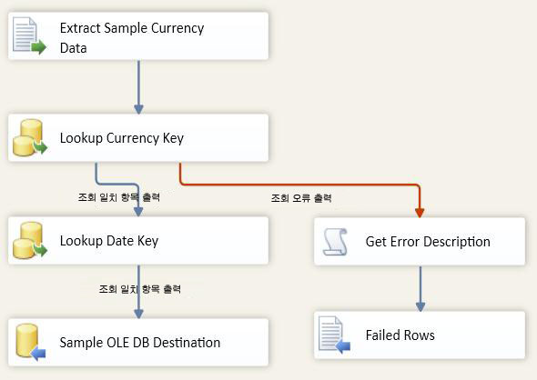

# 6-3단원 - 6단원 패키지 테스트
런타임에서 패키지는 VarFolderName 매개 변수로부터 Directory 속성 값을 가져옵니다.  
  
패키지가 런타임에 새 값으로 Directory 속성을 업데이트하도록 하려면 패키지를 실행해 보십시오. 예제 데이터 파일이 3개만 새 디렉터리에 복사되었으므로 데이터 흐름이 원래 폴더에 있는 파일 14개를 반복하지 않고 세 번만 실행됩니다.  
  
## 패키지 레이아웃 확인  
패키지를 테스트하려면 먼저 6단원 패키지의 제어 흐름과 데이터 흐름에 다음 다이어그램에 표시된 개체가 있는지 확인해야 합니다. 제어 흐름은 5단원의 제어 흐름과 동일해야 합니다. 데이터 흐름은 5단원의 데이터 흐름과 동일해야 합니다.  
  
**제어 흐름**  
  
  
  
**데이터 흐름**  
  
  
  
### 6 단원 자습서 패키지를 테스트하려면  
  
1.  디버그 메뉴에서 디버깅 시작을 클릭합니다.  
  
2.  패키지의 실행이 완료된 후에 디버그 메뉴에서 디버깅 중지를 클릭합니다.  
  
## 단원의 다음 태스크  
[4단계: 6단원 패키지 배포](../integration-services/lesson-6-4-deploying-the-lesson-6-package.md)  
  
  
  
