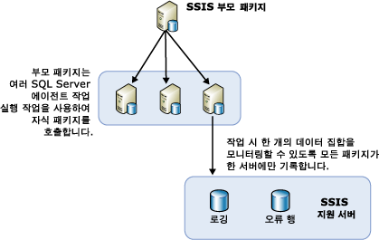

# SQL Server 에이전트를 사용하여 원격 서버의 패키지 로드 균형 조정

[!INCLUDE[ssis-appliesto](../../includes/ssis-appliesto-ssvrpluslinux-asdb-asdw-xxx.md)]

  패키지를 여러 개 실행해야 하는 경우 사용 가능한 다른 서버를 사용하는 것이 편리합니다. 모든 패키지를 한 부모 패키지에서 관리하고 다른 서버를 사용하여 패키지를 실행하는 이 방법을 로드 균형 조정이라고 합니다. [!INCLUDE[ssNoVersion](../../includes/ssnoversion-md.md)] [!INCLUDE[ssISnoversion](../../includes/ssisnoversion-md.md)]에서 로드 균형 조정은 패키지 소유자가 직접 설계해야 하며 서버에서 자동으로 수행되지 않습니다. 또한 원격 서버에서 실행되는 패키지는 다른 패키지의 개별 태스크가 아닌 전체 패키지여야 합니다.  
  
 로드 균형 조정은 다음 시나리오에서 유용합니다.  
  
-   패키지를 동시에 실행할 수 있습니다.  
  
-   패키지가 크고 순차적으로 실행할 경우 처리에 허용된 시간보다 오래 걸릴 수 있습니다.  
  
 관리자와 설계자가 처리에 추가 서버를 사용하는 것이 프로세스에 유리한지 여부를 결정할 수 있습니다.  
  
## 로드 균형 조정의 그림  
 다음 다이어그램에서는 서버의 부모 패키지를 보여 줍니다. 부모 패키지에는 여러 개의 SQL 작업 에이전트 실행 태스크가 들어 있습니다. 부모 패키지에 있는 각 태스크는 원격 서버의 SQL Server 에이전트를 호출합니다. 이러한 원격 서버에는 해당 서버의 패키지를 호출하는 단계가 포함된 SQL Server 에이전트 작업이 들어 있습니다.  
  
   
  
 이 아키텍처에서 로드 균형을 조정하는 데 필요한 단계는 새로운 개념이 아닙니다. 대신 기존 개념 및 일반 SSIS 개체를 새로운 방식으로 사용하여 로드 균형을 조정합니다.  
  
## SQL Server 에이전트를 사용하여 원격 인스턴스에서 패키지 실행  
 원격 패키지 실행을 위한 기본 아키텍처에서 중앙 패키지는 다른 원격 패키지를 제어하는 SQL Server의 인스턴스에 있습니다. 다이어그램은 이 중앙 패키지, 즉 SSIS 부모를 보여 줍니다. 이 부모 패키지가 있는 인스턴스는 자식 패키지를 실행하는 SQL Server 에이전트 작업의 실행을 제어합니다. 자식 패키지는 원격 서버에서 SQL Server 에이전트가 제어하는 고정 일정에 따라 실행되지 않습니다. 대신 자식 패키지는 부모 패키지가 호출하면 SQL Server 에이전트에 의해 시작되고 SQL Server 에이전트가 있는 SQL Server 인스턴스와 같은 인스턴스에서 실행됩니다.  
  
 SQL Server 에이전트를 사용하여 원격 패키지를 실행하려면 부모 및 자식 패키지를 구성하고 자식 패키지를 제어하는 SQL Server 에이전트 작업을 설정해야 합니다. 다음 섹션에서는 원격 서버에서 실행되는 패키지를 만들고, 구성하고, 실행하고, 유지 관리하는 방법을 설명합니다. 이 프로세스에는 여러 단계가 있습니다.  
  
-   원격 서버에서 자식 패키지 만들기 및 설치  
  
-   패키지를 실행할 원격 인스턴스에 SQL Server 에이전트 작업 만들기  
  
-   부모 패키지 만들기  
  
-   자식 패키지에 대한 로깅 시나리오 결정  
  
## 자식 패키지 구현
  [!INCLUDE[ssISnoversion](../../includes/ssisnoversion-md.md)]를 사용하여 로그 균형 조정을 구현하면 사용 가능한 CPU 또는 서버 시간을 사용할 다른 서버에 자식 패키지가 설치됩니다. 자식 패키지를 만들고 실행하려면 다음 단계를 수행하십시오.  
  
-   자식 패키지 디자인  
  
-   원격 서버로 패키지 이동  
  
-   자식 패키지를 실행하는 단계가 포함된 원격 서버에 SQL Server 에이전트 작업 만들기  
  
-   SQL Server 에이전트 작업 및 자식 패키지 테스트와 디버깅  
  
 자식 패키지를 디자인하는 경우 패키지를 디자인하는 데 제한이 없으므로 원하는 모든 기능을 제공할 수 있습니다. 그러나 패키지에서 데이터에 액세스하는 경우 해당 데이터에 액세스할 권한이 패키지를 실행하는 서버에 있어야 합니다.  
  
 자식 패키지를 실행하는 부모 패키지를 확인하려면 [!INCLUDE[ssBIDevStudioFull](../../includes/ssbidevstudiofull-md.md)] 의 솔루션 탐색기에서 패키지를 마우스 오른쪽 단추로 클릭한 다음 **진입점 패키지**를 클릭합니다.  
  
 자식 패키지가 디자인되면 원격 서버에 해당 패키지를 배포합니다.  
  
### 원격 인스턴스로 자식 패키지 이동  
 여러 가지 방법으로 패키지를 다른 서버로 이동할 수 있는데 그 중 다음 두 가지 방법이 권장됩니다.  
  
-   [!INCLUDE[ssManStudioFull](../../includes/ssmanstudiofull-md.md)]를 사용하여 패키지를 내보냅니다.  
  
-   배포할 패키지를 포함하는 프로젝트의 배포 유틸리티를 작성한 다음 패키지를 파일 시스템 또는 [!INCLUDE[ssNoVersion](../../includes/ssnoversion-md.md)]인스턴스에 설치하기 위해 패키지 설치 마법사를 실행하여 패키지를 배포합니다. 자세한 내용은 [레거시 패키지 배포&#40;SSIS&#41;](../../integration-services/packages/legacy-package-deployment-ssis.md)를 참조하세요.  
  
 사용할 원격 서버마다 배포를 반복하여 수행해야 합니다.  
  
### SQL Server 에이전트 작업 만들기  
 자식 패키지가 여러 서버에 배포되면 자식 패키지가 포함된 서버마다 SQL Server 에이전트 작업을 만듭니다. SQL Server 에이전트 작업에는 작업 에이전트 호출 시 자식 패키지를 실행하는 단계가 포함됩니다. SQL Server 에이전트 작업은 예약된 작업이 아니며 부모 패키지에서 호출 시에만 자식 패키지를 실행합니다. 부모 패키지로 다시 전달되는 작업 성공 또는 실패 알림은 자식 패키지의 성공 또는 실패나 실행 여부가 아니라 SQL Server 에이전트 작업의 성공 또는 실패와 호출 성공 여부를 반영합니다.  
  
### SQL Server 에이전트 작업 및 자식 패키지 디버깅  
 다음 방법 중 하나를 사용하여 SQL Server 에이전트 작업 및 해당 자식 패키지를 테스트할 수 있습니다.  
  
-   **디버그** / **디버깅하지 않고 시작**을 클릭하여 SSIS 디자이너에서 각 자식 패키지를 실행합니다.  
  
-   [!INCLUDE[ssManStudioFull](../../includes/ssmanstudiofull-md.md)]를 사용하여 원격 컴퓨터에서 개별 SQL Server 에이전트 작업을 실행하여 패키지가 실행되는지 확인합니다.  
  
 [!INCLUDE[ssNoVersion](../../includes/ssnoversion-md.md)] 에이전트 작업에서 실행한 패키지의 문제를 해결하는 방법은 [지원 기술 자료에서](https://support.microsoft.com/kb/918760) SQL Server 에이전트 작업 단계에서 SSIS 패키지를 호출할 때 SSIS 패키지가 실행하지 않는다 [!INCLUDE[msCoName](../../includes/msconame-md.md)] 를 참조하십시오.  
  
 SQL Server 에이전트는 프록시에 대한 하위 시스템 액세스 권한을 확인하고 작업 단계가 실행될 때마다 프록시에 대한 액세스 권한을 부여합니다.  
  
 [!INCLUDE[ssManStudioFull](../../includes/ssmanstudiofull-md.md)]에서 프록시를 만들 수 있습니다.  

## 부모 패키지 구현
  여러 서버에서 SSIS 패키지의 로드 균형을 조정할 때 자식 패키지를 만들어 배포하고 이러한 패키지를 실행하기 위한 원격 SQL Server 에이전트 작업을 만든 다음에는 부모 패키지를 만들어야 합니다. 부모 패키지에는 많은 SQL Server 에이전트 작업 실행 태스크가 포함되며 각 태스크는 자식 패키지 중 하나를 실행하는 서로 다른 SQL Server 에이전트 작업을 호출합니다. 그러면 부모 패키지의 SQL Server 에이전트 작업 실행 태스크가 다양한 SQL Server 에이전트 작업을 실행합니다. 부모 패키지의 각 태스크에는 원격 서버 연결 방법 및 해당 서버에서 실행할 작업과 같은 정보가 포함되어 있습니다. 자세한 내용은 [Execute SQL Server Agent Job Task](../../integration-services/control-flow/execute-sql-server-agent-job-task.md)을 참조하세요.  
  
 자식 패키지를 실행하는 부모 패키지를 확인하려면 [!INCLUDE[ssBIDevStudioFull](../../includes/ssbidevstudiofull-md.md)] 의 솔루션 탐색기에서 패키지를 마우스 오른쪽 단추로 클릭한 다음 **진입점 패키지**를 클릭합니다.  
  
### 하위 패키지 나열  
 [!INCLUDE[ssISnoversion](../../includes/ssisnoversion-md.md)] 서버에 상위 패키지와 하위 패키지가 들어 있는 프로젝트를 배포하는 경우, 상위 패키지에서 실행되는 하위 패키지 목록을 볼 수 있습니다. 상위 패키지를 실행할 때 상위 패키지의 **개요** 보고서가 [!INCLUDE[ssManStudioFull](../../includes/ssmanstudiofull-md.md)]에 자동으로 생성됩니다. 이 보고서에는 다음 이미지처럼 상위 패키지에 포함되는 패키지 실행 태스크에 의해 수행된 하위 패키지가 나열됩니다.  
  
   
  
 **개요** 보고서에 액세스하는 방법은 [Reports for the Integration Services Server](../../integration-services/performance/monitor-running-packages-and-other-operations.md#reports)를 참조하세요.  
  
### 부모 패키지의 선행 제약 조건  
 부모 패키지의 여러 SQL Server 에이전트 작업 실행 태스크 간에 선행 제약 조건을 만들면 이러한 선행 제약 조건은 원격 서버의 SQL Server 에이전트 작업이 시작되는 시간만 제어합니다. 선행 제약 조건은 SQL Server 에이전트 작업 단계에서 실행된 자식 패키지의 성공 또는 실패 여부 정보를 받을 수 없습니다.  
  
 즉, 부모 패키지의 SQL Server 에이전트 작업 실행이 가지는 유일한 기능은 SQL Server 에이전트 작업이 자식 패키지를 실행하도록 요청하는 것이므로 자식 패키지의 성공 또는 실패 상태가 부모에게 전파되지 않습니다. SQL Server 에이전트 작업이 성공적으로 호출되면 부모 패키지는 <xref:Microsoft.SqlServer.Dts.Runtime.DTSExecResult.Success>의 결과를 받습니다.  
  
 이 시나리오에서 실패는 원격 SQL Server 에이전트 작업 태스크 호출에만 실패했음을 의미합니다. 원격 서버가 다운되어 에이전트가 응답하지 않는 경우에 이러한 상황이 발생할 수 있습니다. 부모 패키지는 에이전트가 시작된 이상 태스크를 완료합니다.  
  
> [!NOTE]  
>  Transact-SQL 문인 **sp_start_job N'package_name'** 을 포함하는 SQL 실행 태스크를 사용할 수 있습니다. 자세한 내용은 [sp_start_job&#40;Transact-SQL&#41;](../../relational-databases/system-stored-procedures/sp-start-job-transact-sql.md)을 참조하세요.  
  
### 디버깅 환경  
 부모 패키지를 테스트할 때는 디버그/디버깅 시작(F5)을 사용하여 디자이너의 디버깅 환경을 실행한 다음 사용합니다. 또는 명령 프롬프트 유틸리티인 **dtexec**를 사용할 수 있습니다. 자세한 내용은 [dtexec Utility](../../integration-services/packages/dtexec-utility.md)를 참조하세요.  

## 원격 서버의 로드 균형 조정된 패키지 로깅
  모든 자식 패키지가 동일한 로그 공급자를 사용하고 동일한 대상에 쓰는 경우 관리자가 보다 쉽게 여러 서버에서 실행되는 모든 자식 패키지에 대한 로그를 관리할 수 있습니다. 모든 자식 패키지에 공통된 로그 파일을 만드는 한 가지 방법은 SQL Server 로그 공급자에 이벤트를 기록하도록 자식 패키지를 구성하는 것입니다. 모든 패키지가 동일한 데이터베이스, 동일한 서버 및 서버의 동일한 인스턴스를 사용하도록 구성할 수 있습니다.  
  
 관리자는 단일 서버에 로그온하여 모든 자식 패키지에 대한 로그 파일을 볼 수 있습니다.  
  
 패키지에서 로깅을 사용하도록 설정하는 방법에 대한 자세한 내용은 [Integration Services(SSIS) 로깅](../../integration-services/performance/integration-services-ssis-logging.md)을 참조하세요.  

## 관련 작업  
 [패키지에 대한 SQL Server 에이전트 작업](../../integration-services/packages/sql-server-agent-jobs-for-packages.md)  
  
  
