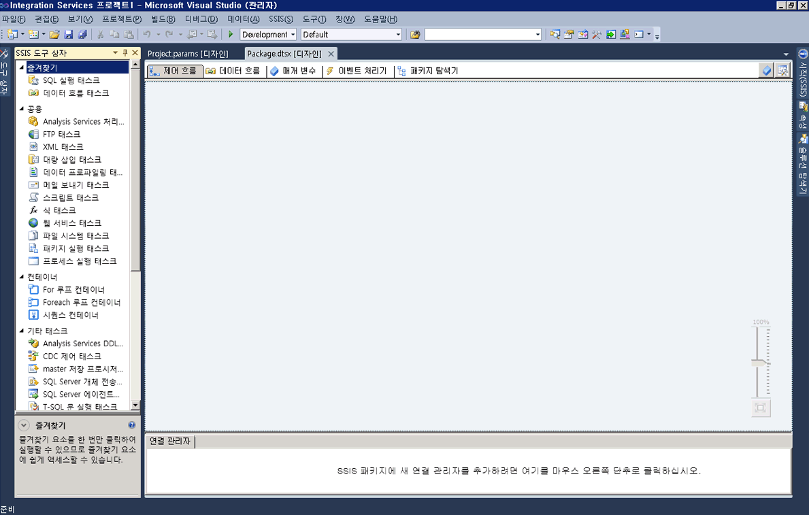

# SSIS 디자이너
  [!INCLUDE[ssIS](../includes/ssis-md.md)] 디자이너는 [!INCLUDE[ssISnoversion](../includes/ssisnoversion-md.md)] 패키지를 만들고 유지 관리하는 데 사용할 수 있는 그래픽 도구입니다. [!INCLUDE[ssIS](../includes/ssis-md.md)] 디자이너는 [!INCLUDE[ssBIDevStudioFull](../includes/ssbidevstudiofull-md.md)] 프로젝트의 일부로 [!INCLUDE[ssISnoversion](../includes/ssisnoversion-md.md)] 에서 사용할 수 있습니다.  
  
 [!INCLUDE[ssIS](../includes/ssis-md.md)] 디자이너를 사용하여 다음 태스크를 수행할 수 있습니다.  
  
-   패키지의 제어 흐름 구성  
  
-   패키지의 데이터 흐름 구성  
  
-   패키지 및 패키지 개체에 이벤트 처리기 추가  
  
-   패키지 내용 보기  
  
-   런타임에 패키지의 실행 진행률 보기  
  
 다음 다이어그램은 [!INCLUDE[ssIS](../includes/ssis-md.md)] 디자이너와 **도구 상자** 창을 보여 줍니다.  
  
   
  
 [!INCLUDE[ssISnoversion](../includes/ssisnoversion-md.md)] 에는 패키지에 대한 추가 기능을 제공하는 추가 대화 상자 및 창이 있으며, [!INCLUDE[ssBIDevStudioFull](../includes/ssbidevstudiofull-md.md)] 에는 개발 환경 구성 및 패키지 사용을 위한 창 및 대화 상자가 제공됩니다. 자세한 내용은 [Integration Services 사용자 인터페이스](../integration-services/integration-services-user-interface.md)를 참조하세요.  
  
 [!INCLUDE[ssIS](../includes/ssis-md.md)] 디자이너는 패키지를 관리 및 모니터링하는 [!INCLUDE[ssISnoversion](../includes/ssisnoversion-md.md)] 서비스에 종속되지 않으며 서비스가 실행 중이 아니어도 [!INCLUDE[ssIS](../includes/ssis-md.md)] 디자이너에서 패키지를 만들거나 수정할 수 있습니다. 하지만 [!INCLUDE[ssIS](../includes/ssis-md.md)] 디자이너가 열려 있는 상태에서 서비스를 중지하면 [!INCLUDE[ssIS](../includes/ssis-md.md)] 디자이너에서 제공하는 대화 상자를 열 수 없으며 "RPC 서버를 사용할 수 없습니다"와 같은 오류 메시지가 표시될 수 있습니다. [!INCLUDE[ssIS](../includes/ssis-md.md)] 디자이너를 다시 설정하고 패키지로 계속 작업하려면 디자이너를 닫고 [!INCLUDE[ssBIDevStudioFull](../includes/ssbidevstudiofull-md.md)]를 종료한 다음 [!INCLUDE[ssBIDevStudioFull](../includes/ssbidevstudiofull-md.md)], [!INCLUDE[ssISnoversion](../includes/ssisnoversion-md.md)] 프로젝트 및 패키지를 다시 열어야 합니다.  
  
## 실행 취소 및 다시 실행  
 [!INCLUDE[ssIS](../includes/ssis-md.md)] Designer에서는 최대 20개의 동작을 실행 취소하고 다시 실행할 수 있습니다. 패키지의 경우 **제어 흐름**, **데이터 흐름**, **이벤트 처리기**및 **매개 변수** 탭과 **변수** 창에서 실행 취소/다시 실행을 사용할 수 있습니다. 프로젝트의 경우 **프로젝트 매개 변수** 창에서 실행 취소/다시 실행을 사용할 수 있습니다.  
  
 새 **SSIS 도구 상자**의 변경 내용은 실행 취소/다시 실행할 수 없습니다.  
  
 구성 요소 편집기를 사용하여 구성 요소를 변경할 때는 개별적으로 변경을 실행 취소하고 다시 실행하는 대신 집합으로 변경을 실행 취소하고 다시 실행합니다. 변경 집합은 실행 취소와 다시 실행 드롭다운 목록에서 단일 동작으로 나타납니다.  
  
 동작을 실행 취소하려면 실행 취소 도구 모음 단추를 클릭하거나 **편집/실행 취소** 메뉴 항목을 선택하거나 Ctrl+Z를 누릅니다. 동작을 다시 실행하려면 다시 실행 도구 모음 단추를 클릭하거나 **편집/다시 실행** 메뉴 항목을 선택하거나 CTRL + Y를 누릅니다. 도구 모음 단추 옆의 화살표를 클릭하고 드롭다운 목록에서 여러 동작을 강조 표시한 다음 목록에서 클릭하여 여러 동작을 실행 취소하고 다시 실행할 수 있습니다.  
  
## SSIS 디자이너의 구성 요소  
 [!INCLUDE[ssIS](../includes/ssis-md.md)] 디자이너에는 각각 패키지 제어 흐름, 데이터 흐름, 매개 변수 및 이벤트 처리기 구축을 위한 4개의 탭과 패키지 내용을 보기 위한 1개의 탭 등 총 5개의 영구적인 탭이 있습니다. 런타임에는 실행 중인 패키지의 실행 과정과 실행 후의 결과를 보여 주는 6번째 탭이 나타납니다.  
  
 또한 [!INCLUDE[ssIS](../includes/ssis-md.md)] 디자이너에는 패키지가 데이터에 연결하기 위해 사용하는 연결 관리자를 추가 및 구성하기 위한 연결 관리자 영역이 있습니다.  
  
### 제어 흐름 탭  
 **제어 흐름** 탭의 디자인 화면에서 패키지의 제어 흐름을 구성합니다. **도구 상자** 에서 디자인 화면으로 항목을 끌어다 놓고 항목 아이콘을 클릭한 후 한 항목에서 다른 항목으로 화살표를 끌어서 항목을 제어 흐름으로 연결합니다.  
  
 자세한 내용은 [Control Flow](../integration-services/control-flow/control-flow.md)을 참조하세요.  
  
### 데이터 흐름 탭  
 패키지에 데이터 흐름 태스크가 포함된 경우 패키지에 데이터 흐름을 추가할 수 있습니다. **데이터 흐름** 탭의 디자인 화면에서 패키지의 데이터 흐름을 구성합니다. **도구 상자** 에서 디자인 화면으로 항목을 끌어 놓고 항목 아이콘을 클릭한 후 한 항목에서 다른 항목으로 화살표를 끌어서 항목을 데이터 흐름으로 연결합니다.  
  
 자세한 내용은 [Data Flow](../integration-services/data-flow/data-flow.md)을(를) 참조하세요.  
  
### 매개 변수 탭  
 Integration Services(SSIS) 매개 변수를 사용하여 패키지 실행 시 패키지 내의 속성에 값을 할당할 수 있습니다. 프로젝트 수준에서 프로젝트 매개 변수를 만들고 패키지 수준에서 패키지 매개 변수를 만들 수 있습니다. 프로젝트 매개 변수는 프로젝트가 수신하는 외부 입력을 프로젝트 내 하나 이상의 패키지에 제공하기 위해 사용됩니다. 패키지 매개 변수를 사용하면 패키지를 편집하여 다시 배포할 필요 없이 패키지 실행을 수정할 수 있습니다. 이 탭에서 패키지 매개 변수를 관리할 수 있습니다.  
  
 매개 변수에 대한 자세한 내용은 [SSIS(Integration Services) 매개 변수](integration-services-ssis-package-and-project-parameters.md)를 참조하세요.  
  
> **중요!!**  매개 변수는 프로젝트 배포 모델을 위해 배포된 프로젝트에만 사용할 수 있습니다. 따라서 프로젝트 배포 모델을 사용하도록 구성된 프로젝트에 속한 패키지에 대해서만 매개 변수 탭이 표시됩니다.  
  
### 이벤트 처리기 탭  
 **이벤트 처리기** 탭의 디자인 화면에서 패키지의 이벤트를 구성합니다. **이벤트 처리기** 탭에서 이벤트 처리기를 만들려는 패키지 또는 패키지 개체를 선택한 다음 이벤트 처리기와 연결할 이벤트를 선택합니다. 이벤트 처리기에는 제어 흐름과 선택적 데이터 흐름이 있습니다.  
  
 자세한 내용은 [Add an Event Handler to a Package](http://msdn.microsoft.com/library/5e56885d-8658-480a-bed9-3f2f8003fd78)을(를) 참조하세요.  
  
### 패키지 탐색기 탭  
 패키지는 여러 태스크, 연결 관리자, 변수 및 기타 요소가 포함되어 복잡할 수 있습니다. 패키지를 탐색기로 보면 전체 패키지 요소 목록을 확인할 수 있습니다.  
  
 자세한 내용은 [패키지 개체 보기](../integration-services/view-package-objects.md)를 참조하세요.  
  
### 진행률/실행 결과 탭  
 패키지가 실행 중인 동안 **진행률** 탭에는 패키지의 실행 진행률이 표시됩니다. 패키지 실행이 종료되면 **실행 결과** 탭에서 실행 결과를 확인할 수 있습니다.  
  
> **참고:** **진행률** 탭에 메시지를 표시할지 여부는 **SSIS** 메뉴의 **디버그 진행률 보고** 옵션을 선택 또는 선택 취소하여 설정합니다.  
  
#### 연결 관리자 영역  
 **연결 관리자** 영역에서는 패키지에서 사용되는 연결 관리자를 추가하고 수정합니다. [!INCLUDE[ssISnoversion](../includes/ssisnoversion-md.md)] 에는 텍스트 파일, OLE DB 데이터베이스 및 .NET 공급자와 같은 다양한 데이터 원본에 연결하기 위한 연결 관리자가 포함됩니다.  
  
 자세한 내용은 [Integration Services&#40;SSIS&#41; 연결](../integration-services/connection-manager/integration-services-ssis-connections.md) 및 [연결 관리자 만들기](http://msdn.microsoft.com/library/6ca317b8-0061-4d9d-b830-ee8c21268345)를 참조하세요.  
 
## 제어 흐름 탭
**디자이너의** 제어 흐름 [!INCLUDE[ssIS](../includes/ssis-md.md)] 탭을 사용하여 [!INCLUDE[ssISnoversion](../includes/ssisnoversion-md.md)] 패키지에 제어 흐름을 작성할 수 있습니다.  
  
 [!INCLUDE[ssIS](../includes/ssis-md.md)] 태스크 및 컨테이너를 나타내는 그래픽 개체를 **도구 상자** 에서 **제어 흐름** 탭의 디자인 화면으로 끌고 개체의 연결선을 다른 개체로 끌어 개체를 연결하는 방법으로 제어 흐름을 만듭니다. 각 연결선은 태스크 및 컨테이너가 실행되는 순서를 지정하는 선행 제약 조건을 나타냅니다.  
  
 또한 [!INCLUDE[ssIS](../includes/ssis-md.md)] 디자이너를 사용하여 **제어 흐름** 탭에서 다음 기능을 추가할 수 있습니다.  
  
-   로깅 구현  
  
-   패키지 구성 만들기  
  
-   인증서로 패키지 서명  
  
-   변수 관리  
  
-   주석 추가  
  
-   중단점 구성  
  
 이러한 기능을 [!INCLUDE[ssIS](../includes/ssis-md.md)] 디자이너의 개별 태스크 또는 컨테이너에 추가하려면 디자인 화면에서 개체를 마우스 오른쪽 단추로 클릭한 다음 해당 옵션을 선택합니다.  
 
## 데이터 흐름 탭
**디자이너의** 데이터 흐름 [!INCLUDE[ssIS](../includes/ssis-md.md)] 탭을 사용하여 [!INCLUDE[ssISnoversion](../includes/ssisnoversion-md.md)] 패키지에 데이터 흐름을 만들 수 있습니다.  
  
 원본, 변환 및 대상을 나타내는 그래픽 개체를 **도구 상자** 에서 **데이터 흐름** 탭의 디자인 화면으로 끌고 변환이 실행되는 순서를 결정하는 경로를 만들기 위해 이러한 개체를 연결하는 방법으로 데이터 흐름을 만듭니다.  
  
 경로를 마우스 오른쪽 단추로 클릭한 다음 **데이터 뷰어** 를 클릭하여 각 데이터 흐름 개체의 앞뒤에 있는 데이터를 보기 위한 데이터 뷰어를 추가합니다.  
  
 [!INCLUDE[ssIS](../includes/ssis-md.md)] 디자이너를 사용하여 **데이터 흐름** 탭에서 다음 기능을 추가할 수도 있습니다.  
  
-   변수 관리  
  
-   주석 추가  
  
 [!INCLUDE[ssIS](../includes/ssis-md.md)] 디자이너에서 이러한 기능을 추가하려면 디자인 화면을 마우스 오른쪽 단추로 클릭한 다음 원하는 옵션을 선택합니다.  
 
## 이벤트 처리기 탭
  **디자이너의** 이벤트 처리기 [!INCLUDE[ssIS](../includes/ssis-md.md)] 탭을 사용하여 [!INCLUDE[ssISnoversion](../includes/ssisnoversion-md.md)] 패키지에 제어 흐름을 작성할 수 있습니다. 이벤트 처리기는 패키지 또는 패키지의 태스크나 컨테이너에 의해 발생한 이벤트에 대한 응답으로 실행됩니다.  
  
## 옵션  
 **실행 파일**  
 이벤트 처리기를 작성할 실행 파일을 선택합니다. 실행 파일은 패키지 또는 패키지의 태스크나 컨테이너가 될 수 있습니다.  
  
 **이벤트 처리기**  
 이벤트 처리기의 유형을 선택합니다. **도구 상자**에서 항목을 끌어 이벤트 처리기를 만듭니다.  
  
 **Delete**  
 이벤트 처리기를 선택하고 **삭제**를 클릭하여 해당 처리기를 패키지에서 제거합니다.  
  
 **실행 파일 \<실행 파일 이름\>**에 대한 \<이벤트 처리기 이름\> 을 만들려면 여기를 클릭하십시오.  
 이벤트 처리기를 만들려면 클릭합니다.  
  
 [!INCLUDE[ssIS](../includes/ssis-md.md)] 태스크 및 컨테이너를 나타내는 그래픽 개체를 **도구 상자** 에서 **이벤트 처리기** 탭의 디자인 화면으로 끌어 온 다음 이러한 태스크 및 컨테이너가 실행되는 순서를 정의하는 선행 제약 조건으로 이러한 개체를 연결하여 제어 흐름을 만듭니다.  
  
 또한 주석을 추가하려면 디자인 화면을 마우스 오른쪽 단추로 클릭한 다음 메뉴에서 **주석 추가**를 클릭합니다.  
 
## 패키지 탐색기 탭
**디자이너의** 패키지 탐색기 [!INCLUDE[ssIS](../includes/ssis-md.md)] 탭을 사용하여 패키지에 있는 구성, 연결, 이벤트 처리기, 태스크 및 컨테이너와 같은 실행 개체, 로그 공급자, 선행 제약 조건, 변수와 같은 요소를 모두 계층적으로 볼 수 있습니다. 패키지에 데이터 흐름 태스크가 있는 경우 **패키지 탐색기** 탭에는 데이터 흐름 구성 요소의 계층 뷰를 포함하는 노드가 포함됩니다.  
  
 패키지 요소를 마우스 오른쪽 단추로 클릭한 다음 **속성** 을 클릭하여 **속성** 창에 요소의 속성을 표시하거나 **삭제** 를 클릭하여 요소를 삭제합니다. 
 
## 진행률 탭
**디자이너의** 진행률 [!INCLUDE[ssIS](../includes/ssis-md.md)] 탭을 사용하여 [!INCLUDE[ssISnoversion](../includes/ssisnoversion-md.md)] 에서 패키지를 실행하는 경우 [!INCLUDE[ssBIDevStudioFull](../includes/ssbidevstudiofull-md.md)]패키지의 실행 진행률을 볼 수 있습니다. **진행률** 탭에는 패키지와 패키지 실행 파일의 유효성 검사와 실행에 대한 시작/완료/경과 시간, 패키지에 대한 정보나 경고, 진행률 알림, 패키지의 성공 여부, 패키지 실행 중 생성된 모든 오류 메시지가 나열됩니다.  
  
 **진행률** 탭에 메시지를 표시할지 여부는 **SSIS** 메뉴의 **디버그 진행률 보고** 옵션을 선택 또는 선택 취소하여 설정합니다. 진행률 보고를 사용하지 않으면 [!INCLUDE[ssBIDevStudio](../includes/ssbidevstudio-md.md)]에서 복잡한 패키지를 실행하는 동안 성능을 높일 수 있습니다.  
  
 패키지 실행이 중지되면 **진행률** 탭은 **실행 결과** 탭이 됩니다.  
 
## 연결 관리자 영역
패키지는 연결 관리자를 사용하여 파일, 관계형 데이터베이스 및 서버와 같은 데이터 원본에 연결합니다.  
  
 **디자이너의** 연결 관리자 [!INCLUDE[ssIS](../includes/ssis-md.md)] 영역을 사용하여 연결 관리자에 대한 추가, 삭제, 수정, 이름 바꾸기, 복사하여 붙여넣기 작업을 수행할 수 있습니다.  
  
 이 영역을 마우스 오른쪽 단추로 클릭한 다음 메뉴에서 수행하려는 태스크에 대한 옵션을 클릭합니다.
 
## 관련 태스크  
  
-   [SQL Server Data Tools에서 패키지 만들기](../integration-services/create-packages-in-sql-server-data-tools.md)  
  
## 관련 항목:  
 [Integration Services 사용자 인터페이스](../integration-services/integration-services-user-interface.md)  
  
  

