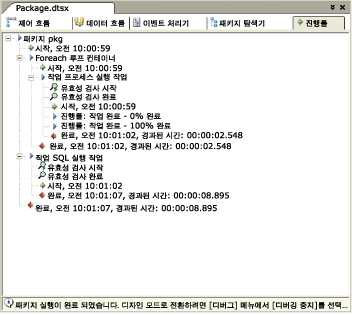

# 제어 흐름 디버깅
  [!INCLUDE[ssBIDevStudioFull](../../includes/ssbidevstudiofull-md.md)] 및 [!INCLUDE[msCoName](../../includes/msconame-md.md)] [!INCLUDE[ssISnoversion](../../includes/ssisnoversion-md.md)] include features 및 tools that you can use to troubleshoot the control flow in an [!INCLUDE[ssISnoversion](../../includes/ssisnoversion-md.md)] 패키지에서 제어 흐름 문제를 해결하는 데 사용할 수 있는 기능과 도구가 포함됩니다.  
  
-   [!INCLUDE[ssISnoversion](../../includes/ssisnoversion-md.md)] 는 컨테이너 및 태스크에서의 중단점을 지원합니다.  
  
-   [!INCLUDE[ssIS](../../includes/ssis-md.md)] 디자이너는 런타임에 진행률을 보고합니다.  
  
-   [!INCLUDE[ssBIDevStudioFull](../../includes/ssbidevstudiofull-md.md)] 는 디버그 창을 제공합니다.  
  
## 중단점  
 [!INCLUDE[ssIS](../../includes/ssis-md.md)] 디자이너는 중단 조건을 설정하고 패키지 실행이 일시 중지되기 전에 중단점이 발생할 수 있는 횟수를 지정하여 중단점을 설정할 수 있는 **중단점 설정** 대화 상자를 제공합니다. 중단점은 패키지 수준이나 개별 구성 요소의 수준에서 설정될 수 있습니다. 중단 조건이 태스크 또는 컨테이너 수준에서 설정된 경우 중단점 아이콘이 **제어 흐름** 탭의 디자인 화면에 있는 태스크 또는 컨테이너 옆에 표시됩니다. 중단 조건이 패키지에서 설정된 경우 중단점 아이콘이 **제어 흐름** 탭의 레이블에 표시됩니다.  
  
 중단점에 도달하면 중단점 아이콘이 변경되어 중단점의 원본을 확인할 수 있습니다. 패키지가 실행 중일 때 중단점을 추가, 삭제 및 변경할 수 있습니다.  
  
 [!INCLUDE[ssISnoversion](../../includes/ssisnoversion-md.md)] 는 모든 태스크 및 컨테이너에 설정할 수 있는 10개의 중단 조건을 제공합니다. **중단점 설정** 대화 상자에서 다음 조건에 따라 중단점을 설정할 수 있습니다.  
  
|중단 조건|설명|  
|---------------------|-----------------|  
|태스크나 컨테이너가 **OnPreExecute** 이벤트를 받을 때|태스크가 실행되려는 순간에 호출됩니다. 이 이벤트는 작업이 실행되기 바로 전에 태스크나 컨테이너에 의해 발생합니다.|  
|태스크나 컨테이너가 **OnPostExecute** 이벤트를 받을 때|태스크의 실행 논리가 완료되자 마자 호출됩니다. 이 이벤트는 작업이 실행된 바로 후에 태스크나 컨테이너에 의해 발생합니다.|  
|태스크나 컨테이너가 **OnError** 이벤트를 받을 때|오류가 발생할 때 태스크 또는 컨테이너에 의해 호출됩니다.|  
|태스크나 컨테이너가 **OnWarning** 이벤트를 받을 때|태스크로 인해 오류가 발생되지는 않지만 경고가 발생할 가능성이 매우 높은 경우에 호출됩니다.|  
|태스크나 컨테이너가 **OnInformation** 이벤트를 받을 때|태스크가 정보를 제공해야 하는 경우에 호출됩니다.|  
|태스크나 컨테이너가 **OnTaskFailed** 이벤트를 받을 때|태스크 호스트가 실패할 때 해당 태스크 호스트에 의해 호출됩니다.|  
|태스크나 컨테이너가 **OnProgress** 이벤트를 받을 때|태스크 실행에 대한 진행률을 업데이트하기 위해 호출됩니다.|  
|태스크나 컨테이너가 **OnQueryCancel** 이벤트를 받을 때|태스크 처리 중 실행을 취소할 수 있는 모든 시점에 호출됩니다.|  
|태스크나 컨테이너가 **OnVariableValueChanged** 이벤트를 받을 때|변수 값이 변경될 때 [!INCLUDE[ssISnoversion](../../includes/ssisnoversion-md.md)] 런타임 시 호출됩니다. 이 이벤트가 발생하려면 변수의 RaiseChangeEvent를 **true** 로 설정해야 합니다.   **&#42;&#42;경고&#42;&#42;** 이 중단점과 연결된 변수는 **컨테이너** 범위에서 정의되어야 합니다. 변수가 패키지 범주로 정의된 경우 중단점이 적중되지 않습니다.|  
|태스크나 컨테이너가 **OnCustomEvent** 이벤트를 받을 때|사용자 지정 태스크 정의 이벤트를 발생시키기 위해 태스크에 의해 호출됩니다.|  
  
 모든 태스크 및 컨테이너에 대해 사용할 수 있는 중단 조건 외에도 일부 태스크 및 컨테이너에는 중단점 설정을 위한 특수한 중단 조건이 포함됩니다. 예를 들어 For 루프 컨테이너에 중단 조건을 설정하여 반복되는 각 루프가 시작될 때 실행을 일시 중지하도록 중단점을 설정할 수 있습니다.  
  
 중단점의 유연성과 기능 향상을 위해 다음 옵션을 지정하여 중단점의 동작을 수정할 수 있습니다.  
  
-   실행이 일시 중지되기 전에 중단 조건이 발생하는 최대 횟수 또는 적중 횟수  
  
-   중단 조건이 중단점을 트리거하는 시점을 지정하는 규칙 또는 적중 횟수 유형  
  
 항상 유형을 제외한 적중 횟수 유형은 적중 횟수로 한정됩니다. 예를 들어 유형이 "다음과 같은 적중 횟수"이고 적중 횟수가 5이면 6번째 중단 조건 발생 시 실행이 일시 중지됩니다.  
  
 다음 표에서는 적중 횟수 유형에 대해 설명합니다.  
  
|적중 횟수 유형|설명|  
|--------------------|-----------------|  
|항상|중단점에 도달하면 실행이 항상 일시 중지됩니다.|  
|다음과 같은 적중 횟수|중단점이 발생한 횟수가 적중 횟수와 같으면 실행이 일시 중지됩니다.|  
|다음보다 크거나 같은 적중 횟수|중단점이 발생한 횟수가 적중 횟수보다 크거나 같으면 실행이 일시 중지됩니다.|  
|다음 배수의 적중 횟수|적중 횟수의 배수가 되면 실행이 일시 중지됩니다. 예를 들어 이 옵션을 5로 설정하면 5번째 중단점마다 실행이 일시 중지됩니다.|  
  
#### 중단점을 설정하려면  
  
-   [태스크 또는 컨테이너에 중단점을 설정하여 패키지 디버깅](#debug)  
  
## 진행률 보고  
 [!INCLUDE[ssIS](../../includes/ssis-md.md)] 디자이너에는 **제어 흐름** 탭의 디자인 화면상의 색 구분 기능과 **진행률** 탭에 표시되는 진행률 메시지의 두 가지 진행률 보고 유형이 있습니다.  
  
 패키지를 실행할 때 [!INCLUDE[ssIS](../../includes/ssis-md.md)] 디자이너는 실행 상태를 나타내는 색을 사용하여 각 태스크나 컨테이너를 표시하여 실행 진행 상태를 보여 줍니다. 색을 보면 요소가 실행 대기 중인지, 현재 실행 중인지, 성공적으로 완료되었는지 또는 오류가 발생하여 종료되었는지를 구분할 수 있습니다. 패키지 실행을 중지한 다음에는 색 구분이 사라집니다.  
  
 다음 표에서는 실행 상태를 보여 주는 데 사용되는 색에 대해 설명합니다.  
  
|색|실행 상태|  
|-----------|----------------------|  
|회색|실행 대기 중|  
|노란색|실행 중|  
|녹색|성공적으로 실행됨|  
|강조 표시됨|실행 중 오류 발생|  
  
 **진행률** 탭에는 실행 순서별로 태스크와 컨테이너가 나열되며 시작 및 종료 횟수, 경고 및 오류 메시지가 포함됩니다. 패키지 실행을 중지한 후에도 진행률 정보는 **실행 결과** 탭에 활성화된 상태로 유지됩니다.  
  
> [!NOTE]  
>  **진행률** 탭에 메시지를 표시할지 여부는 **SSIS** 메뉴의 **디버그 진행률 보고** 옵션을 선택 또는 선택 취소하여 설정합니다.  
  
 다음 다이어그램에서는 **진행률** 탭을 보여 줍니다.  
  
   
  
## 디버그 창  
 [!INCLUDE[ssBIDevStudioFull](../../includes/ssbidevstudiofull-md.md)] 에는 중단점을 사용하고, 중단점이 포함된 패키지를 디버깅하는 데 사용할 수 있는 여러 창이 포함됩니다. 각 창에 대한 자세한 내용을 알아보려면 F1을 눌러서 해당 창에 대한 도움말을 표시하십시오.  
  
 [!INCLUDE[ssBIDevStudioFull](../../includes/ssbidevstudiofull-md.md)]에서 이러한 창을 열려면 **디버그** 메뉴를 클릭하고 **창**을 가리킨 다음 **중단점**, **출력**또는 **직접 실행**을 클릭합니다.  
  
 다음 표에서는 이러한 창에 대해 설명합니다.  
  
|창|설명|  
|------------|-----------------|  
|중단점|패키지에 있는 중단점을 나열하고 중단점을 설정 및 해제할 수 있는 옵션을 제공합니다.|  
|출력|[!INCLUDE[ssBIDevStudioFull](../../includes/ssbidevstudiofull-md.md)]의 기능에 대한 상태 메시지를 표시합니다.|  
|직접 실행|식을 디버깅 및 계산하고 변수 값을 출력하는 데 사용됩니다.|  

##  태스크 또는 컨테이너에 중단점을 설정하여 패키지 디버깅
  이 절차에서는 패키지, 태스크, For 루프 컨테이너, Foreach 루프 컨테이너 또는 시퀀스 컨테이너에 중단점을 설정하는 방법을 설명합니다.  
  
### 패키지, 태스크 또는 컨테이너에 중단점을 설정하려면  
  
1.  [!INCLUDE[ssBIDevStudioFull](../../includes/ssbidevstudiofull-md.md)]에서 원하는 패키지가 들어 있는 [!INCLUDE[ssISnoversion](../../includes/ssisnoversion-md.md)] 프로젝트를 엽니다.  
  
2.  중단점을 설정할 패키지를 두 번 클릭합니다.  
  
3.  SSIS 디자이너에서 다음을 수행합니다.  
  
    -   패키지 개체에 중단점을 설정하려면 **제어 흐름** 탭을 클릭하고 디자인 화면에 아무 곳에 커서를 놓고 마우스 오른쪽 단추를 클릭한 다음 **중단점 편집**을 클릭합니다.  
  
    -   패키지 제어 흐름에 중단점을 설정하려면 **제어 흐름** 탭을 클릭하고 태스크, For 루프 컨테이너, Foreach 루프 컨테이너 또는 시퀀스 컨테이너를 마우스 오른쪽 단추로 클릭한 다음 **중단점 편집**을 클릭합니다.  
  
    -   이벤트 처리기에 중단점을 설정하려면 **이벤트 처리기** 탭을 클릭하고 태스크, For 루프 컨테이너, Foreach 루프 컨테이너 또는 시퀀스 컨테이너를 마우스 오른쪽 단추로 클릭한 다음 **중단점 편집**을 클릭합니다.  
  
4.  **중단점 설정 \<컨테이너 이름>** 대화 상자에서 활성화할 중단점을 선택합니다.  
  
5.  필요에 따라 각 중단점의 적중 횟수 형식 및 적중 횟수를 수정합니다.  
  
6.  패키지를 저장하려면 **파일** 메뉴에서 **선택한 항목 저장** 을 클릭합니다.  

## 중단점 설정
  **중단점 설정** 대화 상자를 사용하여 중단점을 설정할 이벤트를 지정하고 중단점의 동작을 제어할 수 있습니다.  
  
### 옵션  
 **Enabled**  
 이벤트에 중단점을 설정하려면 선택합니다.  
  
 **중단 조건**  
 중단점을 설정할 사용 가능한 이벤트 목록을 봅니다.  
  
 **적중 횟수 형식**  
 중단점이 적용되는 시기를 지정합니다.  
  
|값|설명|  
|-----------|-----------------|  
|**항상**|중단점에 도달하면 실행이 항상 일시 중지됩니다.|  
|**다음과 같은 적중 횟수**|중단점이 발생한 횟수가 적중 횟수와 같으면 실행이 일시 중지됩니다.|  
|**다음보다 크거나 같은 적중 횟수**|중단점이 발생한 횟수가 적중 횟수보다 크거나 같으면 실행이 일시 중지됩니다.|  
|**다음 배수의 적중 횟수**|적중 횟수의 배수가 되면 실행이 일시 중지됩니다. 예를 들어 이 옵션을 5로 설정하면 5번째 중단점마다 실행이 일시 중지됩니다.|  
  
 **적중 횟수**  
 중단을 트리거하는 적중 횟수를 지정합니다. 이 옵션은 중단점을 항상 적용하는 경우에는 사용할 수 없습니다.  
  
## 참고 항목  
 [패키지 배포 문제 해결 도구](../../integration-services/troubleshooting/troubleshooting-tools-for-package-development.md)  
 [스크립트 태스크 및 스크립트 구성 요소에서 중단점을 설정하여 스크립트 디버깅](../../integration-services/extending-packages-scripting/debug-a-script-by-setting-breakpoints-in-a-script-task-and-script-component.md)   
