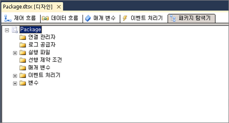

# 패키지 개체 보기
  [!INCLUDE[ssIS](../includes/ssis-md.md)] 디자이너에서 **패키지 탐색기** 탭은 패키지에 대한 탐색기 뷰를 제공합니다. 이 뷰에는 [!INCLUDE[ssISnoversion](../includes/ssisnoversion-md.md)] 아키텍처의 컨테이너 계층이 표시됩니다. 패키지 컨테이너는 최상위 계층에 있으며, 패키지를 확장하면 패키지에 있는 연결, 실행 개체, 이벤트 처리기, 로그 공급자, 선행 제약 조건 및 변수를 볼 수 있습니다.  
  
 패키지의 컨테이너 및 태스크인 실행 개체에는 이벤트 처리기, 선행 제약 조건 및 변수가 포함될 수 있습니다. [!INCLUDE[ssISnoversion](../includes/ssisnoversion-md.md)] 는 컨테이너가 중첩된 계층을 지원하며, For 루프, Foreach 루프 및 시퀀스 컨테이너에는 다른 실행 개체가 포함될 수 있습니다  
  
 패키지에 데이터 흐름이 포함된 경우 **패키지 탐색기** 에는 데이터 흐름 태스크가 나열되며 데이터 흐름 구성 요소가 나열된 **구성 요소** 폴더가 포함됩니다.  
  
 **패키지 탐색기** 탭에서는 패키지의 개체를 삭제하고 **속성** 창을 사용하여 개체 속성을 볼 수 있습니다.  
  
 다음 다이어그램에서는 예제 패키지의 트리 뷰를 보여 줍니다.  
  
   
  
## 패키지 구조 및 내용 보기  
  
1.  [!INCLUDE[ssBIDevStudioFull](../includes/ssbidevstudiofull-md.md)]에서 [!INCLUDE[ssISnoversion](../includes/ssisnoversion-md.md)] 패키지 탐색기 **에서 보려는 패키지가 들어 있는**프로젝트를 엽니다.  
  
2.  **패키지 탐색기** 탭을 클릭합니다.  
  
3.  **변수**, **선행 제약 조건**, **이벤트 처리기**, **연결 관리자**, **로그 공급자**또는 **실행 파일** 폴더의 내용을 보려면 각 폴더를 확장합니다.  
  
4.  패키지 구조에 따라 다음 수준의 폴더를 확장합니다.  
  
## 패키지 개체의 속성 보기
  
-   개체를 마우스 오른쪽 단추로 클릭한 다음 **속성** 을 클릭하여 **속성** 창을 엽니다.  
  
## 패키지의 개체를 삭제 합니다.  
  
-   개체를 마우스 오른쪽 단추로 클릭한 다음 **삭제**를 클릭합니다. 
 
## 관련 항목:  
 [Integration Services 태스크](../integration-services/control-flow/integration-services-tasks.md)   
 [Integration Services 컨테이너](../integration-services/control-flow/integration-services-containers.md)   
 [선행 제약 조건](../integration-services/control-flow/precedence-constraints.md)   
 [Integration Services&#40;SSIS&#41; 변수](../integration-services/integration-services-ssis-variables.md)   
 [Integration Services &#40; Ssis&#41; 이벤트 처리기](../integration-services/integration-services-ssis-event-handlers.md)   
 [Integration Services &#40; Ssis&#41; 로깅](../integration-services/performance/integration-services-ssis-logging.md)  
  
  
