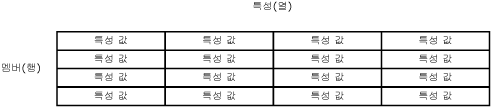

# 특성(Master Data Services)
  특성은 [!INCLUDE[ssMDSshort](../includes/ssmdsshort-md.md)] 엔터티에 포함된 개체입니다. 특성 값은 엔터티 멤버를 설명합니다. 특성을 사용하여 리프 멤버, 통합 멤버 또는 컬렉션을 설명할 수 있습니다.  
  
## 다른 모델 개체와 특성의 관계  
 특성은 엔터티 테이블의 열로 생각할 수 있습니다. 특성 값은 특정 멤버를 설명하는 데 사용되는 값입니다.  
  
   
  
 다수의 특성이 포함된 엔터티를 만들 때는 특성을 특성 그룹으로 구성할 수 있습니다. 자세한 내용은 [특성 그룹&#40;Master Data Services&#41;](../master-data-services/attribute-groups-master-data-services.md)을 참조하세요.  
  
## 필수 특성  
 엔터티를 만들면 Name 및 Code 특성이 자동으로 만들어집니다. Code는 값이 있어야 하고 엔터티 내에서 고유해야 합니다. Name 및 Code 특성은 제거할 수 없습니다.  
  
## 특성 유형  
 특성에는 다음 세 가지 유형이 있습니다.  
  
-   자유 형식 특성 - 텍스트, 숫자, 날짜 또는 링크에 대한 자유 형식 입력이 허용됩니다.  
  
-   도메인 기반 특성 - 엔터티로 채워집니다. 자세한 내용은 [도메인 기반 특성&#40;Master Data Services&#41;](../master-data-services/domain-based-attributes-master-data-services.md)을 참조하세요.  
  
-   파일 특성 - 파일, 문서 또는 이미지를 저장하는 데 사용됩니다. 파일 특성은 파일에 특정 확장명을 사용하도록 요구하여 데이터 일관성에 도움이 됩니다. 파일 특성을 사용해도 악의적인 사용자가 다른 형식의 파일을 업로드하는 것이 방지되지는 않습니다.  
  
### 숫자 자유 형식 특성  
 숫자 자유 형식 특성 값은 **SqlDouble** 값 형식으로 제한되기 때문에 숫자 자유 형식 특성은 특별히 처리해야 합니다.  
  
 내부적으로 최대 17자리가 유지되지만 **SqlDouble** 값의 전체 자릿수는 기본적으로 15자리입니다. 부동 소수점 숫자의 전체 자릿수는 여러 결과를 가집니다.  
  
-   특정 전체 자릿수에서 동일하게 나타나는 두 개의 부동 소수점 숫자는 최소 유효 자릿수가 다르므로 동일하게 비교되지 않을 수 있습니다.  
  
-   부동 소수점 숫자가 10진수를 정확하게 추정하지 않을 수 있으므로 10진수가 사용될 경우 부동 소수점 숫자를 사용하는 수치 또는 비교 연산은 결과가 다를 수 있습니다.  
  
-   부동 소수점 숫자가 포함된 경우 값은 *왕복* 이 아닐 수 있습니다. 작업이 원래 부동 소수점 숫자를 다른 형식으로 변환하고 역 작업이 변환된 형식을 부동 소수점 숫자로 다시 변환한 다음 최종 부동 소수점 숫자가 원래 부동 소수점 숫자와 같을 경우 값을 왕복이라고 합니다. 하나 이상의 최소 유효 자릿수가 변환 중에 손실되거나 변경되어 왕복이 실패할 수 있습니다.  
  
## 특성 예  
 다음 예의 엔터티에는 멤버를 설명하는 Name, Code, Subcategory, StandardCost, ListPrice 및 FilePhoto 특성이 있습니다. 각 멤버는 단일 특성 값 행으로 표시됩니다.  
  
   
  
 다음 예에서 Product 엔터티는 다음을 포함합니다.  
  
-   Name, Code, StandardCost 및 ListPrice의 자유 형식 특성  
  
-   Subcategory의 도메인 기반 특성  
  
-   FilePhoto의 파일 특성  
  
 Subcategory는 Product의 도메인 기반 특성으로 사용되는 엔터티입니다. Category는 Subcategory의 도메인 기반 특성으로 사용되는 엔터티입니다. Product 엔터티와 마찬가지로 Category 및 Subcategory 엔터티는 각각 기본 Name 및 Code 특성을 포함합니다.  
  
   
  
## 관련 태스크  
  
|태스크 설명|항목|  
|----------------------|-----------|  
|새 자유 형식 텍스트 특성을 만듭니다.|[텍스트 특성 만들기&#40;Master Data Services&#41;](../master-data-services/create-a-text-attribute-master-data-services.md)|  
|새 자유 형식 숫자 특성을 만듭니다.|[숫자 특성 만들기&#40;Master Data Services&#41;](../master-data-services/create-a-numeric-attribute-master-data-services.md)|  
|새 자유 형식 링크 특성을 만듭니다.|[링크 특성 만들기&#40;Master Data Services&#41;](../master-data-services/create-a-link-attribute-master-data-services.md)|  
|새 파일 특성을 만듭니다.|[파일 특성 만들기&#40;Master Data Services&#41;](../master-data-services/create-a-file-attribute-master-data-services.md)|  
|새 도메인 기반 특성을 만듭니다.|[도메인 기반 특성 만들기&#40;Master Data Services&#41;](../master-data-services/create-a-domain-based-attribute-master-data-services.md)|  
|기존 특성의 이름을 변경합니다.|[특성 이름 및 데이터 형식 변경&#40;Master Data Services&#41;](../master-data-services/change-an-attribute-name-and-data-type-master-data-services.md)|  
|추적 그룹을 변경하는 기존 특성을 추가합니다.|[변경 내용 추적 그룹에 특성 추가&#40;Master Data Services&#41;](../master-data-services/add-attributes-to-a-change-tracking-group-master-data-services.md)|  
|기존 특성을 삭제합니다.|[특성 삭제&#40;Master Data Services&#41;](../master-data-services/delete-an-attribute-master-data-services.md)|  
|특성 순서를 변경합니다.|[특성 순서 변경](../master-data-services/change-the-order-of-attributes.md)|  
|날짜 특성을 만듭니다.|[날짜 특성 만들기&#40;Master Data Services&#41;](../master-data-services/create-a-date-attribute-master-data-services.md)|  
  
## 관련 내용  
  
-   [도메인 기반 특성&#40;Master Data Services&#41;](../master-data-services/domain-based-attributes-master-data-services.md)  
  
-   [특성 그룹&#40;Master Data Services&#41;](../master-data-services/attribute-groups-master-data-services.md)  
  
-   [멤버&#40;Master Data Services&#41;](../master-data-services/members-master-data-services.md)  
  
-   [리프 권한&#40;Master Data Services&#41;](../master-data-services/leaf-permissions-master-data-services.md)
  
