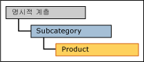
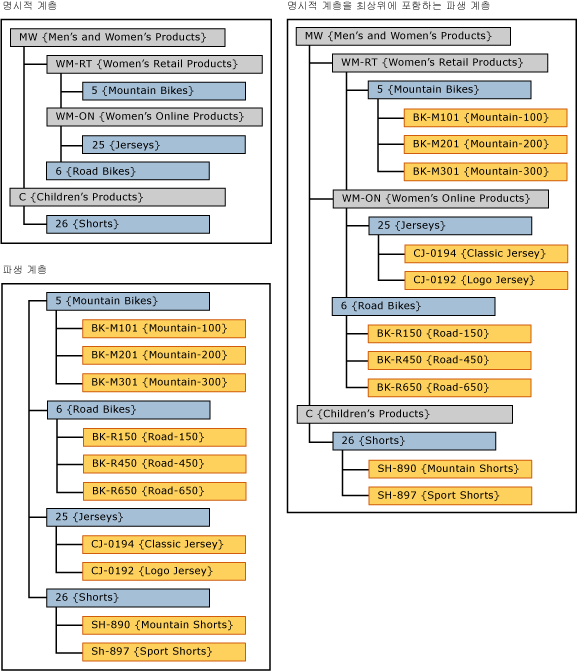

# 명시적 캡이 포함된 파생 계층(Master Data Services)
  [!INCLUDE[ssMDSshort](../includes/ssmdsshort-md.md)]에서 명시적 계층의 수준이 파생 계층의 최상위 수준으로 사용되는 경우 이를 명시적 캡이 포함된 파생 계층이라고 합니다.  
  
 명시적 계층은 파생 계층의 최상위 엔터티와 동일한 엔터티를 기반으로 해야 합니다.  
  
 [!INCLUDE[ssMDSmdm](../includes/ssmdsmdm-md.md)] UI(사용자 인터페이스)에서는 명시적 계층을 파생 계층의 맨 위로 끌어와서 이 유형의 계층을 만듭니다.  
  
   
  
## 명시적 캡이 포함된 파생 계층 예제  
 이 예에서는 명시적 계층의 멤버를 Subcategory 엔터티에서 가져옵니다. 파생 계층의 최상위 멤버 역시 Subcategory 엔터티에서 가져옵니다.  
  
   
  
 파생 계층의 맨 위에 명시적 계층을 사용하므로 파생 계층이 비정형 계층이 됩니다.  
  
## 규칙  
  
-   명시적 캡을 포함한 파생 계층에 두 개 이상의 명시적 계층이 있을 수 없습니다.  
  
-   여러 파생 계층에 Cap과 동일한 명시적 계층을 사용할 수 있습니다.  
  
-   명시적 캡이 포함된 파생 계층에 계층 멤버 권한을 할당할 수 없습니다. 명시적 계층이나 파생 계층에 개별적으로 사용 권한을 할당할 경우 해당 권한이 두 계층에 모두 적용됩니다.  
  
## 관련 작업  
  
|태스크 설명|항목|  
|----------------------|-----------|  
|파생 계층을 만듭니다.|[파생 계층 만들기&#40;Master Data Services&#41;](../master-data-services/create-a-derived-hierarchy-master-data-services.md)|  
|명시적 계층을 만듭니다.|[명시적 계층 만들기&#40;Master Data Services&#41;](../master-data-services/create-an-explicit-hierarchy-master-data-services.md)|  
|기존 파생 계층을 삭제합니다.|[파생 계층 삭제&#40;Master Data Services&#41;](../master-data-services/delete-a-derived-hierarchy-master-data-services.md)|  
|||  
  
## 관련 내용  
  
-   [파생 계층&#40;Master Data Services&#41;](../master-data-services/derived-hierarchies-master-data-services.md)  
  
-   [명시적 계층&#40;Master Data Services&#41;](../master-data-services/explicit-hierarchies-master-data-services.md)  
  
  
