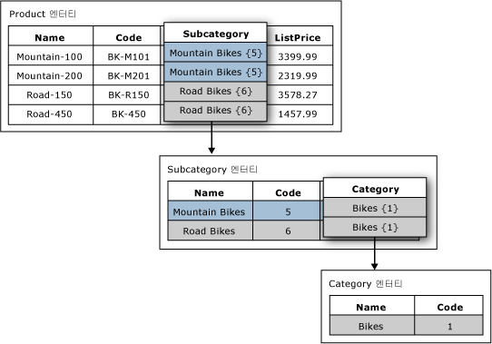

# 도메인 기반 특성(Master Data Services)

[!INCLUDE [SQL Server - Windows only ASDBMI  ](../includes/applies-to-version/sql-windows-only-asdbmi.md)]

  [!INCLUDE[ssMDSshort](../includes/ssmdsshort-md.md)]에서 도메인 기반 특성은 다른 엔터티의 멤버로 값이 채워지는 특성입니다. 도메인 기반 특성은 제한된 목록으로 생각할 수 있습니다. 도메인 기반 특성을 사용하면 사용자가 유효하지 않은 특성 값을 입력하지 못하도록 할 수 있습니다. 특성 값을 선택하려면 사용자가 목록에서 선택해야 합니다.  
  
## 도메인 기반 특성 예  
 다음 이미지의 Product 엔터티에는 Subcategory라는 도메인 기반 특성이 있습니다. Subcategory 특성은 Subcategory 엔터티의 값으로 채워집니다.  
  
 Subcategory 엔터티에는 Category라는 도메인 기반 특성이 있습니다. Category 특성은 Category 엔터티의 값으로 채워집니다.  
  
   
  
## 여러 도메인 기반 특성에 동일한 엔터티 사용  
 동일한 엔터티를 여러 엔터티의 도메인 기반 특성으로 사용할 수 있습니다. 예를 들어, Yes, No 및 Maybe라는 멤버를 포함하는 YesNoIndicator라는 엔터티를 만들 수 있습니다. 또한 InStock이라는 도메인 기반 특성을 만들고 YesNoIndicator 엔터티를 원본으로 사용할 수 있습니다. Approved라는 또 다른 도메인 기반 특성을 만들고 YesNoIndicator 엔터티를 원본으로 사용할 수도 있습니다. 사용자가 YesNoIndicator 엔터티의 멤버 목록에서 선택할 수 있도록 하려는 경우 엔터티를 도메인 기반 특성으로 사용할 수 있습니다.  
  
## 도메인 기반 특성으로 파생 계층 형성  
 도메인 기반 특성 관계는 파생 계층의 기반이 됩니다. 자세한 내용은 [파생 계층&#40;Master Data Services&#41;](../master-data-services/derived-hierarchies-master-data-services.md)을 참조하세요.  
  
## 관련 작업  
  
|태스크 설명|항목|  
|----------------------|-----------|  
|기존 엔터티를 원본으로 이용하여 새 도메인 기반 특성을 만듭니다.|[도메인 기반 특성 만들기&#40;Master Data Services&#41;](../master-data-services/create-a-domain-based-attribute-master-data-services.md)|  
|새 엔터티를 만듭니다.|[엔터티 만들기&#40;Master Data Services&#41;](../master-data-services/create-an-entity-master-data-services.md)|  
  
## 관련 내용  
  
-   [파생 계층&#40;Master Data Services&#41;](../master-data-services/derived-hierarchies-master-data-services.md)  
  
-   [특성&#40;Master Data Services&#41;](../master-data-services/attributes-master-data-services.md)  
  
-   [엔터티&#40;Master Data Services&#41;](../master-data-services/entities-master-data-services.md)  
  
  
