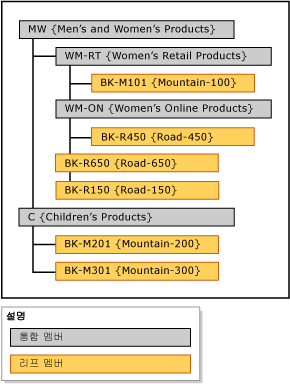

# 명시적 계층(Master Data Services)

[!INCLUDE[appliesto-ss-xxxx-xxxx-xxx-md-winonly](../includes/appliesto-ss-xxxx-xxxx-xxx-md-winonly.md)]

  [!INCLUDE[ssMDSshort](../includes/ssmdsshort-md.md)]에서 명시적 계층은 지정한 방법으로 단일 엔터티의 멤버를 구성합니다. 구조는 비정형일 수 있으며 파생 계층과 달리 명시적 계층은 도메인 기반 특성 관계를 기반으로 하지 않습니다.  
  
> [!NOTE]  
>  명시적 계층은 사용되지 않습니다.  
  
## 통합 멤버가 다른 멤버를 그룹화함  
 명시적 계층에서는 다른 멤버의 그룹화를 위해 만든 통합 멤버를 사용합니다. 이러한 통합 멤버는 한 번에 하나의 명시적 계층에만 속할 수 있습니다. 명시적 계층에는 연결된 엔터티의 모든 리프 멤버도 포함됩니다.  
  
 명시적 계층은 비정형일 수 있습니다. 즉, 계층이 동시에 다른 수준에서 끝날 수 있습니다. 각 통합 멤버는 통합 및 리프 멤버를 무제한 포함할 수도 있고 하나도 포함하지 않을 수도 있습니다. 또한 리프 멤버는 단일 통합 멤버에 속할 수도 있고 여러 수준의 통합 멤버에 속할 수도 있습니다.  
  
> [!NOTE]  
>  명시적 계층을 만들려면 먼저 엔터티가 명시적 계층을 사용하도록 설정되어 있어야 합니다.  
  
## 명시적 계층 유형  
 명시적 계층에는 필수 계층과 필수가 아닌 계층의 두 가지 유형이 있습니다.  
  
### 필수 명시적 계층  
 필수 명시적 계층은 계층 트리의 모든 리프 멤버를 포함해야 하는 계층입니다. 기본적으로 모든 멤버는 트리의 루트에 포함되지만 필요에 따라 멤버를 다시 정렬할 수 있습니다.  
  
### 필수가 아닌 명시적 계층  
 필수가 아닌 명시적 계층은 모든 리프 멤버가 시스템에서 만든 **사용 안 함** 노드에 있는 계층입니다. 필요에 따라 이 노드에서 멤버를 이동할 수 있습니다. 나머지 멤버는 **사용 안 함** 노드에 그대로 둘 수 있습니다.  
  
 필수가 아닌 명시적 계층을 사용하는 경우 이 계층에서 수행된 보고나 분석은 필수 계층에서 수행된 보고나 분석과 일치하지 않을 수 있습니다.  
  
## 규칙  
 필수 명시적 계층과 필수가 아닌 명시적 계층 모두에 다음 규칙이 적용됩니다.  
  
-   각 리프 멤버는 계층에 한 번만 포함될 수 있습니다.  
  
-   통합 멤버는 모두 계층에 포함되어야 합니다.  
  
-   통합 멤버는 둘 이상의 명시적 계층에 속할 수 없습니다.  
  
-   계층 트리의 통합 멤버 아래에는 리프 멤버가 없어도 됩니다.  
  
-   명시적 계층을 삭제하면 해당 계층에 사용된 모든 통합 멤버가 삭제됩니다.  
  
-   명시적 계층에 속한 통합 멤버를 삭제하면 해당 통합 멤버로 그룹화된 모든 리프 멤버가 루트로 이동합니다.  
  
## 명시적 계층과 파생 계층  
 다음 표에서는 명시적 계층과 파생 계층의 몇 가지 차이점을 보여 줍니다.  
  
|명시적 계층|파생 계층|  
|--------------------------|-------------------------|  
|구조가 사용자에 의해 정의됨|구조가 도메인 기반 특성 간의 관계에서 파생됨|  
|단일 엔터티 멤버 포함|여러 엔터티 멤버 포함|  
|통합 멤버를 사용하여 다른 멤버를 그룹화함|한 엔터티의 리프 멤버를 사용하여 다른 엔터티의 리프 멤버를 그룹화함|  
|비정형 가능|항상 일관된 수의 수준 포함|  
  
## 명시적 계층 예  
 다음 예제에서는 Product 엔터티에 이러한 리프 멤버를 포함 합니다. BK-M101 {Mountain-100}, BK-M201 {Mountain-200}, BK-M301 {Mountain-300}, BK-R150 {Road-150}, BK-R450 {Road-450} 및 BK-R650 {Road-650}.  
  
 이러한 리프 멤버를 특정 통합 지점에서 요약하려면 Product 엔터티 내에 통합 멤버를 만들면 됩니다. 계층 트리에서 리프 멤버를 요약할 수준에 통합 멤버를 삽입합니다. 통합 멤버를 삽입할 수 있는 위치에 대한 제한은 없지만 각 멤버(리프 또는 통합)를 한 번만 사용할 수 있습니다.  
  
   
  
 통합 멤버를 사용하여 원하는 수준에서 멤버를 그룹화하고, 리프 및 통합 멤버를 원하는 순서대로 정렬할 수 있습니다.  
  
## 관련 작업  
  
|태스크 설명|항목|  
|----------------------|-----------|  
|새 명시적 계층을 만듭니다.|[명시적 계층 만들기&#40;Master Data Services&#41;](../master-data-services/create-an-explicit-hierarchy-master-data-services.md)|  
|기존 명시적 계층의 이름을 변경합니다.|[명시적 계층 이름 변경&#40;Master Data Services&#41;](../master-data-services/change-an-explicit-hierarchy-name-master-data-services.md)|  
|기존 명시적 계층을 삭제합니다.|[명시적 계층 삭제&#40;Master Data Services&#41;](../master-data-services/delete-an-explicit-hierarchy-master-data-services.md)|  
|||  
  
## 관련 내용  
  
-   [파생 계층&#40;Master Data Services&#41;](../master-data-services/derived-hierarchies-master-data-services.md)  
  
-   [컬렉션&#40;Master Data Services&#41;](../master-data-services/collections-master-data-services.md)  
  
  
