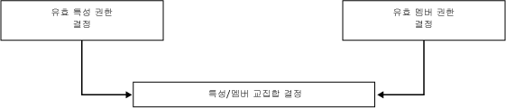
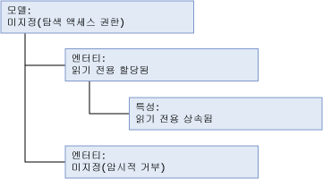
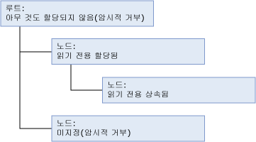
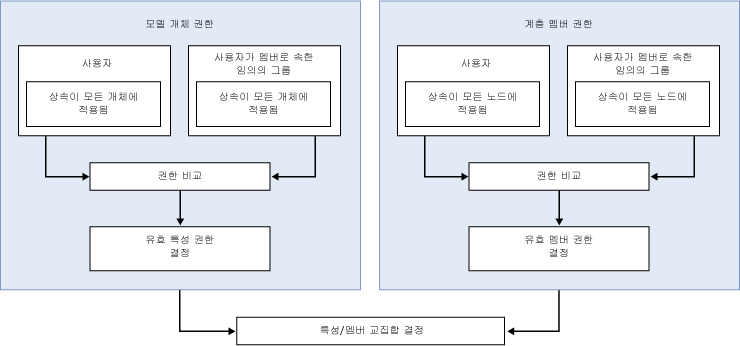

# 사용 권한이 결정되는 방식(Master Data Services)
  [!INCLUDE[ssMDSshort](../includes/ssmdsshort-md.md)]에서 보안을 구성하는 가장 손쉬운 방법은 사용자가 멤버로 속한 그룹에 모델 개체 사용 권한을 할당하는 것입니다.  
  
 다음과 같은 경우에는 보안 구성이 복잡해집니다.  
  
-   모델 개체 사용 권한 및 계층 멤버 권한이 모두 할당되어 있습니다.  
  
-   사용자가 그룹에 속하며 사용 권한이 사용자와 그룹에 모두 할당되어 있습니다.  
  
-   사용자가 그룹에 속하며 사용 권한이 여러 그룹에 할당되어 있습니다.  
  
## 사용 권한이 단일 그룹 또는 사용자에게 할당된 경우  
 사용 권한을 단일 그룹이나 사용자에게 할당하는 경우 다음 워크플로에 따라 사용 권한이 결정됩니다.  
  
   
  
### 1단계: 유효 특성 사용 권한이 결정됩니다.  
 다음 목록에서는 유효 특성 사용 권한이 결정되는 방법을 설명합니다.  
  
-   모델 개체에 할당된 사용 권한에 따라 사용자가 액세스할 수 있는 특성이 결정됩니다.  
  
-   모든 모델 개체는 모델 구조의 상위 수준에서 가장 가까이 있는 개체의 사용 권한을 자동으로 상속합니다.  
  
-   엔터티와 동일한 수준에 있는 개체는 암시적으로 거부됩니다.  
  
-   상위 수준의 개체에는 유추 읽기 권한이 제공됩니다. 유추 읽기에 대한 자세한 내용은 [탐색 액세스&#40;Master Data Services&#41;](../master-data-services/navigational-access-master-data-services.md)를 참조하세요.  
  
 이 예에서는 엔터티에 **읽기** 권한이 할당되었으며 이 사용 권한은 모델 구조에서 하위 수준에 있는 해당 특성에 상속됩니다. 모델은 이 엔터티 및 해당 특성에 대한 유추 읽기 권한을 제공합니다. 모델의 다른 엔터티는 명시적 사용 권한이 할당되지 않았으며 어떠한 사용 권한도 상속하지 않으므로 암시적으로 거부됩니다.  
  
   
  
### 2단계: 계층 멤버 권한이 할당된 경우 유효 멤버 권한이 결정됩니다.  
 다음 목록에서는 유효 계층 멤버 권한이 결정되는 방법을 설명합니다.  
  
-   계층 노드에 할당된 사용 권한에 따라 사용자가 액세스할 수 있는 멤버가 결정됩니다.  
  
-   계층의 모든 노드는 계층 구조의 상위 수준에서 가장 가까이 있는 개체의 사용 권한을 자동으로 상속합니다.  
  
-   동일한 수준에 있는 노드는 암시적으로 거부됩니다.  
  
-   사용 권한이 할당되지 않은 상위 수준의 노드는 암시적으로 거부됩니다.  
  
 이 예에서는 계층의 한 노드에 **읽기** 권한이 할당되었고 이 사용 권한은 계층 구조의 하위 수준에 있는 노드에 상속됩니다. 루트는 사용 권한이 할당되지 않았으므로 암시적으로 거부됩니다. 계층 구조의 다른 노드는 명시적 사용 권한이 할당되지 않았으며 어떠한 사용 권한도 상속하지 않으므로 암시적으로 거부됩니다.  
  
   
  
### 3단계: 특성 사용 권한과 멤버 권한의 교집합이 결정됩니다.  
 유효 특성 사용 권한이 유효 멤버 권한과 다른 경우 각각의 개별 특성 값에 대해 사용 권한이 결정되어야 합니다. 자세한 내용은 [겹치는 모델 및 멤버 권한&#40;Master Data Services&#41;](../master-data-services/overlapping-model-and-member-permissions-master-data-services.md)을 참조하세요.  
  
## 사용 권한이 여러 그룹에 할당된 경우  
 사용자가 하나 이상의 그룹에 속하고 사용 권한이 사용자와 그룹에 모두 할당된 경우 워크플로가 복잡해집니다.  
  
   
  
 이 경우 모델 개체 사용 권한과 계층 멤버 권한을 비교하기 전에 겹치는 사용자 및 그룹 권한을 확인해야 합니다. 자세한 내용은 [겹치는 사용자 및 그룹 권한&#40;Master Data Services&#41;](../master-data-services/overlapping-user-and-group-permissions-master-data-services.md)을 참조하세요.  
  
## 참고 항목  
 [겹치는 사용자 및 그룹 권한&#40;Master Data Services&#41;](../master-data-services/overlapping-user-and-group-permissions-master-data-services.md)   
 [겹치는 모델 및 멤버 권한&#40;Master Data Services&#41;](../master-data-services/overlapping-model-and-member-permissions-master-data-services.md)  
  
  