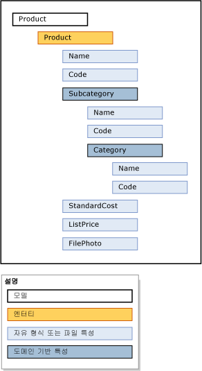

# 모델(Master Data Services)
  모델은 [!INCLUDE[ssMDSshort](../includes/ssmdsshort-md.md)]의 최상위 데이터 구성 수준입니다. 모델은 마스터 데이터 관리 솔루션의 데이터 구조를 정의합니다. 모델은 다음 개체를 포함합니다.  
  
-   엔터티  
  
-   특성 및 특성 그룹  
  
-   명시적 계층 및 파생 계층  
  
-   컬렉션  
  
 모델은 마스터 데이터의 구조를 구성합니다. [!INCLUDE[ssMDSshort](../includes/ssmdsshort-md.md)] 를 구현하면 그룹이 각각 비슷한 종류의 데이터를 가진 하나 이상의 모델이 있을 수 있습니다. 일반적으로 마스터 데이터는 사용자, 장소, 사물 및 개념의 네 가지 범주 중 하나에 속합니다. 예를 들어 Product 모델을 만들어 제품 관련 데이터를 포함하거나 Customer 모델을 만들어 고객 관련 데이터를 포함할 수 있습니다.  
  
 사용자 및 그룹에 모델 내의 개체를 보고 업데이트할 수 있는 권한을 할당할 수 있습니다. 모델에 사용 권한을 부여하지 않으면 해당 모델이 표시되지 않습니다.  
  
 언제든지 모델 내에 마스터 데이터의 복사본을 만들 수 있습니다. 이러한 복사본을 버전이라고 합니다.  
  
 테스트 환경에서 모델을 정의한 경우 해당 데이터를 포함하거나 포함하지 않은 상태로 테스트 환경에서 프로덕션 환경으로 모델을 배포할 수 있습니다. 이렇게 하면 프로덕션 환경에서 모델을 다시 만들 필요가 없습니다.  
  
## 다른 개체와 모델의 관계  
 모델에는 엔터티가 포함됩니다. 엔터티에는 특성, 명시적 계층 및 컬렉션이 포함됩니다. 특성은 특성 그룹에 포함할 수 있습니다. DBA(도메인 기반 특성)는 엔터티를 다른 엔터티의 특성으로 사용할 때 존재합니다.  
  
 이 이미지는 모델 개체 간의 관계를 보여 줍니다.  
  
   
  
> [!NOTE]  
>  파생 계층도 모델 개체지만 이미지에 표시되지 않습니다. 파생 계층은 엔터티 간에 존재하는 도메인 기반 특성 관계에서 파생됩니다. 참조 [파생 계층 &#40; Master Data services&#41; ](../master-data-services/derived-hierarchies-master-data-services.md) 자세한 정보에 대 한 합니다.  
  
 마스터 데이터는 모델 개체에 포함되는 데이터입니다. [!INCLUDE[ssMDSshort](../includes/ssmdsshort-md.md)]에서는 마스터 데이터가 엔터티의 멤버로 저장됩니다.  
  
 모델 개체는 **사용자 인터페이스의** 시스템 관리 [!INCLUDE[ssMDSmdm](../includes/ssmdsmdm-md.md)] 기능 영역에서 유지 관리됩니다.  
  
## 모델 예  
 다음 예에서 Product 모델의 개체는 제품 관련 데이터를 논리적으로 그룹화합니다.  
  
   
  
 그밖에 일반적인 모델은 다음과 같습니다.  
  
-   Accounts - 대차대조표 계정, 재무제표 계정, 통계, 계정 유형 등의 엔터티를 포함할 수 있습니다.  
  
-   Customer - 성별, 교육 수준, 직업, 결혼 여부 등의 엔터티를 포함할 수 있습니다.  
  
-   Geography - 우편 번호, 도시, 군, 주, 지방, 지역, 영토, 국가, 대륙 등을 포함할 수 있습니다.  
  
## 관련 태스크  
  
|태스크 설명|항목|  
|----------------------|-----------|  
|모델을 만들어 마스터 데이터를 구성합니다.|[모델 &#40; 만들기 Master Data services&#41;](../master-data-services/create-a-model-master-data-services.md)|  
|기존 모델의 이름을 변경합니다.|[편집 모델 &#40; Master Data services&#41;](../master-data-services/edit-model-master-data-services.md)|  
|기존 모델을 삭제합니다.|[모델 &#40; 삭제 Master Data services&#41;](../master-data-services/delete-a-model-master-data-services.md)|  
  
## 관련 내용  
  
-   [Master Data Services 개요&#40;MDS&#41;](../master-data-services/master-data-services-overview-mds.md)  
  
-   [엔터티&#40;Master Data Services&#41;](../master-data-services/entities-master-data-services.md)  
  
-   [특성 &#40; Master Data services&#41;](../master-data-services/attributes-master-data-services.md)  
  
-   [모델 &#40; 배포 Master Data services&#41;](../master-data-services/deploying-models-master-data-services.md)  
  
-   [모델 개체 사용 권한 &#40; Master Data services&#41;](../master-data-services/model-object-permissions-master-data-services.md)  
  
  
