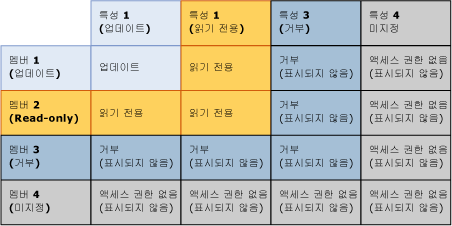
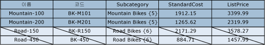
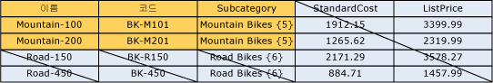

# 겹치는 모델 및 멤버 권한(Master Data Services)

[!INCLUDE [SQL Server - Windows only ASDBMI  ](../includes/applies-to-version/sql-windows-only-asdbmi.md)]

  멤버에 할당된 사용 권한과 모델 개체에 할당된 사용 권한이 겹칠 수 있습니다. 사용 권한이 겹치면 보다 제한적인 사용 권한이 적용됩니다.  
  
 멤버의 사용 권한이 해당 모델 개체와 다른 경우 다음 규칙이 적용됩니다.  
  
-   **거부** 는 다른 모든 사용 권한을 무시합니다.  
  
-   모델에 대한**관리** 권한은 기타 모든 권한을 재정의하며, 하위 수준에서는 모든 권한(CRUD)으로 변경됩니다.  
  
-   유효한 액세스 권한은 멤버 및 특성에 대한 권한과 일정 부분 일치합니다.  
  
     예를 들어 멤버 권한에 **만들기** 및 **업데이트**가 포함되는 경우 특성에 대한 권한은 **업데이트**입니다. 즉, 유효한 권한이 **업데이트**가 됩니다.  
  
 다음 이미지는 특성 사용 권한이 멤버 권한과 다를 경우 개별 특성 값에 적용되는 사용 권한을 보여 줍니다.  
  
   
  
## 예제 1  
   
  
 **모델** 탭의 Product 엔터티에는 **업데이트** 권한이 할당되어 있습니다. 엔터티의 모든 특성은 해당 사용 권한을 상속합니다.  
  
 **계층 멤버** 탭의 파생 계층에 있는 Mountain Bikes 하위 범주 노드에는 **업데이트** 권한이 할당되어 있습니다.  
  
 결과: **탐색기**에서 사용자에게는 Mountain Bikes 노드에 있는 모든 멤버의 모든 특성 값에 대한 **업데이트** 권한이 있습니다. 모든 다른 멤버와 특성은 숨겨집니다.  
  
   
  
## 예제 2  
   
  
 **모델** 탭의 하위 범주 특성에는 **업데이트** 권한이 할당되어 있습니다.  
  
 **계층 멤버** 탭의 파생 계층에 있는 Mountain Bikes 하위 범주 노드에는 **읽기** 권한이 명시적으로 할당됩니다.  
  
 결과: **탐색기**에서 사용자에게는 Mountain Bikes 노드에 있는 멤버의 하위 범주 특성 값에 대한 **읽기** 권한이 있습니다. 모든 다른 멤버와 특성은 숨겨집니다.  
  
   
  
## 예제 3  
   
  
 **모델** 탭의 하위 범주 특성에는 **읽기** 권한이 할당되어 있습니다.  
  
 **계층 멤버** 탭의 파생 계층에 있는 Mountain Bikes 하위 범주 노드에는 **업데이트** 권한이 명시적으로 할당됩니다.  
  
 결과: **탐색기**에서 사용자에게는 특성 값에 대한 **읽기** 권한이 있습니다. 모든 다른 멤버와 특성은 숨겨집니다.  
  
   
  
## 참고 항목  
 [MDS(Master Data Services) &#40;사용 권한을 결정 하는 방법&#41;](../master-data-services/how-permissions-are-determined-master-data-services.md)   
 [겹치는 사용자 및 그룹 권한&#40;Master Data Services&#41;](../master-data-services/overlapping-user-and-group-permissions-master-data-services.md)  
  
  
