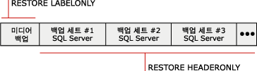

# 백업 기록 및 헤더 정보(SQL Server)
[!INCLUDE[appliesto-ss-xxxx-xxxx-xxx-md](../../includes/appliesto-ss-xxxx-xxxx-xxx-md.md)]
  서버 인스턴스에서 이루어지는 모든 [!INCLUDE[ssNoVersion](../../includes/ssnoversion-md.md)] 백업 및 복원 작업에 대한 전체 기록은 **msdb** 데이터베이스에 저장됩니다. 이 항목에서는 백업 및 복원 기록 테이블에 대해 설명하고 백업 기록에 액세스하는 데 사용되는 [!INCLUDE[tsql](../../includes/tsql-md.md)] 문에 대해서도 설명합니다. 또한 이 항목에서는 데이터베이스와 트랜잭션 로그 파일을 나열하는 것이 유용한 경우에 대해 설명하고, 백업 헤더 정보와 미디어 헤더 정보를 사용하는 경우를 비교하여 설명합니다.  
  
> [!IMPORTANT]  
>  백업 및 복원 기록의 최근 변경 내용에 대한 손실 위험을 줄이려면 **msdb** 를 자주 백업합니다. 백업해야 하는 시스템 데이터베이스에 대한 자세한 내용은 [시스템 데이터베이스 백업 및 복원&#40;SQL Server&#41;](../../relational-databases/backup-restore/back-up-and-restore-of-system-databases-sql-server.md)을 참조하세요.  
  
 **항목 내용:**  
  
-   [백업 및 복원 기록 테이블](#BnRHistoryTables)  
  
-   [백업 기록에 액세스하는 Transact-SQL 문](#TsqlStatementsForBackupHistory)  
  
-   [데이터베이스 및 트랜잭션 로그 파일](#ListDbTlogFiles)  
  
-   [미디어 헤더 정보](#MediaHeader)  
  
-   [백업 헤더 정보](#BackupHeader)  
  
-   [미디어 헤더 정보 및 백업 헤더 정보 비교](#CompareMediaHeaderBackupHeader)  
  
-   [백업 확인](#Verification)  
  
-   [관련 작업](#RelatedTasks)  
  
##   백업 및 복원 기록 테이블  
 이 섹션에서는 **msdb** 시스템 데이터베이스에 백업 및 복원 메타데이터를 저장하는 기록 테이블에 대해 설명합니다.  
  
|기록 테이블|Description|  
|-------------------|-----------------|  
|[backupfile](../../relational-databases/system-tables/backupfile-transact-sql.md)|백업되는 각 데이터 또는 로그 파일에 대해 한 행을 포함합니다.|  
|[backupfilegroup](../../relational-databases/system-tables/backupfilegroup-transact-sql.md)|백업 세트의 각 파일 그룹에 대해 한 행을 포함합니다.|  
|[backupmediafamily](../../relational-databases/system-tables/backupmediafamily-transact-sql.md)|각 미디어 패밀리에 대해 한 행을 포함합니다. 미디어 패밀리가 미러된 미디어 세트에 있을 경우 이 미디어 패밀리에는 미디어 세트의 각 미러에 대한 별도의 행이 있습니다.|  
|[backupmediaset](../../relational-databases/system-tables/backupmediaset-transact-sql.md)|각 백업 미디어 세트에 대해 한 행을 포함합니다.|  
|[backupset](../../relational-databases/system-tables/backupset-transact-sql.md)|각 백업 세트마다 하나의 행을 포함합니다.|  
|[restorefile](../../relational-databases/system-tables/restorefile-transact-sql.md)|복원된 각 파일 그룹에 대해 하나의 행을 포함합니다. 여기에는 파일 그룹 이름에 의해 간접적으로 복원된 파일이 포함됩니다.|  
|[restorefilegroup](../../relational-databases/system-tables/restorefilegroup-transact-sql.md)|복원된 각 파일 그룹에 대해 하나의 행을 포함합니다.|  
|[restorehistory](../../relational-databases/system-tables/restorehistory-transact-sql.md)|각 복원 작업에 대해 하나의 행을 포함합니다.|  
  
> [!NOTE]  
>  복원을 수행하면 백업 기록 테이블 및 복원 기록 테이블이 수정됩니다.  
  
##   백업 기록에 액세스하는 Transact-SQL 문  
 복원 정보 문은 백업 기록 테이블에 저장된 정보와 같습니다.  
  
> [!IMPORTANT]  
>  RESTORE FILELISTONLY, RESTORE HEADERONLY, RESTORE LABELONLY 및 RESTORE VERIFYONLY Transact-SQL 문에는 CREATE DATABASE 권한이 필요합니다. 이 요구 사항을 통해 이전 버전보다 더욱 백업 파일의 보안을 유지하고 백업 정보를 보호할 수 있습니다. 이 사용 권한에 대한 자세한 내용은 [GRANT 데이터베이스 사용 권한&#40;Transact-SQL&#41;](../../t-sql/statements/grant-database-permissions-transact-sql.md)을 참조하세요.  
  
|정보 문|백업 기록 테이블|Description|  
|---------------------------|--------------------------|-----------------|  
|[RESTORE FILELISTONLY](../../t-sql/statements/restore-statements-filelistonly-transact-sql.md)|[backupfile](../../relational-databases/system-tables/backupfile-transact-sql.md)|지정한 백업 세트에 포함된 데이터베이스와 로그 파일의 목록이 있는 결과 집합을 반환합니다.   자세한 내용은 이 항목의 뒷부분에 나오는 "데이터베이스와 트랜잭션 로그 파일 목록 만들기"를 참조하세요.|  
|[RESTORE HEADERONLY](../../t-sql/statements/restore-statements-headeronly-transact-sql.md)|[backupset](../../relational-databases/system-tables/backupset-transact-sql.md)|특정 백업 디바이스의 모든 백업 세트에 대한 백업 헤더 정보를 모두 검색합니다. RESTORE HEADERONLY 실행 결과는 결과 집합입니다.   자세한 내용은 이 항목의 뒷부분에 나오는 "백업 헤더 정보 보기"를 참조하세요.|  
|[RESTORE LABELONLY](../../t-sql/statements/restore-statements-labelonly-transact-sql.md)|[backupmediaset](../../relational-databases/system-tables/backupmediaset-transact-sql.md)|지정한 백업 디바이스의 백업 미디어에 대한 정보가 포함된 결과 집합을 반환합니다.   자세한 내용은 이 항목의 뒷부분에 나오는 "미디어 헤더 정보 보기"를 참조하세요.|  
  
##   데이터베이스 및 트랜잭션 로그 파일  
 백업에서 트랜잭션 로그 파일과 데이터베이스의 목록을 만들 때 표시되는 정보에는 논리적 이름, 물리적 이름, 파일 형식(데이터베이스나 로그), 파일 그룹 멤버, 파일 크기(바이트 단위), 최대 허용 파일 크기, 미리 정의된 파일 증가 크기(바이트 단위) 등이 있습니다. 이 정보는 다음의 경우, 데이터베이스 백업을 복원하기 전에 데이터베이스 백업에서 파일 이름을 결정하는 데 유용합니다.  
  
-   데이터베이스에 대한 파일이 하나 이상 있는 디스크 드라이브를 손실했을 경우  
  
     데이터베이스를 백업한 후에 만든 트랜잭션 로그 백업을 적용하고 해당 파일만 복원하거나 전체 데이터베이스를 복원할 때 어느 파일이 영향을 받았는지 알아내기 위해 데이터베이스 백업에서 파일 목록을 만든 다음 그 파일을 다른 드라이브로 복원할 수 있습니다.  
  
-   한 서버에서 다른 서버로 데이터베이스를 복원하는데 디렉터리 구조와 드라이브 매핑이 서버에 존재하지 않을 경우  
  
     백업에 파일 목록을 만들면 어느 파일이 영향을 받았는지 알 수 있습니다. 예를 들어 백업에 포함된 파일을 드라이브 E에 복원해야 하는데 대상 서버에는 드라이브 E가 없는 경우 파일을 복원할 때 드라이브 Z 등의 다른 위치로 파일 위치를 변경해야 합니다.  
  
##   미디어 헤더 정보  
 미디어 헤더를 보면 미디어의 백업이 아닌 미디어 자체에 대한 정보가 표시되어 있습니다. 표시된 미디어 헤더 정보에는 미디어 이름, 설명, 미디어 헤더를 만든 소프트웨어 이름, 미디어 헤더가 쓰여진 날짜 등이 포함됩니다.  
  
> [!NOTE]  
>  미디어 헤더를 신속하게 볼 수 있습니다.  
  
 자세한 내용은 이 항목의 뒷부분에 나오는 [미디어 헤더 정보 및 백업 헤더 정보 비교](#CompareMediaHeaderBackupHeader)를 참조하세요.  
  
##   백업 헤더 정보  
 백업 헤더를 보면 미디어에 있는 모든 [!INCLUDE[ssNoVersion](../../includes/ssnoversion-md.md)] 및 비[!INCLUDE[ssNoVersion](../../includes/ssnoversion-md.md)] 백업 세트에 대한 정보가 표시됩니다. 표시된 정보에는 사용한 백업 디바이스의 유형, 백업 유형(예: 데이터베이스, 트랜잭션, 파일 또는 차등 데이터베이스), 백업 시작과 중지 시간/날짜 정보 등이 포함됩니다. 이 정보는 테이프에서 복원할 백업 세트나 미디어에 포함된 백업을 결정할 때 유용합니다.  
  
> [!NOTE]  
>  미디어에서 각 백업에 관한 정보를 표시하기 위해 전체 미디어를 검사해야 하기 때문에 고용량 테이프의 경우 백업 헤더 정보를 보는 데 시간이 많이 걸립니다.  
  
 자세한 내용은 이 항목의 뒷부분에 나오는 [미디어 헤더 정보 및 백업 헤더 정보 비교](#CompareMediaHeaderBackupHeader)를 참조하세요.  
  
### 복원할 백업 세트  
 복원할 백업 세트를 식별하는 데 백업 헤더 정보를 사용할 수 있습니다. 데이터베이스 엔진은 백업 미디어에 있는 각 백업 세트에 번호를 매깁니다. 이렇게 하면 미디어에서 백업 세트의 위치를 사용하여 복원할 백업 세트를 식별할 수 있습니다. 예를 들어 다음 미디어에는 3개의 백업 세트가 있습니다.  
  
   
  
 특정 백업 세트를 복원하려면 복원할 백업 세트의 위치 번호를 지정하세요. 예를 들어 두 번째 백업 세트를 복원하려면 2를 복원할 백업 세트로 지정하세요.  
  
##   미디어 헤더 정보 및 백업 헤더 정보 비교  
 다음 그림에서는 백업 헤더를 볼 때와 미디어 헤더 정보를 볼 때의 차이점을 예를 들어 보여 줍니다. 미디어 헤더를 얻으려면 테이프의 시작에서만 정보를 검색해야 하고 백업 헤더를 얻으려면 모든 백업 세트의 헤더를 볼 수 있도록 전체 테이프를 검색해야 합니다.  
  
   
  
> [!NOTE]  
>  여러 미디어 패밀리가 있는 미디어 세트를 사용하면 모든 미디어 패밀리에 미디어 헤더와 백업 세트가 기록됩니다. 따라서 이러한 보고 작업에 하나의 미디어 패밀리만 제공하면 됩니다.  
  
 미디어 헤더를 보는 방법은 이 항목의 앞부분에 나오는 "미디어 헤더 정보 보기"를 참조하세요.  
  
 백업 디바이스에서 모든 백업 세트의 백업 헤더 정보를 보는 방법은 이 항목의 앞부분에 나오는 "백업 헤더 정보 보기"를 참조하십시오.  
  
##   백업 확인  
 백업 확인은 필수는 아니지만 유용한 기능입니다. 백업 확인은 백업의 모든 파일을 읽을 수 있고 저장할 수 있으며 백업을 사용해야 할 때 복원할 수 있도록 백업이 물리적으로 손상되지 않고 그대로인지 확인합니다. 백업 확인은 백업의 데이터 구조를 확인하지 않는다는 점을 이해하는 것이 중요합니다. 그러나 WITH CHECKSUMS를 사용하여 백업을 만든 경우 WITH CHECKSUMS를 사용하여 백업을 확인하면 백업 데이터의 안정성을 정확히 확인할 수 있습니다.  
  
##   관련 작업  
 **백업 및 복원 기록 테이블에서 오래된 행을 삭제하려면**  
  
-   [sp_delete_backuphistory&#40;Transact-SQL&#41;](../../relational-databases/system-stored-procedures/sp-delete-backuphistory-transact-sql.md)  
  
 **백업 및 복원 기록 테이블에서 특정 데이터베이스에 대한 모든 행을 삭제하려면**  
  
-   [sp_delete_database_backuphistory&#40;Transact-SQL&#41;](../../relational-databases/system-stored-procedures/sp-delete-database-backuphistory-transact-sql.md)  
  
 **백업 세트의 데이터와 로그 파일을 보려면**  
  
-   [RESTORE FILELISTONLY&#40;Transact-SQL&#41;](../../t-sql/statements/restore-statements-filelistonly-transact-sql.md)  
  
-   <xref:Microsoft.SqlServer.Management.Smo.Restore.ReadFileList%2A> (SMO)  
  
 **미디어 헤더 정보를 보려면**  
  
-   [RESTORE LABELONLY&#40;Transact-SQL&#41;](../../t-sql/statements/restore-statements-labelonly-transact-sql.md)  
  
-   [논리적 백업 디바이스의 속성 및 내용 보기&#40;SQL Server&#41;](../../relational-databases/backup-restore/view-the-properties-and-contents-of-a-logical-backup-device-sql-server.md)  
  
-   [백업 테이프 또는 파일의 내용 보기&#40;SQL Server&#41;](../../relational-databases/backup-restore/view-the-contents-of-a-backup-tape-or-file-sql-server.md)  
  
-   <xref:Microsoft.SqlServer.Management.Smo.Restore.ReadMediaHeader%2A> (SMO)  
  
 **백업 헤더 정보를 보려면**  
  
-   [RESTORE HEADERONLY&#40;Transact-SQL&#41;](../../t-sql/statements/restore-statements-headeronly-transact-sql.md)  
  
-   [백업 테이프 또는 파일의 내용 보기&#40;SQL Server&#41;](../../relational-databases/backup-restore/view-the-contents-of-a-backup-tape-or-file-sql-server.md)  
  
-   [논리적 백업 디바이스의 속성 및 내용 보기&#40;SQL Server&#41;](../../relational-databases/backup-restore/view-the-properties-and-contents-of-a-logical-backup-device-sql-server.md)  
  
-   <xref:Microsoft.SqlServer.Management.Smo.Restore.ReadBackupHeader%2A> (SMO)  
  
 **백업 및 복원 기록 테이블에서 오래된 행을 삭제하려면**  
  
-   [sp_delete_backuphistory&#40;Transact-SQL&#41;](../../relational-databases/system-stored-procedures/sp-delete-backuphistory-transact-sql.md)  
  
 **백업 및 복원 기록 테이블에서 특정 데이터베이스에 대한 모든 행을 삭제하려면**  
  
-   [sp_delete_database_backuphistory&#40;Transact-SQL&#41;](../../relational-databases/system-stored-procedures/sp-delete-database-backuphistory-transact-sql.md)  
  
 **미디어 헤더 정보를 보려면**  
  
-   [RESTORE LABELONLY&#40;Transact-SQL&#41;](../../t-sql/statements/restore-statements-labelonly-transact-sql.md)  
  
-   [논리적 백업 디바이스의 속성 및 내용 보기&#40;SQL Server&#41;](../../relational-databases/backup-restore/view-the-properties-and-contents-of-a-logical-backup-device-sql-server.md)  
  
-   [백업 테이프 또는 파일의 내용 보기&#40;SQL Server&#41;](../../relational-databases/backup-restore/view-the-contents-of-a-backup-tape-or-file-sql-server.md)  
  
-   <xref:Microsoft.SqlServer.Management.Smo.Restore.ReadMediaHeader%2A> (SMO)  
  
 **백업 헤더 정보를 보려면**  
  
-   [RESTORE HEADERONLY&#40;Transact-SQL&#41;](../../t-sql/statements/restore-statements-headeronly-transact-sql.md)  
  
-   [백업 테이프 또는 파일의 내용 보기&#40;SQL Server&#41;](../../relational-databases/backup-restore/view-the-contents-of-a-backup-tape-or-file-sql-server.md)  
  
-   [논리적 백업 디바이스의 속성 및 내용 보기&#40;SQL Server&#41;](../../relational-databases/backup-restore/view-the-properties-and-contents-of-a-logical-backup-device-sql-server.md)  
  
-   <xref:Microsoft.SqlServer.Management.Smo.Restore.ReadBackupHeader%2A> (SMO)  
  
 **백업 세트의 파일을 보려면**  
  
-   [백업 세트의 데이터와 로그 파일 보기&#40;SQL Server&#41;](../../relational-databases/backup-restore/view-the-data-and-log-files-in-a-backup-set-sql-server.md)  
  
-   [RESTORE HEADERONLY&#40;Transact-SQL&#41;](../../t-sql/statements/restore-statements-headeronly-transact-sql.md)  
  
 **백업을 확인하려면**  
  
-   [RESTORE VERIFYONLY&#40;Transact-SQL&#41;](../../t-sql/statements/restore-statements-verifyonly-transact-sql.md)  
  
-   <xref:Microsoft.SqlServer.Management.Smo.Restore.SqlVerify%2A> (SMO)  
  
## 참고 항목  
 [BACKUP&#40;Transact-SQL&#41;](../../t-sql/statements/backup-transact-sql.md)   
 [미디어 세트, 미디어 패밀리 및 백업 세트&#40;SQL Server&#41;](../../relational-databases/backup-restore/media-sets-media-families-and-backup-sets-sql-server.md)   
 [백업 디바이스&#40;SQL Server&#41;](../../relational-databases/backup-restore/backup-devices-sql-server.md)   
 [미러된 백업 미디어 세트&#40;SQL Server&#41;](../../relational-databases/backup-restore/mirrored-backup-media-sets-sql-server.md)   
 [백업 및 복원 중 발생 가능한 미디어 오류&#40;SQL Server&#41;](../../relational-databases/backup-restore/possible-media-errors-during-backup-and-restore-sql-server.md)  
  
  
