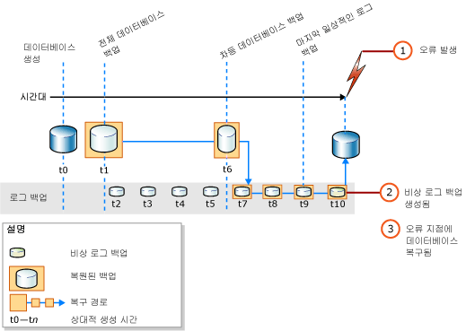

# <a name="complete-database-restores-full-recovery-model"></a>전체 데이터베이스 복원(전체 복구 모델)
[!INCLUDE[appliesto-ss-xxxx-xxxx-xxx-md](../../includes/appliesto-ss-xxxx-xxxx-xxx-md.md)]

  전체 데이터베이스 복원의 목적은 전체 데이터베이스를 복원하는 것입니다. 복원하는 동안 전체 데이터베이스는 오프라인 상태가 됩니다. 데이터베이스의 일부를 온라인에 연결하기 전에 데이터베이스의 모든 부분의 지정 시간이 같고 커밋되지 않은 트랜잭션이 없는 일치하는 지점으로 모든 데이터를 복구합니다.  
  
 전체 복구 모델에서는 데이터 백업이나 백업을 복원한 후, 이후의 모든 트랜잭션 로그 백업을 복원한 다음 데이터베이스를 복구해야 합니다. 이러한 로그 백업 중 하나의 특정 *복구 지점* 으로 데이터베이스를 복원할 수 있습니다. 복구 지점은 특정 날짜 및 시간, 표시된 트랜잭션 또는 LSN(로그 시퀀스 번호)일 수 있습니다.  
  
 데이터베이스를 복원할 경우, 특히 전체 복구 모델 또는 대량 로그 복구 모델에서는 단일 복원 순서를 사용해야 합니다. *복원 순서* 는 하나 이상의 복원 단계를 통해 데이터를 이동시키는 하나 이상의 복원 작업으로 구성됩니다.  
  
> [!IMPORTANT]  
>  알 수 없거나 신뢰할 수 없는 출처의 데이터베이스는 연결 또는 복원하지 않는 것이 좋습니다. 이러한 데이터베이스에 포함된 악성 코드가 의도하지 않은 [!INCLUDE[tsql](../../includes/tsql-md.md)] 코드를 실행하거나 스키마 또는 물리적 데이터베이스 구조를 수정하여 오류가 발생할 수 있습니다. 알 수 없거나 신뢰할 수 없는 소스의 데이터베이스를 사용하기 전에 비프로덕션 서버의 데이터베이스에서 [DBCC CHECKDB](../../t-sql/database-console-commands/dbcc-checkdb-transact-sql.md) 를 실행하여 데이터베이스에서 코드(예: 저장 프로시저 또는 다른 사용자 정의 코드)를 시험해 보세요.  
  
 **항목 내용**  
  
-   [오류 지점으로 데이터베이스 복원](#PointOfFailure)  
  
-   [데이터베이스를 로그 백업 내 지점으로 복원](#PointWithinBackup)  
  
-   [관련 태스크](#RelatedTasks)  
  
> [!NOTE]  
>  이전 버전 [!INCLUDE[ssNoVersion](../../includes/ssnoversion-md.md)]의 백업 지원에 대한 자세한 내용은 [RESTORE&#40;Transact-SQL&#41;](../../t-sql/statements/restore-statements-transact-sql.md)의 "호환성 지원" 섹션을 참조하세요.  
  
##  <a name="PointOfFailure"></a> 오류 지점으로 데이터베이스 복원  
 일반적으로 실패 지점으로 데이터베이스를 복구하는 작업에는 다음의 기본 단계가 포함됩니다.  
  
1.  활성 트랜잭션 로그(비상 로그)를 백업합니다. 이렇게 하면 비상 로그 백업이 만들어집니다. 활성 트랜잭션 로그를 사용할 수 없을 때 해당 로그 부분의 모든 트랜잭션이 손실됩니다.  
  
    > [!IMPORTANT]  
    >  대량 로그 복구 모델에서 대량 로그 작업이 포함된 로그를 백업하려면 데이터베이스의 모든 데이터 파일에 대한 액세스 권한이 있어야 합니다. 데이터 파일에 액세스할 수 없는 경우 트랜잭션 로그를 백업할 수 없습니다. 이 경우 가장 최근의 로그 백업 이후 변경된 모든 내용을 수동으로 다시 실행해야 합니다.  
  
     자세한 내용은 [비상 로그 백업&#40;SQL Server&#41;](../../relational-databases/backup-restore/tail-log-backups-sql-server.md)을 참조하세요.  
  
2.  데이터베이스를 복구하지 않고 가장 최근의 전체 데이터베이스 백업을 복원합니다(RESTORE DATABASE *database_name* FROM *backup_device* WITH NORECOVERY).  
  
3.  차등 백업이 있는 경우 데이터베이스를 복구하지 않고 가장 최근의 차등 백업을 복원합니다(RESTORE DATABASE *database_name* FROM *differential_backup_device* WITH NORECOVERY).  
  
     가장 최근의 차등 백업을 복원하면 복원해야 하는 로그 백업 수를 줄일 수 있습니다.  
  
4.  복원한 백업 이후 첫 번째 트랜잭션 로그 백업부터 시작하여 NORECOVERY의 순서로 로그를 복원합니다.  
  
5.  데이터베이스를 복구합니다(RESTORE DATABASE *database_name* WITH RECOVERY). 또는 이 단계를 마지막 로그 백업 복원과 결합할 수도 있습니다.  
  
 다음 그림은 이 복원 순서를 보여 줍니다. 오류가 발생한 후(1) 비상 로그 백업이 생성됩니다(2). 그런 다음 데이터베이스가 오류 지점으로 복원됩니다. 이 과정에는 데이터베이스 백업 및 후속 차등 백업을 복원하고, 비상 로그 백업을 포함하여 차등 백업 이후에 생성된 모든 로그 백업을 복원하는 작업이 포함됩니다.  
  
   
  
> [!NOTE]  
>  데이터베이스 백업을 다른 서버 인스턴스로 복원할 경우 [백업 및 복원으로 데이터베이스 복사](../../relational-databases/databases/copy-databases-with-backup-and-restore.md)를 참조하세요.  
  
###  <a name="TsqlSyntax"></a> 기본 Transact-SQL RESTORE 구문  
 이전 그림의 복원 순서에 대한 기본 [RESTORE](../../t-sql/statements/restore-statements-transact-sql.md)[!INCLUDE[tsql](../../includes/tsql-md.md)] 구문은 다음과 같습니다.  
  
1.  RESTORE DATABASE *database* FROM *full database backup* WITH NORECOVERY;  
  
2.  RESTORE DATABASE *database* FROM *full_differential_backup* WITH NORECOVERY;  
  
3.  RESTORE LOG *database* FROM *log_backup* WITH NORECOVERY;  
  
     각 추가 로그 백업에 대해 이 복원 로그 단계를 반복합니다.  
  
4.  RESTORE DATABASE *database* WITH RECOVERY;  
  
###  <a name="ExampleToPoFTsql"></a> 예: 오류 지점으로 복구(Transact-SQL)  
 다음 [!INCLUDE[tsql](../../includes/tsql-md.md)] 예에서는 복원 순서에서 오류 지점으로 데이터베이스를 복원하는 필수 옵션을 보여 줍니다. 이 예에서는 데이터베이스의 비상 로그 백업을 만듭니다. 다음으로 전체 데이터베이스 백업 및 로그 백업을 복원한 다음 비상 로그 백업을 복원합니다. 이 예의 경우 별도의 마지막 단계에서 데이터베이스를 복구합니다.  
  
> [!NOTE]  
>  이 예에서는 [전체 데이터베이스 백업&#40;SQL Server&#41;](../../relational-databases/backup-restore/full-database-backups-sql-server.md)의 "호환성 지원" 섹션을 참조하세요. [!INCLUDE[ssSampleDBobject](../../includes/sssampledbobject-md.md)] 예제 데이터베이스는 데이터베이스 백업 전에 전체 복구 모델을 사용하도록 설정되었습니다.  
  
```  
USE master;  
--Create tail-log backup.  
BACKUP LOG AdventureWorks2012   
TO DISK = 'Z:\SQLServerBackups\AdventureWorksFullRM.bak'    
   WITH NORECOVERY;   
GO  
--Restore the full database backup (from backup set 1).  
RESTORE DATABASE AdventureWorks2012   
  FROM DISK = 'Z:\SQLServerBackups\AdventureWorksFullRM.bak'   
  WITH FILE=1,   
    NORECOVERY;  
  
--Restore the regular log backup (from backup set 2).  
RESTORE LOG AdventureWorks2012   
  FROM DISK = 'Z:\SQLServerBackups\AdventureWorksFullRM.bak'   
  WITH FILE=2,   
    NORECOVERY;  
  
--Restore the tail-log backup (from backup set 3).  
RESTORE LOG AdventureWorks2012   
  FROM DISK = 'Z:\SQLServerBackups\AdventureWorksFullRM.bak'  
  WITH FILE=3,   
    NORECOVERY;  
GO  
--recover the database:  
RESTORE DATABASE AdventureWorks2012 WITH RECOVERY;  
GO  
```  
  
##  <a name="PointWithinBackup"></a> 데이터베이스를 로그 백업 내 지점으로 복원  
 전체 복구 모델에서, 전체 데이터베이스 복원은 일반적으로 지정 시간, 표시된 트랜잭션 또는 로그 백업 내 LSN으로 복구될 수 있습니다. 그러나 대량 로그 복구 모델에서 로그 백업에 대량 로그 변경 내용이 있을 경우 지정 시간 복구를 사용할 수 없습니다.  
  
### <a name="sample-point-in-time-restore-scenarios"></a>예제 지정 시간 복원 시나리오  
 다음 예에서는 매일 자정에 전체 데이터베이스 백업을 만들고 월요일부터 토요일까지 정시에 차등 데이터베이스 백업을 만들며 하루 종일 10분마다 트랜잭션 로그 백업을 만드는 업무용 데이터베이스 시스템이 있다고 가정합니다. 데이터베이스를 수요일 5:19 A.M. 상태로 복원하려면 다음을 수행합니다.  
  
1.  화요일 자정에 만든 전체 데이터베이스 백업을 복원합니다.  
  
2.  수요일 5:00 A.M.에 만든 차등 데이터베이스 백업을 적용합니다.  
  
3.  수요일 5:10 A.M.에 만든 트랜잭션 로그 백업을 적용합니다.  
  
4.  복구 프로세스에서 5:19 A.M. 전에 발생한 트랜잭션만 적용하도록 지정하여 수요일 5:20 A.M.에 만든 트랜잭션 로그 백업을 적용합니다.  
  
 또는 데이터베이스를 목요일 3:04 A.M.의 상태로 복원해야 하는데 목요일 3:00 A.M.에 만든 차등 데이터베이스 백업을 사용할 수 없으면 다음을 수행합니다.  
  
1.  수요일 자정에 만든 데이터베이스 백업을 복원합니다.  
  
2.  목요일 2:00 A.M.에 만든 차등 데이터베이스 백업을 적용합니다.  
  
3.  목요일 2:10 A.M.부터 3:00 A.M.까지 만든 트랜잭션 로그 백업을 모두 적용합니다.  
  
4.  목요일 3:04 A.M.에 복구 프로세스를 중지하여 3:10 A.M.에 만든 트랜잭션 로그 백업을 적용합니다.  
  
> [!NOTE]  
>  지정 시간으로 복원하는 예제를 보려면 [SQL Server 데이터베이스를 지정 시간으로 복원&#40;전체 복구 모델&#41;](../../relational-databases/backup-restore/restore-a-sql-server-database-to-a-point-in-time-full-recovery-model.md)의 "호환성 지원" 섹션을 참조하세요.  
  
##  <a name="RelatedTasks"></a> 관련 태스크  
 **전체 데이터베이스 백업을 복원하려면**  
  
-   [Restore a Database Backup Using SSMS](../../relational-databases/backup-restore/restore-a-database-backup-using-ssms.md)  
  
-   [데이터베이스를 새 위치로 복원&#40;SQL Server&#41;](../../relational-databases/backup-restore/restore-a-database-to-a-new-location-sql-server.md)  
  
 **차등 데이터베이스 백업을 복원하려면**  
  
-   [차등 데이터베이스 백업 복원&#40;SQL Server&#41;](../../relational-databases/backup-restore/restore-a-differential-database-backup-sql-server.md)  
  
 **트랜잭션 로그 백업을 복원하려면**  
  
-   [트랜잭션 로그 백업 복원&#40;SQL Server&#41;](../../relational-databases/backup-restore/restore-a-transaction-log-backup-sql-server.md)  
  
 **SMO(SQL Server 관리 개체)를 사용하여 백업을 복원하려면**  
  
-   <xref:Microsoft.SqlServer.Management.Smo.Restore.SqlRestore%2A>  
  
 **데이터베이스를 로그 백업 내 지점으로 복원하려면**  
  
-   [SQL Server 데이터베이스를 지정 시간으로 복원&#40;전체 복구 모델&#41;](../../relational-databases/backup-restore/restore-a-sql-server-database-to-a-point-in-time-full-recovery-model.md)  
  
-   [표시된 트랜잭션이 포함된 관련 데이터베이스 복구](../../relational-databases/backup-restore/recovery-of-related-databases-that-contain-marked-transaction.md)  
  
-   [로그 시퀀스 번호로 복구&#40;SQL Server&#41;](../../relational-databases/backup-restore/recover-to-a-log-sequence-number-sql-server.md)  
  
## <a name="see-also"></a>참고 항목  
 [RESTORE&#40;Transact-SQL&#41;](../../t-sql/statements/restore-statements-transact-sql.md)   
 [BACKUP&#40;Transact-SQL&#41;](../../t-sql/statements/backup-transact-sql.md)   
 [트랜잭션 로그 백업 적용&#40;SQL Server&#41;](../../relational-databases/backup-restore/apply-transaction-log-backups-sql-server.md)   
 [sp_addumpdevice&#40;Transact-SQL&#41;](../../relational-databases/system-stored-procedures/sp-addumpdevice-transact-sql.md)   
 [전체 데이터베이스 백업&#40;SQL Server&#41;](../../relational-databases/backup-restore/full-database-backups-sql-server.md)   
 [차등 백업&#40;SQL Server&#41;](../../relational-databases/backup-restore/differential-backups-sql-server.md)   
 [백업 개요&#40;SQL Server&#41;](../../relational-databases/backup-restore/backup-overview-sql-server.md)   
 [복원 및 복구 개요&#40;SQL Server&#41;](../../relational-databases/backup-restore/restore-and-recovery-overview-sql-server.md)  
  
  
