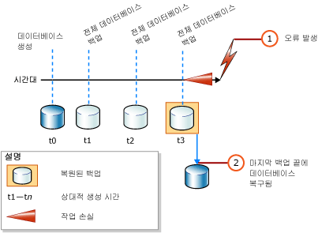
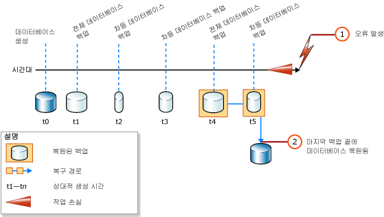

# <a name="complete-database-restores-simple-recovery-model"></a>전체 데이터베이스 복원(단순 복구 모델)
[!INCLUDE[tsql-appliesto-ss2016-xxxx-xxxx-xxx_md](../../includes/tsql-appliesto-ss2016-xxxx-xxxx-xxx-md.md)]

  전체 데이터베이스 복원의 목적은 전체 데이터베이스를 복원하는 것입니다. 복원하는 동안 전체 데이터베이스는 오프라인 상태가 됩니다. 데이터베이스의 일부를 온라인에 연결하기 전에 데이터베이스의 모든 부분의 지정 시간이 같고 커밋되지 않은 트랜잭션이 없는 일치하는 지점으로 모든 데이터를 복구합니다.  
  
 단순 복구 모델에서는 특정 백업 내의 특정 시점으로 데이터베이스를 복원할 수 없습니다.  
  
> [!IMPORTANT]  
>  알 수 없거나 신뢰할 수 없는 출처의 데이터베이스는 연결 또는 복원하지 않는 것이 좋습니다. 이러한 데이터베이스에 포함된 악성 코드가 의도하지 않은 [!INCLUDE[tsql](../../includes/tsql-md.md)] 코드를 실행하거나 스키마 또는 물리적 데이터베이스 구조를 수정하여 오류가 발생할 수 있습니다. 알 수 없거나 신뢰할 수 없는 소스의 데이터베이스를 사용하기 전에 비프로덕션 서버의 데이터베이스에서 [DBCC CHECKDB](../../t-sql/database-console-commands/dbcc-checkdb-transact-sql.md) 를 실행하여 데이터베이스에서 코드(예: 저장 프로시저 또는 다른 사용자 정의 코드)를 시험해 보세요.  
  
 **항목 내용**  
  
-   [단순 복구 모델에서의 데이터베이스 복원 개요](#Overview)  
  
-   [관련 태스크](#RelatedTasks)  
  
> [!NOTE]  
>  이전 버전 [!INCLUDE[ssNoVersion](../../includes/ssnoversion-md.md)]의 백업 지원에 대한 자세한 내용은 [RESTORE&#40;Transact-SQL&#41;](../../t-sql/statements/restore-statements-transact-sql.md)의 "호환성 지원" 섹션을 참조하세요.  
  
##  <a name="Overview"></a> 단순 복구 모델에서의 데이터베이스 복원 개요  
 단순 복구 모델에서는 차등 데이터베이스 백업을 복원할지 여부에 따라 전체 데이터베이스 복원이 하나 또는 두 개의 [RESTORE](../../t-sql/statements/restore-statements-transact-sql.md) 문으로 이루어집니다. 전체 데이터베이스 백업만 사용하는 경우 다음 그림과 같이 최신 백업을 복원하면 됩니다.  
  
   
  
 또한 차등 데이터베이스 백업을 사용하는 경우 데이터베이스를 복구하지 않고 가장 최근의 전체 데이터베이스 백업을 복원한 다음 가장 최근의 차등 데이터베이스 백업을 복원하고 데이터베이스를 복구합니다. 다음 그림에서는 이 프로세스를 보여 줍니다.  
  
   
  
> [!NOTE]  
>  데이터베이스 백업을 다른 서버 인스턴스로 복원하려면 [백업 및 복원으로 데이터베이스 복사](../../relational-databases/databases/copy-databases-with-backup-and-restore.md)를 참조하세요.  
  
###  <a name="TsqlSyntax"></a> 기본 Transact-SQL RESTORE 구문  
 전체 데이터베이스 백업을 복원하는 기본 [!INCLUDE[tsql](../../includes/tsql-md.md)][RESTORE](../../t-sql/statements/restore-statements-transact-sql.md) 구문은 다음과 같습니다.  
  
 RESTORE DATABASE *database_name* FROM *backup_device* [ WITH NORECOVERY ]  
  
> [!NOTE]  
>  차등 데이터베이스 백업도 복원하려면 WITH NORECOVERY를 사용합니다.  
  
 데이터베이스 백업을 복원하는 기본 [RESTORE](../../t-sql/statements/restore-statements-transact-sql.md) 구문은 다음과 같습니다.  
  
 RESTORE DATABASE *database_name* FROM *backup_device* WITH RECOVERY  
  
###  <a name="Example"></a> 예(Transact-SQL)  
 다음 예에서는 먼저 [BACKUP](../../t-sql/statements/backup-transact-sql.md) 문을 사용하여 전체 데이터베이스 백업과 [!INCLUDE[ssSampleDBobject](../../includes/sssampledbobject-md.md)] 데이터베이스의 차등 데이터베이스 백업을 만드는 방법을 보여 줍니다. 그런 다음 이러한 백업을 차례로 복원합니다. 데이터베이스는 차등 데이터베이스 백업이 완료된 시점의 상태로 복원됩니다.  
  
 이 예에서는 전체 데이터베이스 복원 시나리오에 따른 복원 시퀀스의 중요 옵션을 보여 줍니다. *복원 순서* 는 하나 이상의 복원 단계를 통해 데이터를 이동시키는 하나 이상의 복원 작업으로 구성됩니다. 이 용도와 관련 없는 구문 및 세부 사항은 생략됩니다. 데이터베이스를 복구할 때 명확성을 위해 RECOVERY 옵션(기본값)을 명시적으로 지정하는 것이 좋습니다.  
  
> [!NOTE]  
>  이 예제는 복구 모델을 [로 설정하는](../../t-sql/statements/alter-database-transact-sql.md) ALTER DATABASE `SIMPLE`문으로 시작합니다.  
  
```  
USE master;  
--Make sure the database is using the simple recovery model.  
ALTER DATABASE AdventureWorks2012 SET RECOVERY SIMPLE;  
GO  
-- Back up the full AdventureWorks2012 database.  
BACKUP DATABASE AdventureWorks2012   
TO DISK = 'Z:\SQLServerBackups\AdventureWorks2012.bak'   
  WITH FORMAT;  
GO  
--Create a differential database backup.  
BACKUP DATABASE AdventureWorks2012   
TO DISK = 'Z:\SQLServerBackups\AdventureWorks2012.bak'  
   WITH DIFFERENTIAL;  
GO  
--Restore the full database backup (from backup set 1).  
RESTORE DATABASE AdventureWorks2012   
FROM DISK = 'Z:\SQLServerBackups\AdventureWorks2012.bak'   
   WITH FILE=1, NORECOVERY;  
--Restore the differential backup (from backup set 2).  
RESTORE DATABASE AdventureWorks2012   
FROM DISK = 'Z:\SQLServerBackups\AdventureWorks2012.bak'   
   WITH FILE=2, RECOVERY;  
GO  
```  
  
##  <a name="RelatedTasks"></a> 관련 태스크  
 **전체 데이터베이스 백업을 복원하려면**  
  
-   [단순 복구 모델에서 데이터베이스 백업 복원&#40;Transact-SQL&#41;](../../relational-databases/backup-restore/restore-a-database-backup-under-the-simple-recovery-model-transact-sql.md)  
  
-   [Restore a Database Backup Using SSMS](../../relational-databases/backup-restore/restore-a-database-backup-using-ssms.md)  
  
-   [데이터베이스를 새 위치로 복원&#40;SQL Server&#41;](../../relational-databases/backup-restore/restore-a-database-to-a-new-location-sql-server.md)  
  
 **차등 데이터베이스 백업을 복원하려면**  
  
-   [차등 데이터베이스 백업 복원&#40;SQL Server&#41;](../../relational-databases/backup-restore/restore-a-differential-database-backup-sql-server.md)  
  
 **SMO(SQL Server 관리 개체)를 사용하여 백업을 복원하려면**  
  
-   <xref:Microsoft.SqlServer.Management.Smo.Restore.SqlRestore%2A>  
  
## <a name="see-also"></a>참고 항목  
 [RESTORE&#40;Transact-SQL&#41;](../../t-sql/statements/restore-statements-transact-sql.md)   
 [BACKUP&#40;Transact-SQL&#41;](../../t-sql/statements/backup-transact-sql.md)   
 [sp_addumpdevice&#40;Transact-SQL&#41;](../../relational-databases/system-stored-procedures/sp-addumpdevice-transact-sql.md)   
 [전체 데이터베이스 백업&#40;SQL Server&#41;](../../relational-databases/backup-restore/full-database-backups-sql-server.md)   
 [차등 백업&#40;SQL Server&#41;](../../relational-databases/backup-restore/differential-backups-sql-server.md)   
 [백업 개요&#40;SQL Server&#41;](../../relational-databases/backup-restore/backup-overview-sql-server.md)   
 [복원 및 복구 개요&#40;SQL Server&#41;](../../relational-databases/backup-restore/restore-and-recovery-overview-sql-server.md)  
  
  
