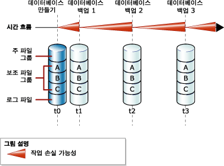
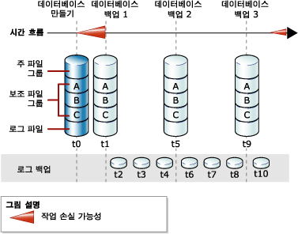

# <a name="full-database-backups-sql-server"></a>전체 데이터베이스 백업(SQL Server)
[!INCLUDE[appliesto-ss-xxxx-xxxx-xxx-md](../../includes/appliesto-ss-xxxx-xxxx-xxx-md.md)] 전체 데이터베이스 백업은 전체 데이터베이스를 백업합니다. 이 백업은 전체 데이터베이스 백업이 복원된 후 전체 데이터베이스가 복구될 수 있도록 트랜잭션 로그의 일부를 포함합니다. 전체 데이터베이스 백업은 백업 완료 시점의 데이터베이스를 나타냅니다.  
  
> [!TIP]  
>  데이터베이스가 커짐에 따라 전체 데이터베이스 백업은 완료하는 데 시간이 오래 걸리고 저장 공간도 더 많이 필요하게 됩니다. 따라서 큰 데이터베이스의 경우 *차등 데이터베이스 백업*으로 전체 데이터베이스 백업을 보완할 수 있습니다. 자세한 내용은 [차등 백업&#40;SQL Server&#41;](../../relational-databases/backup-restore/differential-backups-sql-server.md)을 참조하세요.  
  
> [!IMPORTANT]  
>  데이터베이스 백업에서 TRUSTWORTHY는 OFF로 설정되어 있습니다. TRUSTWORTHY를 ON으로 설정하는 방법은 [ALTER DATABASE SET 옵션&#40;Transact-SQL&#41;](../../t-sql/statements/alter-database-transact-sql-set-options.md)을 참조하세요.  
  
 **항목 내용:**  
  
-   [단순 복구 모델에서 데이터베이스 백업](#DbBuRMs)  
  
-   [전체 복구 모델에서 데이터베이스 백업](#DbBuRMf)  
  
-   [전체 데이터베이스 백업을 사용하여 데이터베이스 복원](#RestoreDbBu)  
  
-   [관련 태스크](#RelatedTasks)  
  
##  <a name="DbBuRMs"></a> 단순 복구 모델에서 데이터베이스 백업  
 단순 복구 모델에서는 각 백업 후 재해가 발생할 경우 데이터베이스가 잠재적 작업 손실 위험에 노출될 수 있습니다. 다음 백업이 시작되어 작업 손실 가능성이 다시 0이 되고 새 작업 손실 가능성 주기가 시작될 때까지 작업 손실 가능성은 업데이트를 수행할 때마다 커집니다. 시간의 경과에 따라 백업 사이의 작업 손실 가능성이 증가합니다. 다음 그림에서는 전체 데이터베이스 백업만 사용하는 백업 전략의 작업 손실 가능성을 보여 줍니다.  
  
   
  
### <a name="example-includetsqlincludestsql-mdmd"></a>예([!INCLUDE[tsql](../../includes/tsql-md.md)])  
 다음 예에서는 기존 백업을 덮어쓰고 새 미디어 세트를 만들기 위해 WITH FORMAT을 사용하여 전체 데이터베이스 백업을 만드는 방법을 보여 줍니다.  
  
```  
-- Back up the AdventureWorks2012 database to new media set.  
BACKUP DATABASE AdventureWorks2012  
    TO DISK = 'Z:\SQLServerBackups\AdventureWorksSimpleRM.bak'   
    WITH FORMAT;  
GO  
```  
  
##  <a name="DbBuRMf"></a> 전체 복구 모델에서 데이터베이스 백업  
 전체 및 대량 로그 복구를 사용하는 데이터베이스의 경우 데이터베이스 백업이 필요하지만 이것만으로 충분하지는 않습니다. 또한 트랜잭션 로그 백업이 필요합니다. 다음 그림에서는 전체 복구 모델에서 사용 가능한 가장 단순한 백업 전략을 보여 줍니다.  
  
   
  
 로그 백업을 만드는 방법은 [트랜잭션 로그 백업&#40;SQL Server&#41;](../../relational-databases/backup-restore/transaction-log-backups-sql-server.md)을 참조하세요.  
  
### <a name="example-includetsqlincludestsql-mdmd"></a>예([!INCLUDE[tsql](../../includes/tsql-md.md)])  
 다음 예에서는 기존 백업을 덮어쓰고 새 미디어 세트를 만들기 위해 WITH FORMAT을 사용하여 전체 데이터베이스 백업을 만드는 방법을 보여 줍니다. 그런 다음 트랜잭션 로그를 백업합니다. 실제 상황에서는 일련의 정기적인 로그 백업을 수행해야 합니다. 이 예의 경우 [!INCLUDE[ssSampleDBobject](../../includes/sssampledbobject-md.md)] 예제 데이터베이스는 전체 복구 모델을 사용하도록 설정됩니다.  
  
```  
USE master;  
ALTER DATABASE AdventureWorks2012 SET RECOVERY FULL;  
GO  
-- Back up the AdventureWorks2012 database to new media set (backup set 1).  
BACKUP DATABASE AdventureWorks2012  
  TO DISK = 'Z:\SQLServerBackups\AdventureWorks2012FullRM.bak'   
  WITH FORMAT;  
GO  
--Create a routine log backup (backup set 2).  
BACKUP LOG AdventureWorks2012 TO DISK = 'Z:\SQLServerBackups\AdventureWorks2012FullRM.bak';  
GO  
```  
  
##  <a name="RestoreDbBu"></a> 전체 데이터베이스 백업을 사용하여 데이터베이스 복원  
 전체 데이터베이스 백업에서 임의 위치로 데이터베이스를 복원하여 전체 데이터베이스를 한 번에 다시 만들 수 있습니다. 충분한 트랜잭션 로그가 백업에 포함되어 있으므로 백업 완료 시점에 데이터베이스를 복구할 수 있습니다. 복원된 데이터베이스는 커밋되지 않은 트랜잭션을 제외하면 데이터베이스 백업이 완료된 당시의 원래 데이터베이스 상태와 일치합니다. 전체 복구 모델에서는 모든 후속 트랜잭션 로그 백업을 복원해야 합니다. 데이터베이스가 복구되면 커밋되지 않은 트랜잭션이 롤백됩니다.  
  
 자세한 내용은 [전체 데이터베이스 복원&#40;단순 복구 모델&#41;](../../relational-databases/backup-restore/complete-database-restores-simple-recovery-model.md) 또는 [전체 데이터베이스 복원&#40;전체 복구 모델&#41;](../../relational-databases/backup-restore/complete-database-restores-full-recovery-model.md)을 참조하세요.  
  
##  <a name="RelatedTasks"></a> 관련 태스크  
 **전체 데이터베이스 백업을 만들려면**  
  
-   [전체 데이터베이스 백업 만들기&#40;SQL Server&#41;](../../relational-databases/backup-restore/create-a-full-database-backup-sql-server.md)  
  
-   <xref:Microsoft.SqlServer.Management.Smo.Backup.SqlBackup%2A> (SMO)  
  
 **백업 작업을 예약하려면**  
  
 [유지 관리 계획 마법사 사용](../../relational-databases/maintenance-plans/use-the-maintenance-plan-wizard.md)  
  
## <a name="see-also"></a>참고 항목  
 [SQL Server 데이터베이스 백업 및 복원](../../relational-databases/backup-restore/back-up-and-restore-of-sql-server-databases.md)   
 [백업 개요&#40;SQL Server&#41;](../../relational-databases/backup-restore/backup-overview-sql-server.md)   
 [Analysis Services 데이터베이스 백업 및 복원](../../analysis-services/multidimensional-models/backup-and-restore-of-analysis-services-databases.md)  
  
  
