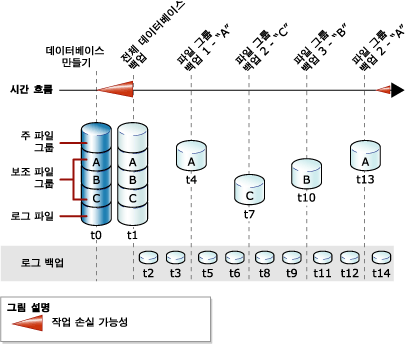

# 전체 파일 백업(SQL Server)
[!INCLUDE[appliesto-ss-xxxx-xxxx-xxx-md](../../includes/appliesto-ss-xxxx-xxxx-xxx-md.md)]
  이 항목에서는 여러 개의 파일 및 파일 그룹을 포함하고 있는 [!INCLUDE[ssNoVersion](../../includes/ssnoversion-md.md)] 데이터베이스에 관련된 내용을 다룹니다.  
  
 [!INCLUDE[ssNoVersion](../../includes/ssnoversion-md.md)] 데이터베이스의 파일을 개별적으로 백업하고 복원할 수 있습니다. 또한 각 구성 파일을 개별적으로 지정하는 대신 전체 파일 그룹을 지정할 수 있습니다. 이때 파일 그룹에 오프라인 상태인 파일이 있다면(예: 복원 중인 파일) 전체 파일 그룹이 오프라인 상태가 되고 이를 백업할 수 없습니다.  
  
 읽기 전용 파일 그룹의 파일 백업을 부분 백업과 결합할 수 있습니다. 부분 백업은 모든 읽기/쓰기 파일 그룹과 필요에 따라 하나 이상의 읽기 전용 파일 그룹을 포함합니다. 자세한 내용은 [부분 백업&#40;SQL Server&#41;](../../relational-databases/backup-restore/partial-backups-sql-server.md)을 참조하세요.  
  
 파일 백업은 차등 파일 백업의 *차등 기반* 으로 사용될 수 있습니다. 자세한 내용은 [차등 백업&#40;SQL Server&#41;](../../relational-databases/backup-restore/differential-backups-sql-server.md)을 참조하세요.  
  
> [!NOTE]  
>  전체 파일 백업은 *차등 파일 백업*과 명시적으로 비교하는 경우를 제외하고 일반적으로 *파일 백업*이라고 합니다.  
  
 **항목 내용:**  
  
-   [파일 백업의 이점](#Benefits)  
  
-   [파일 백업의 단점](#Disadvantages)  
  
-   [파일 백업 개요](#Overview)  
  
-   [관련 작업](#RelatedTasks)  
  
##   파일 백업의 이점  
 파일 백업은 데이터베이스 백업에 비해 다음과 같은 장점이 있습니다.  
  
-   파일 백업을 사용하면 데이터베이스의 나머지 부분을 복원하지 않고 손상된 파일만 복원할 수 있으므로 복구 속도를 높일 수 있습니다.  
  
     예를 들어 데이터베이스가 서로 다른 디스크에 저장된 여러 개의 파일로 구성되어 있고 한 디스크에 오류가 있으면 오류가 있는 디스크의 파일만 복원하면 됩니다. 손상된 파일을 빠르게 복구할 수 있으므로 전체 데이터베이스에 대해 복구할 때보다 더 빠르게 복구됩니다.  
  
-   파일 백업은 초대형 데이터베이스의 경우 관리가 힘든 전체 데이터베이스 백업에 비해 일정 예약 및 미디어 처리의 유연성이 뛰어납니다. 파일 또는 파일 그룹 백업의 뛰어난 유연성은 다양한 업데이트 특성을 가진 데이터가 포함된 대형 데이터베이스에도 유용합니다.  
  
##   파일 백업의 단점  
  
-   전체 데이터베이스 백업과 비교하여 파일 백업의 주요 단점은 관리가 더 복잡하다는 점입니다. 이렇게 전체 백업을 유지 관리하고 추적하는 태스크는 많은 시간이 소모되므로 전체 데이터베이스 백업의 공간 요구 사항 문제보다 더욱 부담이 될 수 있습니다.  
  
-   미디어 실패가 발생했을 때 손상된 파일이 백업되지 않은 경우 전체 데이터베이스를 복구하지 못할 수도 있습니다. 따라서 완전한 파일 백업 세트를 유지 관리해야 하며 전체 복구 모델 및 대량 로그 복구 모델의 경우 첫 번째 전체 파일 백업과 마지막 전체 파일 백업 사이의 최소 간격을 포함하는 하나 이상의 로그 백업을 유지 관리해야 합니다.  
  
##   파일 백업 개요  
 전체 파일 백업은 하나 이상의 파일 또는 파일 그룹에 있는 모든 데이터를 백업합니다. 기본적으로 파일 백업은 충분한 로그 레코드를 포함하여 백업 작업의 끝으로 파일을 롤포워드합니다.  
  
 읽기 전용 파일이나 파일 그룹 백업은 모든 복구 모델에 대해 동일합니다. 전체 복구 모델에서 완전한 전체 파일 백업 세트를 모든 파일 백업을 포함하기에 충분한 로그 백업과 함께 사용하는 것은 전체 데이터베이스 백업을 수행하는 것과 같습니다.  
  
 한 번에 하나의 파일 백업 작업만 할 수 있습니다. 하나의 작업에서 여러 파일을 백업할 수 있지만 단일 파일만 복원해야 할 경우 이 작업으로 인해 복구 시간이 늘어날 수 있습니다. 이는 해당 파일을 찾기 위해 전체 백업을 읽기 때문입니다.  
  
> [!NOTE]  
>  개별 파일은 데이터베이스 백업에서 복원할 수도 있지만 데이터베이스 백업에서 파일을 찾아 복원하는 시간은 파일 백업에서보다 더 오래 걸립니다.  
  
### 파일 백업 및 단순 복구 모델  
 단순 복구 모델에서 읽기/쓰기 파일은 모두 함께 백업해야 합니다. 이렇게 하면 데이터베이스를 일정한 지정 시간으로 복원할 수 있습니다. 각 읽기/쓰기 파일 또는 파일 그룹을 개별적으로 지정하는 대신 READ_WRITE_FILEGROUPS 옵션을 사용하세요. 이 옵션은 데이터베이스의 모든 읽기/쓰기 파일 그룹을 백업합니다. READ_WRITE_FILEGROUPS를 지정하여 만든 백업은 부분 백업이라고도 합니다. 자세한 내용은 [부분 백업&#40;SQL Server&#41;](../../relational-databases/backup-restore/partial-backups-sql-server.md)을 참조하세요.  
  
### 파일 백업 및 전체 복구 모델  
 전체 복구 모델에서는 나머지 백업 전략에 관계없이 트랜잭션 로그를 백업해야 합니다. 첫 번째 파일 백업에서 시작하여 모든 파일 백업을 수행할 수 있는 충분한 로그 백업과 완전한 전체 파일 백업 세트는 전체 데이터베이스 백업에 해당합니다.  
  
 파일 및 로그 백업만을 사용하는 데이터베이스 복원은 복잡할 수 있습니다. 따라서 가능한 경우 최상의 방법은 전체 데이터베이스 백업을 수행하고 첫 번째 파일 백업 이전에 로그 백업을 시작하는 것입니다. 다음 그림에서는 데이터베이스가 생성된 후(시간 t0) 즉시(시간 t1) 전체 데이터베이스 백업이 수행되는 전략을 보여 줍니다. 이 첫 번째 데이터베이스 백업을 사용하여 트랜잭션 로그 백업을 시작할 수 있습니다. 트랜잭션 로그 백업은 지정된 간격으로 수행되도록 예약됩니다. 파일 백업은 데이터베이스의 비즈니스 요구 사항에 가장 적합한 간격으로 수행됩니다. 이 그림에서는 한 번에 하나씩 백업되는 4개의 파일 그룹을 보여 줍니다. 백업되는 순서(A, C, B, A)는 데이터베이스의 비즈니스 요구 사항을 반영합니다.  
  
   
  
> [!NOTE]  
>  전체 복구 모델에서는 파일이 나머지 데이터베이스와 일치하도록 읽기/쓰기 파일 백업을 복원할 때 트랜잭션 로그를 롤포워드해야 합니다. 여러 트랜잭션 로그 백업을 롤포워드하지 않으려면 차등 파일 백업을 사용하세요. 자세한 내용은 [차등 백업&#40;SQL Server&#41;](../../relational-databases/backup-restore/differential-backups-sql-server.md)을 참조하세요.  
  
##   관련 작업  
 **파일 또는 파일 그룹 백업을 만들려면**  
  
-   [파일 및 파일 그룹 백업&#40;SQL Server&#41;](../../relational-databases/backup-restore/back-up-files-and-filegroups-sql-server.md)  
  
-   <xref:Microsoft.SqlServer.Management.Smo.Backup.SqlBackup%2A> (SMO)  
  
> [!NOTE]  
>  유지 관리 계획 마법사는 파일 백업을 지원하지 않습니다.  
  
## 참고 항목  
 [BACKUP&#40;Transact-SQL&#41;](../../t-sql/statements/backup-transact-sql.md)   
 [백업 개요&#40;SQL Server&#41;](../../relational-databases/backup-restore/backup-overview-sql-server.md)   
 [백업 및 복원: 상호 운용성 및 공존성&#40;SQL Server&#41;](../../relational-databases/backup-restore/backup-and-restore-interoperability-and-coexistence-sql-server.md)   
 [차등 백업&#40;SQL Server&#41;](../../relational-databases/backup-restore/differential-backups-sql-server.md)   
 [파일 복원&#40;단순 복구 모델&#41;](../../relational-databases/backup-restore/file-restores-simple-recovery-model.md)   
 [파일 복원&#40;전체 복구 모델&#41;](../../relational-databases/backup-restore/file-restores-full-recovery-model.md)   
 [온라인 복원&#40;SQL Server&#41;](../../relational-databases/backup-restore/online-restore-sql-server.md)   
 [증분 복원&#40;SQL Server&#41;](../../relational-databases/backup-restore/piecemeal-restores-sql-server.md)  
  
  
