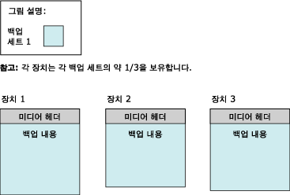
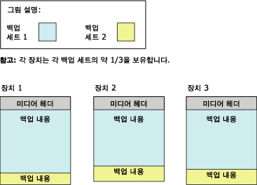

# <a name="media-sets-media-families-and-backup-sets-sql-server"></a>미디어 세트, 미디어 패밀리 및 백업 세트(SQL Server)
[!INCLUDE[appliesto-ss-xxxx-xxxx-xxx-md](../../includes/appliesto-ss-xxxx-xxxx-xxx-md.md)]
  **이 항목에서는 [!INCLUDE[ssNoVersion](../../includes/ssnoversion-md.md)] 를 처음 접하는 사용자를 위해 [!INCLUDE[ssNoVersion](../../includes/ssnoversion-md.md)]백업 및 복원의 기본적인 백업 미디어 관련 용어를 소개합니다.** 
  
  이 항목에서는 [!INCLUDE[ssNoVersion](../../includes/ssnoversion-md.md)] 에서 백업 미디어를 사용하는 형식, 백업 미디어와 백업 장치 간의 관계, 백업 미디어에서의 백업 구성, 미디어 세트 및 미디어 패밀리에 대한 몇 가지 고려 사항에 대해 설명합니다. 이 항목에서는 백업 미디어를 처음 사용하기 전에 초기화하거나 포맷하는 방법과 기존 미디어 세트를 새로운 미디어 세트로 교체하는 방법, 미디어 세트의 기존 백업 세트를 덮어쓰는 방법 및 미디어 세트에 새로운 백업 세트를 추가하는 방법에 대해서도 설명합니다.  
  
>**참고!** Microsoft Azure Blob 저장소 서비스로 SQL Server 백업 방법에 대한 자세한 내용은 [Microsoft Azure Blob 저장소 서비스로 SQL Server 백업 및 복원](../../relational-databases/backup-restore/sql-server-backup-and-restore-with-microsoft-azure-blob-storage-service.md)을 참조하세요.  
   
##  <a name="TermsAndDefinitions"></a> 용어  
 **미디어 세트(media set)**  
 하나 이상의 백업 작업에서 고정된 유형과 개수의 백업 장치를 사용하여 기록한 백업 미디어, 테이프 또는 디스크 파일의 모음입니다.  
  
 **미디어 패밀리(media family)**  
 미디어 세트의 미러되지 않은 단일 장치나 일련의 미러된 장치에 생성된 백업입니다.  
  
**백업 세트(backup set)**  
 백업 작업이 성공할 때 미디어 세트에 추가되는 백업 내용입니다.  
  

##  <a name="OvMediaSetsFamiliesBackupSets"></a> 미디어 세트, 미디어 패밀리 및 백업 세트의 개요  
 백업 미디어가 하나 이상인 세트의 백업이 미디어 세트 하나를 구성합니다. *미디어 세트* 는 하나 이상의 백업 작업에서 고정된 유형과 개수의 백업 장치를 사용하여 기록한 *백업 미디어*, 테이프 또는 디스크 파일, 또는 Windows Azure Blob을 정렬하여 모아 놓은 것입니다. 지정된 미디어 세트에서는 테이프 드라이브, 디스크 드라이브 또는 Azure Blob을 사용하지만 둘 이상을 조합하여 사용하지는 않습니다. 
 
**예제:** 미디어 세트와 연결된 백업 장치는 `\\.\TAPE0`, `\\.\TAPE1`및 `\\.\TAPE2`라는 3개의 테이프 드라이브일 수 있습니다. 이 미디어 세트에는 드라이브마다 최소한 3개로 시작되는 테이프만 포함됩니다. 미디어 세트가 만들어질 때 백업 장치 유형과 개수가 설정되며 이 값은 변경할 수 없습니다. 그러나 필요할 경우 백업 작업과 복원 작업 중간에 지정된 장치를 같은 유형의 장치로 바꿀 수 있습니다.  
  
 백업 미디어를 포맷하여 백업 작업을 수행하는 동안 백업 미디어에 미디어 세트가 생성됩니다. 자세한 내용은 이 항목의 뒷부분에 나오는 [새 미디어 세트 만들기](#CreatingMediaSet)를 참조하십시오. 포맷 후에는 각 파일이나 테이프에 미디어 세트의 미디어 헤더가 포함되어 파일이나 테이프가 백업 내용을 수신할 수 있는 준비가 됩니다. 헤더가 있으면 백업 작업에서 작업에 지정된 모든 백업 장치에 있는 백업 미디어에 지정된 데이터를 백업합니다.  
  
> **참고!** 미디어 세트를 미러링하여 손상된 미디어 볼륨(테이프 또는 디스크 파일)으로부터 보호할 수 있습니다. 자세한 내용은 이 항목의 뒷부분에 나오는 [미러된 백업 미디어 세트&#40;SQL Server&#41;](../../relational-databases/backup-restore/mirrored-backup-media-sets-sql-server.md)백업 및 복원의 기본적인 백업 미디어 관련 용어를 소개합니다.  
  
 압축된 백업과 압축되지 않은 백업은 미디어 세트에서 함께 발생할 수 없습니다. [!INCLUDE[ssKatmai](../../includes/sskatmai-md.md)] 이상의 모든 버전에서는 압축된 백업을 읽을 수 있습니다. 자세한 내용은 [백업 압축&#40;SQL Server&#41;](../../relational-databases/backup-restore/backup-compression-sql-server.md)을 참조하세요.  

  
## <a name="media-families"></a>미디어 패밀리  
 *미디어 패밀리*는 미디어 세트의 미러되지 않은 단일 장치나 일련의 미러된 장치에 생성된 백업으로 구성됩니다. 미디어 세트에 사용된 백업 장치 수에 따라 미디어 세트의 미디어 패밀리 수가 결정됩니다. 예를 들어 미디어 세트에 미러되지 않은 백업 장치 두 개가 사용되면 미디어 세트에는 두 개의 미디어 패밀리가 포함됩니다.  
  
미러된 미디어 세트의 각 미디어 패밀리가 미러됩니다. 예를 들어 미러 두 개가 사용되는 미디어 세트 포맷에 백업 장치 6개가 사용되면 백업 데이터의 해당 복사본 두 개를 각각 포함하는 미디어 패밀리가 3개가 됩니다. 미러된 미디어 세트에 대한 자세한 내용은 [미러된 백업 미디어 세트&#40;SQL Server&#41;](../../relational-databases/backup-restore/mirrored-backup-media-sets-sql-server.md)백업 및 복원의 기본적인 백업 미디어 관련 용어를 소개합니다.  
  
 미디어 패밀리의 각 테이프나 디스크에는 *미디어 시퀀스 번호*가 할당됩니다. 디스크의 미디어 시퀀스 번호는 항상 1입니다. 테이프 미디어 패밀리에서 초기 테이프의 시퀀스 번호는 1이고 두 번째 테이프의 시퀀스 번호는 2이며 나머지 시퀀스 번호도 이와 같은 순서로 지정됩니다. 자세한 내용은 이 항목의 뒷부분에 나오는 [미디어 세트, 미디어 패밀리 및 백업 세트(SQL Server)](../../relational-databases/backup-restore/media-sets-media-families-and-backup-sets-sql-server.md)백업 및 복원의 기본적인 백업 미디어 관련 용어를 소개합니다.
  
## <a name="the-media-header"></a>미디어 헤더  
 모든 백업 미디어(디스크 파일 또는 테이프) 볼륨에는 테이프나 디스크를 사용하는 첫 번째 백업 작업에서 만들어진 미디어 헤더가 포함됩니다. 미디어를 다시 포맷할 때까지 이 헤더가 그대로 유지됩니다.  
  
 미디어 헤더에는 미디어(디스크 파일 또는 테이프)와 미디어가 포함된 미디어 패밀리에서의 위치를 식별하는 데 필요한 정보가 포함됩니다. 이 정보에는 다음이 포함됩니다.  
  
-   미디어 이름  
  
     미디어 이름은 선택 사항이지만 미디어를 잘 나타내는 이름을 일관되게 사용하는 것이 좋습니다. 미디어를 포맷하는 사용자는 누구든지 미디어 이름을 할당할 수 있습니다.  
  
-   미디어 세트의 고유 ID 번호  
  
-   미디어 세트의 미디어 패밀리 수  
  
-   해당 미디어가 포함된 미디어 패밀리의 시퀀스 번호  
  
-   미디어 패밀리의 고유 ID 번호  
  
-   미디어 패밀리에 있는 해당 미디어의 시퀀스 번호. 디스크 파일의 경우는 이 값이 항상 1입니다.  
  
-   미디어 설명에 MTF 미디어 레이블이나 미디어 설명이 포함되는지 여부  
  
    >**참고!** 백업 및 복원 작업에 사용되는 모든 미디어는 MTF( [!INCLUDE[msCoName](../../includes/msconame-md.md)] Tape Format)라는 표준 백업 형식을 사용합니다. MTF를 사용하여 사용자는 MTF 관련 설명이 있는 테이프 레이블을 지정할 수 있습니다. [!INCLUDE[ssNoVersion](../../includes/ssnoversion-md.md)] 에서는 다른 응용 프로그램에서 작성한 모든 MTF 미디어 레이블을 유지하지만 MTF 미디어 레이블을 직접 작성하지는 않습니다.  
  
-   [!INCLUDE[msCoName](../../includes/msconame-md.md)] Tape Format 미디어 레이블 또는 자유형 텍스트로 된 미디어 설명  
  
-   레이블을 기록한 백업 소프트웨어의 이름  
  
-   미디어를 포맷한 소프트웨어 공급업체의 고유 공급업체 ID 번호  
  
-   레이블을 작성한 날짜와 시간  
  
-   세트의 미러 개수(1-4). 1은 미러되지 않은 장치를 나타냅니다.  
  
 [!INCLUDE[ssCurrent](../../includes/sscurrent-md.md)] 에서는 이전 버전의 [!INCLUDE[ssNoVersion](../../includes/ssnoversion-md.md)]에서 포맷된 미디어를 처리할 수 있습니다.  
  
## <a name="backup-sets"></a>백업 세트  
 백업 작업에 성공하면 미디어 세트에 *백업 세트* 하나가 추가됩니다. 백업 세트는 백업이 속해 있는 미디어 세트와 관련해서 설명됩니다. 백업 미디어에 미디어 패밀리가 하나뿐이면 해당 패밀리에 전체 백업 세트가 포함됩니다. 백업 미디어에 미디어 패밀리가 여러 개 있으면 백업 세트가 여러 패밀리에 분산됩니다. 각 미디어에서 백업 세트를 설명하는 헤더가 백업 세트에 포함됩니다.  
  
 이 예제에서는 테이프 드라이브 세 개를 백업 장치로 사용하여 [!INCLUDE[tsql](../../includes/tsql-md.md)] 데이터베이스에 대해 `MyAdvWorks_MediaSet_1` 이라는 미디어 세트를 만드는 [!INCLUDE[ssSampleDBobject](../../includes/sssampledbobject-md.md)] 문을 보여 줍니다.  
  
```  
BACKUP DATABASE AdventureWorks2012  
TO TAPE = '\\.\tape0', TAPE = '\\.\tape1', TAPE = '\\.\tape2'  
WITH   
   FORMAT,  
   MEDIANAME = 'MyAdvWorks_MediaSet_1'  
```  
  
 이 백업 작업이 성공하면 새로운 미디어 헤더와 백업 세트 하나가 포함된 새 미디어 세트가 테이프 3개에 분산됩니다. 다음 그림에서는 이러한 결과를 보여 줍니다.  
  
   
  
 일반적으로 미디어 세트가 만들어지면 다음 백업 작업에서 해당 백업 세트를 미디어 세트에 차례로 추가합니다. 백업 세트에 사용된 모든 미디어는 포함된 미디어나 백업 장치 수에 관계없이 미디어 세트를 구성합니다. 미디어 세트에서의 위치에 따라 백업 세트에 순차적으로 번호가 지정되어 복원할 백업 세트를 지정할 수 있습니다.  
  
 미디어 세트에 대한 모든 백업 작업에서 개수와 유형이 같은 백업 장치에 써야 합니다. 첫 번째 백업 세트와 마찬가지로 장치가 여러 개일 경우 모든 후속 백업 세트의 내용은 모든 장치에 있는 백업 미디어에 분산됩니다. 위의 예를 계속 수행하기 위해 두 번째 백업 작업(차등 백업)에서 같은 미디어 세트에 정보를 추가합니다.  
  
```  
BACKUP DATABASE AdventureWorks2012  
TO TAPE = '\\.\tape0', TAPE = '\\.\tape1', TAPE = '\\.\tape2'  
WITH   
   NOINIT,  
   MEDIANAME = 'AdventureWorksMediaSet1',  
   DIFFERENTIAL  
```  
  
> **참고!** NOINIT 옵션은 기본값이지만 의미를 강조하기 위해 포함되었습니다.  
  
 두 번째 백업 작업이 성공하면 백업 내용을 다음과 같이 분산하여 두 번째 백업 세트를 미디어 세트에 씁니다.  
  
   
  
 백업을 복원할 때 FILE 옵션을 사용하여 사용할 백업을 지정할 수 있습니다. 다음 예제에서는 [!INCLUDE[ssSampleDBobject](../../includes/sssampledbobject-md.md)] 데이터베이스의 전체 데이터베이스 백업을 복원한 후 동일한 미디어 세트에서 차등 데이터베이스 백업을 복원하는 경우 FILE **=***backup_set_file_number* 절을 사용하는 방법을 보여줍니다. 미디어 세트는 `\\.\tape0`, `tape1`및 `tape2`의 테이프 드라이브에 있는 세 개의 백업 테이프를 사용합니다.  
  
```  
RESTORE DATABASE AdventureWorks2012 FROM TAPE = '\\.\tape0', TAPE = '\\.\tape1', TAPE = '\\.\tape2'  
   WITH   
   MEDIANAME = 'AdventureWorksMediaSet1',  
   FILE=1,   
   NORECOVERY;  
RESTORE DATABASE AdventureWorks2012 FROM TAPE = '\\.\tape0', TAPE = '\\.\tape1', TAPE = '\\.\tape2'   
   WITH   
   MEDIANAME = 'AdventureWorksMediaSet1',  
   FILE=2,   
   RECOVERY;  
GO  
```  
  
 미디어 세트 및 해당 미디어 패밀리와 백업 세트 관련 정보를 저장하는 기록 테이블에 대한 자세한 내용은 [백업 기록 및 헤더 정보&#40;SQL Server&#41;](../../relational-databases/backup-restore/backup-history-and-header-information-sql-server.md)백업 및 복원의 기본적인 백업 미디어 관련 용어를 소개합니다.  
  
 미디어 세트의 백업 미디어 개수는 다음과 같은 요소에 따라 결정됩니다.  
  
-   백업 장치 개수  
  
-   백업 서비스 유형  
  
-   백업 세트 개수  

  
##  <a name="CreatingMediaSet"></a> Creating a new media set  
 새 미디어 세트를 만들려면 백업 미디어(하나 이상의 테이프 또는 디스크 파일)를 포맷해야 합니다. 포맷 프로세스 동안 다음과 같이 백업 미디어가 변경됩니다.  
  
1.  오래된 헤더(있는 경우)를 삭제하여 백업 미디어의 이전 내용을 효율적으로 삭제합니다.  
  
     테이프 장치를 포맷하면 현재 탑재된 테이프의 이전 내용이 모두 삭제됩니다. 디스크를 포맷하면 백업 작업에 지정한 파일만 영향을 받습니다.  
  
2.  각 백업 장치에서 백업 미디어(테이프 또는 디스크 파일)에 새 미디어 헤더를 작성합니다.  

  
##  <a name="UseExistingMediaSet"></a> 기존 미디어 세트에 백업  
 기존 미디어 세트에 백업하는 경우 다음 두 가지 옵션이 제공됩니다.  
  
-   기존 백업 세트에 추가합니다.  
  
     사용 가능한 공간을 가장 적합하게 사용하기 위해 일반적으로 새 백업 세트가 기존 미디어 세트에 추가됩니다. 백업에 추가하면 이전 백업이 유지됩니다. 자세한 내용은 이 항목의 뒷부분에 나오는 [기존 백업 세트에 추가](#Appending)를 참조하십시오.  

BACKUP의 기본 동작인 추가는 NOINIT 옵션을 사용하여 명시적으로 지정할 수 있습니다.  
  
-   현재 미디어 헤더를 그대로 유지하면서 현재 백업으로 기존 백업 세트를 덮어씁니다.  
  
     [!INCLUDE[ssNoVersion](../../includes/ssnoversion-md.md)] 에는 실수로 미디어를 덮어쓰지 않도록 하는 보호 장치가 있습니다. 그러나 백업을 사용하면 미리 정의한 만료 날짜에 이른 백업 세트를 자동으로 덮어쓸 수 있습니다.  
  
     테이프 헤더는 현재 위치에 두어도 됩니다. 자세한 내용은 이 항목의 뒷부분에 나오는 [백업 세트 덮어쓰기](#Overwriting)를 참조하십시오.  

    >  기존 백업 세트를 덮어쓰는 작업은 BACKUP 문의 INIT 옵션을 사용하여 지정됩니다.  
  
##  <a name="Appending"></a> Appending to existing backup sets  
 같거나 다른 데이터베이스에 대해 서로 다른 시간에 수행한 백업은 같은 미디어에 저장할 수 있습니다. 다른 백업 세트를 기존의 미디어에 추가하면 미디어의 이전 내용은 그대로 남아 있고 새 백업은 미디어에서 마지막 백업의 끝에 이어서 기록됩니다.  
  
 기본적으로 [!INCLUDE[ssNoVersion](../../includes/ssnoversion-md.md)] 는 항상 새 백업을 미디어에 추가합니다. 추가는 미디어의 끝에서만 발생합니다. 예를 들어 미디어 볼륨에 백업 세트가 5개 있을 때 첫 번째 3개의 백업 세트를 건너 뛰고 네 번째 백업 세트를 새 백업 세트로 덮어쓸 수는 없습니다.  
  
 테이프 백업 시 BACKUP WITH NOREWIND를 사용하면 테이프는 작업이 끝날 때 열린 채로 남아 있습니다. 따라서 테이프를 되감은 다음 마지막 백업 세트를 찾기 위해 앞으로 검색하지 않고 그대로 다른 백업을 테이프에 추가할 수 있습니다. 열려 있는 테이프 드라이브 목록은 **sys.dm_io_backup_tapes** 동적 관리 뷰에 있습니다. 자세한 내용은 [sys.dm_io_backup_tapes&#40;Transact-SQL&#41;](../../relational-databases/system-dynamic-management-views/sys-dm-io-backup-tapes-transact-sql.md)를 참조하세요.  
  
 Microsoft Windows 백업 및 [!INCLUDE[ssNoVersion](../../includes/ssnoversion-md.md)] 백업은 같은 미디어를 공유할 수 있지만 상호 운용되지는 않습니다. [!INCLUDE[ssNoVersion](../../includes/ssnoversion-md.md)] 백업에서는 Windows 데이터를 백업할 수 없습니다.  
  
> **중요!** 압축된 백업과 압축되지 않은 백업은 미디어 세트에서 함께 발생할 수 없습니다. [!INCLUDE[ssKatmai](../../includes/sskatmai-md.md)] 이상의 모든 버전에서는 압축된 백업을 읽을 수 있습니다. 자세한 내용은 [백업 압축&#40;SQL Server&#41;](../../relational-databases/backup-restore/backup-compression-sql-server.md)을 참조하세요.  
  
 
##  <a name="Overwriting"></a> Overwriting backup sets  
 기존 백업 세트를 덮어쓰는 작업은 BACKUP 문의 INIT 옵션을 사용하여 지정됩니다. 이 옵션은 미디어에 있는 모든 백업 세트를 덮어쓰고 미디어 헤더를 보관합니다(있는 경우). 미디어 헤더가 없다면 하나 만듭니다.  
  
 테이프 헤더는 현재 위치에 두어도 됩니다. 디스크 백업 미디어의 경우 백업 작업에서 지정하여 백업 장치에서 사용하는 파일만 덮어쓰므로 디스크의 다른 파일에는 영향을 주지 않습니다. 백업을 덮어쓸 때 기존의 미디어 헤더는 모두 보존되며 새 백업은 백업 장치의 첫 번째 백업으로 생성됩니다. 기존에 미디어 헤더가 없으면 관련된 미디어 이름과 미디어 설명이 있는 유효한 미디어 헤더가 자동으로 작성됩니다. 기존의 미디어 헤더가 잘못되었으면 백업 작업이 종료됩니다. 미디어가 비어 있으면 지정된 MEDIANAME, MEDIAPASSWORD 및 MEDIADESCRIPTION(있는 경우)으로 새 미디어 헤더가 생성됩니다.  
  
 
 백업 미디어가 다음 조건 중 하나를 만족하면 덮어쓰지 않습니다.  
  
-   미디어의 기존 백업이 만료되지 않았습니다. 건너뛰기가 지정된 경우 만료를 확인하지 않습니다.  
  
     만료 날짜를 사용하여 백업이 만료되는 날짜를 지정하고 다른 백업으로 덮어쓸 수 있습니다. 백업을 만들 때 만료 날짜를 지정할 수 있습니다. 기본적으로 만료 날짜는 **sp_configure** 로 설정된 **media retention**옵션에 따라 결정됩니다. 자세한 내용은 이 항목의 뒷부분에 나오는 [sp_configure &#40;Transact-SQL&#41;](../../relational-databases/system-stored-procedures/sp-configure-transact-sql.md)백업 및 복원의 기본적인 백업 미디어 관련 용어를 소개합니다.  
  
-   미디어 이름(제공된 경우)이 백업 미디어에 있는 이름과 일치하지 않습니다.  
  
     미디어 이름은 미디어를 쉽게 식별하기 위해 사용되는 설명적인 이름입니다.  
  
 그러나 기존의 미디어를 덮어쓰기로 결정했으면(예를 들어 테이프의 백업이 더 이상 필요하지 않은 경우) 이 검사는 생략해도 좋습니다.  
  
 백업 미디어가 Microsoft Windows에 의해 암호로 보호되는 경우 Microsoft SQL Server는 해당 미디어에 기록하지 않습니다. 암호가 설정된 미디어를 덮어쓰려면 미디어를 다시 초기화해야 합니다.  
  

  
##  <a name="SequenceNumbers"></a> 시퀀스 번호  
 미디어 세트에 미디어 패밀리가 여러 개 있거나 미디어 패밀리 안에 백업 미디어가 여러 개 있을 경우 올바른 순서가 중요합니다. 따라서 백업은 다음과 같은 방법으로 시퀀스 번호를 할당합니다.  
  
-   미디어 세트 안의 순차적 미디어 패밀리  
  
     미디어 세트 안에서는 미디어 세트 내 위치에 따라 미디어 패밀리에 순차적으로 번호가 지정됩니다. 미디어 패밀리 번호는 **backupmediafamily** 테이블의 **family_sequence_number** 열에 기록됩니다.  
  
-   미디어 패밀리 안의 실제 미디어  
  
     미디어 시퀀스 번호는 미디어 패밀리 안의 실제 미디어 순서를 나타냅니다. 초기 백업 미디어의 시퀀스 번호는 1로 지정되어 1로 태그를 붙이고 두 번째 미디어(첫 번째 연속 미디어)는 2로 태그를 붙이며 나머지 미디어도 이와 같은 순서로 태그를 붙입니다. 백업을 복원하는 운영자는 백업 세트를 복원할 때 미디어 시퀀스 번호를 사용하여 올바른 순서로 정확하게 미디어를 탑재할 수 있습니다.  
  
###  <a name="MultipleDevices"></a> 여러 장치  
 테이프 드라이브나 디스크 파일을 여러 개 사용할 때는 다음 사항을 고려해야 합니다.  
  
-   백업의 경우  
  
     백업 작업에서 만든 전체 미디어 세트는 모든 후속 백업 작업에서 사용해야 합니다. 예를 들어 두 가지 테이프 백업 장치를 사용하여 미디어 세트를 만든 경우 같은 미디어 세트의 모든 후속 백업 작업에서 두 가지 백업 장치를 사용해야 합니다.  
  
-   복원의 경우  
  
     디스크 백업에서 복원하는 경우와 온라인 복원의 경우 모든 미디어 패밀리를 동시에 탑재해야 합니다. 테이프 백업에서 오프라인으로 복원하는 경우 더 적은 백업 장치의 미디어 패밀리를 처리할 수 있습니다. 각 미디어 패밀리를 완전히 처리한 후에 다른 미디어 패밀리의 처리를 시작할 수 있습니다. 단일 장치를 사용하여 복원하는 경우가 아니면 미디어 패밀리는 항상 병렬로 처리됩니다.  
  
##  <a name="RelatedTasks"></a> 관련 태스크  
 **새 미디어 세트 만들기**  
  
-   [전체 데이터베이스 백업 만들기&#40;SQL Server&#41;](../../relational-databases/backup-restore/create-a-full-database-backup-sql-server.md)(**새 미디어 세트에 백업하고 기존 백업 세트 모두 지우기** 옵션)  
  
-   [BACKUP&#40;Transact-SQL&#41;](../../t-sql/statements/backup-transact-sql.md) (FORMAT 옵션)  
  
-   <xref:Microsoft.SqlServer.Management.Smo.Backup.FormatMedia%2A>  
  
 **기존 미디어에 새 백업 추가**  
  
-   [전체 데이터베이스 백업 만들기&#40;SQL Server&#41;](../../relational-databases/backup-restore/create-a-full-database-backup-sql-server.md)(**기존 백업 세트에 추가** 옵션)  
  
-   [BACKUP&#40;Transact-SQL&#41;](../../t-sql/statements/backup-transact-sql.md) (NOINIT 옵션)  
  
 **기존 백업 세트 덮어쓰기**  
  
-   [전체 데이터베이스 백업 만들기&#40;SQL Server&#41;](../../relational-databases/backup-restore/create-a-full-database-backup-sql-server.md)(**기존 백업 세트 모두 덮어쓰기** 옵션)  
  
-   [BACKUP&#40;Transact-SQL&#41;](../../t-sql/statements/backup-transact-sql.md) (INIT 옵션)  
  
 **만료 날짜 설정**  
  
-   [백업의 만료 날짜 설정&#40;SQL Server&#41;](../../relational-databases/backup-restore/set-the-expiration-date-on-a-backup-sql-server.md)  
  
 **미디어 시퀀스 번호 및 패밀리 시퀀스 번호 보기**  
  
-   [논리적 백업 장치의 속성 및 내용 보기&#40;SQL Server&#41;](../../relational-databases/backup-restore/view-the-properties-and-contents-of-a-logical-backup-device-sql-server.md)  
  
-   [backupmediafamily&#40;Transact-SQL&#41;](../../relational-databases/system-tables/backupmediafamily-transact-sql.md)(**family_sequence_number** 열)  
  
 **특정 백업 장치에 있는 백업 세트 보기**  
  
-   [백업 세트의 데이터와 로그 파일 보기&#40;SQL Server&#41;](../../relational-databases/backup-restore/view-the-data-and-log-files-in-a-backup-set-sql-server.md)  
  
-   [논리적 백업 장치의 속성 및 내용 보기&#40;SQL Server&#41;](../../relational-databases/backup-restore/view-the-properties-and-contents-of-a-logical-backup-device-sql-server.md)  
  
-   [RESTORE HEADERONLY&#40;Transact-SQL&#41;](../../t-sql/statements/restore-statements-headeronly-transact-sql.md)  
  
 **백업 장치에 있는 미디어의 미디어 헤더 읽기**  
  
-   [RESTORE LABELONLY&#40;Transact-SQL&#41;](../../t-sql/statements/restore-statements-labelonly-transact-sql.md)  
 
  
## <a name="see-also"></a>관련 항목:  
 [SQL Server 데이터베이스 백업 및 복원](../../relational-databases/backup-restore/back-up-and-restore-of-sql-server-databases.md)   
 [백업 및 복원 중 발생 가능한 미디어 오류&#40;SQL Server&#41;](../../relational-databases/backup-restore/possible-media-errors-during-backup-and-restore-sql-server.md)   
 [백업 기록 및 헤더 정보&#40;SQL Server&#41;](../../relational-databases/backup-restore/backup-history-and-header-information-sql-server.md)   
 [미러된 백업 미디어 세트&#40;SQL Server&#41;](../../relational-databases/backup-restore/mirrored-backup-media-sets-sql-server.md)   
 [BACKUP&#40;Transact-SQL&#41;](../../t-sql/statements/backup-transact-sql.md)   
 [RESTORE&#40;Transact-SQL&#41;](../../t-sql/statements/restore-statements-transact-sql.md)   
 [RESTORE REWINDONLY&#40;Transact-SQL&#41;](../../t-sql/statements/restore-statements-rewindonly-transact-sql.md)   
 [sp_configure &#40;Transact-SQL&#41;](../../relational-databases/system-stored-procedures/sp-configure-transact-sql.md)  
  
  
