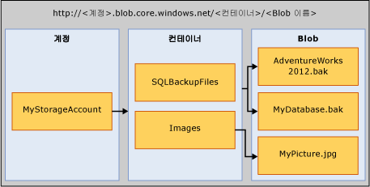

# <a name="sql-server-backup-to-url"></a>URL에 대한 SQL Server 백업
[!INCLUDE[tsql-appliesto-ss2016-xxxx-xxxx-xxx_md](../../includes/tsql-appliesto-ss2016-xxxx-xxxx-xxx-md.md)]

  이 항목에서는 Microsoft Azure Blob 저장소 서비스를 백업 대상으로 사용하는 데 필요한 개념, 요구 사항 및 구성 요소를 소개합니다. 백업 및 복원 기능은 디스크나 테이프를 사용하는 경우와 동일하거나 비슷하지만 몇 가지 차이점이 있습니다. 이러한 차이점과 몇 가지 코드 예제가 이 항목에서 소개됩니다.  
  
## <a name="requirements-components-and-concepts"></a>요구 사항, 구성 요소 및 개념  
 **섹션 내용**  
  
-   [보안](#security)  
  
-   [주요 구성 요소 및 개념 소개](#intorkeyconcepts)  
  
-   [Microsoft Azure Blob 저장소 서비스](#Blob)  
  
-   [SQL Server 구성 요소](#sqlserver)  
  
-   [제한 사항](#limitations)  
  
-   [Backup/Restore 문 지원](#Support)  
  
-   [SQL Server Management Studio에서 백업 태스크 사용](../../relational-databases/backup-restore/sql-server-backup-to-url.md#BackupTaskSSMS)  
  
-   [유지 관리 계획 마법사를 사용하여 URL로 SQL Server 백업](../../relational-databases/backup-restore/sql-server-backup-to-url.md#MaintenanceWiz)  
  
-   [SQL Server Management Studio를 사용하여 Windows Azure Storage에서 복원](../../relational-databases/backup-restore/sql-server-backup-to-url.md#RestoreSSMS)  
  
###  <a name="security"></a> 보안  
 다음은 Microsoft Azure Blob 저장소 서비스로 백업하거나 복원하는 경우 보안 고려 사항과 요구 사항입니다.  
  
-   Microsoft Azure BLOB 저장소 서비스의 컨테이너를 만들 때 액세스 권한을 **개인**으로 설정하는 것이 좋습니다. 액세스 권한을 개인으로 설정하면 사용자나 계정에 대한 액세스 시 필요한 정보를 제공해야 Windows Azure 계정 인증을 받을 수 있도록 제한됩니다.  
  
    > [!IMPORTANT]  
    >  [!INCLUDE[ssNoVersion](../../includes/ssnoversion-md.md)] 에서는 Microsoft Azure 계정 이름 및 액세스 키 인증 또는 공유 액세스 서명 및 액세스 토큰을 [!INCLUDE[ssNoVersion](../../includes/ssnoversion-md.md)] 자격 증명에 저장해야 합니다. 이 정보는 백업 또는 복원 작업을 수행할 때 Microsoft Azure 계정 인증을 받는 데 사용됩니다.  
  
-   BACKUP 또는 RESTORE 명령을 실행하는 데 사용되는 사용자 계정은 **모든 자격 증명 변경** 권한이 있는 **db_backup operator** 데이터베이스 역할에 있어야 합니다.  
  
###  <a name="intorkeyconcepts"></a> 주요 구성 요소 및 개념 소개  
 다음 두 섹션에서는 Microsoft Azure Blob 저장소 서비스와 Microsoft Azure Blob 저장소 서비스로 백업하거나 복원하는 데 사용되는 [!INCLUDE[ssNoVersion](../../includes/ssnoversion-md.md)] 구성 요소를 소개합니다. 구성 요소와 Microsoft Azure Blob 저장소 서비스로 백업하거나 복원할 때 구성 요소 간의 상호 작용을 이해하는 것이 중요합니다.  
  
 이 프로세스의 첫 번째 단계에서는 Azure 구독 내에 Microsoft Azure Storage 계정을 만듭니다. 이 저장소 계정은 저장소 계정을 사용하여 만든 모든 컨테이너 및 개체에 대한 모든 관리 권한이 있는 관리자 계정입니다. [!INCLUDE[ssNoVersion](../../includes/ssnoversion-md.md)] 에서는 Microsoft Azure Storage 계정 이름 및 해당 액세스 키 값을 사용하여 Microsoft Azure Blob 저장소 서비스에 인증하고 blob을 읽고 쓰거나, 읽기 및 쓰기 권한을 부여하는 특정 컨테이너에서 생성된 공유 액세스 서명 토큰을 사용할 수 있습니다. Azure Storage 계정에 대한 자세한 내용은 [Azure Storage 계정 정보](http://azure.microsoft.com/en-us/documentation/articles/storage-create-storage-account/) 를 참조하고, 공유 액세스 서명에 대한 자세한 내용은 [공유 액세스 서명, 1부: SAS 모델 이해](http://azure.microsoft.com/en-us/documentation/articles/storage-dotnet-shared-access-signature-part-1/)를 참조하세요. [!INCLUDE[ssNoVersion](../../includes/ssnoversion-md.md)] 자격 증명은 이 인증 정보를 저장하며 백업 또는 복원 작업 중에 사용됩니다.  
  
###  <a name="Blob"></a> Microsoft Azure Blob 저장소 서비스  
 **저장소 계정:** 저장소 계정은 모든 저장소 서비스의 시작 지점입니다. Microsoft Azure Blob 저장소 서비스에 액세스하려면 먼저 Microsoft Azure Storage 계정을 만듭니다. 자세한 내용은 [저장소 계정 만들기](http://azure.microsoft.com/en-us/documentation/articles/storage-create-storage-account/)를 참조하세요.  
  
 **컨테이너:** 컨테이너에서는 그룹화된 blob 집합을 제공하며 blob을 무제한으로 저장할 수 있습니다. Microsoft Azure Blob 저장소 서비스에 [!INCLUDE[ssNoVersion](../../includes/ssnoversion-md.md)] 백업을 쓰려면 적어도 루트 컨테이너가 만들어져 있어야 합니다. 컨테이너에서 공유 액세스 서명 토큰을 생성하고 특정 컨테이너의 개체에 대한 액세스 권한만 부여할 수 있습니다.  
  
 **Blob:** 모든 형식과 크기의 파일입니다. Microsoft Azure Blob 저장소 서비스에는 블록 Blob과 페이지 Blob이라는 두 가지 유형의 Blob을 저장할 수 있습니다. [!INCLUDE[ssNoVersion](../../includes/ssnoversion-md.md)] 백업에서는 사용되는 TRANSACT-SQL 구문에 따라 Blob 유형 중 하나를 사용할 수 있습니다. Blob에는 https://\<storage account>.blob.core.windows.net/\<container>/\<blob> URL 형식을 사용하여 주소를 지정할 수 있습니다. Microsoft Azure Blob 저장소 서비스에 대한 자세한 내용은 [.NET에서 Blob 저장소 서비스를 사용하는 방법](http://www.windowsazure.com/develop/net/how-to-guides/blob-storage/)을 참조하세요. 페이지 및 블록 Blob에 대한 자세한 내용은 [블록 및 페이지 Blob 이해](http://msdn.microsoft.com/library/windowsazure/ee691964.aspx)를 참조하세요.  
  
   
  
 **Azure 스냅숏:** 지정 시간에 생성된 Azure blob의 스냅숏입니다. 자세한 내용은 [Blob의 스냅숏 만들기](https://msdn.microsoft.com/library/azure/hh488361.aspx)를 참조하세요. [!INCLUDE[ssNoVersion](../../includes/ssnoversion-md.md)] 백업에서는 Microsoft Azure Blob 저장소 서비스에 저장된 데이터베이스 파일의 Azure 스냅샷 백업을 지원합니다. 자세한 내용은 [Azure의 데이터베이스 파일에 대한 파일-스냅숏 백업](../../relational-databases/backup-restore/file-snapshot-backups-for-database-files-in-azure.md)을 참조하세요.  
  
###  <a name="sqlserver"></a> [!INCLUDE[ssNoVersion](../../includes/ssnoversion-md.md)] Components  
 **URL:** URL은 고유한 백업 파일에 대한 URI(Uniform Resource Identifier)를 지정합니다. URL은 [!INCLUDE[ssNoVersion](../../includes/ssnoversion-md.md)] 백업 파일의 위치와 이름을 제공하는 데 사용됩니다. URL은 컨테이너가 아닌 실제 Blob을 가리켜야 합니다. Blob이 없으면 만들어집니다. 기존 blob이 지정된 경우에는 “WITH FORMAT” 옵션을 지정하여 blob에서 기존 백업 파일을 덮어쓰지 않으면 BACKUP이 실패합니다.  
  
 샘플 URL 값은 http[s]://ACCOUNTNAME.blob.core.windows.net/\<CONTAINER>/\<FILENAME.bak>입니다. HTTPS는 필수 사항은 아니지만 권장 사항입니다.  
  
 **자격 증명:** [!INCLUDE[ssNoVersion](../../includes/ssnoversion-md.md)] 자격 증명은 SQL Server 외부의 리소스에 연결하는 데 필요한 인증 정보를 저장하는 데 사용되는 개체입니다. 여기에서 [!INCLUDE[ssNoVersion](../../includes/ssnoversion-md.md)] 백업 및 복원 프로세스에서는 자격 증명을 사용하여 Microsoft Azure Blob 저장소 서비스와 해당 컨테이너 및 blob 개체의 인증을 받습니다. 자격 증명은 저장소 계정 및 저장소 계정 **액세스 키** 값 또는 컨테이너 URL 및 해당 공유 액세스 서명 토큰을 저장합니다. 자격 증명이 만들어지면 BACKUP/RESTORE 문의 구문에 따라 blob의 유형 및 필요한 자격 증명이 결정됩니다.  
  
 공유 액세스 서명을 만드는 방법에 대한 예제는 이 항목의 뒷부분에 나오는 [공유 액세스 서명 만들기](../../relational-databases/backup-restore/sql-server-backup-to-url.md#SAS) 예제를 참조하고, [!INCLUDE[ssNoVersion](../../includes/ssnoversion-md.md)] 자격 증명을 만들려면 이 항목의 뒷부분에 나오는 [자격 증명 만들기](../../relational-databases/backup-restore/sql-server-backup-to-url.md#credential) 예제를 참조하세요.  
  
 자격 증명에 대한 자세한 내용은 [자격 증명](http://msdn.microsoft.com/library/ms161950.aspx)을 참조하세요.  
  
 자격 증명이 사용되는 다른 예에 대한 정보는 [SQL Server 에이전트 프록시 만들기](http://msdn.microsoft.com/library/ms175834.aspx)를 참조하세요.  
  
###  <a name="limitations"></a> 제한 사항  
  
-   Premium 저장소로 백업은 지원 되지 않습니다.  
  
-   SQL Server는 페이지 Blob을 사용하여 지원되는 최대 백업 크기를 1TB로 제한합니다. 블록 Blob을 사용하여 지원되는 최대 백업 크기는 약 200MB로 제한됩니다(50,000개 블록 * 4MB MAXTRANSFERSIZE). 블록 Blob은 실질적으로 더 큰 백업 크기를 지원하기 위해 스트라이프를 지원합니다.  
  
-   TSQL, SMO, PowerShell cmdlet, SQL Server Management Studio 백업 또는 복원 마법사를 사용하여 백업 또는 복원 문을 실행할 수 있습니다.   
  
-   논리적 장치 이름을 만들 수 없습니다. 따라서 SQL Server Management Studio나 sp_dumpdevice를 사용하여 URL을 백업 장치로 추가할 수 없습니다.  
  
-   기존 백업 Blob에 추가는 지원되지 않습니다. 기존 Blob으로 백업은 **WITH FORMAT** 옵션을 사용하여 덮어쓸 수만 있습니다. 그러나 파일-스냅숏 백업을 사용( **WITH FILE_SNAPSHOT** 인수 사용)할 때는 원래 파일-스냅숏 백업을 사용하여 만든 분리된 파일-스냅숏이 남아 있는 것을 방지하기 위해 **WITH FORMAT** 인수는 허용되지 않습니다.  
  
-   단일 백업 작업에서 여러 blob에 대한 백업은 블록 blob을 사용하고 SQL 자격 증명에 대한 저장소 계정 키 대신 SAS(공유 액세스 서명) 토큰을 사용하는 경우에만 지원됩니다.  
  
-   **BLOCKSIZE** 지정은 페이지 Blob에 대해 지원되지 않습니다. 
  
-   **MAXTRANSFERSIZE**를 지정하면 페이지 Blob이 지원되지 않습니다. 
  
-   backupset 옵션 **RETAINDAYS** 및 **EXPIREDATE** 지정은 지원되지 않습니다.  
  
-   [!INCLUDE[ssNoVersion](../../includes/ssnoversion-md.md)] 에서는 백업 장치 이름이 최대 259자로 제한됩니다. BACKUP TO URL에서 URL- ‘https://.blob.core.windows.net//.bak’를 지정하는 데 사용되는 필수 요소에 36자가 사용되며, 계정, 컨테이너 및 blob 이름에 사용할 수 있는 문자는 223자입니다.  
  
###  <a name="Support"></a> Backup/Restore 문 지원  
  
|Backup/Restore 문|지원됨|예외|주석|
|-|-|-|-|
|BACKUP|Y|BLOCKSIZE 및 MAXTRANSFERSIZE는 블록 Blob에 대해 지원됩니다. 페이지 Blob에 대해서는 지원되지 않습니다. | 블록 Blob에 대한 백업에는 SQL Server 자격 증명에 저장된 공유 액세스 서명이 필요합니다. 페이지 Blob에 대한 백업은 [!INCLUDE[ssNoVersion](../../includes/ssnoversion-md.md)] 자격 증명에 저장된 저장소 계정 키가 필요하며 WITH CREDENTIAL 인수가 지정되어야 합니다.|  
|RESTORE|Y||[!INCLUDE[ssNoVersion](../../includes/ssnoversion-md.md)] 자격 증명을 정의해야 하며, 저장소 계정 키를 암호로 사용하여 [!INCLUDE[ssNoVersion](../../includes/ssnoversion-md.md)] 자격 증명을 정의한 경우 WITH CREDENTIAL 인수를 지정해야 합니다.|  
|RESTORE FILELISTONLY|Y||[!INCLUDE[ssNoVersion](../../includes/ssnoversion-md.md)] 자격 증명을 정의해야 하며, 저장소 계정 키를 암호로 사용하여 [!INCLUDE[ssNoVersion](../../includes/ssnoversion-md.md)] 자격 증명을 정의한 경우 WITH CREDENTIAL 인수를 지정해야 합니다.|  
|RESTORE HEADERONLY|Y||[!INCLUDE[ssNoVersion](../../includes/ssnoversion-md.md)] 자격 증명을 정의해야 하며, 저장소 계정 키를 암호로 사용하여 [!INCLUDE[ssNoVersion](../../includes/ssnoversion-md.md)] 자격 증명을 정의한 경우 WITH CREDENTIAL 인수를 지정해야 합니다.|  
|RESTORE LABELONLY|Y||[!INCLUDE[ssNoVersion](../../includes/ssnoversion-md.md)] 자격 증명을 정의해야 하며, 저장소 계정 키를 암호로 사용하여 [!INCLUDE[ssNoVersion](../../includes/ssnoversion-md.md)] 자격 증명을 정의한 경우 WITH CREDENTIAL 인수를 지정해야 합니다.|  
|RESTORE VERIFYONLY|Y||[!INCLUDE[ssNoVersion](../../includes/ssnoversion-md.md)] 자격 증명을 정의해야 하며, 저장소 계정 키를 암호로 사용하여 [!INCLUDE[ssNoVersion](../../includes/ssnoversion-md.md)] 자격 증명을 정의한 경우 WITH CREDENTIAL 인수를 지정해야 합니다.|  
|RESTORE REWINDONLY|−|||  
  
 구문과 Backup 문에 대한 자세한 내용은 [BACKUP&#40;Transact-SQL&#41;](../../t-sql/statements/backup-transact-sql.md)을 참조하세요.  
  
 구문과 Restore 문에 대한 자세한 내용은 [RESTORE&#40;Transact-SQL&#41;](../../t-sql/statements/restore-statements-transact-sql.md)을 참조하세요.  
  
### <a name="support-for-backup-arguments"></a>Backup 인수 지원  

|인수|지원됨|예외|주석|  
|-|-|-|-|  
|DATABASE|Y|||  
|LOG|Y|||  
||  
|TO (URL)|Y|DISK 및 TAPE와 달리 URL은 논리적 이름 지정 및 작성을 지원하지 않습니다.|이 인수는 백업 파일에 대한 URL 경로를 지정하는 데 사용됩니다.|  
|MIRROR TO|Y|||  
|**WITH 옵션:**||||  
|CREDENTIAL|Y||WITH CREDENTIAL은 저장소 계정 키를 암호로 사용하여 [!INCLUDE[ssNoVersion](../../includes/ssnoversion-md.md)] 자격 증명을 정의한 경우 BACKUP TO URL 옵션을 사용하여 Microsoft Azure Blob 저장소 서비스에 백업할 때만 지원됩니다.|  
|FILE_SNAPSHOT|Y|||  
|ENCRYPTION|Y||**WITH ENCRYPTION** 인수를 지정한 경우 [!INCLUDE[ssNoVersion](../../includes/ssnoversion-md.md)] 파일-스냅숏 백업은 백업을 가져오기 전에 먼저 전체 데이터베이스가 TDE 암호화되었는지 확인하며, 그런 경우 데이터베이스에서 TDE에 대해 지정된 알고리즘을 사용하여 파일-스냅숏 백업 파일 자체를 암호화합니다. 전체 데이터베이스의 일부 데이터가 암호화되지 않은 경우 백업이 실패합니다(예: 암호화 프로세스가 아직 완료되지 않은 경우).|  
|DIFFERENTIAL|Y|||  
|COPY_ONLY|Y|||  
|COMPRESSION&#124;NO_COMPRESSION|Y|파일-스냅숏 백업에 지원되지 않습니다.||  
|DESCRIPTION|Y|||  
|NAME|Y|||  
|EXPIREDATE &#124; RETAINDAYS|−|||  
|NOINIT &#124; INIT|−||Blob에 추가는 불가능합니다. 백업을 덮어쓰려면 **WITH FORMAT** 인수를 사용하세요. 그러나 파일-스냅숏 백업을 사용( **WITH FILE_SNAPSHOT** 인수 사용)할 때는 원래 백업을 사용하여 만든 분리된 파일-스냅숏이 남아 있는 것을 방지하기 위해 **WITH FORMAT** 인수는 허용되지 않습니다.|  
|NOSKIP &#124; SKIP|−|||  
|NOFORMAT &#124; FORMAT|Y||**WITH FORMAT** 을 지정하지 않으면 기존 blob으로 백업이 실패합니다. **WITH FORMAT** 을 지정하면 기존 blob을 덮어씁니다. 그러나 파일-스냅숏 백업을 사용( **WITH FILE_SNAPSHOT** 인수 사용)할 때는 원래 파일-스냅숏 백업을 사용하여 만든 분리된 파일-스냅숏이 남아 있는 것을 방지하기 위해 FORMAT 인수는 허용되지 않습니다. 그러나 파일-스냅숏 백업을 사용( **WITH FILE_SNAPSHOT** 인수 사용)할 때는 원래 백업을 사용하여 만든 분리된 파일-스냅숏이 남아 있는 것을 방지하기 위해 **WITH FORMAT** 인수는 허용되지 않습니다.|  
|MEDIADESCRIPTION|Y|||  
|MEDIANAME|Y|||  
|BLOCKSIZE|Y|페이지 Blob에 대해서는 지원되지 않습니다. 블록 Blob에 대해서는 지원됩니다.| 블록 Blob에 허용된 50,000개의 블록 사용을 최적화하려면 BLOCKSIZE=65536을 사용하는 것이 좋습니다. |  
|BUFFERCOUNT|Y|||  
|MAXTRANSFERSIZE|Y|페이지 Blob에 대해서는 지원되지 않습니다. 블록 Blob에 대해서는 지원됩니다.| 기본값은 1048576입니다. 값의 범위는 최대 4MB이며 65536바이트씩 증가합니다.</br> 블록 Blob에 허용된 50,000개의 블록 사용을 최적화하려면 MAXTRANSFERSIZE=4194304를 사용하는 것이 좋습니다. |  
|NO_CHECKSUM &#124; CHECKSUM|Y|||  
|STOP_ON_ERROR &#124; CONTINUE_AFTER_ERROR|Y|||  
|STATS|Y|||  
|REWIND &#124; NOREWIND|−|||  
|UNLOAD &#124; NOUNLOAD|−|||  
|NORECOVERY &#124; STANDBY|Y|||  
|NO_TRUNCATE|Y|||  
  
 Backup 인수에 대한 자세한 내용은 [BACKUP&#40;Transact-SQL&#41;](../../t-sql/statements/backup-transact-sql.md)을 참조하세요.  
  
### <a name="support-for-restore-arguments"></a>Restore 인수 지원  
  
|인수|지원됨|예외|주석|  
|-|-|-|-|  
|DATABASE|Y|||  
|LOG|Y|||  
|FROM (URL)|Y||FROM URL 인수는 백업 파일에 대한 URL 경로를 지정하는 데 사용됩니다.|  
|**WITH Options:**||||  
|CREDENTIAL|Y||WITH CREDENTIAL은 RESTORE FROM URL 옵션을 사용하여 Microsoft Azure Blob 저장소 서비스에서 복원할 때만 지원됩니다.|  
|PARTIAL|Y|||  
|RECOVERY &#124; NORECOVERY &#124; STANDBY|Y|||  
|LOADHISTORY|Y|||  
|MOVE|Y|||  
|REPLACE|Y|||  
|RESTART|Y|||  
|RESTRICTED_USER|Y|||  
|FILE|−|||  
|PASSWORD|Y|||  
|MEDIANAME|Y|||  
|MEDIAPASSWORD|Y|||  
|BLOCKSIZE|Y|||  
|BUFFERCOUNT|−|||  
|MAXTRANSFERSIZE|−|||  
|CHECKSUM &#124; NO_CHECKSUM|Y|||  
|STOP_ON_ERROR &#124; CONTINUE_AFTER_ERROR|Y|||  
|FILESTREAM|Y|스냅숏 백업에 지원되지 않습니다.||  
|STATS|Y|||  
|REWIND &#124; NOREWIND|−|||  
|UNLOAD &#124; NOUNLOAD|−|||  
|KEEP_REPLICATION|Y|||  
|KEEP_CDC|Y|||  
|ENABLE_BROKER &#124; ERROR_BROKER_CONVERSATIONS &#124; NEW_BROKER|Y|||  
|STOPAT &#124; STOPATMARK &#124; STOPBEFOREMARK|Y|||  
  
 Restore 인수에 대한 자세한 내용은 [RESTORE 인수&#40;Transact-SQL&#41;](../../t-sql/statements/restore-statements-arguments-transact-sql.md)를 참조하세요.  
  
##  <a name="BackupTaskSSMS"></a> SQL Server Management Studio에서 백업 태스크 사용  
SQL Server 자격 증명을 사용하여 SQL Server Management Studio의 백업 태스크를 통해 데이터베이스를 URL에 백업할 수 있습니다.  
  
> [!NOTE]  
>  [!INCLUDE[ssNoVersion](../../includes/ssnoversion-md.md)] 파일-스냅숏 백업을 만들거나 기존 미디어 세트를 덮어쓰려면 SQL Server Management Studio의 백업 태스크 대신 TRANSACT-SQL, Powershell 또는 C#을 사용해야 합니다.  
  
 다음 단계에서는 Microsoft Azure Storage로 백업할 수 있도록 SQL Server Management Studio에서 변경된 데이터베이스 백업 태스크에 대해 설명합니다.  
  
1.  **개체 탐색기**에서 SQL Server 데이터베이스 엔진의 인스턴스에 연결한 다음 해당 인스턴스를 확장합니다.

2.  **데이터베이스**를 확장하고 원하는 데이터베이스를 마우스 오른쪽 단추로 클릭한 다음 **태스크**를 가리키고 **백업...** 을 클릭합니다.
  
3.  **대상** 섹션의 **일반** 페이지에 있는 **백업할 위치:** 드롭다운 목록에서 **URL** 옵션을 사용할 수 있습니다.  **URL** 옵션은 Microsoft Azure Storage에 백업을 만드는 데 사용됩니다. **추가** 를 클릭하면 **백업 대상 선택** 대화 상자가 열립니다.
   
    1.  **Azure Storage 컨테이너:** 백업 파일을 저장할 Microsoft Azure Storage 컨테이너의 이름입니다.  드롭다운 목록에서 기존 컨테이너를 선택하거나 수동으로 컨테이너를 입력합니다. 
  
    2.  **공유 액세스 정책:** 수동으로 입력한 컨테이너에 대한 공유 액세스 서명을 입력합니다.  기존 컨테이너를 선택한 경우에는 이 필드를 사용할 수 없습니다. 
  
    3.  **백업 파일:** 백업 파일의 이름입니다.
    
    4.  **새 컨테이너:** 공유 액세스 서명이 없는 기존 컨테이너를 등록하는 데 사용됩니다.  [Microsoft Azure 구독에 연결](../../relational-databases/backup-restore/connect-to-a-microsoft-azure-subscription.md)을 참조하세요.
  
> [!NOTE] 
>  **추가** 는 단일 미디어 세트에 대해 여러 백업 파일 및 저장소 컨테이너를 지원합니다.
  
 **URL** 을 대상으로 선택하는 경우 **미디어 옵션** 페이지의 특정 옵션을 사용할 수 없습니다.  다음 항목에서는 데이터베이스 백업 대화 상자에 대한 자세한 정보를 제공합니다.  
  
 [데이터베이스 백업&#40;일반 페이지&#41;](../../relational-databases/backup-restore/back-up-database-general-page.md)  
  
 [데이터베이스 백업&#40;미디어 옵션 페이지&#41;](../../relational-databases/backup-restore/back-up-database-media-options-page.md)  
  
 [데이터베이스 백업&#40;백업 옵션 페이지&#41;](../../relational-databases/backup-restore/back-up-database-backup-options-page.md)  
  
 [자격 증명 만들기 - Azure Storage 인증](../../relational-databases/backup-restore/create-credential-authenticate-to-azure-storage.md)  
  
##  <a name="MaintenanceWiz"></a> 유지 관리 계획 마법사를 사용하여 URL로 SQL Server 백업  
 이전에 설명한 백업 작업과 마찬가지로, SQL Server Management Studio의 유지 관리 계획 마법사는 대상 옵션 중 하나로 **URL** 을 포함하고 Microsoft Azure Storage로 백업하는 데 필요한 다른 지원 개체(예: SQL 자격 증명)를 포함합니다. 자세한 내용은 **Using Maintenance Plan Wizard** 의 [백업 작업 정의](../../relational-databases/maintenance-plans/use-the-maintenance-plan-wizard.md#SSMSProcedure)섹션을 참조하세요.  
  
> [!NOTE]  
>  공유 액세스 토큰을 사용하여 스트라이프 백업 집합, [!INCLUDE[ssNoVersion](../../includes/ssnoversion-md.md)] 파일-스냅숏 백업 또는 SQL 자격 증명을 만들려면 유지 관리 계획 마법사의 백업 태스크 대신 TRANSACT-SQL, Powershell 또는 C#을 사용해야 합니다.  
  
##  <a name="RestoreSSMS"></a> SQL Server Management Studio를 사용하여 Microsoft Azure Storage에서 복원  
데이터베이스 복원 태스크에는 **URL** 이 복원할 원본 장치로 포함됩니다.  다음 단계에서는 복원 작업을 사용하여 Microsoft Azure Blob 저장소 서비스에서 복원하는 방법을 설명합니다. 
  
1.  **데이터베이스** 를 마우스 오른쪽 단추로 클릭하고 **데이터베이스 복원...** 을 선택합니다. 
  
2.  **일반** 페이지의 **원본** 섹션에서 **장치** 를 선택합니다.
  
3.  찾아보기(...) 단추를 클릭하여 **백업 장치 선택** 대화 상자를 엽니다. 

4.  **백업 미디어 유형:** 드롭다운 목록에서 **URL** 을 선택합니다.  **추가** 를 클릭하여 **백업 파일 위치 선택** 대화 상자를 엽니다.

    1.  **Azure Storage 컨테이너:** 백업 파일을 포함하는 Microsoft Azure Storage 컨테이너의 정규화된 이름입니다.  드롭다운 목록에서 기존 컨테이너를 선택하거나 정규화된 컨테이너 이름을 수동으로 입력합니다.
      
    2.  **공유 액세스 서명:**  지정된 컨테이너에 대한 공유 액세스 서명을 입력하는 데 사용됩니다.
      
    3.  **추가:**  공유 액세스 서명이 없는 기존 컨테이너를 등록하는 데 사용됩니다.  [Microsoft Azure 구독에 연결](../../relational-databases/backup-restore/connect-to-a-microsoft-azure-subscription.md)을 참조하세요.
      
    4.  **확인:** SQL Server가 제공된 SQL 자격 증명 정보를 사용하여 Microsoft Azure Storage에 연결하고 **Microsoft Azure에서 백업 파일 찾기** 대화 상자를 엽니다. 저장소 컨테이너에 있는 백업 파일이 이 페이지에 표시됩니다. 복원하는 데 사용할 파일을 선택하고 **확인**을 클릭합니다. **백업 장치 선택** 대화 상자가 표시됩니다. 이 대화 상자에서 **확인** 을 클릭하면 복원을 완료할 수 있는 기본 **복원** 대화 상자가 표시됩니다. 
  
     [데이터베이스 복원&#40;일반 페이지&#41;](../../relational-databases/backup-restore/restore-database-general-page.md)  
  
     [데이터베이스 복원&#40;파일 페이지&#41;](../../relational-databases/backup-restore/restore-database-files-page.md)  
  
     [데이터베이스 복원&#40;옵션 페이지&#41;](../../relational-databases/backup-restore/restore-database-options-page.md)  
  
##  <a name="Examples"></a> 코드 예제  
 이 섹션에서는 다음과 같은 예를 보여 줍니다.  
  
-   [자격 증명 만들기](#credential)  
  
-   [전체 데이터베이스 백업](#complete)  
    
-   [STOPAT를 사용하여 지정 시간으로 복원](#PITR)  
  
> [!NOTE]  
>  Microsoft Azure Blob 저장소 서비스에서 SQL Server 2016을 사용하는 방법에 대한 자습서는 [자습서: SQL Server 2016 데이터베이스와 함께 Microsoft Azure Blob 저장소 서비스 사용](../tutorial-use-azure-blob-storage-service-with-sql-server-2016.md)을 참조하세요.  
  
###  <a name="SAS"></a> 공유 액세스 서명 만들기  
 다음 예제에서는 새로 만든 컨테이너에서 [!INCLUDE[ssNoVersion](../../includes/ssnoversion-md.md)] 자격 증명을 만드는 데 사용할 수 있는 공유 액세스 서명을 만듭니다. 이 스크립트는 저장된 액세스 정책에 연결된 공유 액세스 서명을 만듭니다. 자세한 내용은 [공유 액세스 서명, 1부: SAS 모델 이해](http://azure.microsoft.com/en-us/documentation/articles/storage-dotnet-shared-access-signature-part-1/)를 참조하세요. 또한 스크립트는 SQL Server에 자격 증명을 만드는 데 필요한 T-SQL 명령을 작성합니다. 

> [!NOTE] 
> 이 예제에는 Microsoft Azure Powershell이 필요합니다. Azure PowerShell 설치 및 사용에 대한 자세한 내용은 [Azure PowerShell을 설치 및 구성하는 방법](https://azure.microsoft.com/documentation/articles/powershell-install-configure/)을 참조하세요.  
> 이러한 스크립트는 Azure PowerShell 5.1.15063을 사용하여 확인되었습니다. 


**저장된 액세스 정책에 연결된 공유 액세스 서명**  
  
```Powershell  
# Define global variables for the script  
$prefixName = '<a prefix name>'  # used as the prefix for the name for various objects  
$subscriptionName='<your subscription name>'   # the name of subscription name you will use  
$locationName = '<a data center location>'  # the data center region you will use  
$storageAccountName= $prefixName + 'storage' # the storage account name you will create or use  
$containerName= $prefixName + 'container'  # the storage container name to which you will attach the SAS policy with its SAS token  
$policyName = $prefixName + 'policy' # the name of the SAS policy  


# Set a variable for the name of the resource group you will create or use  
$resourceGroupName=$prefixName + 'rg'   

# adds an authenticated Azure account for use in the session   
Login-AzureRmAccount

# set the tenant, subscription and environment for use in the rest of   
Set-AzureRmContext -SubscriptionName $subscriptionName   

# create a new resource group - comment out this line to use an existing resource group  
New-AzureRmResourceGroup -Name $resourceGroupName -Location $locationName   

# Create a new ARM storage account - comment out this line to use an existing ARM storage account  
New-AzureRmStorageAccount -Name $storageAccountName -ResourceGroupName $resourceGroupName -Type Standard_RAGRS -Location $locationName   

# Get the access keys for the ARM storage account  
$accountKeys = Get-AzureRmStorageAccountKey -ResourceGroupName $resourceGroupName -Name $storageAccountName  

# Create a new storage account context using an ARM storage account  
$storageContext = New-AzureStorageContext -StorageAccountName $storageAccountName -StorageAccountKey $accountKeys[0].value 

# Creates a new container in blob storage  
$container = New-AzureStorageContainer -Context $storageContext -Name $containerName  
$cbc = $container.CloudBlobContainer  

# Sets up a Stored Access Policy and a Shared Access Signature for the new container  
$policy = New-AzureStorageContainerStoredAccessPolicy -Container $containerName -Policy $policyName -Context $storageContext -ExpiryTime $(Get-Date).ToUniversalTime().AddYears(10) -Permission "rwld"
$sas = New-AzureStorageContainerSASToken -Policy $policyName -Context $storageContext -Container $containerName


# Gets the Shared Access Signature for the policy  
$policy = new-object 'Microsoft.WindowsAzure.Storage.Blob.SharedAccessBlobPolicy'  
$sas = $cbc.GetSharedAccessSignature($policy, $policyName)  
Write-Host 'Shared Access Signature= '$($sas.Substring(1))''  

# Outputs the Transact SQL to the clipboard and to the screen to create the credential using the Shared Access Signature  
Write-Host 'Credential T-SQL'  
$tSql = "CREATE CREDENTIAL [{0}] WITH IDENTITY='Shared Access Signature', SECRET='{1}'" -f $cbc.Uri,$sas.Substring(1)   
$tSql | clip  
Write-Host $tSql  
```  

스크립트를 성공적으로 실행한 후에는, `CREATE CREDENTIAL` 명령을 쿼리 도구에 복사하고 SQL Server 인스턴스에 연결한 다음 명령을 실행하여 공유 액세스 서명으로 자격 증명을 만듭니다. 

###  <a name="credential"></a> 자격 증명 만들기  
 다음 예제에서는 Microsoft Azure Blob 저장소 서비스 인증용 [!INCLUDE[ssNoVersion](../../includes/ssnoversion-md.md)] 자격 증명을 만듭니다. 다음 중 하나를 수행합니다. 
  
1.  **공유 액세스 서명 사용**  

   위의 공유 액세스 서명을 만들기 위해 스크립트를 실행한 경우 `CREATE CREDENTIAL`을 SQL Server 인스턴스에 연결된 쿼리 편집기로 복사하고 명령을 실행합니다. 

   다음 T-SQL은 공유 액세스 서명을 사용하기 위한 자격 증명을 만드는 예제입니다. 

   ```sql  
   IF NOT EXISTS  
   (SELECT * FROM sys.credentials   
   WHERE name = 'https://<mystorageaccountname>.blob.core.windows.net/<mystorageaccountcontainername>')  
   CREATE CREDENTIAL [https://<mystorageaccountname>.blob.core.windows.net/<mystorageaccountcontainername>] 
      WITH IDENTITY = 'SHARED ACCESS SIGNATURE',  
      SECRET = '<SAS_TOKEN>';  
   ```  
  
2.  **저장소 계정 ID 및 액세스 키 사용**  
  
   ```sql 
   IF NOT EXISTS  
   (SELECT * FROM sys.credentials   
   WHERE name = '<mycredentialname>')  
   CREATE CREDENTIAL [<mycredentialname>] WITH IDENTITY = '<mystorageaccountname>'  
   ,SECRET = '<mystorageaccountaccesskey>';  
   ```  
  
###  <a name="complete"></a> 전체 데이터베이스 백업 수행  
 다음 예제에서는 Microsoft Azure Blob 저장소 서비스로 AdventureWorks2016 데이터베이스의 전체 데이터베이스 백업을 수행합니다. 다음 중 하나를 수행합니다.   
  
  
2.  **공유 액세스 서명을 사용하는 끝 URL**  
  
   ```sql  
   BACKUP DATABASE AdventureWorks2016   
   TO URL = 'https://<mystorageaccountname>.blob.core.windows.net/<mycontainername>/AdventureWorks2016.bak';  
   GO   
   ```  

1.  **저장소 계정 ID 및 액세스 키를 사용하는 끝 URL**  
  
   ```sql
   BACKUP DATABASE AdventureWorks2016  
   TO URL = 'https://<mystorageaccountname>.blob.core.windows.net/<mycontainername>/AdventureWorks2016.bak'   
         WITH CREDENTIAL = '<mycredentialname>'   
        ,COMPRESSION  
        ,STATS = 5;  
   GO   
   ```  
  

  
  
###  <a name="PITR"></a> STOPAT를 사용하여 지정 시간으로 복원  
 다음 예제에서는 지정 시간의 상태로 AdventureWorks2016 샘플 데이터베이스를 복원하고 복원 작업을 보여 줍니다.  
  
1.  **공유 액세스 서명을 사용하는 시작 URL**  
  
   ```sql
   RESTORE DATABASE AdventureWorks2016 FROM URL = 'https://<mystorageaccountname>.blob.core.windows.net/<mycontainername>/AdventureWorks2016_2015_05_18_16_00_00.bak'   
   WITH MOVE 'AdventureWorks2016_data' to 'C:\Program Files\Microsoft SQL Server\<myinstancename>\MSSQL\DATA\AdventureWorks2016.mdf'  
   ,MOVE 'AdventureWorks2016_log' to 'C:\Program Files\Microsoft SQL Server\<myinstancename>\MSSQL\DATA\AdventureWorks2016.ldf'  
   ,NORECOVERY  
   ,REPLACE  
   ,STATS = 5;  
   GO   
  
   RESTORE LOG AdventureWorks2016 FROM URL = 'https://<mystorageaccountname>.blob.core.windows.net/<mycontainername>/AdventureWorks2016_2015_05_18_18_00_00.trn'   
   WITH   
   RECOVERY   
   ,STOPAT = 'May 18, 2015 5:35 PM'   
   GO  
   ```  
  
## <a name="see-also"></a>참고 항목  
 [URL에 대한 SQL Server 백업 - 최상의 방법 및 문제 해결](../../relational-databases/backup-restore/sql-server-backup-to-url-best-practices-and-troubleshooting.md)   
 [시스템 데이터베이스 백업 및 복원&#40;SQL Server&#41;](../../relational-databases/backup-restore/back-up-and-restore-of-system-databases-sql-server.md)   
 [자습서: SQL Server 2016 데이터베이스와 함께 Microsoft Azure Blob 저장소 서비스 사용](../tutorial-use-azure-blob-storage-service-with-sql-server-2016.md)  
  
  
