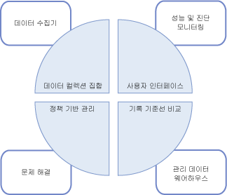

# 데이터 수집
[!INCLUDE[appliesto-ss-xxxx-xxxx-xxx-md](../../includes/appliesto-ss-xxxx-xxxx-xxx-md.md)]
  데이터 수집기는 다양한 데이터 집합을 수집하는 [!INCLUDE[ssCurrent](../../includes/sscurrent-md.md)] 구성 요소입니다. 데이터 컬렉션은 항상 실행되거나 사용자 정의 일정에 따라 실행됩니다. 데이터 수집기는 관리 데이터 웨어하우스로 알려진 관계형 데이터베이스에 수집한 데이터를 저장합니다.  
  
## 데이터 수집기란? 
 데이터 수집기는 [!INCLUDE[ssCurrent](../../includes/sscurrent-md.md)] 에서 제공하는 도구와 [!INCLUDE[ssNoVersion](../../includes/ssnoversion-md.md)]를 위한 데이터 컬렉션 플랫폼의 핵심 구성 요소입니다. 데이터 수집기는 데이터베이스 서버 및 애플리케이션 전체에서 데이터 컬렉션에 대한 단일 중심점을 제공합니다. 이 컬렉션 지점을 통해 SQL 추적과 달리 성능 데이터로만 제한되지 않고 다양한 원본으로부터 데이터를 가져올 수 있습니다.  
  
 데이터 수집기를 사용하면 사용자의 테스트 및 프로덕션 환경에 맞도록 데이터 컬렉션의 범위를 조정할 수도 있습니다. 또한 데이터 수집기는 데이터에 다양한 보존 기간을 설정하여 수집 데이터를 관리할 수 있도록 하는 관련 데이터베이스인 데이터 웨어하우스를 사용합니다.  
  
 데이터 수집기는 데이터 컬렉션에 대한 동적 튜닝을 지원하며 API를 통해 확장 가능합니다. 자세한 내용은 [Data Collector Programming](https://msdn.microsoft.com/library/53b4752b-055d-4716-b2bc-75b4cce84101)을 참조하세요.  
  
 다음 그림에서는 데이터 수집기가 [!INCLUDE[ssCurrent](../../includes/sscurrent-md.md)]의 데이터 컬렉션 및 데이터 관리를 위한 전반적인 전략에 어떻게 맞추는지를 보여 줍니다.  
  
   
  
## 개념  
 데이터 수집기는 [!INCLUDE[ssNoVersion](../../includes/ssnoversion-md.md)] 에이전트 및 [!INCLUDE[ssISnoversion](../../includes/ssisnoversion-md.md)]와 통합되며 둘 다 광범위하게 사용됩니다. 따라서 데이터 수집기를 사용하려면 먼저 이러한 [!INCLUDE[ssNoVersion](../../includes/ssnoversion-md.md)] 구성 요소 각각과 관련된 특정 개념을 이해해야 합니다.  
  
 [!INCLUDE[ssNoVersion](../../includes/ssnoversion-md.md)] 에이전트는 컬렉션 작업을 예약하고 실행하는 데 사용됩니다. 다음 개념을 이해해야 합니다.  
  
-   작업  
  
-   작업 단계  
  
-   작업 일정  
  
-   하위 시스템  
  
-   프록시 계정  
  
 자세한 내용은 [관리 태스크 자동화&#40;SQL Server 에이전트&#41;](https://msdn.microsoft.com/library/541ee5ac-2c9f-4b74-b4f0-13b7bd5920b0)를 참조하세요.  
  
 [!INCLUDE[ssISnoversion](../../includes/ssisnoversion-md.md)] ([!INCLUDE[ssIS](../../includes/ssis-md.md)])는 개별 데이터 공급자에서 데이터를 수집하는 패키지를 실행하는 데 사용됩니다. 다음 [!INCLUDE[ssIS](../../includes/ssis-md.md)] 도구 및 개념에 대해 잘 알고 있어야 합니다.  
  
-   [!INCLUDE[ssIS](../../includes/ssis-md.md)] 패키지  
  
-   [!INCLUDE[ssIS](../../includes/ssis-md.md)] 패키지 구성  
  
 자세한 내용은 [Integration Services&#40;SSIS&#41; 패키지](../../integration-services/integration-services-ssis-packages.md)를 참조하세요.  
  
## 용어  
 **대상**  
 데이터 컬렉션을 지원하는 [!INCLUDE[ssDE](../../includes/ssde-md.md)] 버전에서 [!INCLUDE[ssNoVersion](../../includes/ssnoversion-md.md)] 인스턴스입니다. 지원되는 버전에 대한 자세한 내용은 [SQL Server 2016 버전에서 지원하는 기능](~/sql-server/editions-and-supported-features-for-sql-server-2016.md)의 "관리 효율성" 섹션을 참조하세요.  
  
 *대상 루트* 는 대상 계층의 하위 트리를 정의합니다. *대상 집합* 은 대상 루트를 통해 정의된 하위 트리에 필터를 적용하여 생성되는 대상 그룹입니다. 대상 루트는 데이터베이스, [!INCLUDE[ssNoVersion](../../includes/ssnoversion-md.md)]인스턴스 또는 컴퓨터 인스턴스가 될 수 있습니다.  
  
**대상 유형**  
 일정한 특징 및 동작을 갖는 대상의 유형입니다. 예를 들어 [!INCLUDE[ssNoVersion](../../includes/ssnoversion-md.md)] 인스턴스 대상의 특징은 [!INCLUDE[ssNoVersion](../../includes/ssnoversion-md.md)] 데이터베이스 대상의 특징과 다릅니다.  
  
 **데이터 공급자**  
 수집기 형식에 데이터를 제공하는 알려진 데이터 원본으로, 대상 유형별로 고유합니다.  
  
**수집기 형식**  
 데이터를 수집하고 관리 데이터 웨어하우스에 이를 업로드하는 실제 메커니즘을 제공하는 [!INCLUDE[ssIS](../../includes/ssis-md.md)] 패키지에 대한 논리적 래퍼입니다.  
  
 **컬렉션 항목**  
 수집기 형식의 인스턴스입니다. 컬렉션 항목은 컬렉션 빈도 및 입력 속성의 특정 집합을 사용하여 만듭니다.  
  
 **컬렉션 집합**  
 컬렉션 항목 그룹입니다. 컬렉션 집합은 사용자가 사용자 인터페이스를 통해 상호 작용할 수 있는 데이터 컬렉션 단위입니다.  
  
 **컬렉션 모드**  
 데이터를 수집하고 저장하는 방식입니다. 컬렉션 모드는 캐시되거나 캐시되지 않을 수 있습니다. 캐시된 모드는 연속적인 컬렉션을 지원하지만 캐시되지 않은 모드는 요청 시 컬렉션 또는 컬렉션 스냅샷을 위한 것입니다.  
  
 **관리 데이터 웨어하우스**  
 수집되는 데이터를 저장하는 데 사용되는 관계형 데이터베이스입니다.  
  
 다음 그림에서는 데이터 수집기 구성 요소 간 종속성 및 관계를 보여 줍니다.  
  
   
  
 그림에서와 같이 데이터 공급자는 데이터 수집기 외부에 있으며 정의에 따라 대상과 암시적인 관계에 있습니다. 데이터 공급자는 특정 대상(예: 관계형 엔진 같은 [!INCLUDE[ssNoVersion](../../includes/ssnoversion-md.md)] 서비스)에 한정되고 [!INCLUDE[ssNoVersion](../../includes/ssnoversion-md.md)]의 시스템 뷰, 성능 모니터 카운터 및 WMI 공급자와 같은 데이터 수집기에서 사용할 수 있는 데이터를 제공합니다.  
  
 수집기 형식은 대상 유형별로 고유하며, 데이터 공급자와 대상 유형의 논리적 연결을 기반으로 합니다. 수집기 형식은 스키마화된 매개 변수를 사용하여 특정 데이터 공급자에서 데이터를 수집하는 방식을 정의하며 데이터 스토리지 스키마를 지정합니다. 수집된 데이터를 저장하려면 데이터 공급자 스키마 및 스토리지 스키마가 필요합니다. 또한 수집기 형식은 관리 데이터 웨어하우스의 위치를 제공하며 관리 데이터 웨어하우스는 데이터 컬렉션을 실행하는 컴퓨터에 있을 수도 있고 다른 컴퓨터에 있을 수도 있습니다.  
  
 그림에서와 같이 컬렉션 항목은 수집기 형식에 대한 XML 스키마처럼 입력 매개 변수로 매개 변수가 제공되는 특정 수집기 형식의 인스턴스입니다. 모든 컬렉션 항목은 동일한 대상 루트 또는 빈 대상 루트에서 사용되어야 합니다. 이렇게 하면 데이터 수집기가 운영 체제 또는 특정 대상 루트의 여러 수집기 형식(다른 대상 루트의 수집기 형식 제외)을 함께 사용할 수 있습니다.  
  
 컬렉션 항목에는 값의 스냅샷을 만드는 빈도를 결정하는 컬렉션 빈도가 정의되어 있습니다. 컬렉션 항목은 컬렉션 집합에 대한 빌딩 블록이지만 자체적으로 존재할 수는 없습니다.  
  
 컬렉션 집합은 서버 인스턴스에 정의 및 배포되며 서로 독립적으로 실행될 수 있습니다. 컬렉션 집합의 일부인 모든 수집기 형식의 대상 유형과 일치하는 대상에 각 컬렉션 집합을 적용할 수 있습니다. 컬렉션 집합은 [!INCLUDE[ssNoVersion](../../includes/ssnoversion-md.md)] 에이전트 작업으로 실행되며 데이터는 미리 정의된 일정에 따라 관리 데이터 웨어하우스에 업로드됩니다.  
  
 컬렉션 집합 내의 서로 다른 인스턴스에서 수집한 데이터는 모두 같은 일정에 따라 관리 데이터 웨어하우스에 업로드됩니다. 이 일정은 공유 [!INCLUDE[ssNoVersion](../../includes/ssnoversion-md.md)] 에이전트 일정으로 정의되며 둘 이상의 컬렉션 집합에 사용될 수 있습니다. 컬렉션 집합은 단일 엔터티로 설정되거나 해제되지만 컬렉션 항목은 개별적으로 설정하거나 해제할 수 없습니다.  
  
 컬렉션 집합을 만들거나 업데이트할 때 데이터를 수집하고 관리 데이터 웨어하우스에 이를 업로드하는 컬렉션 모드를 구성할 수 있습니다. 일정 예약 유형은 캐시됨 또는 캐시 안 됨과 같은 컬렉션 유형에 따라 결정됩니다. 컬렉션이 캐시되는 경우 데이터 컬렉션과 데이터 업로드는 각각 별도의 작업에서 실행됩니다. 컬렉션은 [!INCLUDE[ssNoVersion](../../includes/ssnoversion-md.md)] 에이전트 시작 시 시작되는 일정에 따라 실행되며 컬렉션 항목에 지정된 빈도로 실행됩니다. 업로드는 사용자가 지정한 일정에 따라 실행됩니다.  
  
 캐시되지 않는 컬렉션에서 데이터 컬렉션과 데이터 업로드는 모두 두 단계로 구성된 단일 작업에서 실행됩니다. 1단계는 컬렉션이고 2단계는 업로드입니다. 요청 시 컬렉션에는 일정이 필요하지 않습니다.  
  
 컬렉션 집합이 활성화된 후 일정 또는 요청에 따라 데이터 컬렉션을 시작할 수 있습니다. 데이터 컬렉션이 시작되면 [!INCLUDE[ssNoVersion](../../includes/ssnoversion-md.md)] 에이전트가 데이터 수집기의 프로세스를 생성하며 이 프로세스는 컬렉션 집합에 대한 [!INCLUDE[ssISnoversion](../../includes/ssisnoversion-md.md)] 패키지를 로드합니다. 컬렉션 유형을 나타내는 컬렉션 항목은 지정된 대상의 적절한 데이터 공급자에서 데이터를 수집합니다. 컬렉션 주기가 끝나면 이 데이터가 관리 데이터 웨어하우스에 업로드됩니다.  
  
## 수행할 수 있는 작업  
  
|Description|항목|  
|----------------------|-----------|  
|데이터 컬렉션 사용 또는 사용 안 함, 컬렉션 집합 구성 변경, 관리 데이터 웨어하우스에서 데이터 보기와 같은 데이터 컬렉션의 다양한 기능을 관리합니다.|[데이터 컬렉션 관리](../../relational-databases/data-collection/manage-data-collection.md)|  
|보고서를 사용하여 시스템 용량을 모니터링하고 시스템 성능 문제를 해결하는 데 필요한 정보를 얻을 수 있습니다.|[시스템 데이터 컬렉션 집합 보고서](../../relational-databases/data-collection/system-data-collection-set-reports.md)|  
|관리 데이터 웨어하우스를 사용하여 데이터 컬렉션 대상인 서버에서 데이터를 수집할 수 있습니다.|[관리 데이터 웨어하우스](../../relational-databases/data-collection/management-data-warehouse.md)| 
|SQL Server Profiler의 서버 쪽 추적 기능을 이용하여 일반 SQL 추적 수집기 형식을 사용하는 컬렉션 집합을 만들기 위한 추적 정의를 내보냅니다.| [SQL Server 프로파일러를 사용하여 SQL 추적 컬렉션 집합 만들기(SQL Server Management Studio)](use-sql-server-profiler-to-create-a-sql-trace-collection-set.md)
  
  

