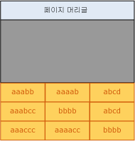
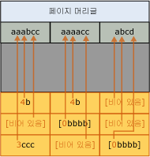
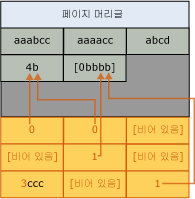

# 페이지 압축 구현
[!INCLUDE [SQL Server Azure SQL Database](../../includes/applies-to-version/sql-asdb.md)]

  이 항목에서는 [!INCLUDE[ssDE](../../includes/ssde-md.md)] 이 페이지 압축을 구현하는 방법에 대해 간략하게 설명합니다. 이 요약에서는 사용자의 데이터에 필요한 스토리지 공간을 계획하는 데 도움이 되는 기본 정보를 제공합니다.  
  
 페이지 압축은 테이블, 테이블 파티션, 인덱스 및 인덱스 파티션에 대한 압축과 유사합니다. 테이블에 대한 다음 페이지 압축 설명은 모든 개체 유형에 대한 페이지 압축에 동일하게 적용됩니다. 다음 예에서는 문자열을 압축하지만, 접두사 및 사전 압축은 모두 동일한 원칙으로 다른 데이터 형식에 적용됩니다.  
  
 페이지 압축으로 테이블 및 인덱스의 리프 수준을 압축하는 작업은 다음 순서의 세 가지 작업으로 구성됩니다.  
  
1.  행 압축  
  
2.  접두사 압축  
  
3.  사전 압축  

 페이지 압축을 사용할 경우 인덱스의 리프 수준이 아닌 페이지는 행 압축만 사용하여 압축됩니다. 행 압축에 대한 자세한 내용은 [Row Compression Implementation](../../relational-databases/data-compression/row-compression-implementation.md)을 참조하십시오.  
  
## 접두사 압축  
 압축되는 각 페이지에 대해 접두사 압축은 다음 단계를 사용합니다.  
  
1.  각 열에서 값은 각 열의 값에 대한 스토리지 공간을 줄이는 데 사용할 수 있는 것으로 식별됩니다.  
  
2.  각 열의 접두사 값을 나타내는 행이 CI(압축 정보) 구조에서 페이지 헤더 바로 다음에 만들어지고 저장됩니다.  
  
3.  열에서 반복되는 접두사 값은 해당 접두사의 참조로 교체됩니다. 행의 값이 선택한 접두사 값과 정확히 일치하지 않으면 부분 일치로 표시될 수 있습니다.  
  
 다음 그림에서는 접두사 압축 이전의 간단한 테이블 페이지를 보여 줍니다.  
  
   
  
 다음 그림에서는 접두사 압축 다음의 동일한 페이지를 보여 줍니다. 접두사는 헤더로 이동하고 열 값은 접두사의 참조로 변경됩니다.  
  
   
  
 첫 행의 첫 열에서 값 4b는 처음 4자리 접두사(aaab)가 해당 열에 대해 존재함을 나타내며 문자 b도 나타냅니다. 이것은 원래 값인 결과 값 aaabb를 만듭니다.  
  
## 사전 압축  
 접두사 압축이 완료된 후에 사전 압축이 적용됩니다. 사전 압축은 페이지에서 반복된 값을 검색하여 CI 영역에 저장합니다. 접두사 압축과 달리 사전 압축은 한 개의 열로 제한되지 않습니다. 사전 압축은 페이지에서 발생하는 반복된 값을 교체할 수 있습니다. 다음 그림에서는 사전 압축 다음의 동일한 페이지를 보여 줍니다.  
  
   
  
 값 4b는 페이지의 다른 열에서 참조되었습니다.  
  
## 페이지 압축이 발생할 경우  
 페이지 압축이 발생한 새 테이블이 만들어지면 압축이 발생하지 않습니다. 그러나 테이블의 메타데이터는 페이지 압축을 사용해야 한다고 나타냅니다. 데이터가 첫 데이터 페이지에 추가되면 데이터의 행이 압축됩니다. 페이지가 가득 차지 않았으므로 페이지 압축으로 얻을 수 있는 이점은 없습니다. 페이지가 가득 차면 추가할 다음 행에서 페이지 압축 작업을 시작합니다. 전체 페이지가 검토됩니다. 즉, 각 열이 접두사 압축에 대해 평가된 후 모든 열이 사전 압축에 대해 평가됩니다. 페이지 압축이 추가 행의 위한 충분한 공간을 페이지에 만들면 행이 추가되고 데이터의 행과 페이지가 모두 압축됩니다. 페이지 압축으로 얻은 공간에서 CI 구조에 필요한 공간을 뺀 값이 크지 않으면 해당 페이지에 대해 페이지 압축이 사용되지 않습니다. 향후 행은 새 페이지에 적합합니다. 만약 적합하지 않을 경우 새 페이지가 테이블에 추가됩니다. 첫 페이지와 유사하게 새 페이지는 첫 페이지가 압축되지 않습니다.  
  
 데이터가 들어 있는 기존 테이블이 페이지 압축으로 변환되면 각 페이지가 다시 작성되고 평가됩니다. 모든 페이지를 다시 작성하면 테이블, 인덱스 또는 파티션이 다시 작성됩니다.  
  
## 참고 항목  
 [데이터 압축](../../relational-databases/data-compression/data-compression.md)   
 [행 압축 구현](../../relational-databases/data-compression/row-compression-implementation.md)  
  
  
