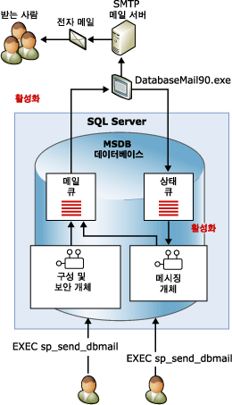

# 데이터베이스 메일
[!INCLUDE[appliesto-ss-xxxx-xxxx-xxx-md](../../includes/appliesto-ss-xxxx-xxxx-xxx-md.md)]
  데이터베이스 메일은 [!INCLUDE[ssDEnoversion](../../includes/ssdenoversion-md.md)]에서 전자 메일 메시지를 보내는 엔터프라이즈 솔루션입니다. 데이터베이스 메일을 사용하여 데이터베이스 응용 프로그램에서 전자 메일 메시지를 사용자에게 보낼 수 있습니다. 메시지에는 쿼리 결과와 네트워크상의 리소스 파일이 포함될 수 있습니다.  
  
  
##   데이터베이스 메일 사용의 이점  
 데이터베이스 메일은 안정성, 확장성, 보안 및 지원 가능성을 고려하여 디자인되었습니다.  
  
### 안정성  
  
-   데이터베이스 메일은 표준 SMTP(Simple Mail Transfer Protocol)를 사용하여 메일을 보냅니다. [!INCLUDE[ssNoVersion](../../includes/ssnoversion-md.md)]를 실행하는 컴퓨터에 확장 MAPI 클라이언트를 설치하지 않고 데이터베이스 메일을 사용할 수 있습니다.  
  
-   프로세스 격리. [!INCLUDE[ssNoVersion](../../includes/ssnoversion-md.md)]에 대한 영향을 최소화하기 위해 전자 메일을 배달하는 구성 요소는 [!INCLUDE[ssNoVersion](../../includes/ssnoversion-md.md)]외부에서 별도의 프로세스로 실행됩니다. [!INCLUDE[ssNoVersion](../../includes/ssnoversion-md.md)]는 외부 프로세스가 중지되거나 실패한 경우에도 계속해서 메일 메시지를 큐에 대기시킵니다. 지연된 메시지는 외부 프로세스 또는 SMTP 서버가 온라인 상태로 되면 전송됩니다.  
  
-   장애 조치(Failover) 계정. 데이터베이스 메일 프로필을 사용하면 SMTP 서버를 둘 이상 지정할 수 있습니다. 한쪽 SMTP 서버를 사용할 수 없는 경우 메일은 다른 SMTP 서버로 배달될 수 있습니다.  
  
-   클러스터 지원. 데이터베이스 메일은 클러스터를 인식하므로 클러스터에서 완벽하게 지원됩니다.  
  
### 확장성  
  
-   백그라운드 배달: 데이터베이스 메일은 백그라운드(비동기) 배달 기능을 제공합니다. **sp_send_dbmail** 을 호출하여 메시지를 보낼 때 데이터베이스 메일은 요청을 [!INCLUDE[ssSB](../../includes/sssb-md.md)] 큐에 추가합니다. 저장 프로시저가 즉시 반환됩니다. 외부 전자 메일 구성 요소는 요청을 받아 전자 메일을 배달합니다.  
  
-   여러 프로필: 데이터베이스 메일을 사용하면 [!INCLUDE[ssNoVersion](../../includes/ssnoversion-md.md)] 인스턴스 내에 여러 프로필을 만들 수 있습니다. 필요에 따라 메시지를 보낼 때 데이터베이스 메일이 사용하는 프로필을 선택할 수 있습니다.  
  
-   여러 계정: 각 프로필에 여러 개의 장애 조치(failover) 계정을 포함할 수 있습니다. 여러 개의 전자 메일 서버를 통해 전자 메일을 배포할 때 서로 다른 계정으로 다양한 프로필을 구성할 수 있습니다.  
  
-   64비트 호환성: 데이터베이스 메일은 64비트 [!INCLUDE[ssNoVersion](../../includes/ssnoversion-md.md)]설치에서 완전하게 지원됩니다.  
  
### 보안  
  
-   기본적으로 해제됨: [!INCLUDE[ssNoVersion](../../includes/ssnoversion-md.md)]의 노출 영역을 줄이기 위해 데이터베이스 메일 저장 프로시저는 기본적으로 사용할 수 없도록 설정되어 있습니다.  
  
-   메일 보안:데이터베이스 메일을 보내려면 **msdb** 데이터베이스에서 **DatabaseMailUserRole** 데이터베이스 역할의 멤버여야 합니다.  
  
-   프로필 보안: 데이터베이스 메일은 메일 프로필에 대해 보안을 적용합니다. 데이터베이스 메일 프로필에 액세스할 수 있는 **msdb** 데이터베이스 사용자나 그룹을 선택합니다. **msdb**의 특정 사용자나 모든 사용자에게 액세스 권한을 부여할 수 있습니다. 개인 프로필은 지정된 목록의 사용자만 액세스할 수 있도록 제한되어 있습니다. 공개 프로필은 데이터베이스의 모든 사용자가 사용할 수 있습니다.  
  
-   첨부 파일 크기 관리자: 데이터베이스 메일은 첨부 파일 크기에 대해 구성 가능한 제한을 적용합니다. [sysmail_configure_sp](../../relational-databases/system-stored-procedures/sysmail-configure-sp-transact-sql.md) 저장 프로시저를 사용하여 이 제한을 변경할 수 있습니다.  
  
-   금지할 파일 확장명: 데이터베이스 메일은 금지할 파일 확장명 목록을 유지 관리합니다. 사용자는 목록에 표시된 확장명의 파일을 첨부할 수 없습니다. sysmail_configure_sp를 사용하여 이 목록을 변경할 수 있습니다.  
  
-   데이터베이스 메일은e [!INCLUDE[ssNoVersion](../../includes/ssnoversion-md.md)] 엔진 서비스 계정에서 실행됩니다. 폴더의 파일을 전자 메일에 첨부하려면 [!INCLUDE[ssNoVersion](../../includes/ssnoversion-md.md)] 엔진 계정에 파일이 들어 있는 폴더에 대한 액세스 권한이 있어야 합니다.  
  
### 지원 가능성  
  
-   통합 구성: 데이터베이스 메일은 [!INCLUDE[ssDEnoversion](../../includes/ssdenoversion-md.md)]내에서 메일 계정에 대한 정보를 유지 관리합니다. 외부 클라이언트 응용 프로그램에서 메일 프로필을 관리할 필요가 없습니다. 데이터베이스 메일 구성 마법사는 데이터베이스 메일을 구성할 수 있는 편리한 인터페이스를 제공합니다. 또한 [!INCLUDE[tsql](../../includes/tsql-md.md)]을 사용하여 데이터베이스 메일 구성을 생성하고 유지 관리할 수 있습니다.  
  
-   로깅. 데이터베이스 메일은 [!INCLUDE[ssNoVersion](../../includes/ssnoversion-md.md)], Microsoft Windows 응용 프로그램 이벤트 로그 및 **msdb** 데이터베이스의 테이블에 메일 작업을 기록합니다.  
  
-   감사: 데이터베이스 메일은 보낸 메시지와 첨부 파일의 복사본을 **msdb** 데이터베이스에 보관합니다. 데이터베이스 메일 사용을 쉽게 감사하고 보존된 메시지를 검토할 수 있습니다.  
  
-   HTML 지원: 데이터베이스 메일을 사용하면 HTML 형식의 전자 메일을 보낼 수 있습니다.  
  
  
##   데이터베이스 메일 아키텍처  
 데이터베이스 메일은 Service Broker 기술을 사용하는 큐 아키텍처를 기반으로 디자인되었습니다. 사용자가 **sp_send_dbmail**을 실행하면 이 저장 프로시저는 메일 큐에 항목을 삽입하고 메일 메시지가 포함된 레코드를 만듭니다. 메일 큐에 새 항목이 삽입되면 외부 데이터베이스 메일 프로세스(DatabaseMail.exe)가 시작됩니다. 이 외부 프로세스는 전자 메일 정보를 읽고 전자 메일 메시지를 해당 전자 메일 서버로 보냅니다. 또한 보내기 작업의 결과로 상태 큐에 항목을 삽입합니다. 상태 큐에 새 항목이 삽입되면 전자 메일 메시지의 상태를 업데이트하는 내부 저장 프로시저가 시작됩니다. 데이터베이스 메일은 보낸 전자 메일 메시지나 보내지 않은 전자 메일 메시지를 저장할 뿐만 아니라 모든 전자 메일 첨부 파일을 시스템 테이블에 기록합니다. 데이터베이스 메일 뷰는 문제 해결을 위해 메시지 상태를 제공하며 저장 프로시저를 통해 데이터베이스 메일 큐를 관리할 수 있습니다.  
  
   
  
  
##   데이터베이스 메일 구성 요소 소개  
 데이터베이스 메일은 다음 주요 구성 요소로 이루어집니다.  
  
-   구성 및 보안 구성 요소  
  
     데이터베이스 메일은 **msdb** 데이터베이스에 구성 및 보안 정보를 저장합니다. 구성 및 보안 개체는 데이터베이스 메일에 사용되는 프로필과 계정을 만듭니다.  
  
-   메시징 구성 요소  
  
     **msdb** 데이터베이스는 메일 호스트 데이터베이스의 역할을 수행하며 데이터베이스 메일이 메일을 보낼 때 사용하는 메시징 개체를 보유합니다. 이러한 개체에는 **sp_send_dbmail** 저장 프로시저 및 메시지에 대한 정보를 보유하는 데이터 구조가 포함됩니다.  
  
-   데이터베이스 메일 실행 파일  
  
     데이터베이스 메일 실행 파일은 **msdb** 데이터베이스의 큐에서 읽은 메시지를 메일 서버로 보내는 외부 프로그램입니다.  
  
-   로깅 및 감사 구성 요소  
  
     데이터베이스 메일은 **msdb** 데이터베이스와 [!INCLUDE[msCoName](../../includes/msconame-md.md)] Windows 응용 프로그램 이벤트 로그에 로깅 정보를 기록합니다.  
  
 **데이터베이스 메일을 사용하도록 에이전트 구성:**  
  
 SQL Server 에이전트는 데이터베이스 메일을 사용하도록 구성될 수 있습니다. 이는 경고 알림 및 작업 완료 자동 알림에 필요합니다.  
  
> [!WARNING]  
>  작업 내의 개별 작업 단계에서는 데이터베이스 메일을 사용하도록 [!INCLUDE[ssNoVersion](../../includes/ssnoversion-md.md)] 에이전트를 구성하지 않고 전자 메일을 보낼 수도 있습니다. 예를 들어 [!INCLUDE[tsql](../../includes/tsql-md.md)] 작업 단계에서는 데이터베이스 메일을 사용하여 쿼리 결과를 받는 사람 목록에 보낼 수 있습니다.  
  
 [!INCLUDE[ssNoVersion](../../includes/ssnoversion-md.md)] 에이전트를 구성하여 다음과 같은 경우에 미리 지정한 운영자에게 전자 메일을 보낼 수 있습니다.  
  
-   경고가 트리거되었을 경우. 경고를 구성하여 발생한 특정 이벤트를 알리는 전자 메일을 보낼 수 있습니다. 예를 들어 경고를 구성하여 즉각적인 동작이 필요한 특정 데이터베이스 이벤트 또는 운영 체제 상태를 운영자에게 알릴 수 있습니다. 경고 구성에 대한 자세한 내용은 [경고](../../ssms/agent/alerts.md)를 참조하세요.  
  
-   데이터베이스 백업이나 복제 이벤트와 같이 예약된 태스크가 성공하거나 실패했을 경우. 예를 들어 처리하는 동안 오류가 발생했을 경우 [!INCLUDE[ssNoVersion](../../includes/ssnoversion-md.md)] 에이전트 메일을 사용하여 월말에 운영자에게 알릴 수 있습니다.  
  
  
##   데이터베이스 메일 구성 요소 항목  
  
-   [데이터베이스 메일 구성 개체](../../relational-databases/database-mail/database-mail-configuration-objects.md)  
  
-   [데이터베이스 메일 메시징 개체](../../relational-databases/database-mail/database-mail-messaging-objects.md)  
  
-   [데이터베이스 메일 외부 프로그램](../../relational-databases/database-mail/database-mail-external-program.md)  
  
-   [데이터베이스 메일 로그 및 감사](../../relational-databases/database-mail/database-mail-log-and-audits.md)  
  
-   [데이터베이스 메일을 사용하도록 SQL Server 에이전트 메일 구성](../../relational-databases/database-mail/configure-sql-server-agent-mail-to-use-database-mail.md)  
  
  
  
