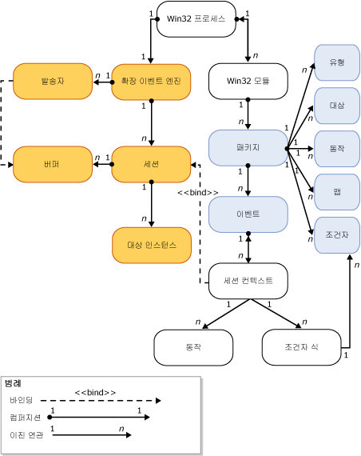

# SQL Server 확장 이벤트 엔진
[!INCLUDE[appliesto-ss-asdb-xxxx-xxx-md](../../includes/appliesto-ss-asdb-xxxx-xxx-md.md)]

  [!INCLUDE[ssNoVersion](../../includes/ssnoversion-md.md)] 확장 이벤트 엔진은 다음과 같은 역할을 하는 서비스 및 개체의 집합입니다.  
  
-   이벤트를 정의할 수 있도록 합니다.  
  
-   이벤트 데이터를 처리할 수 있도록 합니다.  
  
-   시스템의 확장 이벤트 서비스 및 개체를 관리합니다.  
  
-   확장 이벤트 세션의 목록을 유지 관리하고 이 목록에 대한 액세스를 관리합니다.  
  
 확장 이벤트 엔진 자체는 이벤트가 발생할 때 실행할 이벤트 또는 동작을 지정하지 않습니다. 대신 확장 이벤트 엔진을 사용하는 프로세스가 엔진과의 상호 작용을 정의하며 이벤트 지점을 추가하고 이벤트 발생에 대한 응답으로 실행할 동작을 지정합니다.  
  
 다음 그림은 확장 이벤트 세션을 간략히 요약하여 보여 줍니다. 자세한 내용은 [SQL Server Extended Events Sessions](../../relational-databases/extended-events/sql-server-extended-events-sessions.md)을 참조하세요.  
  
   
  
 다음에 유의하세요.  
  
-   각 Windows 프로세스에는 하나 이상의 모듈(**Win32 프로세스**, **Win32 모듈**)이 있을 수 있습니다. 이를 *바이너리* 또는 *실행 모듈*이라고도 합니다.  
  
-   각 Windows 프로세스 모듈은 하나 이상의 확장 이벤트 개체(**Type**,**Target**, **Action**, **Map**, **Predicate**및 **Event**)가 포함된 확장 이벤트 패키지( **Package**)를 포함할 수 있습니다.  
  
-   호스트 프로세스 내부에는 다음과 같은 역할을 하는 확장 이벤트 엔진(**Extended event engine**)의 인스턴스가 하나만 포함될 수 있습니다.  
  
    -   세션 열거와 같은 세션의 일부 기능을 관리합니다.  
  
    -   디스패치(**Dispatcher**)를 처리합니다. 이는 스레드 풀과 유사합니다.  
  
    -   이벤트를 위한 메모리 버퍼(**Buffer**)를 처리합니다. 버퍼가 가득 차면 대상으로 디스패치됩니다.  
  
-   세션이 생성되고 이벤트가 선택적으로 세션(**Session context**)에 바인딩된 후 다음이 수행됩니다.  
  
    -   대상의 인스턴스(**Target instance**)가 생성되어 세션에 추가됩니다.  
  
    -   버퍼가 가득 차면 해당 버퍼가 대상으로 디스패치됩니다.  
  
## 참고 항목  
 [확장 이벤트](../../relational-databases/extended-events/extended-events.md)  
  
  
