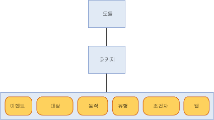

# <a name="sql-server-extended-events-packages"></a>SQL Server 확장 이벤트 패키지

[!INCLUDE [SQL Server Azure SQL Database](../../includes/applies-to-version/sql-asdb.md)]

  패키지는 [!INCLUDE[ssNoVersion](../../includes/ssnoversion-md.md)] 확장 이벤트 개체를 위한 컨테이너입니다. 확장 이벤트 패키지에는 다음과 같은 세 가지 종류가 있습니다.  
  
-   package0 - 확장 이벤트 시스템 개체입니다. 기본 패키지입니다.  
  
-   sqlserver - [!INCLUDE[ssNoVersion](../../includes/ssnoversion-md.md)] 관련 개체입니다.  
  
-   sqlos - SQLOS( [!INCLUDE[ssNoVersion](../../includes/ssnoversion-md.md)] 운영 체제) 관련 개체입니다.  
  
> [!NOTE]  
>  SecAudit 패키지는 [!INCLUDE[ssNoVersion](../../includes/ssnoversion-md.md)] 감사에 사용됩니다. 이 패키지의 개체는 확장 이벤트 DDL(데이터 정의 언어)을 통해 사용할 수 없습니다.  
  
 패키지는 이름, GUID 및 패키지가 들어 있는 바이너리 모듈로 식별할 수 있습니다. 자세한 내용은 [sys.dm_xe_packages&#40;Transact-SQL&#41;](../../relational-databases/system-dynamic-management-views/sys-dm-xe-packages-transact-sql.md)를 참조하세요.  
  
 패키지에는 다음과 같은 개체 전체 또는 일부가 포함될 수 있습니다. 각 개체에 대해서는 이 항목의 뒷부분에서 자세히 설명합니다.  
  
-   이벤트  
  
-   대상  
  
-   동작  
  
-   유형  
  
-   조건자  
  
-   지도  
  
 서로 다른 패키지의 개체를 혼합하여 하나의 이벤트 세션에 사용할 수 있습니다. 자세한 내용은 [SQL Server Extended Events Sessions](../../relational-databases/extended-events/sql-server-extended-events-sessions.md)을 참조하세요.  
  
## <a name="package-contents"></a>패키지 내용  
 다음 그림에서는 패키지에 포함될 수 있는 개체를 보여 줍니다. 패키지는 모듈에 포함되며 모듈은 실행 파일 또는 동적 연결 라이브러리일 수 있습니다.  
  
   
  
### <a name="events"></a>이벤트  
 이벤트는 [!INCLUDE[ssNoVersion](../../includes/ssnoversion-md.md)]같은 프로그램의 실행 경로 내에서 특정 지점을 모니터링합니다. 이벤트의 발생은 이러한 관심 지점에 도달했다는 사실을 알림과 동시에 이벤트가 발생한 시점의 상태 정보를 제공하게 됩니다.  
  
 이벤트는 추적이나 동작 트리거를 위해서만 사용할 수 있습니다. 이러한 동작은 동기적이거나 비동기적일 수 있습니다.  
  
> [!NOTE]  
>  이벤트에는 이벤트 발생에 대한 응답으로 트리거할 수 있는 동작에 대한 정보가 없습니다.  
  
 패키지를 확장 이벤트에 등록한 후에는 패키지의 이벤트 집합을 변경할 수 없습니다.  
  
 모든 이벤트에는 내용을 정의하는 버전이 지정된 스키마가 있습니다. 이러한 스키마는 잘 정의된 형식의 이벤트 열로 구성됩니다. 특정 형식의 이벤트는 항상 스키마에 지정된 순서대로 정확하게 데이터를 제공해야 합니다. 하지만 이벤트 대상이 제공된 모든 데이터를 소비할 필요는 없습니다.  
  
#### <a name="event-categorization"></a>이벤트 범주 분류  
 확장 이벤트는 ETW(Windows용 이벤트 추적)와 유사한 이벤트 범주 분류 모델을 사용합니다. 범주 분류에는 채널 및 키워드라는 두 가지 이벤트 속성이 사용됩니다. 이러한 속성을 사용하여 확장 이벤트를 ETW 및 그 도구와 통합할 수 있습니다.  
  
 **채널**  
  
 채널은 이벤트의 대상을 식별합니다. 다음 표에서는 이러한 채널에 대해 설명합니다.  
  
|용어|정의|  
|----------|----------------|  
|Admin|Admin 이벤트는 주로 최종 사용자, 관리자 및 지원 담당자를 대상으로 합니다. Admin 채널의 이벤트는 관리자가 대처할 수 있는 잘 정의된 솔루션이 마련된 문제를 나타냅니다. Admin 이벤트의 예로 애플리케이션에서 프린터를 연결하는 데 실패한 경우를 들 수 있습니다. 이러한 이벤트는 문제를 해결하기 위해 수행할 작업을 사용자에게 알려 주는 적절한 문서나 메시지와 연결됩니다.|  
|작동|Operational 이벤트는 문제 또는 발생을 분석 및 진단하는 데 사용되며 문제 또는 발생을 기반으로 도구 또는 태스크를 트리거하는 데 사용할 수 있습니다. Operational 이벤트의 예로는 시스템에서 프린터를 추가 또는 제거하는 경우를 들 수 있습니다.|  
|Analytic|Analytic 이벤트는 고용량으로 게시됩니다. 이러한 이벤트는 프로그램 작업을 나타내며 일반적으로 성능 검사에 사용됩니다.|  
|디버그|Debug 이벤트는 디버깅을 위해 문제를 진단하는 개발자에 의해서만 사용됩니다.<br /><br /> 디버그 채널의 이벤트는 내부 구현과 관련된 상태 데이터를 반환합니다. 이벤트가 반환하는 스키마와 데이터는 변경되거나 이후 SQL Server 버전에서 유효하지 않게 될 수 있습니다. 따라서 이후 버전의 SQL Server에서는 예고 없이 디버그 채널의 이벤트가 변경되거나 제거될 수 있습니다.|  
  
 **키워드**  
  
 키워드는 애플리케이션마다 다르게 사용되며 관련된 이벤트를 보다 세부적으로 그룹화할 수 있으므로 세션에서 사용할 이벤트를 더욱 쉽게 지정하고 가져올 수 있습니다. 다음 쿼리를 사용하여 키워드 정보를 가져올 수 있습니다.  
  
```  
select map_value Keyword from sys.dm_xe_map_values  
where name = 'keyword_map'  
```  
  
> [!NOTE]  
>  키워드는 SQL 추적 이벤트의 현재 그룹화와 밀접하게 매핑됩니다.  
  
### <a name="targets"></a>대상  
 대상은 이벤트의 소비자입니다. 대상은 이벤트가 발생하는 스레드에서 동기적으로 이벤트를 처리하거나 시스템을 통해 제공되는 스레드에서 비동기적으로 이벤트를 처리합니다. 확장 이벤트는 이벤트 출력을 전송하는 데 적합하게 사용할 수 있는 여러 대상을 제공합니다. 자세한 내용은 [SQL Server Extended Events Targets](/previous-versions/sql/sql-server-2016/bb630339(v=sql.130))을 참조하세요.  
  
### <a name="actions"></a>동작  
 동작은 이벤트에 대한 한 차례 또는 일련의 프로그래밍 방식 응답입니다. 동작은 이벤트에 바인딩되며 각 이벤트에는 일련의 고유한 동작이 있을 수 있습니다.  
  
> [!NOTE]  
>  특정 이벤트 집합을 위해 사용되는 동작은 알 수 없는 이벤트에 바인딩할 수 없습니다.  
  
 이벤트에 바인딩된 동작은 이벤트가 발생한 스레드에서 동기적으로 실행됩니다. 다양한 유형의 동작이 있으며 기능도 다양합니다. 동작의 기능은 다음과 같습니다.  
  
-   스택 덤프를 캡처하고 데이터를 검사합니다.  
  
-   변수 스토리지를 사용하여 상태 정보를 로컬 컨텍스트로 저장합니다.  
  
-   이벤트 데이터를 집계합니다.  
  
-   이벤트 데이터에 데이터를 추가합니다.  
  
 일반적이고 잘 알려진 동작의 예를 몇 가지 들면 다음과 같습니다.  
  
-   스택 덤퍼  
  
-   실행 계획 감지([!INCLUDE[ssNoVersion](../../includes/ssnoversion-md.md)] 에만 해당)  
  
-   [!INCLUDE[tsql](../../includes/tsql-md.md)] 스택 컬렉션([!INCLUDE[ssNoVersion](../../includes/ssnoversion-md.md)] 에만 해당)  
  
-   런타임 통계 계산  
  
-   예외 시 사용자 입력 수집  
  
### <a name="predicates"></a>조건자  
 조건자는 이벤트를 처리할 때 이벤트를 평가하는 데 사용되는 논리적 규칙의 집합입니다. 확장 이벤트 사용자는 조건자를 사용하여 특정 기준에 맞는 이벤트 데이터를 선별적으로 캡처할 수 있습니다.  
  
 조건자는 데이터를 로컬 컨텍스트에 저장하여 이벤트가 발생하는 *n* 분 또는 *n* 번마다 true를 한 번만 반환하는 조건자를 만드는 데 사용할 수 있습니다. 이 로컬 컨텍스트 스토리지를 사용하면 조건자를 동적으로 업데이트함으로써 나중에 발생한 이벤트에 전과 유사한 데이터가 있는 경우 이를 생략하는 데 사용할 수 있습니다.  
  
 조건자는 이벤트별 데이터와 스레드 ID 등의 컨텍스트 정보를 검색할 수 있습니다. 조건자는 완전한 부울 식으로 평가될 수 있으며 처음으로 전체 식이 false가 될 때 단락(short circuit)을 지원합니다.  
  
> [!NOTE]  
>  이전 조건자 검사에 실패한 경우 부작용이 있는 조건자는 평가할 수 없습니다.  
  
### <a name="types"></a>유형  
 데이터는 연결된 바이트의 집합이므로 데이터를 해석하려면 바이트 집합의 길이 및 특성이 필요합니다. 이 정보는 Type 개체에 캡슐화됩니다. 패키지 개체에 제공되는 유형은 다음과 같습니다.  
  
-   이벤트  
  
-   action  
  
-   대상  
  
-   pred_source  
  
-   pred_compare  
  
-   type  
  
 자세한 내용은 [sys.dm_xe_objects&#40;Transact-SQL&#41;](../../relational-databases/system-dynamic-management-views/sys-dm-xe-objects-transact-sql.md)를 참조하세요.  
  
### <a name="maps"></a>지도  
 맵 테이블은 내부 값을 문자열에 매핑함으로써 값이 무엇을 나타내는지 사용자에게 알려 줍니다. 사용자는 숫자 값뿐만 아니라 내부 값의 의미를 나타내는 설명도 얻을 수 있습니다. 다음 쿼리에서는 맵 값을 가져오는 방법을 보여 줍니다.  
  
```  
select map_key, map_value from sys.dm_xe_map_values  
where name = 'lock_mode'  
```  
  
 위 쿼리에서 생성되는 출력은 다음과 같습니다.  
  
 `map_key     map_value`  
  
 `---------------------`  
  
 `0           NL`  
  
 `1           SCH_S`  
  
 `2           SCH_M`  
  
 `3           S`  
  
 `4           U`  
  
 `5           X`  
  
 `6           IS`  
  
 `7           IU`  
  
 `8           IX`  
  
 `9           SIU`  
  
 `10          SIX`  
  
 `11          UIX`  
  
 `12          BU`  
  
 `13          RS_S`  
  
 `14          RS_U`  
  
 `15          RI_NL`  
  
 `16          RI_S`  
  
 `17          RI_U`  
  
 `18          RI_X`  
  
 `19          RX_S`  
  
 `20          RX_U`  
  
 `21          RX_X`  
  
 `21          RX_X`  
  
 이 표의 경우 mode라는 열이 있고 값이 5라고 가정하면 표에서 5가 X에 매핑되므로 잠금 유형은 배타입니다.  
  
## <a name="see-also"></a>참고 항목  
 [SQL Server Extended Events Sessions](../../relational-databases/extended-events/sql-server-extended-events-sessions.md)   
 [SQL Server 확장 이벤트 엔진](../../relational-databases/extended-events/sql-server-extended-events-engine.md)   
 [SQL Server 확장 이벤트 대상](/previous-versions/sql/sql-server-2016/bb630339(v=sql.130))  
  
