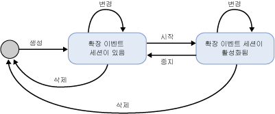

# SQL Server Extended Events Sessions
[!INCLUDE[appliesto-ss-asdb-xxxx-xxx-md](../../includes/appliesto-ss-asdb-xxxx-xxx-md.md)]

  [!INCLUDE[ssNoVersion](../../includes/ssnoversion-md.md)] 확장 이벤트 세션은 확장 이벤트 엔진을 호스팅하는 [!INCLUDE[ssNoVersion](../../includes/ssnoversion-md.md)] 프로세스에서 생성됩니다. 확장 이벤트 세션의 다음과 같은 요소는 확장 이벤트 인프라 및 일반적인 프로세스를 파악할 수 있는 컨텍스트를 제공합니다.  
  
-   세션 상태. CREATE EVENT SESSION 및 ALTER EVENT SESSION 문이 실행될 때 확장 이벤트 세션의 상태입니다.  
  
-   세션 내용 및 특징. 대상 및 이벤트 같은 확장 이벤트 세션의 내용과 이러한 개체가 단일 세션에서 또는 여러 세션 간에 상호 관련되는 방식입니다.  
  
## 세션 상태  
 다음 그림에서는 확장 이벤트 세션의 다양한 상태를 보여 줍니다.  
  
   
  
 위 그림을 보면 이벤트 세션에 대해 다른 DDL 명령이 실행됨에 따라 세션 상태가 바뀜을 알 수 있습니다. 다음 표에서는 이러한 상태 변경을 설명합니다.  
  
|그림 레이블|DDL 문|Description|  
|------------------------|-------------------|-----------------|  
|만들기|CREATE EVENT SESSION|호스트 프로세스는 CREATE EVENT SESSION 문에서 제공된 메타데이터가 포함된 세션 개체를 만듭니다. 호스트 프로세스는 세션 정의 및 사용자 권한 수준을 검사하고 master 데이터베이스에 메타데이터를 저장합니다. 이 시점에서 세션은 활성 상태가 아닙니다.|  
|Alter|ALTER EVENT SESSION, STATE=START|호스트 프로세스가 세션을 시작합니다. 호스트 프로세스는 저장된 메타데이터를 읽고 세션 정의를 검사하며 사용자 권한 수준을 확인하고 세션을 만듭니다. 이벤트 및 대상과 같은 세션 개체가 로드되며 이벤트 처리는 활성 상태입니다.|  
|Alter|ALTER EVENT SESSION, STATE=STOP|호스트 프로세스가 활성 세션을 중지하지만 메타데이터는 유지됩니다.|  
|Drop|DROP EVENT SESSION|세션이 활성 상태인지 여부에 따라 Drop(DROP SESSION)은 메타데이터를 삭제하고 활성 세션을 종료하거나 세션 메타데이터를 삭제합니다.|  
  
> [!NOTE]  
>  ALTER EVENT SESSION과 DROP EVENT SESSION 두 가지 모두 메타데이터에 적용되거나 활성 세션과 메타데이터에 적용될 수 있습니다.  
  
## 세션 내용 및 특징  
 확장 이벤트 세션에는 암시적인 경계가 있어 한 세션의 구성으로 인해 다른 세션의 구성이 변경되지 않습니다. 그러나 이러한 경계는 이벤트 또는 대상이 두 개 이상의 세션에서 사용되는 것을 차단하지는 않습니다.  
  
 다음 그림에서는 세션 내용, 그리고 패키지와 세션 간의 관계를 보여 줍니다.  
  
 ![세션에서의 개체 공존 및 공유] (../../relational-databases/extended-events/media/xesessions.gif "Object co-existance and sharing in sessions")  
  
 위 그림을 보면 다음과 같은 사실을 알 수 있습니다.  
  
-   패키지 개체와 세션 간의 매핑은 다 대 다이며, 이는 하나의 개체가 여러 세션에서 나타나고 하나의 세션에 여러 개체가 포함될 수 있음을 의미합니다.  
  
-   동일한 이벤트(Event 1) 또는 대상(Target 1)이 두 개 이상의 세션에서 사용될 수 있습니다.  
  
 세션의 특징은 다음과 같습니다.  
  
-   동작과 조건자는 세션별로 이벤트에 바인딩됩니다. Session A에 Action 1, Predicate Z와 함께 Event 1이 있어도 Session B에 조건자 없이 Action 2, Action 3과 함께 Event 1이 있을 수 있습니다.  
  
-   정책이 세션에 연결되어 버퍼링과 디스패치, 인과 관계 추적을 처리합니다.  
  
 **버퍼링 및 디스패치**  
  
 버퍼링은 이벤트 세션이 실행되는 동안 이벤트 데이터가 저장되는 방식입니다.  버퍼링 정책은 이벤트 데이터에 사용할 메모리 크기와 이벤트에 대한 손실 정책을 지정합니다. 디스패치는 이벤트를 처리하기 위해 대상에 전달하기 전에 버퍼에 유지하는 시간입니다.  
  
 **인과 관계 추적**  
  
 인과 관계 추적은 여러 태스크에 걸쳐 작업을 추적할 수 있는 기능을 제공합니다. 인과 관계 추적을 사용하면 각 발생 이벤트는 시스템 전체에서 고유한 작업 ID를 갖게 됩니다. 작업 ID는 태스크에 대한 모든 이벤트에서 일관적으로 유지되는 GUID 값과 이벤트가 발생할 때마다 증가하는 시퀀스 번호의 조합입니다. 한 태스크가 다른 태스크의 작업 수행을 유발하면 부모 태스크의 작업 ID가 자식 태스크로 전송됩니다. 자식 태스크는 처음 이벤트를 발생시킬 때 부모의 작업 ID를 출력합니다.  
  
 확장 이벤트 아키텍처는 다양한 개체를 함께 사용하여 특정 문제를 처리할 수 있는 유연한 시스템을 제공합니다.  
  
## 참고 항목  
 [확장 이벤트](../../relational-databases/extended-events/extended-events.md)  
  
  
