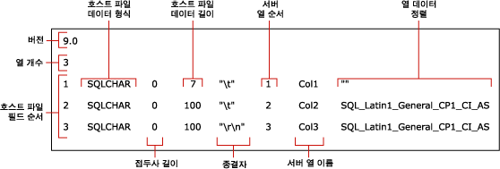

# <a name="use-a-format-file-to-skip-a-table-column-sql-server"></a>서식 파일을 사용하여 테이블 열 건너뛰기(SQL Server)
[!INCLUDE[appliesto-ss-asdb-asdw-pdw-md](../../includes/appliesto-ss-asdb-asdw-pdw-md.md)]

이 문서에서는 원본 데이터 파일에 건너뛴 열의 데이터가 없는 경우 서식 파일을 사용하여 테이블 열 가져오기를 건너뛰는 방법을 설명합니다. 데이터 파일에는 대상 테이블의 열 수보다 적은 수의 필드가 포함될 수 있습니다. 즉, 대상 테이블에서 다음 두 조건 중 하나 이상이 사실인 경우에만 열 가져오기를 건너뛸 수 있습니다.
-   건너뛴 열이 Null을 허용합니다.
-   건넌뛴 열에 기본값이 있습니다.  
  
## <a name="sample-table-and-data-file"></a>예제 테이블 및 데이터 파일  
 이 아티클의 예에서는 **dbo** 스키마에서 `myTestSkipCol`이라는 테이블을 기대합니다. *WideWorldImporters* 또는 *AdventureWorks*와 같은 샘플 데이터베이스 또는 다른 데이터베이스에서 이 테이블을 만들 수 있습니다. 이 테이블을 다음과 같이 만듭니다.  
  
```sql
USE WideWorldImporters;  
GO  
CREATE TABLE myTestSkipCol   
   (  
   Col1 smallint,  
   Col2 nvarchar(50) NULL,  
   Col3 nvarchar(50) not NULL  
   );  
GO  
```  
  
이 아티클의 예에서는 샘플 데이터 파일 `myTestSkipCol2.dat`도 사용합니다. 대상 테이블에는 세 개의 열이 있지만 이 데이터 파일에는 두개의 필드만 포함됩니다.

```  
1,DataForColumn3  
1,DataForColumn3  
1,DataForColumn3  
```  
  
## <a name="basic-steps"></a>기본 단계

비 XML 서식 파일 또는 XML 서식 파일을 사용하여 테이블 열을 건너뛸 수 있습니다. 두 경우 모두 다음 두 단계를 수행하세요.

1.   **bcp** 명령줄 유틸리티를 사용하여 기본 서식 파일을 만듭니다.

2.   텍스트 편집기에서 기본 서식 파일을 수정합니다.

수정된 서식 파일은 각 기존 필드를 대상 테이블의 해당 열로 매핑해야 합니다. 또한 테이블 열 또는 건너뛸 열을 표시해야 합니다. 

예를 들어 `myTestSkipCol2.dat`에서 `myTestSkipCol` 테이블로 데이터를 대량으로 가져오려면 서식 파일은 첫 번째 데이터 필드를 `Col1`에 매핑하고 `Col2`를 건너뛴 다음, 두 번째 필드를 `Col3`에 매핑해야 합니다.  
 
## <a name="option-1---use-a-non-xml-format-file"></a>옵션 #1 - 비 XML 서식 파일 사용  
  
### <a name="step-1---create-a-default-non-xml-format-file"></a>단계 #1 - 기본 비 XML 서식 파일 만들기  
명령 프롬프트에서 다음 **bcp** 명령을 실행하여 `myTestSkipCol` 샘플 테이블에 대한 기본 비 XML 서식 파일을 만듭니다.  
  
```cmd
bcp WideWorldImporters..myTestSkipCol format nul -f myTestSkipCol_Default.fmt -c -T  
```  

> [!IMPORTANT]  
>  `-S` 인수로 연결할 서버 인스턴스의 이름을 지정해야 합니다. 또한 `-U` 및 `-P` 인수를 사용하여 사용자 이름과 암호를 지정해야 할 수도 있습니다. 자세한 내용은 [bcp Utility](../../tools/bcp-utility.md)를 참조하세요.  

위 명령은 `myTestSkipCol_Default.fmt`라는 비 XML 서식 파일을 만듭니다. 이 서식 파일은 *bcp* 에서 생성되는 형식이므로 **기본 서식 파일**이라고 합니다. 기본 서식 파일은 데이터 파일 필드와 테이블 열 간의 일 대 일 대응을 나타냅니다.  
  
 다음 스크린샷에서는 이 샘플 기본 서식 파일의 값을 보여줍니다. 
  
   
  
> [!NOTE]  
>  서식 파일 필드에 대한 자세한 내용은 [비 XML 서식 파일&#40;SQL Server&#41;](../../relational-databases/import-export/non-xml-format-files-sql-server.md)을 참조하세요.  
  
### <a name="step-2---modify-a-non-xml-format-file"></a>단계 #2 - 비 XML 서식 파일 수정  
기본 비 XML 서식 파일을 수정하려면 두 가지 방법이 있습니다. 각 방법은 데이터 필드가 데이터 파일에 없고 데이터가 해당 테이블 열에 삽입되지 않음을 나타냅니다.

테이블 열을 건너뛰려면 기본 비 XML 서식 파일을 편집하고 다음 방법 중 하나를 사용하여 해당 파일을 수정합니다.  

#### <a name="option-1---remove-the-row"></a>옵션 #1 - 행 제거
열을 건너뛰는 데 기본적으로 사용되는 방법에는 다음 세 가지 단계가 포함됩니다.

1.   먼저 원본 데이터 파일에서 누락된 필드를 나타내는 모든 서식 파일 행을 삭제합니다.
2.   그런 다음 삭제된 행 뒤에 오는 각 서식 파일 행의 "호스트 파일 필드 순서" 값을 줄입니다. 목표는 데이터 파일에서 각 데이터 필드의 실제 위치를 반영하는 1부터 *n*까지의 순차적인 "호스트 파일 필드 순서" 값을 얻는 것입니다.
3.   마지막으로 데이터 파일의 실제 필드 수를 반영하도록 "열 수" 필드의 값을 줄입니다.  
  
다음 예는 `myTestSkipCol` 테이블에 대한 기본 서식 파일을 기반으로 합니다. 수정된 이 서식 파일은 첫 번째 데이터 필드를 `Col1`에 매핑하고 `Col2`를 건너뛴 다음 두 번째 데이터 필드를 `Col3`에 매핑합니다. `Col2` 의 행은 삭제되었습니다. 첫 번째 필드 뒤의 구분 기호도 `\t`에서 `,`로 변경되었습니다.
  
```  
14.0  
2  
1       SQLCHAR       0       7       ","      1     Col1         ""  
2       SQLCHAR       0       100     "\r\n"   3     Col3         SQL_Latin1_General_CP1_CI_AS  
```  
  
#### <a name="option-2---modify-the-row-definition"></a>옵션 #2 - 행 정의 수정

테이블 열을 건너뛰기 위해 테이블 열에 해당하는 서식 파일 행의 정의를 수정할 수도 있습니다. 이 서식 파일 행에서 "접두사 길이", "호스트 파일 데이터 길이" 및 "서버 열 순서" 값은 0으로 설정해야 하며 “종결자” 및 “열 데이터 정렬” 필드도 ""(즉, 빈 값이나 NULL 값)로 설정해야 합니다. 실제 열 이름이 필요하지 않더라도 “서버 열 이름” 값에는 공백이 아닌 문자열이 필요합니다. 나머지 서식 필드에는 해당 기본값이 필요합니다.  
  
다음 예도 `myTestSkipCol` 테이블에 대한 기본 서식 파일에서 파생된 것입니다.  
  
```  
14.0  
3  
1       SQLCHAR       0       7       ","      1     Col1         ""  
2       SQLCHAR       0       0       ""       0     Col2         ""  
3       SQLCHAR       0       100     "\r\n"   3     Col3         SQL_Latin1_General_CP1_CI_AS  
```  
  
### <a name="examples-with-a-non-xml-format-file"></a>비 XML 서식 파일의 예 
다음 예는 이 문서의 앞부분에 나오는 `myTestSkipCol` 샘플 테이블과 `myTestSkipCol2.dat` 샘플 데이터 파일을 기반으로 합니다.  
  
#### <a name="using-bulk-insert"></a>BULK INSERT 사용  
이 예는 이전 섹션에서 설명한 대로 생성되어진 수정된 비 XML 서식 파일 중 하나를 사용하여 작동 합니다. 이 예에서 수정된 서식 파일의 이름은 `myTestSkipCol2.fmt`입니다. `BULK INSERT`를 사용하여 `myTestSkipCol2.dat` 데이터 파일을 대량으로 가져오려면 SSMS에서 다음 코드를 실행합니다. 컴퓨터에서 샘플 파일 위치에 대한 파일 시스템 경로를 업데이트합니다.
  
```sql  
USE WideWorldImporters;  
GO  
BULK INSERT myTestSkipCol   
   FROM 'C:\myTestSkipCol2.dat'   
   WITH (FORMATFILE = 'C:\myTestSkipCol2.fmt');  
GO  
SELECT * FROM myTestSkipCol;  
GO  
```  
  
## <a name="option-2---use-an-xml-format-file"></a>옵션 #2 - XML 서식 파일 사용  
  
### <a name="step-1---create-a-default-xml-format-file"></a>단계 #1 - 기본 XML 서식 파일 만들기   

명령 프롬프트에서 다음 **bcp** 명령을 실행하여 `myTestSkipCol` 샘플 테이블에 대한 기본 XML 서식 파일을 만듭니다.  
  
```cmd
bcp WideWorldImporters..myTestSkipCol format nul -f myTestSkipCol_Default.xml -c -x -T  
```  
  
> [!IMPORTANT]  
>  `-S` 인수로 연결할 서버 인스턴스의 이름을 지정해야 합니다. 또한 `-U` 및 `-P` 인수를 사용하여 사용자 이름과 암호를 지정해야 할 수도 있습니다. 자세한 내용은 [bcp Utility](../../tools/bcp-utility.md)를 참조하세요.  
 
위 명령은 `myTestSkipCol_Default.xml`이라는 XML 서식 파일을 만듭니다. 이 서식 파일은 *bcp* 에서 생성되는 형식이므로 **기본 서식 파일**이라고 합니다. 기본 서식 파일은 데이터 파일 필드와 테이블 열 간의 일 대 일 대응을 나타냅니다.  
  
```xml
<?xml version="1.0"?>  
<BCPFORMAT xmlns="http://schemas.microsoft.com/sqlserver/2004/bulkload/format" xmlns:xsi="http://www.w3.org/2001/XMLSchema-instance">  
 <RECORD>  
  <FIELD ID="1" xsi:type="CharTerm" TERMINATOR="\t" MAX_LENGTH="7"/>  
  <FIELD ID="2" xsi:type="CharTerm" TERMINATOR="\t" MAX_LENGTH="100" COLLATION="SQL_Latin1_General_CP1_CI_AS"/>  
  <FIELD ID="3" xsi:type="CharTerm" TERMINATOR="\r\n" MAX_LENGTH="100" COLLATION="SQL_Latin1_General_CP1_CI_AS"/>  
 </RECORD>  
 <ROW>  
  <COLUMN SOURCE="1" NAME="Col1" xsi:type="SQLSMALLINT"/>  
  <COLUMN SOURCE="2" NAME="Col2" xsi:type="SQLNVARCHAR"/>  
  <COLUMN SOURCE="3" NAME="Col3" xsi:type="SQLNVARCHAR"/>  
 </ROW>  
</BCPFORMAT>  
```  
  
> [!NOTE]  
>  XML 서식 파일의 구조에 대한 자세한 내용은 [XML 서식 파일&#40;SQL Server&#41;](../../relational-databases/import-export/xml-format-files-sql-server.md)을 참조하세요.  

### <a name="step-2---modify-an-xml-format-file"></a>단계 #2 - XML 서식 파일 수정

여기서 `myTestSkipCol2.xml`은 `Col2`를 건너뛴 수정된 XML 서식 파일입니다. `Col2`에 대한 `FIELD` 및 `ROW` 항목이 제거되고 항목 번호가 다시 지정되었습니다. 첫 번째 필드 뒤의 구분 기호도 `\t`에서 `,`로 변경되었습니다.

```xml
<?xml version="1.0"?>  
<BCPFORMAT xmlns="http://schemas.microsoft.com/sqlserver/2004/bulkload/format" xmlns:xsi="http://www.w3.org/2001/XMLSchema-instance">  
 <RECORD>  
  <FIELD ID="1" xsi:type="CharTerm" TERMINATOR="," MAX_LENGTH="7"/>  
  <FIELD ID="2" xsi:type="CharTerm" TERMINATOR="\r\n" MAX_LENGTH="100" COLLATION="SQL_Latin1_General_CP1_CI_AS"/>  
 </RECORD>  
 <ROW>  
  <COLUMN SOURCE="1" NAME="Col1" xsi:type="SQLSMALLINT"/>  
  <COLUMN SOURCE="2" NAME="Col3" xsi:type="SQLNVARCHAR"/>  
 </ROW>  
</BCPFORMAT>  
```  
 
### <a name="examples-with-an-xml-format-file"></a>XML 서식 파일의 예   
다음 예는 이 문서의 앞부분에 나오는 `myTestSkipCol` 샘플 테이블과 `myTestSkipCol2.dat` 샘플 데이터 파일을 기반으로 합니다.

`myTestSkipCol2.dat`의 데이터를 `myTestSkipCol` 테이블로 가져오기 위해 이 예에서는 수정된 XML 서식 파일인 `myTestSkipCol2.xml`을 사용합니다.   
  
#### <a name="using-bulk-insert-with-a-view"></a>뷰와 함께 BULK INSERT 사용  

XML 서식 파일을 사용하면 **bcp** 명령이나 `BULK INSERT` 문을 사용하여 테이블로 데이터를 직접 가져올 때 열을 건너뛸 수 없습니다. 그러나 테이블의 마지막 열을 제외하고 모든 열로 가져올 수 있습니다. 마지막 열을 제외하고 모든 열을 건너뛰어야 하는 경우 데이터 파일에 있는 열만 포함된 대상 테이블의 뷰를 만들어야 합니다. 그런 다음 해당 파일의 데이터를 뷰로 대량 가져오기를 수행할 수 있습니다.  
  
다음 예에서는 `myTestSkipCol` 테이블에 `v_myTestSkipCol` 뷰를 만듭니다. 이 뷰는 두 번째 테이블 열인 `Col2`를 건너뜁니다. 그런 다음 이 예에서는 `BULK INSERT` 를 사용하여 `myTestSkipCol2.dat` 데이터 파일을 이 뷰로 가져옵니다.  
  
SSMS에서 다음 코드를 실행합니다. 컴퓨터에서 샘플 파일 위치에 대한 파일 시스템 경로를 업데이트합니다. 
  
```sql  
USE WideWorldImporters;  
GO  

CREATE VIEW v_myTestSkipCol AS  
    SELECT Col1,Col3  
    FROM myTestSkipCol;  
GO  
  
BULK INSERT v_myTestSkipCol  
FROM 'C:\myTestSkipCol2.dat'  
WITH (FORMATFILE='C:\myTestSkipCol2.xml');  
GO  
```  

#### <a name="using-openrowsetbulk"></a>OPENROWSET(BULK...) 사용  

`OPENROWSET(BULK...)`를 사용하여 XML 서식 파일로 테이블 열을 건너뛰려면 다음과 같이 선택 목록과 대상 테이블에 명시적인 열 목록을 제공해야 합니다.  
  
    ```sql
    INSERT ...<column_list> SELECT <column_list> FROM OPENROWSET(BULK...) 
    ```

다음 예에서는 `OPENROWSET` 대량 행 집합 공급자와 `myTestSkipCol2.xml` 서식 파일을 사용합니다. 또한 `myTestSkipCol2.dat` 데이터 파일을 `myTestSkipCol` 테이블로 대량 가져옵니다. 이 문에는 필요에 따라 SELECT 목록과 대상 테이블의 명시적인 열 목록이 있습니다.  
  
SSMS에서 다음 코드를 실행합니다. 컴퓨터에서 샘플 파일 위치에 대한 파일 시스템 경로를 업데이트합니다.
  
```sql  
USE WideWorldImporters;  
GO  
INSERT INTO myTestSkipCol  
  (Col1,Col3)  
    SELECT Col1,Col3  
      FROM  OPENROWSET(BULK  'C:\myTestSkipCol2.Dat',  
      FORMATFILE='C:\myTestSkipCol2.Xml'    
       ) as t1 ;  
GO  
```

## <a name="see-also"></a>참고 항목  
 [bcp Utility](../../tools/bcp-utility.md)   
 [BULK INSERT&#40;Transact-SQL&#41;](../../t-sql/statements/bulk-insert-transact-sql.md)   
 [OPENROWSET&#40;Transact-SQL&#41;](../../t-sql/functions/openrowset-transact-sql.md)   
 [서식 파일을 사용하여 데이터 필드 건너뛰기&#40;SQL Server&#41;](../../relational-databases/import-export/use-a-format-file-to-skip-a-data-field-sql-server.md)   
 [서식 파일을 사용하여 테이블 열을 데이터 파일 필드에 매핑&#40;SQL Server&#41;](../../relational-databases/import-export/use-a-format-file-to-map-table-columns-to-data-file-fields-sql-server.md)   
 [서식 파일을 사용하여 데이터 대량 가져오기&#40;SQL Server&#41;](../../relational-databases/import-export/use-a-format-file-to-bulk-import-data-sql-server.md)  
  
  
