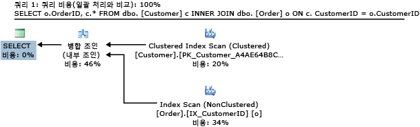
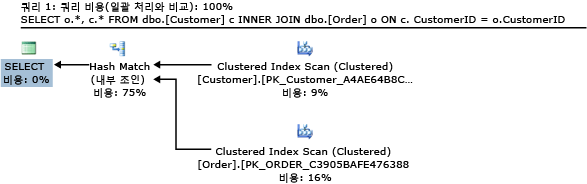
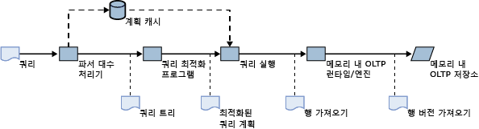
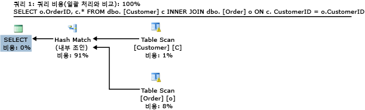
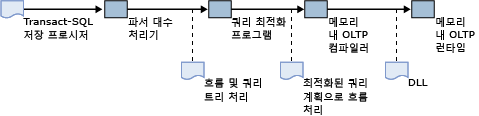
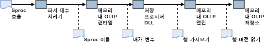
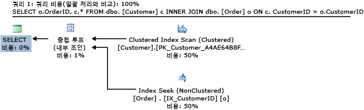

# <a name="a-guide-to-query-processing-for-memory-optimized-tables"></a>메모리 액세스에 최적화된 테이블에 대한 쿼리 처리 가이드
[!INCLUDE[appliesto-ss-asdb-xxxx-xxx-md](../../includes/appliesto-ss-asdb-xxxx-xxx-md.md)]

  메모리 내 OLTP는 [!INCLUDE[ssNoVersion](../../includes/ssnoversion-md.md)]에서 메모리 최적화 테이블과 고유하게 컴파일된 저장 프로시저를 도입합니다. 이 문서에서는 메모리 최적화 테이블 및 고유하게 컴파일된 저장 프로시저 모두의 쿼리 처리에 대한 개요를 제공합니다.  
  
 이 문서에서는 다음 내용을 포함하여 메모리 최적화 테이블에 대한 쿼리를 컴파일하고 실행하는 방법에 대해 설명합니다.  
  
-   디스크 기반 테이블에 대한 [!INCLUDE[ssNoVersion](../../includes/ssnoversion-md.md)] 의 쿼리 처리 파이프라인입니다.  
  
-   쿼리 최적화: 메모리 최적화 테이블에 대한 통계의 역할 및 잘못된 쿼리 계획의 문제 해결을 위한 지침  
  
-   메모리 최적화 테이블에 액세스하기 위한 해석된 [!INCLUDE[tsql](../../includes/tsql-md.md)] 사용입니다.  
  
-   메모리 최적화 테이블 액세스를 위한 쿼리 최적화 관련 고려 사항  
  
-   고유하게 컴파일된 저장 프로시저 컴파일 및 처리  
  
-   최적화 프로그램에서 비용 예측을 위해 사용되는 통계  
  
-   잘못된 쿼리 계획을 수정하는 방법  
  
## <a name="example-query"></a>예제 쿼리  
 다음 예는 이 문서에서 설명하는 쿼리 처리 개념을 설명하기 위해 사용됩니다.  
  
 여기에서는 두 가지 테이블인 Customer 및 Order 테이블을 살펴봅니다. 다음 [!INCLUDE[tsql](../../includes/tsql-md.md)] 스크립트에는 기존의 디스크 기반 형태로 이러한 두 테이블과 관련 인덱스에 대한 정의가 포함됩니다.  
  
```tsql  
CREATE TABLE dbo.[Customer] (  
  CustomerID nchar (5) NOT NULL PRIMARY KEY,  
  ContactName nvarchar (30) NOT NULL   
)  
GO  
  
CREATE TABLE dbo.[Order] (  
  OrderID int NOT NULL PRIMARY KEY,  
  CustomerID nchar (5) NOT NULL,  
  OrderDate date NOT NULL  
)  
GO  
CREATE INDEX IX_CustomerID ON dbo.[Order](CustomerID)  
GO  
CREATE INDEX IX_OrderDate ON dbo.[Order](OrderDate)  
GO  
```  
  
 이 문서에 표시된 쿼리 계획을 생성하기 위해 두 테이블에는 Northwind 샘플 데이터베이스의 샘플 데이터가 입력되었습니다. 이 데이터베이스는 [SQL Server 2000의 Northwind 및 pubs 샘플 데이터베이스](http://www.microsoft.com/download/details.aspx?id=23654)에서 다운로드할 수 있습니다.  
  
 다음 쿼리를 살펴보십시오. 이 쿼리는 Customer 및 Order 테이블을 조인하고 주문 ID와 연관된 고객 정보를 반환합니다.  
  
```tsql  
SELECT o.OrderID, c.* FROM dbo.[Customer] c INNER JOIN dbo.[Order] o ON c.CustomerID = o.CustomerID  
```  
  
 [!INCLUDE[ssManStudioFull](../../includes/ssmanstudiofull-md.md)] 에서 표시되는 예상 실행 계획은 다음과 같습니다.  
  
   
디스크 기반 테이블 조인을 위한 쿼리 계획.  
  
 이 쿼리 계획 정보:  
  
-   Customer 테이블의 행은 기본 데이터 구조이며 전체 테이블 데이터를 포함하는 클러스터형 인덱스로부터 검색됩니다.  
  
-   Order 테이블의 데이터는 CustomerID 열에 있는 비클러스터형 인덱스를 사용해서 검색됩니다. 이 인덱스에는 조인에 사용되는 CustomerID 열과 사용자에게 반환되는 기본 키 열인 OrderID가 모두 포함됩니다. Order 테이블에서 추가 열을 반환하려면 Order 테이블에 대한 클러스터형 인덱스에서 조회가 필요합니다.  
  
-   논리 연산자 **Inner Join** 은 물리 연산자 **Merge Join**에 의해 구현됩니다. 다른 물리적 조인 유형은 **Nested Loops** 및 **Hash Join**입니다. **Merge Join** 연산자는 두 인덱스가 모두 조인 열 CustomerID에 정렬되어 있다는 사실을 활용합니다.  
  
 이제 이 쿼리를 약간 변형하여 OrderID만 아니라 Order 테이블의 모든 행을 반환합니다.  
  
```tsql  
SELECT o.*, c.* FROM dbo.[Customer] c INNER JOIN dbo.[Order] o ON c.CustomerID = o.CustomerID  
```  
  
 이 쿼리의 예상 계획은 다음과 같습니다.  
  
   
디스크 기반 테이블의 해시 조인을 위한 쿼리 계획.  
  
 이 쿼리에서 Order 테이블의 행은 클러스터형 인덱스를 사용해서 검색됩니다. **Hash Match** 물리 연산자는 이제 **Inner Join**에 사용됩니다. Order에 대한 클러스터형 인덱스가 CustomerID로 정렬되지 않았으므로 **Merge Join** 을 위해 sort 연산자가 필요하지만, 이는 성능에 영향을 줄 수 있습니다. 이전 예제에서 **Merge Join** 연산자의 비용(46%)에 대비해서 **Hash Match** 연산자의 상대적 비용(75%)에 주의하세요. 이전 예에서 최적화 프로그램에는 **Hash Match** 연산자도 고려되었겠지만 **Merge Join** 연산자가 더 나은 성능을 제공하는 것으로 결정되었습니다.  
  
## <a name="includessnoversionincludesssnoversion-mdmd-query-processing-for-disk-based-tables"></a>[!INCLUDE[ssNoVersion](../../includes/ssnoversion-md.md)] 디스크 기반 테이블에 대한 쿼리 처리  
 다음 다이어그램에서는 임시 쿼리를 위한 [!INCLUDE[ssNoVersion](../../includes/ssnoversion-md.md)] 의 쿼리 처리 흐름을 간단히 보여줍니다.  
  
 ![SQL Server 쿼리 처리 파이프라인.] (../../relational-databases/in-memory-oltp/media/hekaton-query-plan-3.gif "SQL Server 쿼리 처리 파이프라인.")  
SQL Server 쿼리 처리 파이프라인.  
  
 시나리오 내용:  
  
1.  사용자가 쿼리를 실행합니다.  
  
2.  파서 및 algebrizer가 사용자가 제출한 [!INCLUDE[tsql](../../includes/tsql-md.md)] 텍스트 기반의 논리 연산자를 사용해서 쿼리 트리를 생성합니다.  
  
3.  최적화 프로그램이 물리 연산자가 포함된 최적화된 쿼리 계획을 만듭니다(예: 중첩 루프 조인). 최적화 후 계획은 계획 캐시에 저장될 수 있습니다. 계획 캐시에 이미 이 쿼리에 대한 계획이 포함된 경우 이 단계는 무시됩니다.  
  
4.  쿼리 실행 엔진이 쿼리 계획 해석을 처리합니다.  
  
5.  각 index seek, index scan 및 table scan 연산자에 대해 실행 엔진이 Access Methods의 해당 인덱스 및 테이블 구조로부터 행을 요청합니다.  
  
6.  Access Methods는 버퍼 풀에 있는 인덱스 및 데이터 페이지로부터 행을 검색하고 필요에 따라 디스크에서 버퍼 풀로 페이지를 로드합니다.  
  
 첫 번째 예제 쿼리에서 실행 엔진은 Access Methods에서 Customer의 클러스터형 인덱스 및 Order의 비클러스터형 인덱스에 있는 행을 요청합니다. Access Methods는 B-트리 인덱스 구조를 통과하여 요청된 행을 검색합니다. 이 경우에는 계획이 전체 인덱스 검색을 호출하므로 모든 행이 검색됩니다.  
  
## <a name="interpreted-includetsqlincludestsql-mdmd-access-to-memory-optimized-tables"></a>메모리 액세스에 최적화된 테이블에 대한 해석된 [!INCLUDE[tsql](../../includes/tsql-md.md)] 액세스  
 [!INCLUDE[tsql](../../includes/tsql-md.md)] 임시 일괄 처리 및 저장 프로시저는 해석된 [!INCLUDE[tsql](../../includes/tsql-md.md)]이라고도 부릅니다. 해석되었다는 용어는 쿼리 실행 엔진에서 쿼리 계획의 각 연산자에 대해 쿼리 계획이 해석되었음을 의미합니다. 실행 엔진은 연산자 및 해당 매개 변수를 읽고 작업을 수행합니다.  
  
 해석된 [!INCLUDE[tsql](../../includes/tsql-md.md)]을 사용하면 메모리 최적화 테이블 및 디스크 기반 테이블에 모두 액세스할 수 있습니다. 다음 그림에서는 메모리 최적화 테이블에 대한 해석된 [!INCLUDE[tsql](../../includes/tsql-md.md)] 액세스를 위한 쿼리 처리를 보여 줍니다.  
  
   
메모리 최적화 테이블에 대한 해석된 Transact-SQL 액세스를 위한 쿼리 처리 파이프라인  
  
 그림에 표시된 것처럼 쿼리 처리 파이프라인은 대부분 변경되지 않은 상태로 유지됩니다.  
  
-   파서 및 algebrizer가 쿼리 트리를 생성합니다.  
  
-   최적화 프로그램이 실행 계획을 만듭니다.  
  
-   쿼리 실행 엔진이 실행 계획을 해석합니다.  
  
 기존의 쿼리 처리 파이프라인(그림 2)과 기본적으로 다른 점은 메모리 최적화 테이블의 행이 Access Methods를 사용하여 버퍼 풀에서 검색되지 않는다는 것입니다. 대신 메모리 내 OLTP 엔진을 통해 메모리 내 데이터 구조에서 행이 검색됩니다. 데이터 구조의 차이점으로 인해 다음 예에 표시된 것처럼 경우에 따라 최적화 프로그램이 서로 다른 계획을 선택하게 됩니다.  
  
 다음 [!INCLUDE[tsql](../../includes/tsql-md.md)] 스크립트에는 해시 인덱스를 사용하는 Order 및 Customer 테이블의 메모리 최적화 버전이 포함됩니다.  
  
```tsql  
CREATE TABLE dbo.[Customer] (  
  CustomerID nchar (5) NOT NULL PRIMARY KEY NONCLUSTERED,  
  ContactName nvarchar (30) NOT NULL   
) WITH (MEMORY_OPTIMIZED=ON)  
GO  
  
CREATE TABLE dbo.[Order] (  
  OrderID int NOT NULL PRIMARY KEY NONCLUSTERED,  
  CustomerID nchar (5) NOT NULL INDEX IX_CustomerID HASH(CustomerID) WITH (BUCKET_COUNT=100000),  
  OrderDate date NOT NULL INDEX IX_OrderDate HASH(OrderDate) WITH (BUCKET_COUNT=100000)  
) WITH (MEMORY_OPTIMIZED=ON)  
GO  
```  
  
 다음과 같이 메모리 최적화 테이블에서 동일한 쿼리를 실행한다고 가정해보세요.  
  
```tsql  
SELECT o.OrderID, c.* FROM dbo.[Customer] c INNER JOIN dbo.[Order] o ON c.CustomerID = o.CustomerID  
```  
  
 예상 계획은 다음과 같습니다.  
  
   
메모리 최적화 테이블의 조인을 위한 쿼리 계획  
  
 디스크 기반 테이블에서 동일한 쿼리를 계획에 사용해서 다음과 같은 차이점을 관찰합니다(그림 1).  
  
-   이 계획에는 Customer 테이블에 대해 클러스터형 인덱스 검색이 아닌 테이블 검색이 포함됩니다.  
  
    -   테이블 정의에는 클러스터형 인덱스가 포함되지 않습니다.  
  
    -   클러스터형 인덱스는 메모리 최적화 테이블에서 지원되지 않습니다. 대신 메모리 최적화 모든 테이블에 적어도 하나 이상의 비클러스터형 인덱스가 있어야 하고 메모리 최적화 테이블의 모든 인덱스는 인덱스에 행을 저장하거나 클러스터형 인덱스를 참조할 필요 없이 테이블의 모든 열에 효율적으로 액세스할 수 있습니다.  
  
-   이 계획에는 **Hash Match** 이 아니라 **Merge Join**가 포함됩니다. Order 및 Customer 테이블에 모두 있는 인덱스는 해시 인덱스이므로 정렬되지 않습니다. **Merge Join** 을 사용하기 위해서는 성능 저하가 발생하는 sort 연산자가 필요합니다.  
  
## <a name="natively-compiled-stored-procedures"></a>고유하게 컴파일된 저장 프로시저  
 고유하게 컴파일된 저장 프로시저는 쿼리 실행 엔진에서 해석되지 않고 기계어 코드로 컴파일된 [!INCLUDE[tsql](../../includes/tsql-md.md)] 저장 프로시저입니다. 다음 스크립트는 예제 쿼리(예제 쿼리 섹션 참조)를 실행하는 기본적으로 컴파일되는 저장 프로시저를 만듭니다.  
  
```tsql  
CREATE PROCEDURE usp_SampleJoin  
WITH NATIVE_COMPILATION, SCHEMABINDING, EXECUTE AS OWNER  
AS BEGIN ATOMIC WITH   
(  TRANSACTION ISOLATION LEVEL = SNAPSHOT,  
  LANGUAGE = 'english')  
  
  SELECT o.OrderID, c.CustomerID, c.ContactName   
FROM dbo.[Order] o INNER JOIN dbo.[Customer] c   
  ON c.CustomerID = o.CustomerID  
  
END  
```  
  
 고유하게 컴파일된 저장 프로시저는 프로시저를 만들 때 컴파일되지만 해석된 저장 프로시저는 처음 실행할 때 컴파일됩니다. 컴파일 중 특히 구문 분석과 대수 부분은 생성 시에 발생합니다. 하지만 해석된 저장 프로시저의 경우 처음 실행할 때 쿼리 계획의 최적화가 발생합니다. 다시 컴파일 논리도 비슷합니다. 고유하게 컴파일된 저장 프로시저는 서버를 다시 시작한 경우 프로시저를 처음 실행할 때 다시 컴파일됩니다. 해석된 저장 프로시저는 계획 캐시에 계획이 더 이상 없는 경우에 다시 컴파일됩니다. 다음 표에서는 고유하게 컴파일된 저장 프로시저와 해석된 저장 프로시저 모두의 컴파일 및 다시 컴파일 사례를 요약해서 보여줍니다.  
  
||네이티브 컴파일|메모리 액세스에 최적화된 테이블에 대한 해석된|  
|-|-----------------------|-----------------|  
|초기 컴파일|생성 시|처음 실행 시|  
|자동 다시 컴파일|데이터베이스나 서버를 다시 시작한 후 프로시저를 처음 실행할 때|서버를 다시 시작할 때 또는 일반적으로 스키마 또는 통계 변경이나 메모리 압력에 따라 계획 캐시에서 계획이 제거될 때|  
|수동 다시 컴파일|**sp_recompile**을 사용합니다.|**sp_recompile**을 사용합니다. 캐시에서 계획을 수동으로 제거할 수 있습니다(예: DBCC FREEPROCCACHE 사용). 또한 WITH RECOMPILE로 저장 프로시저를 만들면 실행할 때마다 저장 프로시저가 다시 컴파일됩니다.|  
  
### <a name="compilation-and-query-processing"></a>컴파일 및 쿼리 처리  
 다음 다이어그램은 고유하게 컴파일된 저장 프로시저의 컴파일 프로세스를 보여줍니다.  
  
   
저장 프로시저의 고유 컴파일  
  
 프로세스에 대한 설명은 다음과 같습니다.  
  
1.  사용자가 **에 대해** CREATE PROCEDURE [!INCLUDE[ssNoVersion](../../includes/ssnoversion-md.md)]문을 실행합니다.  
  
2.  파서 및 algebrizer가 프로시저에 대한 처리 흐름과 저장 프로시저에 있는 [!INCLUDE[tsql](../../includes/tsql-md.md)] 쿼리에 대한 쿼리 트리를 만듭니다.  
  
3.  최적화 프로그램이 저장 프로시저에 있는 모든 쿼리에 대한 최적화된 쿼리 실행 계획을 만듭니다.  
  
4.  메모리 내 OLTP 컴파일러가 포함된 최적화된 쿼리 계획에 처리 흐름을 사용해서 저장 프로시저 실행을 위한 기계어 코드가 포함된 DLL을 생성합니다.  
  
5.  생성된 DLL이 메모리에 로드됩니다.  
  
 고유하게 컴파일된 저장 프로시저의 호출은 DLL의 함수 호출과 같습니다.  
  
   
고유하게 컴파일된 저장 프로시저의 실행  
  
 고유하게 컴파일된 저장 프로시저의 호출에 대한 설명은 다음과 같습니다.  
  
1.  사용자가 **EXEC***usp_myproc* 문을 실행합니다.  
  
2.  파서가 이름 및 저장 프로시저 매개 변수를 추출합니다.  
  
     **sp_prep_exec**등을 사용해서 문이 준비되었으면 파서가 실행 시에 프로시저 이름과 매개 변수를 추출할 필요가 없습니다.  
  
3.  메모리 내 OLTP 런타임이 저장 프로시저에 대한 DLL 진입점을 찾습니다.  
  
4.  DLL의 기계어 코드가 실행되고 결과가 클라이언트에 반환됩니다.  
  
 **매개 변수 스니핑**  
  
 생성 시에 컴파일되는 고유하게 컴파일된 저장 프로시저와 달리 해석된 [!INCLUDE[tsql](../../includes/tsql-md.md)] 저장 프로시저는 첫 실행 시 컴파일됩니다. 호출 시에 해석된 저장 프로시저가 컴파일될 때 이 호출을 위해 제공된 매개 변수의 값은 최적화 프로그램이 실행 계획을 생성할 때 사용됩니다. 이렇게 컴파일 중 매개 변수의 사용을 매개 변수 스니핑이라고 부릅니다.  
  
 고유하게 컴파일된 저장 프로시저를 컴파일하는 데에는 매개 변수 스니핑이 사용되지 않습니다. 이 저장 프로시저에 대한 모든 매개 변수는 UNKNOWN 값을 갖는 것으로 간주됩니다. 해석된 저장 프로시저처럼 고유하게 컴파일된 저장 프로시저도 **OPTIMIZE FOR** 힌트를 지원합니다. 자세한 내용은 [쿼리 힌트&#40;Transact-SQL&#41;](../../t-sql/queries/hints-transact-sql-query.md)를 참조하세요.  
  
### <a name="retrieving-a-query-execution-plan-for-natively-compiled-stored-procedures"></a>고유하게 컴파일된 저장 프로시저에 대한 쿼리 실행 검색  
 고유하게 컴파일된 저장 프로시저에 대한 쿼리 실행 계획은 **에서** 예상 실행 계획 [!INCLUDE[ssManStudio](../../includes/ssmanstudio-md.md)]을 사용하거나 [!INCLUDE[tsql](../../includes/tsql-md.md)]에서 SHOWPLAN_XML 옵션을 사용하여 검색할 수 있습니다. 예를 들어  
  
```tsql  
SET SHOWPLAN_XML ON  
GO  
EXEC dbo.usp_myproc  
GO  
SET SHOWPLAN_XML OFF  
GO  
```  
  
 쿼리 최적화 프로그램에서 생성되는 실행 계획은 트리의 노드 및 리프에 대한 쿼리 연산자가 포함된 트리로 구성됩니다. 트리 구조에 따라 연산자 사이의 상호 작용(한 연산자에서 다른 연산자로의 행 흐름)이 결정됩니다. [!INCLUDE[ssManStudioFull](../../includes/ssmanstudiofull-md.md)]의 그래픽 보기에서 흐름은 오른쪽에서 왼쪽의 방향으로 진행됩니다. 예를 들어, 그림 1의 쿼리 계획에는 merge join 연산자에 행을 제공하는 2개의 index scan 연산자가 포함됩니다. merge join 연산자는 select 연산자에 행을 제공합니다. select 연산자가 마지막으로 클라이언트에 행을 반환합니다.  
  
### <a name="query-operators-in-natively-compiled-stored-procedures"></a>고유하게 컴파일된 저장 프로시저의 쿼리 연산자  
 다음 표에서는 고유하게 컴파일 저장 프로시저 내부에서 지원되는 쿼리 연산자를 요약해서 보여줍니다.  
  
|연산자|예제 쿼리|참고|  
|--------------|------------------|-----------|  
|SELECT|`SELECT OrderID FROM dbo.[Order]`||  
|INSERT|`INSERT dbo.Customer VALUES ('abc', 'def')`||  
|UPDATE|`UPDATE dbo.Customer SET ContactName='ghi' WHERE CustomerID='abc'`||  
|DELETE|`DELETE dbo.Customer WHERE CustomerID='abc'`||  
|Compute Scalar|`SELECT OrderID+1 FROM dbo.[Order]`|이 연산자는 내장 함수 및 형식 변환에 모두 사용됩니다. 고유하게 컴파일된 저장 프로시저 내에서 모든 함수 및 형식 변환이 지원되는 것은 아닙니다.|  
|중첩 루프 조인|`SELECT o.OrderID, c.CustomerID FROM dbo.[Order] o INNER JOIN dbo.[Customer] c`|Nested Loops는 고유하게 컴파일된 저장 프로시저에서 지원되는 유일한 조인 연산자입니다. 해석된 [!INCLUDE[tsql](../../includes/tsql-md.md)] 로 실행된 것과 동일한 쿼리에 대한 계획에 해시 또는 병합 조인이 포함되더라도 조인을 포함하는 모든 계획에는 Nested Loops 연산자가 사용됩니다.|  
|정렬|`SELECT ContactName FROM dbo.Customer ORDER BY ContactName`||  
|위쪽|`SELECT TOP 10 ContactName FROM dbo.Customer`||  
|Top-sort|`SELECT TOP 10 ContactName FROM dbo.Customer  ORDER BY ContactName`|**TOP** 식(반환할 행의 수)은 8,000행을 초과할 수 없습니다. 쿼리에 조인 및 집계 연산자도 있을 경우 이보다 적습니다. 일반적으로 조인과 집계는 기본 테이블의 행 개수와 비교할 때 정렬될 행 수를 줄입니다.|  
|Stream Aggregate|`SELECT count(CustomerID) FROM dbo.Customer`|Hash Match 연산자는 집계가 지원되지 않습니다. 따라서 해석된 [!INCLUDE[tsql](../../includes/tsql-md.md)] 의 동일 쿼리에 대한 계획에 Hash Match 연산자가 사용되더라도 고유하게 컴파일된 저장 프로시저의 모든 집계에는 Stream Aggregate 연산자가 사용됩니다.|  
  
## <a name="column-statistics-and-joins"></a>열 통계 및 조인  
 [!INCLUDE[ssNoVersion](../../includes/ssnoversion-md.md)] 는 index scan 및 index seek와 같은 특정 작업의 비용을 예측할 수 있도록 인덱스 키 열에 값 통계를 유지 관리합니다. (인덱스가 아닌 키 열을 사용자가 명시적으로 만들거나 쿼리 최적화 프로그램에서 조건자가 있는 쿼리에 대한 응답으로 만드는 경우 [!INCLUDE[ssNoVersion](../../includes/ssnoversion-md.md)]에서 그에 대한 통계도 만듭니다.) 비용 예측의 기본 메트릭은 단일 연산자에서 처리되는 행 수입니다. 디스크 기반 테이블의 경우에는 특정 연산자에서 액세스되는 페이지 수가 비용 예측에서 중요한 요소입니다. 하지만 메모리 최적화 테이블의 경우에는 페이지 수가 항상 0이므로 중요하지 않습니다. 이 문서에서는 행 수에 대해 중점적으로 설명합니다. 예측은 계획에서 index seek 및 scan 연산자로 시작해서 조인 연산자와 같은 다른 연산자를 포함하도록 확장됩니다. 조인 연산자에서 처리될 것으로 예상되는 행 수는 기본 index, seek 및 scan 연산자의 예측을 기반으로 결정됩니다. 메모리 최적화 테이블에 대한 해석된 [!INCLUDE[tsql](../../includes/tsql-md.md)] 액세스의 경우 실제 실행 계획을 관찰하면 계획에서 연산자에 대한 예측 및 실제 행 수 간의 차이를 볼 수 있습니다.  
  
 그림 1 예의 경우,  
  
-   Customer에 대한 클러스터형 인덱스 검색의 예측은 91이고, 실제도 91입니다.  
  
-   CustomerID에 대한 비클러스터형 인덱스 검색의 예측은 830이고 실제도 830입니다.  
  
-   Merge Join 연산자의 예측은 815이고 실제는 830입니다.  
  
 인덱스 검색에 대한 예측은 정확합니다. [!INCLUDE[ssNoVersion](../../includes/ssnoversion-md.md)] 는 디스크 기반 테이블에 대한 행 수를 유지 관리합니다. 전체 테이블 및 인덱스 검색에 대한 예측은 항상 정확합니다. 조인에 대한 예측도 상당히 정확한 편입니다.  
  
 이러한 예측이 변경될 경우 각각의 계획 대안에 대한 비용 고려도 함께 변경됩니다. 예를 들어, 조인의 어느 한쪽에 대한 예측 행 수가 1개 또는 몇 개 정도뿐이라면 중첩 루프 조인을 사용하는 것이 비용이 낮습니다.  
  
 다음은 쿼리에 대한 계획입니다.  
  
```  
SELECT o.OrderID, c.* FROM dbo.[Customer] c INNER JOIN dbo.[Order] o ON c.CustomerID = o.CustomerID  
```  
  
 Customer 테이블에서 행을 하나만 남겨두고 모두 삭제한 후에는 다음과 같이 됩니다.  
  
   
  
 이 쿼리 계획에 대한 설명은 다음과 같습니다.  
  
-   Hash Match가 Nested Loops 물리적 조인 연산자로 바뀌었습니다.  
  
-   IX_CustomerID에 대한 전체 인덱스 검색은 index seek로 바뀌었습니다. 그 결과 전체 인덱스 검색에 필요한 830개 행 대신 5개 행이 검색되었습니다.  
  
## <a name="see-also"></a>참고 항목  
 [메모리 액세스에 최적화된 테이블](../../relational-databases/in-memory-oltp/memory-optimized-tables.md)  
  
  
