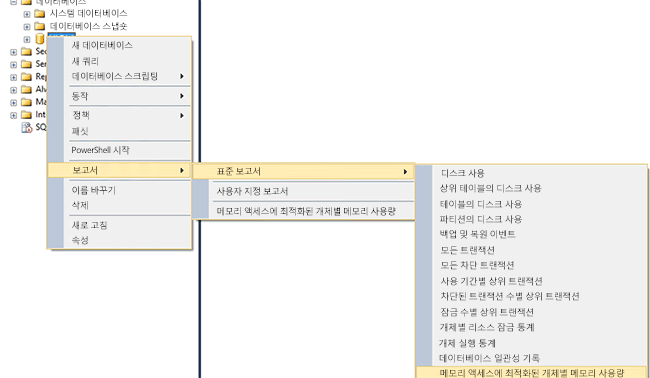
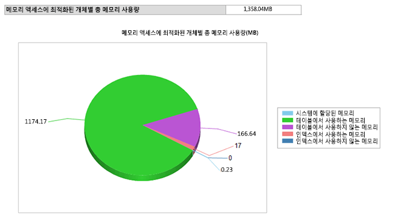

# <a name="monitor-and-troubleshoot-memory-usage"></a>메모리 사용량 모니터링 및 문제 해결
[!INCLUDE [SQL Server Azure SQL Database](../../includes/applies-to-version/sql-asdb.md)]
  [!INCLUDE[hek_1](../../includes/hek-1-md.md)] 에서는 디스크 기반 테이블과 다른 패턴으로 메모리를 사용합니다. 메모리 및 가비지 수집 하위 시스템에 제공되는 DMV 또는 성능 카운터를 사용하여 데이터베이스에 할당된 메모리의 양과 메모리 최적화 테이블 및 인덱스에서 사용하는 메모리의 양을 모니터링할 수 있습니다.  이를 통해 시스템 및 데이터베이스 수준에서 가시성을 확보하고 메모리 부족으로 인한 문제를 방지할 수 있습니다.  
  
 이 항목에서는 [!INCLUDE[hek_2](../../includes/hek-2-md.md)] 메모리 사용 모니터링에 대해 다룹니다.  
  
## <a name="sections-in-this-topic"></a>이 항목의 단원  
  
-   [메모리 최적화 테이블이 포함된 샘플 데이터베이스 만들기](../../relational-databases/in-memory-oltp/monitor-and-troubleshoot-memory-usage.md#bkmk_CreateDB)  
  
-   [메모리 사용 모니터링](../../relational-databases/in-memory-oltp/monitor-and-troubleshoot-memory-usage.md#bkmk_Monitoring)  
  
    -   [SQL Server Management Studio 사용](../../relational-databases/in-memory-oltp/monitor-and-troubleshoot-memory-usage.md#bkmk_UsingSSMS)  
  
    -   [DMVs 사용](../../relational-databases/in-memory-oltp/monitor-and-troubleshoot-memory-usage.md#bkmk_UsingDMVs)  
  
-   [메모리 최적화 개체에서 사용하는 메모리 관리](../../relational-databases/in-memory-oltp/monitor-and-troubleshoot-memory-usage.md#bkmk_MemOptObjects)  
  
-   [메모리 문제 해결](../../relational-databases/in-memory-oltp/monitor-and-troubleshoot-memory-usage.md#bkmk_Troubleshooting)  
  
##  <a name="create-a-sample-database-with-memory-optimized-tables"></a><a name="bkmk_CreateDB"></a> 메모리 최적화 테이블이 포함된 샘플 데이터베이스 만들기  
 메모리 최적화 테이블이 있는 데이터베이스를 이미 만든 경우에는 이 섹션을 건너뛸 수 있습니다.  
  
 다음 단계에서는 이 항목의 나머지 부분에서 사용할 수 있는 메모리 최적화 테이블이 3개 있는 데이터베이스를 만듭니다. 이 예제에서는 데이터베이스를 리소스 풀에 매핑하여 메모리 최적화 테이블에서 가져올 수 있는 메모리의 양을 제어할 수 있습니다.  
  
1.  [!INCLUDE[ssManStudioFull](../../includes/ssmanstudiofull-md.md)]를 시작합니다.  
  
2.  **새 쿼리** 를 클릭합니다.  
  
3.  새 쿼리 창에 이 코드를 붙여 넣고 각 섹션을 실행합니다.  

    ```  
    -- create a database to be used  
    CREATE DATABASE IMOLTP_DB  
    GO  
  
    ALTER DATABASE IMOLTP_DB ADD FILEGROUP IMOLTP_DB_xtp_fg CONTAINS MEMORY_OPTIMIZED_DATA  
    ALTER DATABASE IMOLTP_DB ADD FILE( NAME = 'IMOLTP_DB_xtp' , FILENAME = 'C:\Data\IMOLTP_DB_xtp') TO FILEGROUP IMOLTP_DB_xtp_fg;  
    GO  
  
    USE IMOLTP_DB  
    GO  
  
    -- create the resoure pool  
    CREATE RESOURCE POOL PoolIMOLTP WITH (MAX_MEMORY_PERCENT = 60);  
    ALTER RESOURCE GOVERNOR RECONFIGURE;  
    GO  
  
    -- bind the database to a resource pool  
    EXEC sp_xtp_bind_db_resource_pool 'IMOLTP_DB', 'PoolIMOLTP'  
  
    -- you can query the binding using the catalog view as described here  
    SELECT d.database_id  
         , d.name  
         , d.resource_pool_id  
    FROM sys.databases d  
    GO  
  
    -- take database offline/online to finalize the binding to the resource pool  
    USE master  
    GO  
  
    ALTER DATABASE IMOLTP_DB SET OFFLINE  
    GO  
    ALTER DATABASE IMOLTP_DB SET ONLINE  
    GO  
  
    -- create some tables  
    USE IMOLTP_DB  
    GO  
  
    -- create table t1  
    CREATE TABLE dbo.t1 (  
           c1 int NOT NULL CONSTRAINT [pk_t1_c1] PRIMARY KEY NONCLUSTERED  
         , c2 char(40) NOT NULL  
         , c3 char(8000) NOT NULL  
         ) WITH (MEMORY_OPTIMIZED = ON, DURABILITY = SCHEMA_AND_DATA)  
    GO  
  
    -- load t1 150K rows  
    DECLARE @i int = 0  
    BEGIN TRAN  
    WHILE (@i <= 150000)  
       BEGIN  
          INSERT t1 VALUES (@i, 'a', replicate ('b', 8000))  
          SET @i += 1;  
       END  
    Commit  
    GO  
  
    -- Create another table, t2  
    CREATE TABLE dbo.t2 (  
           c1 int NOT NULL CONSTRAINT [pk_t2_c1] PRIMARY KEY NONCLUSTERED  
         , c2 char(40) NOT NULL  
         , c3 char(8000) NOT NULL  
         ) WITH (MEMORY_OPTIMIZED = ON, DURABILITY = SCHEMA_AND_DATA)  
    GO  
  
    -- Create another table, t3   
    CREATE TABLE dbo.t3 (  
           c1 int NOT NULL CONSTRAINT [pk_t3_c1] PRIMARY KEY NONCLUSTERED HASH (c1) WITH (BUCKET_COUNT = 1000000)  
         , c2 char(40) NOT NULL  
         , c3 char(8000) NOT NULL  
         ) WITH (MEMORY_OPTIMIZED = ON, DURABILITY = SCHEMA_AND_DATA)  
    GO  
    ```  
  
##  <a name="monitoring-memory-usage"></a><a name="bkmk_Monitoring"></a> 메모리 사용 모니터링  
  
###  <a name="using-ssmanstudiofull"></a><a name="bkmk_UsingSSMS"></a> 사용 중 [!INCLUDE[ssManStudioFull](../../includes/ssmanstudiofull-md.md)]  
 [!INCLUDE[ssSQL14](../../includes/sssql14-md.md)] 에서는 메모리 내 테이블이 사용하는 메모리를 모니터링할 수 있는 기본 표준 보고서를 제공합니다. 이러한 보고서는 개체 탐색기를 사용하여 액세스할 수 있습니다. 또한 개체 탐색기를 사용하여 메모리 최적화 개별 테이블에서 사용하는 메모리를 모니터링할 수 있습니다.  
  
#### <a name="consumption-at-the-database-level"></a>데이터베이스 수준에서 사용  
 다음과 같이 데이터베이스 수준에서 메모리 사용을 모니터링할 수 있습니다.  
  
1.  [!INCLUDE[ssManStudioFull](../../includes/ssmanstudiofull-md.md)] 를 시작하고 서버에 연결합니다.  
  
2.  개체 탐색기에서 보고하려는 데이터베이스를 마우스 오른쪽 단추로 클릭합니다.  
  
3.  상황에 맞는 메뉴에서 **보고서** -> **Standard 보고서** -> **메모리 액세스에 최적화된 개체의 메모리 사용량** 을 선택합니다.  
  
   
  
 이 보고서는 위에서 만든 데이터베이스의 메모리 사용을 보여 줍니다.  
  
   
  
###  <a name="using-dmvs"></a><a name="bkmk_UsingDMVs"></a> DMVs 사용  
 메모리 최적화 테이블, 인덱스, 시스템 개체 및 런타임 구조에서 사용하는 메모리를 모니터링하는 데 사용할 수 있는 다양한 DMV가 있습니다.  
  
#### <a name="memory-consumption-by-memory-optimized-tables-and-indexes"></a>메모리 최적화 테이블 및 인덱스의 메모리 사용  
 여기 표시된 대로 `sys.dm_db_xtp_table_memory_stats` 를 쿼리하여 모든 사용자 테이블, 인덱스 및 시스템 개체에 대한 메모리 사용을 확인할 수 있습니다.  
  
```sql  
SELECT object_name(object_id) AS Name  
     , *  
   FROM sys.dm_db_xtp_table_memory_stats  
```  
  
 **샘플 출력**  
  
```  
Name       object_id   memory_allocated_for_table_kb memory_used_by_table_kb memory_allocated_for_indexes_kb memory_used_by_indexes_kb  
---------- ----------- ----------------------------- ----------------------- ------------------------------- -------------------------  
t3         629577281   0                             0                       128                             0  
t1         565577053   1372928                       1200008                 7872                            1942  
t2         597577167   0                             0                       128                             0  
NULL       -6          0                             0                       2                               2  
NULL       -5          0                             0                       24                              24  
NULL       -4          0                             0                       2                               2  
NULL       -3          0                             0                       2                               2  
NULL       -2          192                           25                      16                              16  
```  
  
 자세한 내용은 [sys.dm_db_xtp_table_memory_stats](../../relational-databases/system-dynamic-management-views/sys-dm-db-xtp-table-memory-stats-transact-sql.md)를 참조하세요.  
  
#### <a name="memory-consumption-by-internal-system-structures"></a>내부 시스템 구조의 메모리 사용  
 메모리는 트랜잭션 구조, 데이터 및 델타 파일 버퍼, 가비지 수집 구조 등의 시스템 개체에서도 사용합니다. 이러한 시스템 개체에서 사용하는 메모리는 여기 표시된 대로 `sys.dm_xtp_system_memory_consumers` 를 쿼리하여 확인할 수 있습니다.  
  
```sql  
SELECT memory_consumer_desc  
     , allocated_bytes/1024 AS allocated_bytes_kb  
     , used_bytes/1024 AS used_bytes_kb  
     , allocation_count  
   FROM sys.dm_xtp_system_memory_consumers  
```  
  
 **샘플 출력**  
  
```  
memory_consumer_ desc allocated_bytes_kb   used_bytes_kb        allocation_count  
------------------------- -------------------- -------------------- ----------------  
VARHEAP                   0                    0                    0  
VARHEAP                   384                  0                    0  
DBG_GC_OUTSTANDING_T      64                   64                   910  
ACTIVE_TX_MAP_LOOKAS      0                    0                    0  
RECOVERY_TABLE_CACHE      0                    0                    0  
RECENTLY_USED_ROWS_L      192                  192                  261  
RANGE_CURSOR_LOOKSID      0                    0                    0  
HASH_CURSOR_LOOKASID      128                  128                  455  
SAVEPOINT_LOOKASIDE       0                    0                    0  
PARTIAL_INSERT_SET_L      192                  192                  351  
CONSTRAINT_SET_LOOKA      192                  192                  646  
SAVEPOINT_SET_LOOKAS      0                    0                    0  
WRITE_SET_LOOKASIDE       192                  192                  183  
SCAN_SET_LOOKASIDE        64                   64                   31  
READ_SET_LOOKASIDE        0                    0                    0  
TRANSACTION_LOOKASID      448                  448                  156  
PGPOOL:256K               768                  768                  3  
PGPOOL: 64K               0                    0                    0  
PGPOOL:  4K               0                    0                    0  
```  
  
 자세한 내용은 [sys.dm_xtp_system_memory_consumers&#40;Transact-SQL&#41;](../../relational-databases/system-dynamic-management-views/sys-dm-xtp-system-memory-consumers-transact-sql.md)를 참조하세요.  
  
#### <a name="memory-consumption-at-run-time-when-accessing-memory-optimized-tables"></a>메모리 최적화 테이블에 액세스할 때 런타임 시 메모리 사용  
 다음 쿼리를 사용하는 프로시저 캐시 등의 런타임 구조에서 사용하는 메모리를 확인할 수 있습니다. 이 쿼리를 실행하여 프로시저 캐시의 경우와 같이 런타임 구조에서 사용하는 메모리를 가져옵니다. 모든 런타임 구조에는 XTP로 태그가 지정됩니다.  
  
```sql  
SELECT memory_object_address  
     , pages_in_bytes  
     , bytes_used  
     , type  
   FROM sys.dm_os_memory_objects WHERE type LIKE '%xtp%'  
```  
  
 **샘플 출력**  
  
```  
memory_object_address pages_ in_bytes bytes_used type  
--------------------- ------------------- ---------- ----  
0x00000001F1EA8040    507904              NULL       MEMOBJ_XTPDB  
0x00000001F1EAA040    68337664            NULL       MEMOBJ_XTPDB  
0x00000001FD67A040    16384               NULL       MEMOBJ_XTPPROCCACHE  
0x00000001FD68C040    16384               NULL       MEMOBJ_XTPPROCPARTITIONEDHEAP  
0x00000001FD284040    16384               NULL       MEMOBJ_XTPPROCPARTITIONEDHEAP  
0x00000001FD302040    16384               NULL       MEMOBJ_XTPPROCPARTITIONEDHEAP  
0x00000001FD382040    16384               NULL       MEMOBJ_XTPPROCPARTITIONEDHEAP  
0x00000001FD402040    16384               NULL       MEMOBJ_XTPPROCPARTITIONEDHEAP  
0x00000001FD482040    16384               NULL       MEMOBJ_XTPPROCPARTITIONEDHEAP  
0x00000001FD502040    16384               NULL       MEMOBJ_XTPPROCPARTITIONEDHEAP  
0x00000001FD67E040    16384               NULL       MEMOBJ_XTPPROCPARTITIONEDHEAP  
0x00000001F813C040    8192                NULL       MEMOBJ_XTPBLOCKALLOC  
0x00000001F813E040    16842752            NULL       MEMOBJ_XTPBLOCKALLOC  
```  
  
 자세한 내용은 [sys.dm_os_memory_objects(Transact-SQL)](../../relational-databases/system-dynamic-management-views/sys-dm-os-memory-objects-transact-sql.md)를 참조하세요.  
  
#### <a name="memory-consumed-by-hek_2-engine-across-the-instance"></a>인스턴스 전반의 [!INCLUDE[hek_2](../../includes/hek-2-md.md)] 엔진에서 사용하는 메모리  
 [!INCLUDE[hek_2](../../includes/hek-2-md.md)] 엔진 및 메모리 최적화 개체에 할당된 메모리는 [!INCLUDE[ssNoVersion](../../includes/ssnoversion-md.md)] 인스턴스 내의 다른 메모리 소비자와 동일한 방식으로 관리됩니다. MEMORYCLERK_XTP 유형의 계정 클럭은 [!INCLUDE[hek_2](../../includes/hek-2-md.md)] 엔진에 할당된 모든 메모리를 처리합니다. 다음 쿼리를 사용하여 [!INCLUDE[hek_2](../../includes/hek-2-md.md)] 엔진에서 사용하는 모든 메모리를 찾을 수 있습니다.  
  
```sql  
-- this DMV accounts for all memory used by the hek_2 engine  
SELECT type  
     , name  
     , memory_node_id  
     , pages_kb/1024 AS pages_MB   
   FROM sys.dm_os_memory_clerks WHERE type LIKE '%xtp%'  
```  
  
 샘플 출력에서는 할당된 총 메모리가 18MB 시스템 수준 메모리 소비량이고 ID가 5인 데이터베이스에 1358MB가 할당되었음을 나타냅니다. 이 데이터베이스가 전용 리소스 풀에 매핑되어 있으므로 이 메모리는 해당 리소스 풀로 계산됩니다.  
  
 **샘플 출력**  
  
```  
type                 name       memory_node_id pages_MB  
-------------------- ---------- -------------- --------------------  
MEMORYCLERK_XTP      Default    0              18  
MEMORYCLERK_XTP      DB_ID_5    0              1358  
MEMORYCLERK_XTP      Default    64             0  
```  
  
 자세한 내용은 [sys.dm_os_memory_clerks(Transact-SQL)](../../relational-databases/system-dynamic-management-views/sys-dm-os-memory-clerks-transact-sql.md)를 참조하세요.  
  
##  <a name="managing-memory-consumed-by-memory-optimized-objects"></a><a name="bkmk_MemOptObjects"></a> 메모리 최적화 개체에서 사용하는 메모리 관리  
 메모리 최적화 테이블을 [메모리 최적화 테이블이 있는 데이터베이스를 리소스 풀에 바인딩](../../relational-databases/in-memory-oltp/bind-a-database-with-memory-optimized-tables-to-a-resource-pool.md)항목에서 설명된 대로 명명된 리소스 풀에 바인딩하여 사용하는 총 메모리 양을 제어할 수 있습니다.  
  
##  <a name="troubleshooting-memory-issues"></a><a name="bkmk_Troubleshooting"></a> 메모리 문제 해결  
 다음 3단계 프로세스를 통해 메모리 문제를 해결합니다.  
  
1.  데이터베이스 또는 인스턴스의 개체에서 사용되는 메모리 양을 파악합니다. 앞서 설명한 대로 메모리 최적화 테이블에 대해 다양한 모니터링 도구를 활용할 수 있습니다.  예를 들어, DMV `sys.dm_db_xtp_table_memory_stats` 또는 `sys.dm_os_memory_clerks`등이 있습니다.  
  
2.  메모리 사용 증가량과 남은 공간을 확인합니다. 메모리 사용을 주기적으로 모니터링하여 메모리 사용 증가량을 확인할 수 있습니다. 예를 들어, 데이터베이스를 명명된 리소스 풀에 매핑한 경우 성능 카운터 메모리 사용(KB)을 모니터링하여 메모리 사용량의 증가 정도를 확인할 수 있습니다.  
  
3.  잠재적인 메모리 문제를 해소하기 위한 정정 작업을 수행합니다. 자세한 내용은 [OOM(메모리 부족) 문제 해결](../../relational-databases/in-memory-oltp/resolve-out-of-memory-issues.md)을 참조하세요.  
  
## <a name="see-also"></a>참고 항목  
 [데이터베이스를 리소스 풀에 바인딩하는 방법에 대한 지침은](../../relational-databases/in-memory-oltp/bind-a-database-with-memory-optimized-tables-to-a-resource-pool.md)   
 [기존 풀에서 MIN_MEMORY_PERCENT 및 MAX_MEMORY_PERCENT 변경](../../relational-databases/in-memory-oltp/bind-a-database-with-memory-optimized-tables-to-a-resource-pool.md#bkmk_ChangeAllocation)  
  
  
