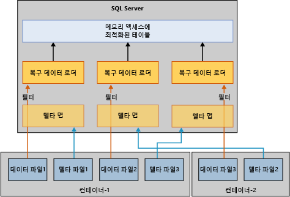

# 메모리 최적화 테이블 복원 및 복구
[!INCLUDE[appliesto-ss-xxxx-xxxx-xxx-md](../../includes/appliesto-ss-xxxx-xxxx-xxx-md.md)]

메모리 최적화 테이블을 사용하는 데이터베이스를 복구하거나 복원하기 위한 기본 메커니즘은 디스크 기반 테이블만 사용하는 데이터베이스에 대한 메커니즘과 비슷합니다. 하지만 디스크 기반 테이블과 달리, 메모리 최적화 테이블은 먼저 메모리에 로드해야만 사용자가 데이터베이스에 액세스할 수 있습니다. 이러한 요구 사항으로 인해 데이터베이스 복구에 새로운 단계가 추가됩니다.  
  
서버에 사용 가능한 메모리가 충분하지 않은 경우 데이터베이스 복구에 실패하고 데이터베이스가 주의 대상으로 표시됩니다. 이 문제를 해결하려면 [메모리 부족 문제 해결](resolve-out-of-memory-issues.md)을 참조하세요. 
  
## 로드 시간에 영향을 주는 요인
복구 또는 복원 작업 중에 메모리 내 OLTP 엔진은 물리적 메모리에 로드하기 위해 데이터 및 델타 파일을 읽습니다. 로드 시간을 결정하는 요소는 다음과 같습니다.  
  
-   로드할 데이터의 양  
  
-   순차 I/O 대역폭  
  
-   파일 컨테이너 및 프로세서 코어의 수로 결정되는 병렬 처리 수준  
  
-   다시 실행해야 할 로그의 활성 부분에 있는 로그 레코드의 수  

## 복구 단계
[!INCLUDE[ssNoVersion](../../includes/ssnoversion-md.md)]이(가) 다시 시작되면 각 데이터베이스는 다음 세 단계로 구성된 복구 프로세스를 진행합니다.  
  
1.  **분석**. 이 단계에서는 커밋된 트랜잭션과 커밋되지 않은 트랜잭션을 감지하기 위한 패스가 활성 트랜잭션 로그에 작성됩니다. 메모리 내 OLTP 엔진은 로드할 검사점을 식별하고 시스템 테이블 로그 항목을 미리 로드합니다. 또한 일부 파일 할당 로그 레코드를 처리합니다.  
  
2.  **다시 실행**. 이 단계는 디스크 기반 테이블과 메모리 최적화 테이블에서 동시에 실행됩니다.  
  
    - 디스크 기반 테이블의 경우 데이터베이스가 현재 시점으로 이동하고 커밋되지 않은 트랜잭션에 있는 잠금을 획득합니다.  
  
    - 메모리 최적화 테이블의 경우 데이터와 델타 파일 쌍의 데이터가 메모리에 로드됩니다. 그런 다음, 최종 지속형 검사점을 기반으로 활성 트랜잭션 로그로 데이터가 업데이트됩니다.  
  
    디스크 기반 테이블과 메모리 최적화 테이블에 대한 이전 작업이 완료되면 데이터베이스에 액세스할 수 있습니다.  
  
3.  **실행 취소**. 이 단계에서는 커밋되지 않은 트랜잭션이 롤백됩니다.  
  
## 로드 시간 향상을 위한 프로세스
메모리 최적화 테이블을 메모리에 로드하면 RTO(복구 시간 목표)의 성능에 영향을 줄 수 있습니다. 데이터 및 델타 파일에서 메모리 최적화 데이터를 로드하는 시간을 개선하기 위해 메모리 내 OLTP 엔진은 다음과 같이 데이터/델타 파일을 병렬로 로드합니다.  
  
-   **델타 맵 필터 만들기**. 델타 파일은 삭제된 행에 대한 참조를 저장합니다. 컨테이너당 하나의 스레드가 델타 파일을 읽고 델타 맵 필터를 만듭니다. 메모리 최적화 데이터 파일 그룹에는 하나 이상의 컨테이너가 있을 수 있습니다.  
  
-   **데이터 파일 스트리밍**. 델타 맵 필터가 생성된 후, 논리적 CPU 수 만큼의 스레드에서 데이터 파일을 읽습니다. 각 스레드는 데이터 행을 읽고 연결된 델타 맵을 확인한 다음, 이 행이 삭제됨으로 표시되지 않은 경우에만 테이블에 행을 삽입합니다. 복구의 이 부분은 다음 다이어그램과 같이 일부 경우에 CPU 바인딩될 수 있습니다.  
  
      
  
## 로드 시간이 길어지는 구체적인 경우
메모리 최적화 테이블은 일반적으로 I/O 속도로 메모리에 로드될 수 있지만 데이터 행을 메모리에 로드하면 때때로 속도가 느려집니다. 구체적인 경우는 다음과 같습니다.  
  
-   해시 인덱스의 버킷 수가 적으면 과도한 충돌이 발생하여 데이터 행 삽입이 느려질 수 있습니다. 이 경우 일반적으로 전체 CPU 사용률이 높아지며 복구가 거의 끝날 때 특히 높아집니다. 해시 인덱스를 올바르게 구성한 경우 복구 시간에 영향을 미치지 않습니다.  
  
-   비클러스터형 인텍스가 하나 이상 포함된 메모리 최적화 테이블이 많으면 CPU 사용률이 높아질 수 있습니다. 작성 시 버킷 수 크기가 조정되는 해시 인덱스와 달리, 비클러스터형 인덱스는 동적으로 증가합니다.  
  
## 관련 항목:  
 [메모리 액세스에 최적화된 테이블의 백업, 복원 및 복구](http://msdn.microsoft.com/library/3f083347-0fbb-4b19-a6fb-1818d545e281)  
  
  
