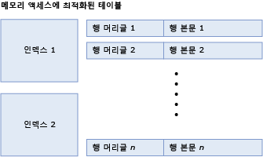
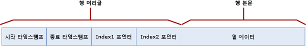

# 메모리 액세스에 최적화된 테이블의 테이블 및 행 크기
[!INCLUDE[tsql-appliesto-ss2016-asdb-xxxx-xxx_md](../../includes/tsql-appliesto-ss2016-asdb-xxxx-xxx-md.md)]

  메모리 액세스에 최적화된 테이블은 행의 컬렉션과 행에 대한 포인터를 포함하는 인덱스로 구성됩니다. 메모리 액세스에 최적화된 테이블에서 행 내부 데이터는 8,060바이트를 초과할 수 없습니다. 그러나 [!INCLUDE[ssSQL15](../../includes/sssql15-md.md)]부터 여러 큰 열(예: 여러 varbinary(8000) 열) 및 LOB 열(즉, varbinary(max), varchar(max) 및 nvarchar(max))이 있는 테이블을 만들 수 있습니다. 특별한 내부 테이블에서 행 내부 데이터의 최대 크기를 초과하는 열은 행 외부에 배치됩니다. 이러한 내부 테이블에 대한 자세한 내용은 [sys.memory_optimized_tables_internal_attributes&#40;Transact-SQL&#41;](../../relational-databases/system-catalog-views/sys-memory-optimized-tables-internal-attributes-transact-sql.md)를 참조하세요.
  
 테이블과 행 크기를 계산하는 이유는 두 가지입니다.  
  
-   테이블에서 사용하는 메모리의 양  
  
    -   테이블에서 사용되는 메모리의 양은 정확하게 계산할 수 없습니다. 여러 가지 요소들이 사용되는 메모리 양에 영향을 줍니다. 이러한 요소에는 페이지 기반 메모리 할당, 지역성, 캐시 및 패딩 등이 포함됩니다. 또한 연관된 활성 트랜잭션을 포함하는 행이나 가비지 수집을 대기 중인 행 등 여러 가지 버전의 행이 존재할 수 있습니다.  
  
    -   테이블의 데이터 및 인덱스에 필요한 최소 크기는 아래에서 설명하는 [table size]에 대한 계산으로 제공됩니다.  
  
    -   메모리 사용량에 대한 계산은 아무리 잘해도 근사값만 얻을 수 있으며, 배포 계획에 용량 계획을 포함하는 것이 좋습니다.  
  
-   행의 데이터 크기 및 8,060바이트 행 크기 제한에 맞는지 여부. 이 질문에 답변하려면 아래 설명된 [row body size] 계산을 사용합니다.  

8060바이트 행 크기 제한에 맞지 않는 열은 행 외부의 별도 내부 테이블에 배치됩니다. 각 행 외부 열에는 해당 내부 테이블이 있으며 단일 비클러스터형 인덱스가 있습니다. 행 외부 열에 사용되는 내부 테이블에 대한 자세한 내용은 [sys.memory_optimized_tables_internal_attributes&#40;Transact-SQL&#41;](../../relational-databases/system-catalog-views/sys-memory-optimized-tables-internal-attributes-transact-sql.md)를 참조하세요. 
  
 다음 그림에서는 인덱스 및 행을 포함하며 차례로 행 헤더와 본문을 가지는 테이블을 보여줍니다.  
  
   
인덱스와 행으로 구성된 메모리 액세스에 최적화된 테이블  
  
 테이블의 메모리 내 크기(바이트)는 다음과 같이 계산됩니다.  
  
```  
[table size] = [size of index 1] + … + [size of index n] + ([row size] * [row count])  
```  
  
 해시 인덱스의 크기는 테이블을 만들 때 고정되며 실제 버킷 수에 따라 달라집니다. 인덱스 사양으로 지정된 bucket_count는 [실제 버킷 수]를 얻기 위해 가장 가까운 2의 제곱으로 반올림됩니다. 예를 들어, 지정된 bucket_count가 100000인 경우 인덱스의 [실제 버킷 수]는 131072입니다.  
  
```  
[hash index size] = 8 * [actual bucket count]  
```  

 비클러스터형 인덱스의 크기는 `[row count] * [index key size]` 순입니다.
  
 행 크기는 헤더 및 본문을 추가하여 계산됩니다.  
  
```  
[row size] = [row header size] + [actual row body size]  
[row header size] = 24 + 8 * [number of indices]  
```  
  
 **행 본문 크기**  
  
 [row body size] 계산은 다음 표에서 설명합니다.  
  
 행 본문 크기는 계산된 크기 및 실제 크기의 두 가지 방식으로 계산할 수 있습니다.  
  
-   [computed row body size]로 표시되는 계산 크기는 행 크기 제한인 8,060바이트를 초과하는지 여부를 확인하기 위해 사용됩니다.  
  
-   [actual row body size]로 표시되는 실제 크기는 메모리 및 검사점 파일에서 행 본문의 실제 저장소 크기입니다.  
  
 [computed row body size] 및 [actual row body size]는 모두 비슷하게 계산됩니다. 유일한 차이점은 다음 표의 하단에 표시된 것처럼 (n)varchar(i) 및 varbinary(i) 열의 크기에 대한 계산입니다. 계산된 행 본문 크기는 선언된 크기인 *i* 를 열 크기로 사용하고, 실제 행 본문 크기는 데이터의 실제 크기를 사용합니다.  
  
 다음 표에서는 [actual row body size] = SUM([size of shallow types]) + 2 + 2 * [number of deep type columns]와 같이 행 본문 크기의 계산에 대해 설명합니다.  
  
|섹션|크기|설명|  
|-------------|----------|--------------|  
|단순 형식 열|SUM([단순 형식의 크기]) 개별 형식의 바이트 크기는 다음과 같습니다.<br /><br /> **Bit**: 1<br /><br /> **Tinyint**: 1<br /><br /> **Smallint**: 2<br /><br /> **Int**: 4<br /><br /> **Real**: 4<br /><br /> **Smalldatetime**: 4<br /><br /> **Smallmoney**: 4<br /><br /> **Bigint**: 8<br /><br /> **Datetime**: 8<br /><br /> **Datetime2**: 8<br /><br /> **Float**: 8<br /><br /> **Money**: 8<br /><br /> **숫자**(전체 자릿수<=18): 8<br /><br /> **Time**: 8<br /><br /> **숫자**(전체 자릿수>18): 16<br /><br /> **Uniqueidentifier**: 16||  
|단순 열 패딩|가능한 값은<br /><br /> 전체 형식 열이 있고 단순 열의 총 데이터 크기가 홀수인 경우 1입니다.<br /><br /> 그렇지 않으면 0입니다.|전체 형식은 (var)binary 및 (n)(var)char 형식입니다.|  
|전체 형식 열의 오프셋 배열|가능한 값은<br /><br /> 전체 형식 열이 없으면 0입니다.<br /><br /> 그렇지 않으면 2 + 2 * [number of deep type columns]입니다.|전체 형식은 (var)binary 및 (n)(var)char 형식입니다.|  
|NULL 배열|[number of nullable columns]/8, 전체 바이트로 반올림|null 허용 열당 1비트가 배열에 포함됩니다. 전체 바이트로 반올림됩니다.|  
|NULL 배열 패딩|가능한 값은<br /><br /> 전체 형식 열이 있고 NULL 배열의 크기가 홀수 바이트인 경우 1입니다.<br /><br /> 그렇지 않으면 0입니다.|전체 형식은 (var)binary 및 (n)(var)char 형식입니다.|  
|패딩|전체 형식 열이 없으면 0입니다.<br /><br /> 전체 형식 열이 있는 경우, 단순 열에 필요한 최대 맞춤에 따라 0-7바이트의 패딩이 추가됩니다. 각 단순 열에는 위에 설명한 대로 해당 크기와 동일한 맞춤이 필요하지만, GUID 열은 16바이트가 아니라 1바이트의 맞춤이 필요하고, 숫자 열에는 항상 16이 아닌 8바이트의 맞춤이 필요합니다. 모든 단순 열 사이에 가장 높은 맞춤 요구 사항이 사용되며, 지금까지의 총 크기(전체 형식 열 없음)가 필요한 맞춤의 배수가 되도록 0-7바이트의 패딩이 추가됩니다.|전체 형식은 (var)binary 및 (n)(var)char 형식입니다.|  
|고정 길이 전체 형식 열|SUM([size of fixed length deep type columns])<br /><br /> 각 열의 크기는 다음과 같습니다.<br /><br /> char(i) 및 binary(i)의 경우 i<br /><br /> nchar(i)의 경우 2 * i|고정 길이 전체 형식 열은 char(i), nchar(i) 또는 binary(i) 유형의 열입니다.|  
|가변 길이 전체 형식 열 [computed size]|SUM([computed size of variable length deep type columns])<br /><br /> 각 열에 대해 계산된 크기는 다음과 같습니다.<br /><br /> varchar(i) 및 varbinary(i)의 경우 i<br /><br /> nvarchar(i)의 경우 2 * i|이 행은 [computed row body size]에만 적용되었습니다.<br /><br /> 가변 길이 전체 형식 열은 varchar(i), nvarchar(i) 또는 varbinary(i) 유형의 열입니다. 계산된 크기는 열의 최대 길이(i)에 의해 결정됩니다.|  
|가변 길이 전체 형식 열 [actual size]|SUM([actual size of variable length deep type columns])<br /><br /> 각 열의 실제 크기는 다음과 같습니다.<br /><br /> n, 여기서 n은 varchar(i)에 대해 열에 저장된 문자 수입니다.<br /><br /> 2 * n, 여기서 n은 nvarchar(i)에 대해 열에 저장된 문자 수입니다.<br /><br /> n, 여기서 n은 varbinary(i)에 대해 열에 저장된 바이트 수입니다.|이 행은 [actual row body size]에만 적용되었습니다.<br /><br /> 실제 크기는 행의 열에 저장된 데이터에 의해 결정됩니다.|  
  
##  <a name="bkmk_RowStructure"></a> 행 구조  
 메모리 액세스에 최적화된 테이블의 행에는 다음과 같은 구성 요소가 있습니다.  
  
-   행 머리글에는 행 버전 관리를 구현하는 데 필요한 타임스탬프가 포함됩니다. 행 머리글에는 위에서 설명한 해시 버킷의 행 체인을 구현하는 인덱스 포인터도 포함됩니다.  
  
-   행 본문에는 실제 열 데이터가 포함됩니다. 여기에는 Null 허용 열에 대한 Null 배열과 가변 길이 데이터 형식에 대한 오프셋 배열 같은 일부 보조 정보가 포함됩니다.  
  
 다음 그림에서는 두 개의 인덱스가 있는 테이블에 대한 행 구조를 보여 줍니다.  
  
   
  
 시작 및 종료 타임스탬프는 특정 행 버전의 유효 기간을 나타냅니다. 이 기간에 시작되는 트랜잭션은 이 행 버전을 참조할 수 있습니다. 자세한 내용은 [Transactions with Memory-Optimized Tables](../../relational-databases/in-memory-oltp/transactions-with-memory-optimized-tables.md)(메모리 액세스에 최적화된 테이블의 트랜잭션)를 참조하세요.  
  
 인덱스 포인터는 체인에서 해시 버킷에 속한 그 다음 행을 가리킵니다. 다음 그림에서는 두 개의 열(이름, 도시)이 있는 테이블의 구조를 보여 줍니다. 여기에는 두 개의 인덱스가 있는데, 하나의 이름 열에 대한 것이고 다른 하나는 도시 열에 대한 것입니다.  
  
   
  
 이 그림에서는 John과 Jane이라는 이름이 첫 번째 버킷에 해시됩니다. Susan은 두 번째 버킷에 해시됩니다. 베이징과 보고타는 첫 번째 버킷에 해시됩니다. 파리와 프라하는 두 번째 버킷에 해시됩니다.  
  
 따라서 이름에 대한 해시 인덱스의 체인은 다음과 같습니다.  
  
-   첫 번째 버킷: (John, 베이징), (John, 파리), (Jane, 프라하)  
  
-   두 번째 버킷: (Susan, 보고타)  
  
 도시에 대한 인덱스의 체인은 다음과 같습니다.  
  
-   첫 번째 버킷: (John, 베이징), (Susan, 보고타)  
  
-   두 번째 버킷: (John, 파리), (Jane, 프라하)  
  
 종료 타임스탬프 ∞(무한대)는 해당 행이 현재 유효한 버전의 행임을 나타냅니다. 이 행 버전이 기록되었기 때문에 행은 업데이트되거나 삭제되지 않았습니다.  
  
 200보다 큰 시간의 경우 테이블에 다음 행이 포함됩니다.  
  
|이름|City|  
|----------|----------|  
|John|베이징|  
|Jane|프라하|  
  
 그러나 시작 시간이 100인 활성 트랜잭션은 다음 버전의 테이블을 참조합니다.  
  
|이름|City|  
|----------|----------|  
|John|파리|  
|Jane|프라하|  
|Susan|보고타|  
  
##  <a name="bkmk_ExampleComputation"></a> 예제: 테이블 및 행 크기 계산  
 해시 인덱스의 경우 실제 버킷 수는 가장 가까운 2의 제곱으로 반올림됩니다. 예를 들어, 지정된 bucket_count가 100000인 경우 인덱스의 실제 버킷 수는 131072입니다.  
  
 다음 정의의 Orders 테이블을 살펴보십시오.  
  
```tsql  
CREATE TABLE dbo.Orders (  
     OrderID int NOT NULL   
           PRIMARY KEY NONCLUSTERED,  
     CustomerID int NOT NULL   
           INDEX IX_CustomerID HASH WITH (BUCKET_COUNT=10000),  
     OrderDate datetime NOT NULL,  
     OrderDescription nvarchar(1000)  
) WITH (MEMORY_OPTIMIZED=ON)  
GO  
```  
  
 이 테이블에는 1개의 해시 인덱스와 1개의 비클러스터형 인덱스(기본 키)가 있습니다. 또한 3개의 고정 길이 열과 1개의 가변 길이 열이 포함되며, 이러한 열 중 하나는 Null 허용으로 구성됩니다(OrderDescription). 이제 Orders 테이블에 8379 행이 있고 OrderDescription 열의 평균 값 길이가 78자라고 가정해보십시오.  
  
 테이블 크기를 결정하려면 먼저 인덱스 크기를 결정해야 합니다. 두 인덱스의 bucket_count는 10000으로 지정되었습니다. 이 숫자는 가장 가까운 2의 제곱인 16384입니다. 따라서 Orders 테이블에서 인덱스의 총 크기는 다음과 같습니다.  
  
```  
8 * 16384 = 131072 bytes  
```  
  
 남은 것은 테이블 데이터 크기입니다.  
  
```  
[row size] * [row count] = [row size] * 8379  
```  
  
 예제 테이블에는 8379개 행이 있습니다. 이제 다음과 같이 됩니다.  
  
```  
[row size] = [row header size] + [actual row body size]  
[row header size] = 24 + 8 * [number of indices] = 24 + 8 * 1 = 32 bytes  
```  
  
 그러면 이제 [actual row body size]를 계산해보겠습니다.  
  
-   단순 형식 열:  
  
    ```  
    SUM([size of shallow types]) = 4 [int] + 4 [int] + 8 [datetime] = 16  
    ```  
  
-   총 단순 열 크기는 짝수이므로 단순 열 패딩은 0입니다.  
  
-   전체 형식 열의 오프셋 배열:  
  
    ```  
    2 + 2 * [number of deep type columns] = 2 + 2 * 1 = 4  
    ```  
  
-   NULL 배열은 1입니다.  
  
-   NULL 배열 크기가 홀수이고 전체 형식 열이 있으므로 NULL 배열 패딩은 1입니다.  
  
-   패딩  
  
    -   가장 큰 맞춤 요구 사항은 8입니다.  
  
    -   지금까지 크기는 16 + 0 + 4 + 1 + 1 = 22입니다.  
  
    -   8의 가장 가까운 배수는 24입니다.  
  
    -   총 패딩은 24 - 22 = 2바이트입니다.  
  
-   고정 길이 전체 형식 열은 없습니다(고정 길이 전체 형식 열은 0임).  
  
-   전체 형식 열의 실제 크기는 2 * 78 = 156입니다. 단일 전체 형식 열 OrderDescription의 형식은 nvarchar입니다.  
  
```  
[actual row body size] = 24 + 156 = 180 bytes  
```  
  
 계산을 완료하면 다음과 같습니다.  
  
```  
[row size] = 32 + 180 = 212 bytes  
[table size] = 8 * 16384 + 212 * 8379 = 131072 + 1776348 = 1907420  
```  
  
 메모리에서 총 테이블 크기는 약 2MB입니다. 여기에는 메모리 할당으로 발생하는 잠재적인 오버헤드와 이 테이블에 액세스하는 트랜잭션에 필요한 행 버전 관리가 고려되지 않았습니다.  
  
 이 테이블 및 해당 인덱스에 할당되어 사용되는 실제 메모리는 다음 쿼리를 통해 얻을 수 있습니다.  
  
```tsql  
select * from sys.dm_db_xtp_table_memory_stats  
where object_id = object_id('dbo.Orders')  
```  
  
## 참고 항목  
 [메모리 액세스에 최적화된 테이블](../../relational-databases/in-memory-oltp/memory-optimized-tables.md)  
  
  